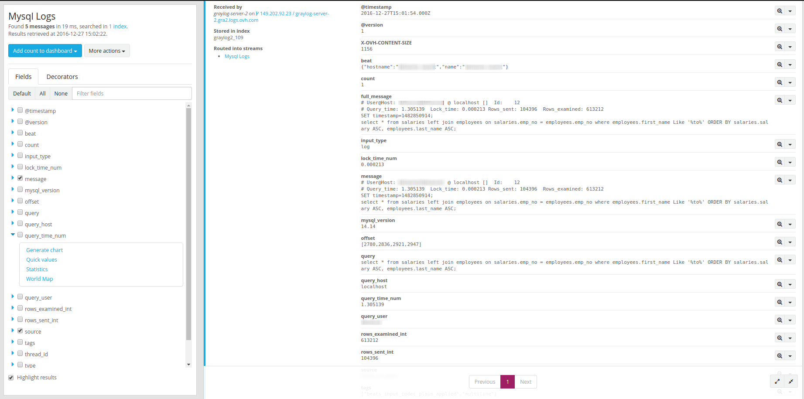
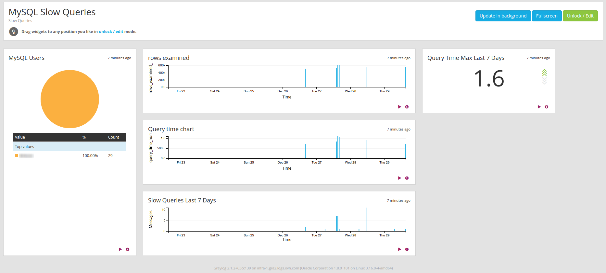

**Last updated 11th April, 2019**

## Objective

MySQL is one of the most popular database software. It has many features and can answer to complex queries with great performance. But with time, your database expands itself, its complexity grows, and the performance will naturally decline. There are many tips available to improve the speed of your queries but to rectify this you will have to know which queries are slow.

This guide will help you to track your slowest queries and send them to Logs Data Platform for further analysis.

## Requirements

Before, you must read these three guides:

- [Starting with Logs Data Platform.](../quick-start){.ref}
- [How to setup a Logstash input?](../logstash-input){.ref}
- [Using Filebeat with Logs Data Platform.](../filebeat-logs){.ref}

## Instructions

### Configure the MySQL slow query logs
To send your logs to Logs Data Platform you first need to activate the slow query logs in your MySQL configuration.

I recommend you to refer to the official [MySQL documentation](http://dev.mysql.com/doc/){.external} for your own version of MySQL. For example here is a working configuration on MySQL 5.6:


```ini
# Here you can see queries with especially long duration
slow_query_log = 1
slow_query_log_file = /var/log/mysql/slow-queries.log
long_query_time = 0.5
```

If you add theses lines to your MySQL configuration file and restart it, MySQL will then log any query taking longer than 0.5 second to complete in the file */var/log/mysql/slow-queries.log*

Here is a sample of the lines produced by the slow query log:

```MySQL
 # Time: 161223 16:43:49
 # User@Host: guest[guest] @ localhost []  Id:     2
 # Query_time: 0.734103  Lock_time: 0.000161 Rows_sent: 72761  Rows_examined: 518199
 SET timestamp=1482507829;
 select * from salaries left join employees on salaries.emp_no = employees.emp_no where employees.first_name Like '%ba%' ORDER BY salaries.salary ASC, employees.last_name ASC;
 # Time: 161223 16:43:52
 # User@Host: guest[guest] @ localhost []  Id:     2
 # Query_time: 0.628527  Lock_time: 0.000216 Rows_sent: 72750  Rows_examined: 518199
 SET timestamp=1482507832;
 select * from salaries left join employees on salaries.emp_no = employees.emp_no where employees.first_name Like '%yo%' ORDER BY salaries.salary ASC, employees.last_name ASC;
 # Time: 161223 16:51:08
 # User@Host: guest[guest] @ localhost []  Id:     2
 # Query_time: 0.649018  Lock_time: 0.000223 Rows_sent: 72963  Rows_examined: 518199
 SET timestamp=1482508268;
 select * from salaries left join employees on salaries.emp_no = employees.emp_no where employees.first_name Like '%er%' ORDER BY salaries.salary ASC, employees.last_name ASC;
 # Time: 161223 16:51:11
 # User@Host: guest[guest] @ localhost []  Id:     2
 # Query_time: 0.609382  Lock_time: 0.000199 Rows_sent: 77524  Rows_examined: 518199
 SET timestamp=1482508271;
 select * from salaries left join employees on salaries.emp_no = employees.emp_no where employees.first_name Like '%de%' ORDER BY salaries.salary ASC, employees.last_name ASC;
```

Slow query logs are multi-line logs giving information:

- The time of creation of the log.
- The user, the host, and the thread Id associated with the query.
- The query duration time, with the table lock duration time, and the number of rows sent and examined.
- The timestamp of the actual query.
- The query itself.


### Configure Filebeat on your system

Our favorite way to send MySQL slow query logs is to send logs directly to Logs Data Platform by using [Filebeat](https://www.elastic.co/fr/downloads/beats/filebeat-oss){.external}.
We cover Filebeat in depth in [another tutorial](https://docs.ovh.com/pt/logs-data-platform/filebeat-logs/){.external}. Here is a minimal **filebeat.yml** configuration file.

```yaml
#=========================== Filebeat inputs =============================

filebeat.inputs:

# Each - is an input. Most options can be set at the input level, so
# you can use different inputs for various configurations.
# Below are the input specific configurations.

- type: log

  # Change to true to enable this input configuration.
  enabled: false

  # Paths that should be crawled and fetched. Glob based paths.
  paths:
    - /var/log/*.log


#============================= Filebeat modules ===============================

filebeat.config.modules:
  # Glob pattern for configuration loading
  path: ${path.config}/modules.d/*.yml

  # Set to true to enable config reloading
  reload.enabled: false


#----------------------------- Logstash output --------------------------------
output.logstash:
  # The Logstash hosts
  hosts: ["<your_cluster>.logs.ovh.com:5044"]

  ssl.enabled: true

```

Enable filebeat MySQL support with following command:

```shell-session
$ ldp@ubuntu:~$ sudo filebeat modules enable mysql
```

It will generate a new module file: **/etc/filebeat/modules.d/mysql.yml**, please change it to include all your MySQL error/slow path files:

```yaml hl_lines="8 16"
- module: mysql
  # Error logs
  error:
    enabled: true

    # Set custom paths for the log files. If left empty,
    # Filebeat will choose the paths depending on your OS.
    var.paths: ["/var/log/mysqld.log"]

  # Slow logs
  slowlog:
    enabled: true

    # Set custom paths for the log files. If left empty,
    # Filebeat will choose the paths depending on your OS.
    var.paths: ["/var/log/mysql-slow.log"]
```

Launch Filebeat and try to run some slow queries in your database. For this you can use this [database sample](https://github.com/datacharmer/test_db){.external} and use join and like queries.

```shell-session
$ ldp@ubuntu:~$ sudo systemctl restart filebeat.service
```

or

```shell-session
$ ldp@ubuntu:~$ sudo /etc/init.d/filebeat restart
```

### Exploit your results in Graylog

A fully parsed log looks like this:

{.thumbnail}

- The **mysql_slowlog_query_time_sec_num** is already available for further analysis.
- You can track the **mysql_slowlog_user** and the **mysql_slowlog_host** that trigger the slowest queries.
- You have the **mysql_slowlog_rows_examined_int** scanned and returned

All this information can help you to analyse the most difficult queries for your database. You will know when to scale and when your database is too big for your hardware or when to optimize your queries. Of course it is always better to have a nice dashboard to display your own key performance indicators. One way to have this critical information as soon as it arrives is to use the [alerting feature.](../alerting){.ref}

{.thumbnail}

## Go further

- Getting Started: [Quick Start](../quick-start){.ref}
- Documentation: [Guides](../){.ref}
- Community hub: [https://community.ovh.com](https://community.ovh.com/en/c/Platform/data-platforms){.external}
- Create an account: [Try it!](https://www.ovh.com/fr/order/express/#/express/review?products=~(~(planCode~'logs-account~productId~'logs)){.external}
