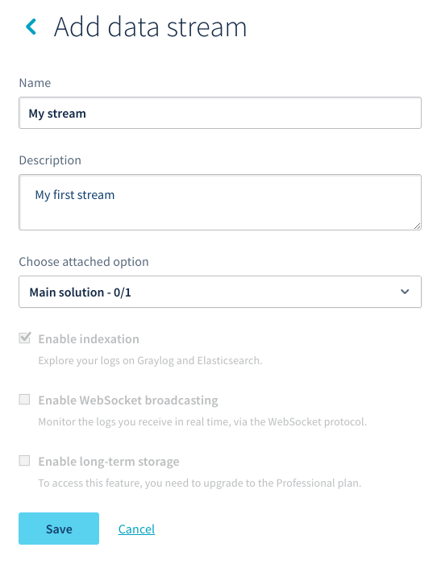
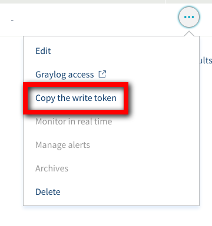
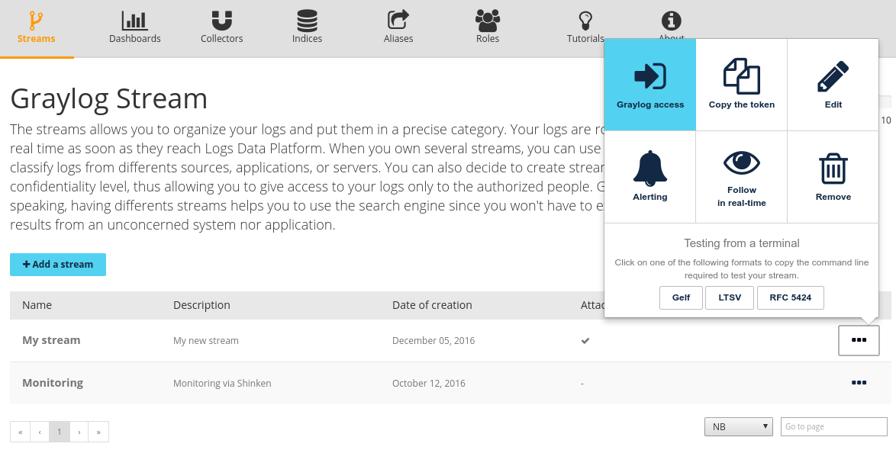
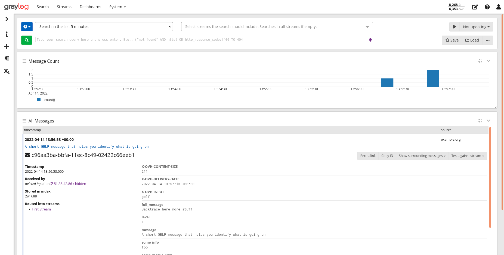
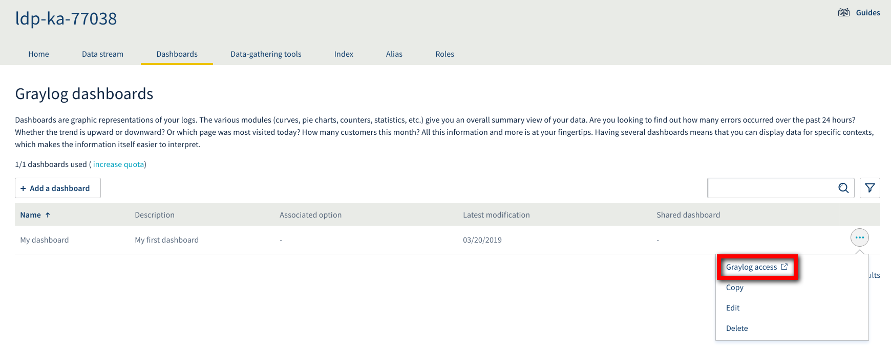
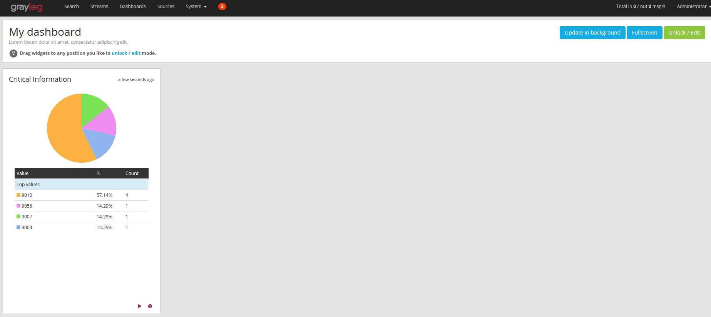
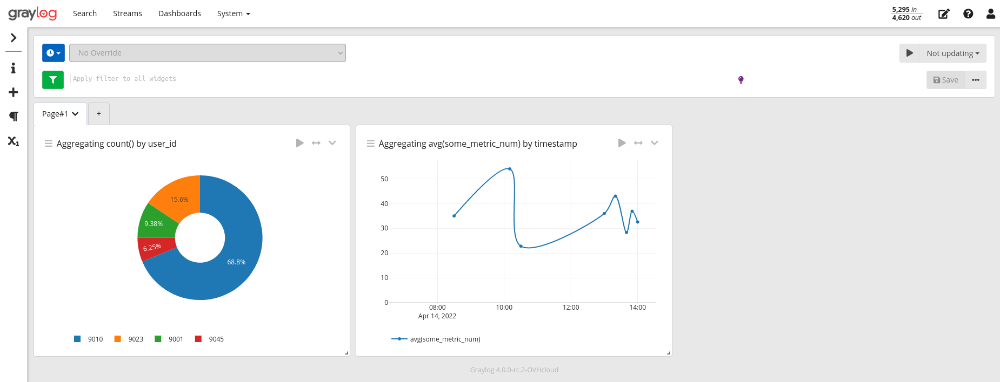

**Last updated 20th March 2019**

## Objective

Welcome to the quick start tutorial of the Logs Data Platform. This Quick start guide will help you to understand the core concepts behind the Logs Data Platform and how to send your first logs to the engine.
 
## Instructions

### Welcome to Logs Data Platform

First, you will have to order [one of the Logs Data Platform plans](https://www.ovh.com/fr/data-platforms/logs){.external}. We have a free plan so you can test this tutorial! Once the order is complete you will be able to play with Logs Data Platform (LDP).

- Log into the [ovh.com Manager](https://www.ovh.com/manager){.external}, and navigate to the Cloud section located at the top left in the header.
- Once you have created your credentials, the main interface will appear :

{.thumbnail}

Your Logs Data Platform username is located on the bottom left of the page, in the **Configuration** panel. In this section, you can also :

1. Review your plan and options
2. Change your service name
3. Reset your password of your LDP current account.

On this interface you can see the configuration menu of the two main items :

1. The **Data streams** are the recipients of your logs. When you send a log with the right stream token, it arrives automatically to your stream in an awesome software named Graylog. When you access your stream in Graylog you will be able to search your logs and immediately analyze them.
2. The **Dashboard** is the global view of your logs, A Dashboard is an efficient way to exploit your logs and to view global information like metrics and trends about your data without being overwhelmed by the logs details.

Below them, you have access to different sections :

3. The **Data-gathering tools** will allow you to ask OVH to host your own dedicated collector like Logstash or Flowgger.
4. The **Users Roles** will give you the control over who can read and access your streams or dashboard.
5. The **Index** will allow you to create your dedicated Elasticsearch Index or retrieve the ones used to store your Kibana settings.
6. The **Aliases** will allow you to access your data directly from your Kibana or using an Elasticsearch query.

### Let's send some logs!

- The first step to use the Logs Data Platform is to create a stream and to get your token. Creating a stream is really simple: click on the link  **Add data stream**  in the data stream panel. It will then redirect to a page where you can add a name and a description to your stream:

{.thumbnail}

- Once you have done this, click on the blue button  **Save**  and that's it! You have created your first stream. The button will redirect you to the stream page where you will be able to copy the X-OVH-TOKEN token. This value is the only token you will need to route logs to your stream. Under this token, you will have a list of your created streams.

{.thumbnail}

The menu **"..."** at the right gives you several features:

- **Edit** allows you to edit the name and the description of your Stream.
- **Graylog access** gives you a direct access to your stream and its logs.
- **Copy the write token** allows you to retrieve your token and to use it in your different logs collector.
- **Monitor in real-time** allows you to see the logs incoming into your stream in real-time. Note that Graylog also provides this functionality. On this page you can also **Test** different log formats from your computer to your stream. [More about](../ldp_tail/guide.en-gb.md){.ref}
- **Manage alerts** allows you to define your alert conditions on the logs routed to the stream. [More about](../alerting/guide.en-gb.md){.ref}
- **Archives** allows you to download the cold stored archives. [More about](../cold_storage/guide.en-gb.md){.ref}
- **Remove** Deletes your stream from the system and all related content.

Logs Data Platform supports several logs formats, each one of them has its own advantages and disadvantages. Here are the different formats available

- **GELF**: This is the native format of logs used by Graylog. This JSON format will allow you to send logs really easily. See: [http://docs.graylog.org/en/latest/pages/gelf.html](http://docs.graylog.org/en/latest/pages/gelf.html){.external}. The GELF input only accept a null ('') delimiter.
- **LTSV**: this simple format is very efficient and is still human readable. you can learn more about it [here](http://ltsv.org){.external}. LTSV has two inputs that accept a line delimiter or a null delimiter.
- **RFC 5424**: This format is one of the most commonly used by logs utility like syslog. It is extensible enough to allow you to send all your data. More information about it can be found at this link: [RFC
5424](https://tools.ietf.org/html/rfc5424){.external}.
- **Cap'n'Proto**: The most efficient log format. this is a binary format that will allows you to maintain a low footprint and high speed performance. If you want to know more about it, check the official website: [Cap'n'Proto](https://capnproto.org/){.external}.

Here are the ports you can use on your cluster to send your logs. You can either use the secured ones with SSL Enabled (TLS >= 1.1) or use the plain unsecured ones if you can't use a SSL transport.

||Syslog RFC5424|Gelf|LTSV line|LTSV nul|Cap’n’Proto|
|---|---|---|---|---|---|
|TCP/TLS|6514|12202|12201|12200|12204|
|TCP|514|2202|2201|2200|2204|
|UDP|514|2202|2201|2200|2204|

You can retrieve the ports and the address of your cluster at the **Home** page

{.thumbnail}

To send your logs to Logs Data Platform you can easily test your stream, by doing for example, a simple **echo** followed by a **openssl** command. Here are 3 examples, choose the format you like the most with your preferred terminal:  Note that each format has its own timestamp format: GELF uses [seconds from epoch](https://en.wikipedia.org/wiki/Unix_time){.external}, RFC 5424 and LTSV use the [RFC 3339](https://tools.ietf.org/html/rfc3339){.external}. Don't forget to change the timestamp to your current time to see your logs (By Default Graylog only display recent logs, you can change the scope of the search by using the top left time picker in the Graylog web interface). Don't forget to change the token to put the right one too.

*GELF*:


```shell-session
$ ubuntu@server:~$ echo -e '{"version":"1.1",  "_X-OVH-TOKEN":"d93eee2a-697f-4bac-a452-705416b98a04", "host": "example.org", "short_message": "A short message that helps you identify what is going on", "full_message": "Backtrace here\n\nmore stuff", "timestamp": 1385053862.3072, "level": 1, "_user_id": 9001, "_some_info": "foo", "some_metric_num": 42.0 }\0' | \
openssl s_client -quiet -no_ign_eof -connect <your_cluster>.logs.ovh.com:12202
```

For this format, the time is in seconds, with optional milliseconds as decimals.

*LTSV*:


```shell-session
$ ubuntu@server:~$ echo -e 'X-OVH-TOKEN:d93eee2a-697f-4bac-a452-705416b98a04\thost:example.org\ttime:2016-03-08T14:44:01+01:00\tmessage:A short message that helps you identify what is going on\tfull_message:Backtrace here\n\nmore stuff\tlevel:1\tuser_id:9001\tsome_info:foo\tsome_metric_num:42.0\0'| \
openssl s_client -quiet -no_ign_eof -connect <your_cluster>.logs.ovh.com:12200
```

For this format the time is in the RFC 3339 format.

*RFC 5424*:

```shell-session
$ ubuntu@server:~$ echo -e '<6>1 2016-03-08T14:44:01+01:00 149.202.165.20 example.org - - [exampleSDID@8485 X-OVH-TOKEN="d93eee2a-697f-4bac-a452-705416b98a04" user_id="9001"  some_info="foo" some_metric_num="42.0" ] A short message that helps you identify what is going on\n' | \
openssl s_client -quiet -no_ign_eof -connect <your_cluster>.logs.ovh.com:6514
```

For this format the time is in the RFC 3339 format.

- To see your logs in Graylog, click on the Menu button "**...**" located at the right of your stream in the stream list. Click on the **Graylog access** button to jump straight to Graylog. You have to use the Logs Data Platform credentials that were sent by email when you ordered your account **logs-XXXXX/your_password**. If you have not written it, you can click **reset password** in the account menu at the top right of the main page or at the corresponding link in the **Home** page.

{.thumbnail}

The Graylog login page looks like this:

{.thumbnail}

Once logged, you will be redirected to this page :

{.thumbnail}

On this page you can already search for the different values present in the logs by using the search bar (at the top of the page). You can also select the time range of your search by playing with time picker at the top left of the page.
For example to search all the logs in the last 5 minutes that contain 42 for the value some_metric_num you can enter in the search bar after you have select **Last 5 minutes** in the time picker combobox at the top:

```
some_metric_num:42
```

Press `Enter`{.action} or click on the Green button to launch the search and wait for your results.

You can also search some part of your message by entering:

```
helps going
```

It will give you all the messages that contains the terms 'helps' and 'going'.

Graylog allows you to extensively search through your logs without compromising usability. If you want to know more about how to craft relevant searches on Graylog, head to [Graylog Search Documentation](http://docs.graylog.org/en/2.0/pages/queries.html){.external}.

Send several logs with different values for user_id, for example. At the left of the page you will see the fields present in your stream, you can click on the user_id checkbox to display all the values for this field along the logs.


### Let's create a Dashboard

Let's go back to the Logs Data Platform manager, we will now create a Dashboard that will allow you to explore your data in a graphical manner. It is even simpler to create a Dashboard, just click on the `Add a dashboard`{.action} button and on the next page, add a description and a title for your Dashboard. Once created, you can use the **...** menu to access it immediately.

{.thumbnail}

At first, your dashboard is sad and empty but we will fill it really soon with some awesome widgets ;-). To do that, get back to your stream: you can use the link on graylog (under the Stream tab) or the link on your console as you wish. Let's say you want all the user Ids for which the value some_metric is above 30, first. you search for this data:

- in the search bar, enter this: `some_metric_num:>30`
- select above the search bar, the relative range of time you want to use in your widgets. If you want your widget to display the value for the last hour, select "Search in the last Hour".
- On the left panel, unroll the user_id menu (by clicking on the blue triangle at the left) and select Quick Values. It will then display a nice widget with the distribution of the most frequent user_ids.


This widget gives you the most frequent user_id in the logs of the last hour that have a some_metric_num value above 30.

- To add this really critical information to your dashboard, click on the `Add to Dashboard`{.action} menu button and select your newly created Dashboard. Fill a title for your widget and select the representation of your datas.

Head to the Dashboard by clicking on the the appropriate tab and observe your widget on it.



Mixing various widgets on the same dashboard give to this feature all its sense. In this screenshot, you can see that we added a widget that represents the mean values for some_metric_num (by using generate chart instead of quick values for the field some_metric in the stream tab). we also updated the title of the first widget using the little "pen" button at the bottom right of the widget and finally we also changed the disposition of the widgets (using the Unlock button at the top right) and moved everything around.




## Go further
We have only scratched the surface of what Logs Data Platform can do for you. you will find soon enough how to:

- [Send correctly formatted logs to use custom types as number, boolean and other stuffs](../field_naming_conventions/guide.en-gb.md){.ref}
- [Configure your syslog-ng to send your Linux logs to Logs Data Platform.](../how_to_log_your_linux/guide.en-gb.md){.ref}
- Using roles to allow other users of the platform to let them see yours beautiful Dashboards or let them dig in your Streams instead of doing it for them.
- [Using Kibana and aliases to unleash the power of elasticsearch](../using_kibana_with_logs/guide.en-gb.md){.ref}
- If you want to master Graylog, this is the place to go: [Graylog documentation](http://docs.graylog.org/en/2.0/pages/queries.html){.external}
- Getting Started: [Quick Start](./guide.en-gb.md){.ref}
- Documentation: [Guides](../product.en-gb.md){.ref}
- Create an account: [Try it free!](https://www.ovh.com/fr/order/express/#/new/express/resume?products=~%28~%28planCode~%27logs-basic~productId~%27logs%29){.external}
- Join our community of users on [https://community.ovh.com](https://community.ovh.com/en/c/Platform){.external}