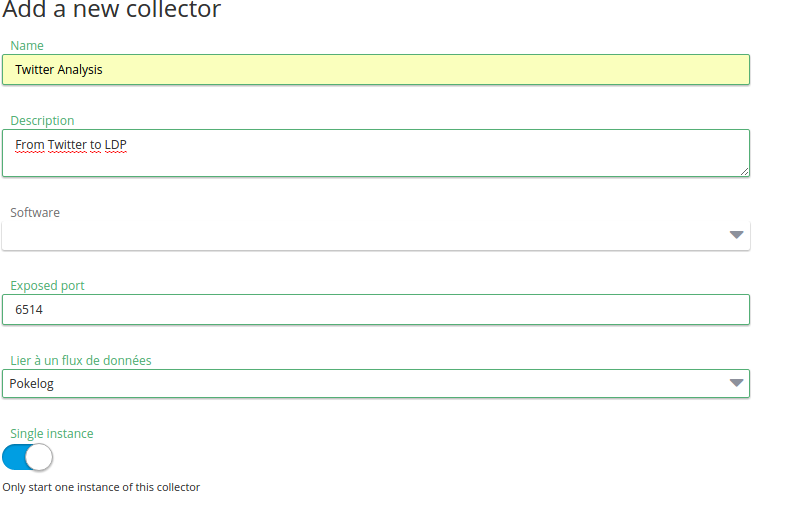

**Last updated 10th April, 2019**

## Objective

Twitter can be an amazing source to have a direct feedback on your products or events, track a particular subject to find new business opportunities or just to follow the most important people of your network. You can use Logs Data Platform to fully exploit this data flow with the Logstash collector feature and its powerful plugins. This guide will show you how to analyze your tweets using the Logs Data Platform.
 
## Requirements

Prior to completing this guide, you should read the following:

- [Quick Start of Logs Data Platform](../quick_start/guide.en-gb.md){.ref}
- [Field naming conventions](../field_naming_conventions/guide.en-gb.md){.ref}
- [Logstash collector](../logstash_input/guide.en-gb.md){.ref}

If you have completely understood these three guides, let's dive into this one.

## Instructions

### Logstash collector configuration

#### Twitter application creation

Logstash has a powerful Twitter Input plugin. This plugin allows you to connect to the Stream API of Twitter and to listen for incoming tweets. In order to do this, it just needs your Twitter account API Keys. They are free and needs only a Twitter account. Log in your Twitter account in: [https://apps.twitter.com/](https://apps.twitter.com/){.external} and click on create a new app. Fill a name, a description and a website for your project. Read and agree to the Twitter Developer Agreement to proceed. You will then arrive on the application webpage:

{.thumbnail}

From there, head to the **Keys and Access Tokens tab** and click on the **Create my access token** button at the bottom of the page. So you have now a total of 4 keys that identify your access:

Two main application Keys located at the top:

- The Consumer Key
- The Consumer Secret

Two API access Keys located below:

- The Access Token
- The Access Token Secret

Note that you can configure the access levels on both your app and tokens. All these keys will be used in the Twitter input plugin of Logstash. Now let's configure our Twitter logstash collector!

#### Logstash collector creation

In the Logs Data Platform manager, create a Logstash collector. On the creation page, as usual fill a Name and a Description and leave the default port since it will not be used (The logstash input will connect to Twitter by itself). Also attach your collector to a dedicated stream. The only important thing is to check the **Single Instance** option. This option is here to ensure that only one logstash instance will be created. If you don't use it, according to your option attached, several instances will fetch the same data from Twitter and send it to your stream multiple times.

{.thumbnail}

#### Twitter input plugin configuration

Once your collector has been created, head to the configuration page, this is where the real fun begins! To configure your input plugin, you need the Twitter Keys created before. Here is a configuration snippet of the Twitter plugin input:


```ruby hl_lines="2 3 4 5"
twitter {
    consumer_key => "XXXXXXXXXXXXXXXXXXXXXXXXXXXXXXX"
    consumer_secret => "XXXXXXXXXXXXXXXXXXXXXXXXXXXXXXXXXXXXXXXXXXXXXXXx"
    oauth_token => "XXXXXXXXXXXXXXXXXXXXXXXXXXXXXXXXXXXXXXXXXXXXXXXXXXXXXXX"
    oauth_token_secret => "XXXXXXXXXXXXXXXXXXXXXXXXXXXXXXXXXXXXXXXXXXXXX"
    keywords => [ "playstation","Nintendo","xbox"]
    type => "tweet"
    full_tweet => true
}
```

Fill the consumer Keys and Secret with the keys you obtained at the Twitter app configuration step. The oauth_token and the oauth_token_secret are the Access Token and Access Token Secret you created just before.

The keywords array is the special array where you can specify which keywords you want to follow. Here i want to follow the three different competitors of the famous #ConsoleWars. If you want to follow tweets that contains multiple terms simultaneously you just separate them by a space in the same string. For Exemple: "call of duty" will follow only tweets that contain 'call', 'of' and 'Duty'. You can also just follow a specific Twitter account by using the option **follows**. For more information about the Twitter input, go to the complete [Twitter input documentation](https://www.elastic.co/guide/en/logstash/6.7/plugins-inputs-twitter.html){.external}.

You must use two additional parameters:

- **type** will be useful for our Logstash filters
- **full_tweet** is here to fetch all the metadata from the tweet.

#### Filter plugin configuration

Actually, if you want a minimal Twitter configuration, this could be enough. But our goal is to analyze trends, hashtags, mentions, user activities etc. In order to do this, we need to have at least a clear view of the main objects contained in a tweet: hashtags and mentions. Both of them are normally embedded in a tweet event but Logs Data Platform need flat objects, so we will have to extract them. The goal is to have three different objects: tweets, hashtags and mentions so that we can freely analyze them or correlate them. Here is the filter configuration:


```ruby
if [type] == "tweet" {

	mutate {
		add_field => {
			"message" => "%{text}"
			"full_message" => "%{text}"
			"hashtags" => "%{[entities][hashtags]}"
			"mentions" =>  "%{[entities][user_mentions]}"
			"host" => "twitter"
			"tweet_url" => "https://twitter.com/%{[user][screen_name]}/status/%{id_str}"
			"user_screen_name" => "%{[user][screen_name]}"
			"user_id" => "%{[user][id_str]}"
			"user_followers_count_int" => "%{[user][followers_count]}"
			"user_friends_count_int" => "%{[user][friends_count]}"
			"user_listed_count_int" => "%{[user][listed_count]}"
			"user_favourites_count_int" => "%{[user][favourites_count]}"
			"user_statuses_count_int" => "%{[user][statuses_count]}"
			"user_profile_image_url" => "%{[user][profile_image_url_https]}"
			"user_verified_bool" => "%{[user][verified]}"
		}
		remove_field => ["timestamp_ms"]
	}

	if [user][profile_banner_url] {
		mutate {
			add_field => {
				"user_profile_banner_url" => "%{[user][profile_banner_url]}"
			}
		}
	}

	if [retweeted_status] {
		mutate {
			add_field => {
				"retweeted_status_user_screen_name" => "%{[retweeted_status][user][screen_name]}"
				"retweeted_status_tweet_url" => "https://twitter.com/%{[retweeted_status][user][screen_name]}/status/%{[retweeted_status][id_str]}"
			}
		}
	}       

	if [entities][user_mentions] and [type] == "tweet" {
		clone {
			clones => ["mention"]
		}
	}

	if [entities][hashtags]  and [type] == "tweet" {
		clone {
			clones => ["hashtag"]
		}
	}

}

if [type] == "hashtag" {

	split {
		field => "[entities][hashtags]"
	}

	mutate {
		add_field => {
			"hashtag" =>  "%{[entities][hashtags][text]}"
			"indice_begin_int" =>  "%{[entities][hashtags][indices][0]}"
			"indice_end_int" =>  "%{[entities][hashtags][indices][1]}"
		}
		remove_field => [ "retweet_count", "retweeted_status", "user", "text", "filter_level", "favorite_count", "extended_tweet", "entities"]
		update => {
			"message" => "#%{[entities][hashtags][text]}"
		}
	}

}

if [type] == "mention" {

	split {
		field => "[entities][user_mentions]"
	}

	mutate {
		add_field => {
			"mention" =>  "%{[entities][user_mentions][screen_name]}"
			"mention_user_id_" =>  "%{[entities][user_mentions][id]}"
			"indice_begin_int" =>  "%{[entities][user_mentions][indices][0]}"
			"indice_end_int" =>  "%{[entities][user_mentions][indices][1]}"
		}
		remove_field => [ "retweet_count", "retweeted_status", "user", "text", "filter_level", "favorite_count", "extended_tweet", "entities"]
		update => {
			"message" => "@%{[entities][user_mentions][screen_name]}"
		}
	}

}
```

The configuration looks quite long and complex, it is in fact splittable into three parts: the *tweet type section*, the *hashtag type section* and the *mention type section*

- The tweet type section: In this section, we select all the objects that have the *tweet*  type. We use the *mutate filter*  to extract and move some information at the top level of the event. We also remove unneeded information as id_str or timestamp_ms. Then we use [conditional expressions](https://www.elastic.co/guide/en/logstash/6.7/event-dependent-configuration.html){.external} to extract information and to create hashtags and mentions objects. The *clone filters*  will create a new event that will contain a copy of the full tweet and will tag it as a hashtag or mention type. They will execute only if mentions or hashtags are present.
- The hashtag type section: In this section, the hashtags of a tweet will be splitted in distinct events so a tweet that has 4 hashtags will generate 4 events of type hashtag. That's the purpose of the *split filter*. After the split filter, there is a mutate filter that will promote some information at the top level of the event and remove unecessary information for this type of object. It will also change the message to the hashtag text itself with the preceding 'hash' character.
- The mention type section: It is pretty much the same than the hashtag one. One *split filter*  to create mentions events and one *mutate filter*  to extract, delete and modify useful information.

We could have applied the same process for the media entities for example. The workflow would have been the same: Extract the entities from the tweet by cloning it with the media type, add a media type section with a split and mutate filter to generate different events.

Now that we have our filter, test the configuration, and then start the collector ! Head to your Graylog Stream attached to the collector to analyze your data !

### Analyze tweets in Graylog

Depending on the popularity of your keywords, you may or may not have any information in your stream yet. If you don't have any, check that the input started correctly or try it with more popular subjects:-). Here are some exemples of queries you can use in your Graylog stream:

If you want to know what is the number of tweets over time just type in the Graylog search bar:
```
type:tweet
```
This will give you only the tweets without hashtag nor mentions objects.

To search for a particular subject just type it in the search bar (with double-quotes):
```
"Final Fantasy XV"
```

If you want the hashtags, type:
```
type:hashtag
```
This will give you the hashtags list.

How to list all tweets from @PlayStation?
```
type:tweet AND user_screen_name:PlayStation
```

What are the most popular hashtags?
Use the left panel to select the *Quick Values widget* for the value **hashtag** to display a listing of the most frequent values.

What are the most popular hashtags associated with Nintendo?
You can combine the query and the quick values by issuing a query in the search bar first:
```
type:hashtag AND Nintendo. Then use the *Quick Values Widget* again
```

Which tweets contain 'xbox'?
```
type:tweet AND message:*xbox*
```

How many times @xboxuk is mentioned?
```
mention:xboxuk
```

In which tweets?
```
type:tweet AND mentions:*xboxuk*
```
Note here that we used the *mentions* field (with a final 's') on the tweet to retrieve the mention. Moreover with all objects types, you always have the original tweet message in the full_message field.

How to list tweets from "popular" users?
```
type:tweet AND user_followers_count_int:>5000
```

How to list all hashtags on the PlayStation subject except the PlayStation hashtag?
```
type:hashtag AND playstation AND NOT hashtag:PlayStation
```

How to list all tweets except retweets?
```
type:tweet AND NOT _exists_:retweet_status
```

There are many more possibilities. Of course you can create beautiful dashboards from all this information to visualize your data:

{.thumbnail}

That's all for now. If you have any proposition or trouble with this tutorial, don't hesitate to reach us with the mailing list or share your experience with the [Community](https://community.ovh.com/en/c/Platform){.external}.

## Go further

- Getting Started: [Quick Start](../quick_start/guide.en-gb.md){.ref}
- Documentation: [Guides](../product.en-gb.md){.ref}
- Community hub: [https://community.ovh.com](https://community.ovh.com/en/c/Platform){.external}
- Create an account: [Try it free!](https://www.ovh.com/fr/order/express/#/new/express/resume?products=~%28~%28planCode~%27logs-basic~productId~%27logs%29){.external}
