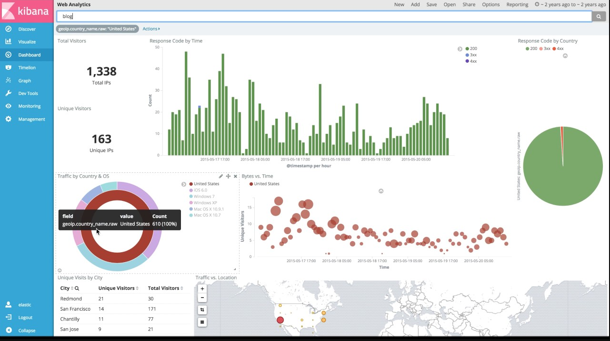
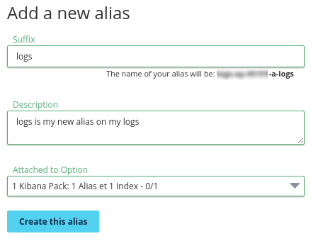
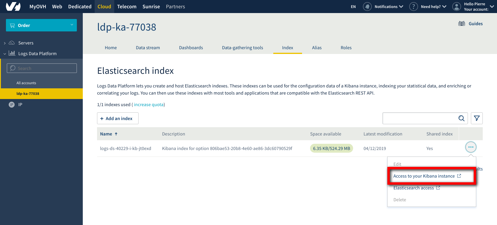
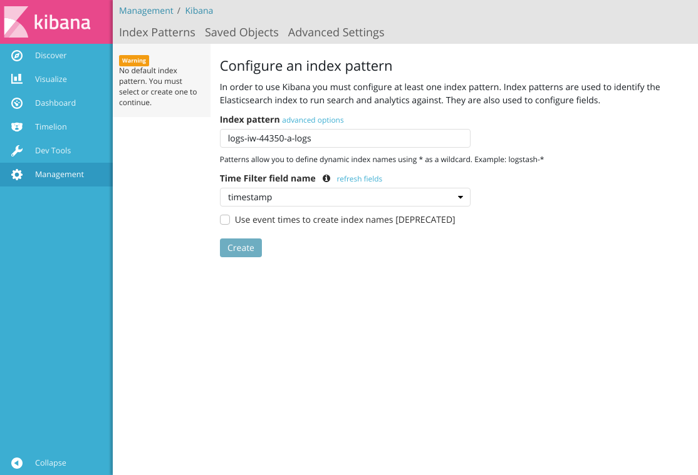

**Last updated 27th July, 2020**

## Objective

This guide will help you unleash the full power of [Kibana](https://github.com/elastic/kibana){.external} and craft some beautiful Dashboards from your logs.

## Requirements

This is what you need to know to get you started:

- You are already sending logs on a stream you own: [see the quick start tutorial](../quick_start/guide.en-gb.md){.ref}
- There is nothing else

After some training you will be able to do this kind of Dashboard: 

## Instructions

### Create your Stream Alias

To access your logs from Kibana, you will need to setup an Elasticsearch Alias and link them to your Graylog streams, so here we go again:

1. Go back to your manager.
2. In the Alias panel, click on the `Add an alias`{.action} button
3. Choose a name and define a description for your alias
4. Save the entry by clicking the `Save`{.action} button
5. Once the alias has been created. Use the **...** menu at the right and select `Attach content to the alias`{.action} option.
6. Define there the graylog streams you want to associate to your alias
7. That's it.

{.thumbnail}

So here you go, now Logs Data Platform knows which stream you want to browse. Now let's configure Kibana and see if it works!

### Access your Kibana instance

To reach your Kibana instance, click on Kibana tab, Click on `Add a instance`{.action}, put a description and click on **Order** to launch the creation of your instance. Your instance will be created and delivered in approximatively 20 minutes. 

{.thumbnail}

Use the **...** menu at the right and select `Access to your Kibana instance`{.action} option to be redirected.

{.thumbnail}

Once there, use your LDP credentials to sign in and set on the first page, as the Index name, the full name of your alias **logs-XXXXX-a-XXXXX**. Choose **timestamp** for the time field name then click on Discover tab to read your log entries.

{.thumbnail}

You can also explore any [Elasticsearch index](../index_as_a_service/guide.en-gb.md){.ref} you created on the platform. One Kibana instance allow you to explore all the data you delivered on Logs Data Platform.

If you want to know what you can do with Kibana, you can fly to the [very good Elastic documentation](https://www.elastic.co/guide/en/kibana/6.8/index.html){.external}

## Go further

- Getting Started: [Quick Start](../quick_start/guide.en-gb.md){.ref}
- Documentation: [Guides](../product.en-gb.md){.ref}
- Community hub: [https://community.ovh.com](https://community.ovh.com/en/c/Platform){.external}
- Create an account: [Try it!](https://www.ovh.com/fr/order/express/#/express/review?products=~(~(planCode~'logs-account~productId~'logs)){.external}

