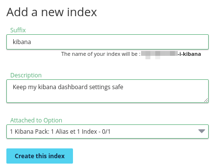

**Last updated 28th February, 2018**

## Objective

This guide will help you want to unleash the full power of [Kibana](https://github.com/elastic/kibana){.external} and craft some beautiful Dashboards from your logs.

## Requirements

This is what you need to know to get you started:

- You are already sending logs on a stream you own: [see the quick start tutorial](https://docs.ovh.com/fr/logs-data-platform/quick-start/){.external}
- You have ordered the Kibana pack Option.
- You have access to the port 9200 to your cluster (head to the **About** page in manager to know the address of your cluster).

After some training you will be able to do this kind of Dashboard: 


## Instructions

### Setup your Kibana index

Kibana requires an index in which to store your dashboards and other settings. Please do the following to create it in our Elasticsearch cluster:

1. Sign in on your manager
2. On Dedicated Indices section, click on Add a new Index.
3. Fill a new suffix and a description. Your index will be prefixed with *username-i* where username is your current username.
4. Attach the Index to your Kibana Pack and click on `Create this index`{.action}.

{.thumbnail}


### Select your Stream Alias

To access your logs from Kibana, you will need to setup an Elasticsearch Alias and link them to your Graylog streams, so here we go again:

1. Go back to your manager.
2. In the alias panel, click on the **Add a new alias**  button
3. Choose a name and define a description for your alias
4. Save the entry by clicking the floppy disk button.
5. Once the alias has been created. Use the **...** menu at the right and select **Link the alias to a Stream** option.
6. Define there the graylog streams you want to associate to your alias
7. That's it.

{.thumbnail}

So here you go, now Logs Data Platform knows what is the stream you want to browse. Now let's configure Kibana and see if it works!

### Setup your own kibana
Get the latest Kibana **5.6.X** for **Elasticsearch 5.6** here [https://www.elastic.co/downloads/kibana](https://www.elastic.co/downloads/kibana){.external} (5.6.3 at the time of writing). Here are some direct links for your convenience.

- [WINDOWS](https://artifacts.elastic.co/downloads/kibana/kibana-5.6.3-windows-x86.zip){.external}
- [MAC](https://artifacts.elastic.co/downloads/kibana/kibana-5.6.3-darwin-x86_64.tar.gz){.external}
- [LINUX 64-BIT](https://artifacts.elastic.co/downloads/kibana/kibana-5.6.3-linux-x86_64.tar.gz){.external}
- [LINUX 32-BIT](https://artifacts.elastic.co/downloads/kibana/kibana-5.6.3-linux-x86.tar.gz){.external}

Unzip the archive anywhere on your machine. To configure the Kibana, edit config/kibana.yml and set the following properties. **Don't forget to change the kibana index by the one you have created in the first part. Similarly, update the username and password to the ones you use to connect to Graylog. :**

```
 server.port: 5601
 # The host to bind the server to.
 server.host: "localhost"
 
 
 # The Elasticsearch instance to use for all your queries.
 elasticsearch.url: "https://<your_cluster>.logs.ovh.com:9200"
 
 # preserve_elasticsearch_host true will send the hostname specified in `elasticsearch`. If you set it to false,
 # then the host you use to connect to *this* Kibana instance will be sent.
 elasticsearch.preserveHost: true
 
 # Kibana uses an index in Elasticsearch to store saved searches, visualizations
 # and dashboards. It will create a new index if it doesn't already exist.
 kibana.index: "username-i-index"
 
 # If your Elasticsearch is protected with basic auth, this is the user credentials
 # used by the Kibana server to perform maintenance on the kibana_index at startup. Your Kibana
 # users will still need to authenticate with Elasticsearch (which is proxyfied through
 # the Kibana server)
 elasticsearch.username: "logs-XXXXX"
 elasticsearch.password: "YOUR_GRAYLOG_PASSWORD"
```

### Launch it!

If everything is setup properly, you should be able to start it by calling bin/kibana. Launch your favorite browser, and point it to **http://localhost:5601** On the first page, for Index name or pattern give the full name of your alias (logs-XXXXX-a-XXXXX). Choose timestamp for the time field name then click on Discover tab to read your log entries.

If you want to know what you can do with Kibana, you can fly to the [very good Elastic documentation](https://www.elastic.co/guide/en/kibana/5.6/index.html){.external}


## Go further

- Join our community of users on <https://community.ovh.com/>
- Getting Started: [Quick Start](https://docs.ovh.com/fr/logs-data-platform/quick-start/){.external}
- Documentation: [Guides](https://docs.ovh.com/fr/logs-data-platform/){.external}
- Community hub: [https://community.ovh.com](https://community.ovh.com/c/platform/data-platforms-lab){.external}
- Mailing List: [paas.logs-subscribe@ml.ovh.net](mailto:paas.logs-subscribe@ml.ovh.net){.external}
- Create an account: [Try it free!](https://www.ovh.com/fr/order/express/#/new/express/resume?products=~%28~%28planCode~%27logs-basic~productId~%27logs%29){.external}