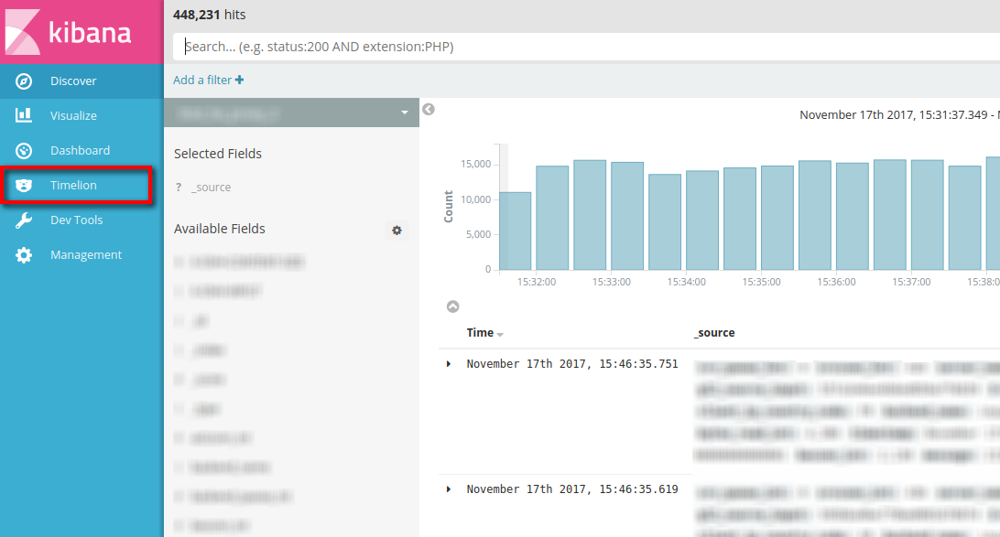
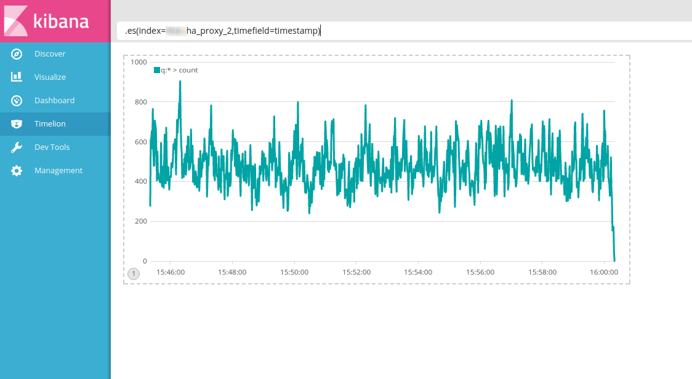
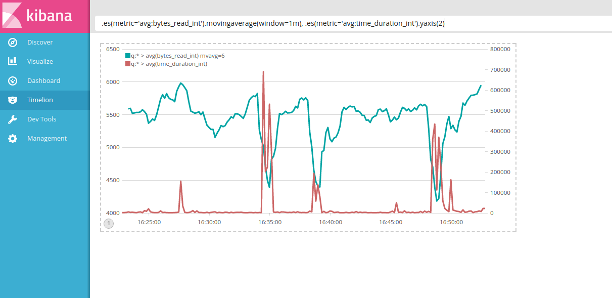
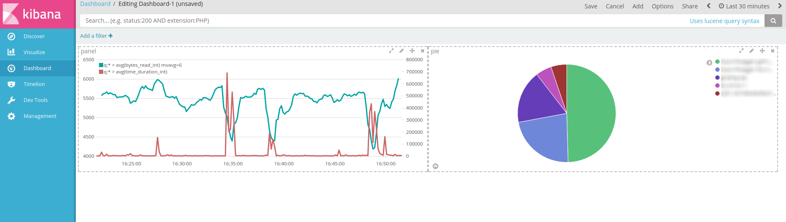

**Last updated 12th April, 2019**

## Objective

[Timelion](https://github.com/elastic/timelion){.external} is a Kibana module which allows you to query multiple datasources from a single Kibana instance a bit like Grafana. This tool is very powerful to analyze metric contained in logs (or simply analyze the logs count) sent to Elasticsearch (so Logs Data Platform here). This guide will show you how to achieve this.


The functionality of Timelion includes (but is not limited to):

- Compute an average over a period of time
- Compute a moving average over a period of time
- Compute the derivative of a metric or the results of a specific query to quickly see the variations.
- Doing arithmetic operation between your metric (division, sum, cumulative sum, multiply, percentage...)
- Grabbing series from other sources to mix your data with it ([Quandl](https://www.quandl.com){.external}, [World Bank Indicators](http://data.worldbank.org/){.external}, [Graphite](http://graphite.readthedocs.io/en/latest/){.external}).

An introduction to this plugin can be found here: [https://www.elastic.co/blog/timelion-timeline](https://www.elastic.co/blog/timelion-timeline){.external}.


## Requirements

In order to use Timelion, your Kibana access has to be already configured. If you don't have it already, you can visit [this Kibana tutorial](../using_kibana_with_logs/guide.en-gb.md){.ref}. If you're ready, let's get started!


## Instructions

### First, contact with Timelion on Kibana

To go to the Timelion module, use the link in Kibana interface:

{.thumbnail}


Once the module is loaded, it should complain about an error on access right. This is expected since by default the timelion plugins try to load data for the index **_all** and this is forbidden. 
but don't worry, you can change the index on the fly by using the search bar with the parameter **index**. If you use an alias on your stream, you also need to change the timefield used from **@timestamp** to **timestamp**. 


{.thumbnail}


### Configuring Timelion

To configure your default index and timefield for Timelion, go to the **Management** Page, and select the **Advanced Settings**. From there, locate the timelion settings and change the default index and timefield. 

### Where do I go from here?

Timelion has built-in documentation that allows you to discover its different functions. To access it, use the **Docs** button next to the time range selector at the top-right of the interface. The auto complete feature can also helps you to remember and have a short description of the available commands.

The Elasticsearch commands start by ".es", you can change the resolution of the chart by using the drop down menu at the right of the search bar.

To display all your data at the selected timerange (top right), use:

```
 .es()
```

To display only the data that have a certain field use

```
 .es(field:value)
```

To display the average on a numeric value present in your logs use :

```
 .es(metric='avg:my_field_num')
```

You can display only the variation (derivative) on this value by using the following formula :

```
 .es(metric='avg:my_field_num').derivative()
```

To display different data on different yaxis, use the yaxis() functions.

```
 .es(metric='avg:my_field_num').derivative(), es(*).yaxis(2)
```

In the following screenshot, you can easily see if there is a correlation between different metrics we have in your softwares (here we tried to find one in HA Proxy between the variation of the bytes_read and the duration of requests).

{.thumbnail}

Every visualization you create through Timelion can be embedded in a Kibana Dashboard so you can further query and refine your data.

{.thumbnail}

We have only scratched the surface of what you can do with Timelion. Head to these resources to learn even more cool tricks:


- [Timelion Elastic blog post](https://www.elastic.co/blog/timelion-timeline){.external}
- [Experiments with Timelion](http://rmoff.net/2016/03/29/experiments-with-kibana-timelion-2/){.external}
- [Anomaly detection with Timelion](https://www.elastic.co/blog/implementing-a-statistical-anomaly-detector-part-1){.external}
- [45 minutes of Timelion with its creator](https://www.youtube.com/watch?v=L5LvP_Cj0A0){.external}


## Go further

- Getting Started: [Quick Start](../quick_start/guide.en-gb.md){.ref}
- Documentation: [Guides](../product.en-gb.md){.ref}
- Community hub: [https://community.ovh.com](https://community.ovh.com/en/c/Platform){.external}
- Create an account: [Try it free!](https://www.ovh.com/fr/order/express/#/new/express/resume?products=~%28~%28planCode~%27logs-basic~productId~%27logs%29){.external}
