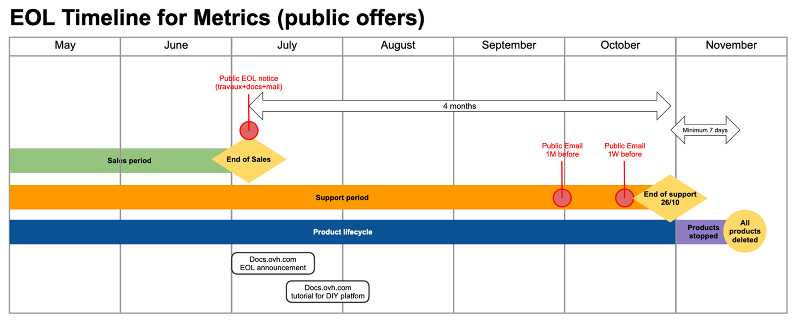

**Dernière mise à jour le 08/07/2021**

## Résumé

OVHcloud annonce la fin de vie des offres Metrics Data Platform.
Il n'est plus possible de commander des nouveaux services à partir du 8 Juillet 2021.
Les services actifs seront supportés jusqu'au 26 Octobre 2021, date de fin de support.
L'ensemble des opérations peut être suivi via [cette tâche travaux](https://bare-metal-servers.status-ovhcloud.com/incidents/7tx5l20nbp8z).

## Planification de la fin de vie

Les clients concernés et disposant de services actifs recevront courant juillet 2021 une notification par email sur leur NIC-admin.

### Table de planification 

| Jalon                 | Définition                                                                                                          | Date       |
|-----------------------|---------------------------------------------------------------------------------------------------------------------|------------|
| Annonce de fin de vie | Date de la tâche travaux qui annonce la fin de vente et la fin de support.  | 02/07/2021 |
| Fin de vente | Dernier jour pour acheter un nouveau service sur OVHcloud. | 08/07/2021 |
| Fin de support | Dernier jour pour utiliser les services. Après cette date, tous les services et supports associés seront indisponibles. | 26/10/2021 |

### Frise chronologique

{.thumbnail}

## Périmètre de la fin de vie

Sont concernés par cette fin de vie :

- l'ensemble des services et offres Metrics Data Platform (gratuits ou payants), mondialement;
- les routes API OVHcloud /me/insights et /metrics/*;
- L'interface web Grafana mise à disposition ( https://grafana.metrics.ovh.net/ ).

Ne sont pas concernés :

- Logs Data Platform (offre 100% indépendante).

## Options de migration et services de remplacement

OVHcloud ne dispose actuellement pas de solutions managées de remplacement, ni de services de migrations.
Des solutions sont en cours de développement tels que des clusters basés sur la technologie M3DB.
Leur disponibilité n'étant à ce jour pas confirmée, nous recommandons de déployer une solution de métrique open source telle que [Prometheus](https://prometheus.io/).

Ces solutions impliquent une migration manuelle réalisée par le client. OVHcloud mettra rapidement des guides à disposition, ils seront envoyés par email aux clients concernés.
