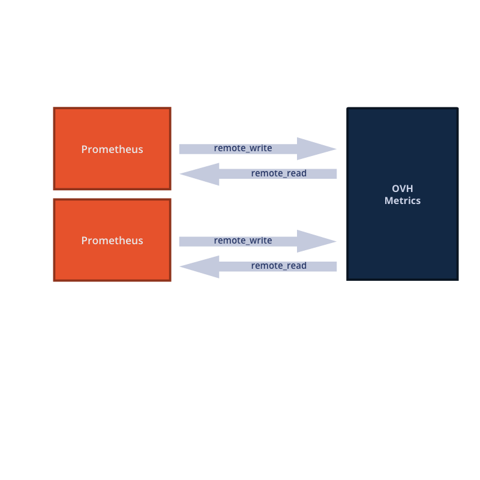

**Last updated 14 November, 2019**

## Objective

[Prometheus](https://prometheus.io/) is a well known services and systems monitoring tool which allow code instrumentation.
Collecting more and more data can lead to store a huge amount of data on local prometheus. It then become possible to configure your Prometheus instance to use [another storage layer](https://prometheus.io/docs/operating/integrations/#remote-endpoints-and-storage).

The read/write protocol support is available on OVH Metrics. It allows you to keep your prometheus instance, add another ones if needed and mutualise storage part.

Why should you do that ?

- Ability to scale Prometheus instances count with a shared storage
- Extends series retention
- ability to replace and perform a maintenance on instances without data loss

{.thumbnail}

## Requirements

- An active OVH Metrics account (xs plan at least)
- A working Prometheus instance

## Instructions

### Grep some tokens

Let's go to your [OVH Metrics manager](https://www.ovh.com/manager/cloud/index.html#/). The tokens tab is located on your Metrics product.
Craft two dedicated tokens (one for read, one for write) for your Prometheus instance, keep them for the next step.

### Configure Prometheus instance

Edit `prometheus.yml` configuration file, this file contains the global instance configuration.

You can find this file by greping the process which use it.

```sh
ps aux | grep prometheus | grep -v 'grep'
```

The process arg `--config.file` contains the configuration file path.

To setup prometheus remote configuration add the following lines (replace captitals strings by your tokens):

```yaml
remote_read:
  - url: https://prometheus.gra1.metrics.ovh.net/remote_read
    basic_auth:
      username: ''
      password: 'OVH_METRICS_READ_TOKEN'
remote_write:
  - url: https://prometheus.gra1.metrics.ovh.net/remote_write
    basic_auth:
      username: ''
      password: 'OVH_METRICS_WRITE_TOKEN'
```

This example assume your are on __gra1__ Metrics region, your OVH Metrics service can be on another one (like __bhs1__).
You can see it in your OVH Metrics manager under `platforms`.

Don't forget to restart your Prometheus instance to apply modifications.

## Going further

[How to make PromQL queries on OVH Metrics](../protocol_prometheus/guide.fr-fr.md){.ref}

You can exchange with our community of users on [OVH Comunnity](https://community.ovh.com/c/platform/data-platforms) or directly with us with our [gitter room](https://gitter.im/ovh/metrics).
