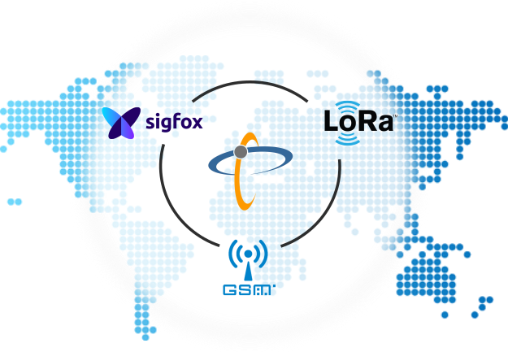
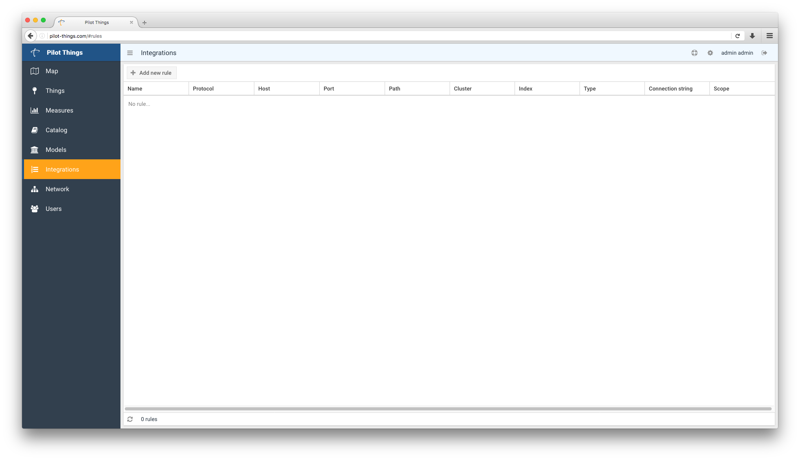
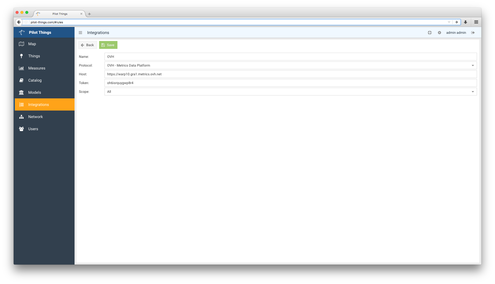
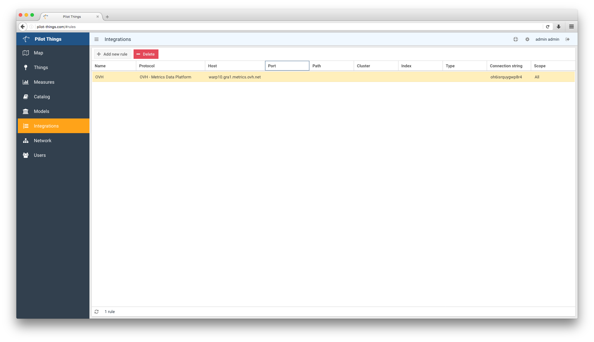

**Last updated 15th May, 2018**

## IoT Devices
IoT Devices can take a lot of form factors. From a simple wireless sensors to the Airbus A380, you will need the right strategy to connect your device. [Contact us](mailto:metrics@priv.ovh.net){.external} if you need help to choose the plan that suits you best.

With a Metrics account, you can store different kind of values: - Long - Double - Boolean - String

> [!warning]
>
> Some devices could push arbitrary binary values and you could need to unpack the data payload to extract the value.
> 

## Operators

{.thumbnail}

Operator's integration is a crucial criteria while choosing how you can acquire the data. And they are many choices :

- GPRS/SMS
- 4G
- Sigfox
- LoraWan (auto operated or its operators)
- Others

In order to offer you a direct presence in many countries from many Operators, we invite you to use [PilotThings](http://www.pilot-things.com/accueil/){.external} which will operate for you :

- Local ISP Acquisition
- Payload extraction
- Push to Metrics

## Create a PilotThings account
To get your account details, just send an email to [contact@pilot-things.com](mailto:contact@pilot-things.com){.external} with your :

- First name
- Lastname
- Company
- Phone number
- Contact email

*Pilot Things for OVH* beta is free for one month.

{.thumbnail}

## Associate your device
Now you have your account, you can associate your devices from the provided catalog. The latter will help you automatically decode data for devices from the list and PilotThings will send the data extracted from payload directly to the configured backend (see Integrations later)

{.thumbnail}

## Provide a custom decoder
Eventually, if your device doesn't appear in this list, you have to provide your custom decoder. It will help PilotThings to extract the meaningful data from the payload. Decoders are JavaScript function.

{.thumbnail}

## Setup OVH Metrics integration as backend
Fill the few fields by first naming your integrated Metrics account and choosing the corresponding protocol.

{.thumbnail}

Then complete it with your specific account informations :

- the region endpoint URL
- a WRITE Token you will have generated through the [Metrics Manager](https://www.ovh.com/manager/cloud/index.html#/dbaas/metrics/){.external} (Cloud > Metrics > your project) or OVH API (/metrics)

{.thumbnail}

Save your backend, and you're good to go!

{.thumbnail}

Continue to next section : {.ref}.

## Go further

Join our community of users on <https://community.ovh.com/en/>.
