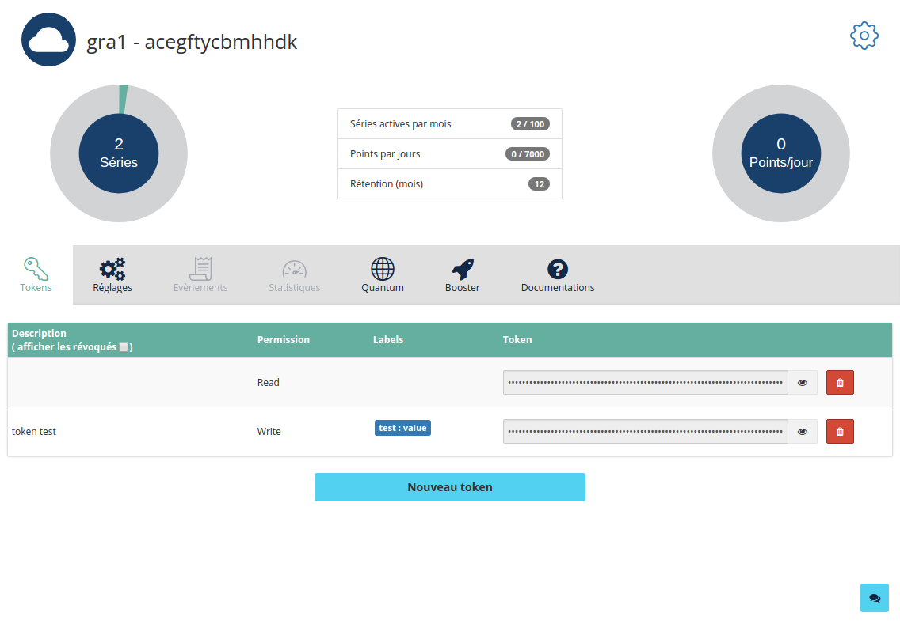
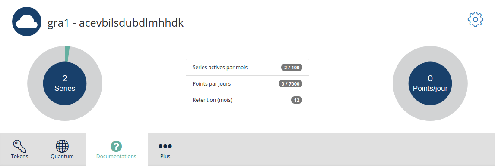
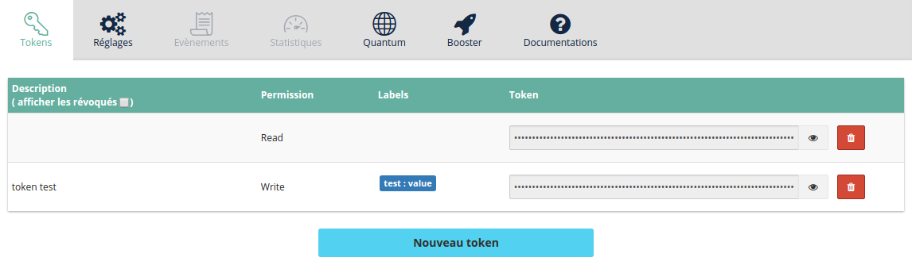
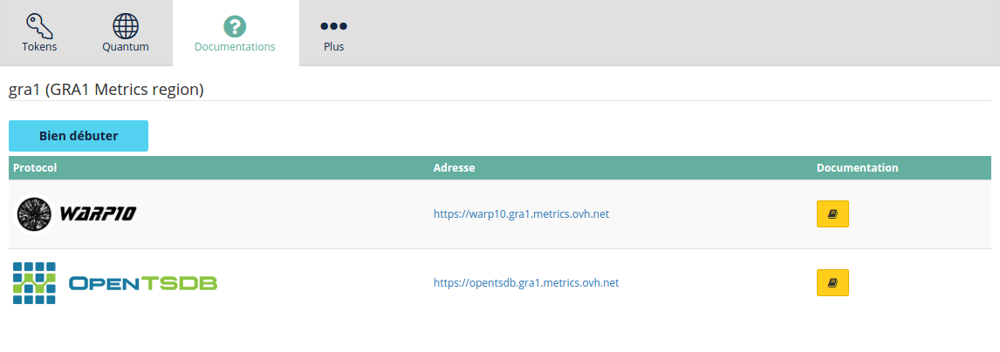

To access your manager, your first need to order a Metrics product.

This page assumes you've already read {.ref}

## Metrics Manager
Let's have a quick tour on the Manager. It's located in the [cloud section](https://www.ovh.com/manager/cloud/index.html){.external} under Metrics section (available when you subscribed a Metrics product).

{.thumbnail}

When in the Metrics section, select your project and you will enter the Metrics manager :

{.thumbnail}

The manager is divided into several sections, with different views :

- Header view
- Token view
- Platform view

### Header view

{.thumbnail}

The header is holding several informations about your account:

- Your region
- the name of the associated Metrics project
- Number of series active this month
- Number of datapoints pushed today
- The retention for the datapoints

### Token View

{.thumbnail}

In this view, you can view and edit your tokens. Those are needed to access the platform. There's two types:

- read token
- write token

You can create as many tokens as you want, by clicking on "new token".

### Token creation

{.thumbnail}

During token creation, you can set multiples parameters:

- the associated description for a token
- type, which is read or write
- a pair of defaults labels or tags. For a write token, those will be automatically added. For a read token, labels will be added during fetch.

### Platform view (Documentation)

{.thumbnail}

Here, you'll be able to find links to this present documentation, and also the endpoints per each supported protocols.

Continue to next section : {.ref}