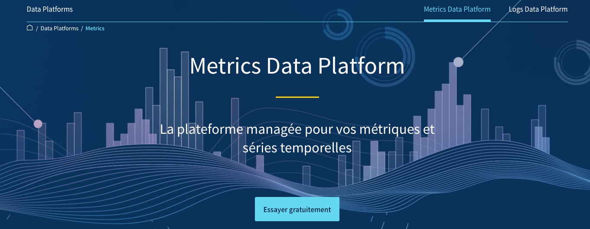
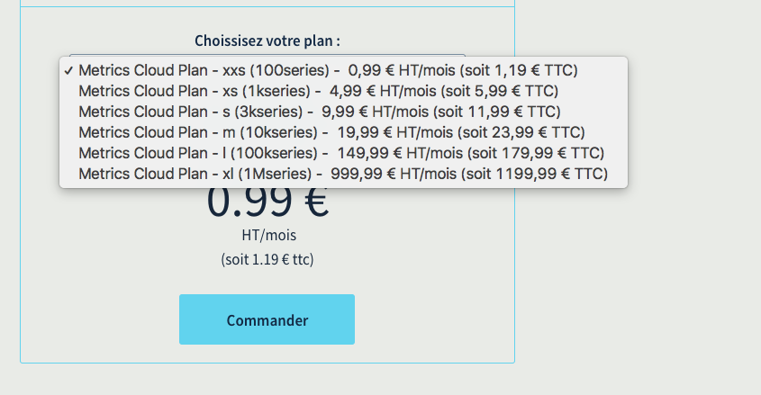
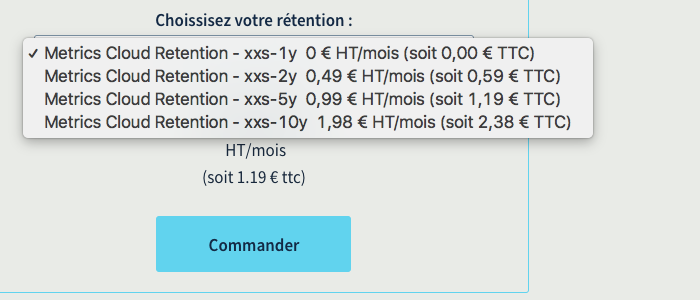
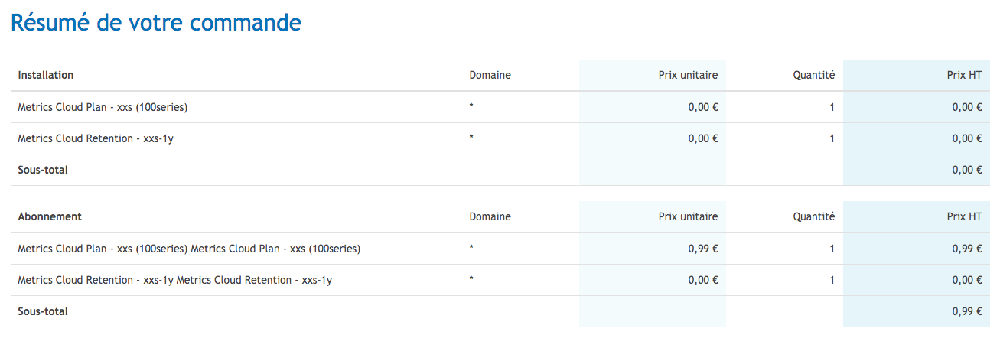

## Choose your plan
1. To order your Metrics Data Platform offer, go to [https://www.ovh.com/fr/data-platforms/metrics/](https://www.ovh.com/fr/data-platforms/metrics/){.external} and choose the offer that suits you best.

{.thumbnail}

First select the chosen plan :

{.thumbnail}

Then the retention between 1 year, 2 years, 5 years or 10 years. Retention means how much time we need to keep the data.

{.thumbnail}

## Order your Metrics project

{.thumbnail}

## Go to the manager
Once your order has been validated, you will receive an email with a direct link to the project. Alternatively, you can go to the [cloud section](https://www.ovh.com/manager/cloud/index.html){.external}. of your OVH manager (control panel) and click on Metrics.

{.thumbnail}

In the Token section, you will find a **pair of tokens**: one to read and the other one to write. You'll use them to access your data.

{.thumbnail}

You're now ready to go!