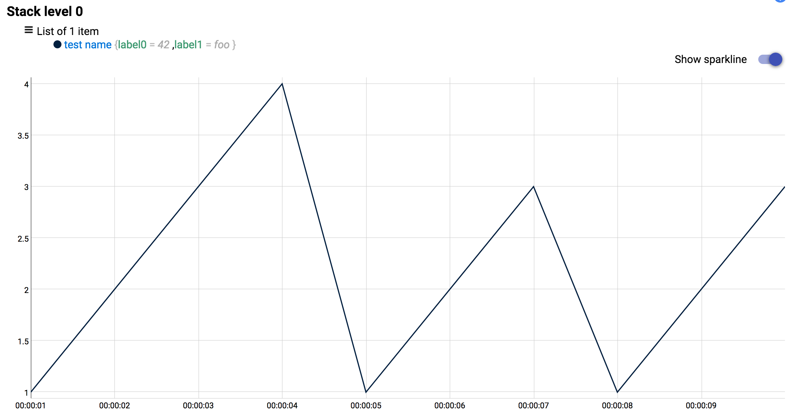
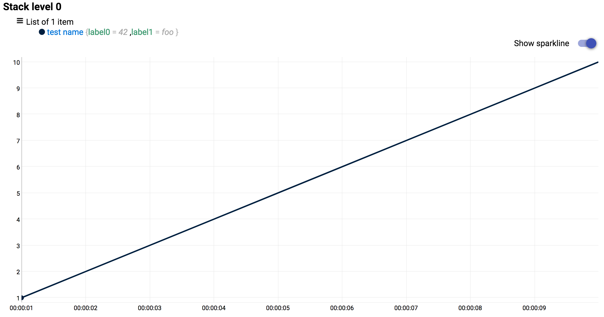
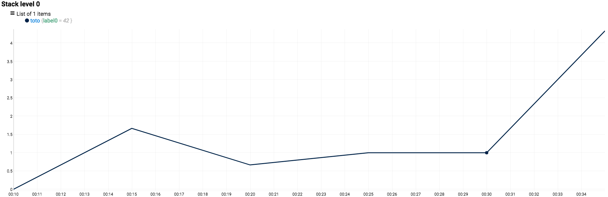
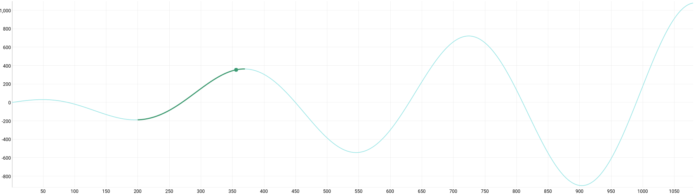
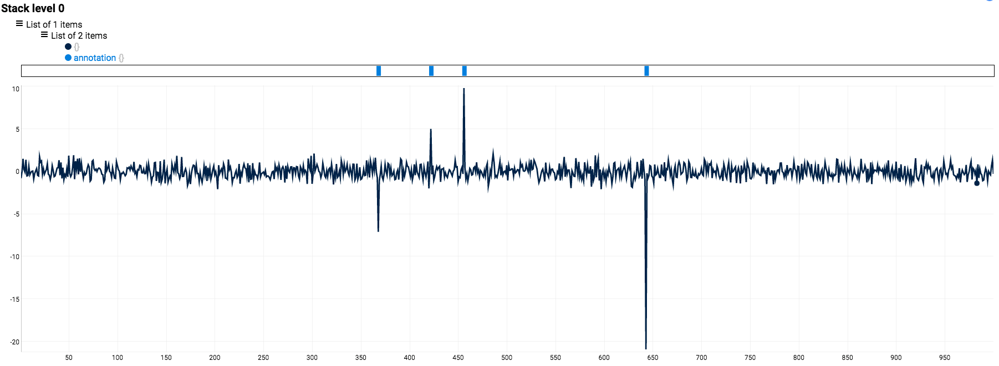

**Last updated 15th May, 2018**

> [!warning]
>
> This page is a Work in Progress.
> 

## Working with counters

In IT monitoring, we're heavily working with counters. Linux's data, number of HTTP calls, and so on. With WarpScript™, you can easily avoid counter resets and calculate rate.


### How to detect counter resets and remove them

The [RESETS functions](https://warp10.io/doc/RESETS){.external} compensates for possible counter resets by adding the last value before the rest to all values after the reset.

You just need to use the **RESETS** like this:

```
 [] FETCH        // Fetch your data
 FALSE RESETS    // compensates your counter if it was reset
```
Before:


{.thumbnail}

After:

{.thumbnail}

You can play with these example using Quantum: [resets](https://quantum.metrics.ovh.net/#/warpscript/TkVXR1RTIAondGVzdCBuYW1lJwpSRU5BTUUKeyAnbGFiZWwwJyAnNDInICdsYWJlbDEnICdmb28nIH0KUkVMQUJFTAoxMDAwMDAwICBOYU4gTmFOIE5hTiAxLjAgQUREVkFMVUUKMjAwMDAwMCAgTmFOIE5hTiBOYU4gMi4wIEFERFZBTFVFCjMwMDAwMDAgIE5hTiBOYU4gTmFOIDMuMCBBRERWQUxVRQo0MDAwMDAwICBOYU4gTmFOIE5hTiA0LjAgQUREVkFMVUUKNTAwMDAwMCAgTmFOIE5hTiBOYU4gMS4wIEFERFZBTFVFCjYwMDAwMDAgIE5hTiBOYU4gTmFOIDIuMCBBRERWQUxVRQo3MDAwMDAwICBOYU4gTmFOIE5hTiAzLjAgQUREVkFMVUUKODAwMDAwMCAgTmFOIE5hTiBOYU4gMS4wIEFERFZBTFVFCjkwMDAwMDAgTmFOIE5hTiBOYU4gIDIuMCBBRERWQUxVRQoxMDAwMDAwMCBOYU4gTmFOIE5hTiAgMy4wIEFERFZBTFVFCjEgLT5MSVNUCmZhbHNlIApSRVNFVFM%3D/eyJ1cmwiOiJodHRwczovL3dhcnAxMC5ncmExLm1ldHJpY3Mub3ZoLm5ldC9hcGkvdjAiLCJmZXRjaEVuZHBvaW50IjoiL2ZldGNoIiwiaGVhZGVyTmFtZSI6IlgtV2FycDEwIn0%3D){.external}.


### How to transform a counter into a rate

The [mapper.rate](https://warp10.io/doc/mapper.rate){.external} function **computes the rate of change** between the first and last values (rate = (last - first) / (lastick - firsttick)) of each sliding window. The location and elevation returned are those associated with the most recent value in the sliding window.

Here's an example:

```
 [] FETCH                            // Fetch your data
 [ SWAP mapper.rate 1 0 0 ] MAP      // compute a rate on a sliding-window
```
Before:


{.thumbnail}

After:


{.thumbnail}

You can play with these example using Quantum: [rate](https://quantum.metrics.ovh.net/#/warpscript/TkVXR1RTICJ0b3RvIiBSRU5BTUUgCnsgJ2xhYmVsMCcgJzQyJyB9IFJFTEFCRUwKMTAgbSBOYU4gTmFOIE5hTiAgMzAwLjAgQUREVkFMVUUKMTUgbSBOYU4gTmFOIE5hTiAgODAwLjAgQUREVkFMVUUKMjAgbSBOYU4gTmFOIE5hTiAgMTAwMC4wIEFERFZBTFVFCjI1IG0gTmFOIE5hTiBOYU4gIDEzMDAuMCBBRERWQUxVRQozMCBtIE5hTiBOYU4gTmFOIDE2MDAuMCBBRERWQUxVRQozNSBtIE5hTiBOYU4gTmFOICAyOTAwLjAgQUREVkFMVUUKCjEgLT5MSVNUICAKbWFwcGVyLnJhdGUKMQowCjAKNSAtPkxJU1QKTUFQCg%3D%3D/eyJ1cmwiOiJodHRwczovL3dhcnAxMC5ncmExLm1ldHJpY3Mub3ZoLm5ldC9hcGkvdjAiLCJmZXRjaEVuZHBvaW50IjoiL2ZldGNoIiwiaGVhZGVyTmFtZSI6IlgtV2FycDEwIn0%3D){.external}.


## Detecting patterns

Patterns detection is easy using built-in functions:

- PATTERNS is generating a list of motifs.
- PATTERNDETECTION is running the list of motifs on all the time series you have.

Here's an example:

```
[] FETCH 'gts' STORE
[] FETCH 'pattern.to.detect' STORE

32 'windowSize' STORE
8 'patternLength' STORE
16 'quantizationScale' STORE

$pattern.to.detect 0 GET $windowSize $patternLength $quantizationScale PATTERNS VALUES 'patterns' STORE
$gts $patterns $windowSize $patternLength $quantizationScale  PATTERNDETECTION
```
Before:


{.thumbnail}

After:


{.thumbnail}

You can play with these example using Quantum: [pattern](https://quantum.metrics.ovh.net/#/warpscript/TkVXR1RTICdjb3MnIFJFTkFNRQoxIDEwODAKPCUgRFVQICdpJyBTVE9SRSBEVVAgMiAqIFBJICogMzYwIC8gQ09TICRpICogTmFOIE5hTiBOYU4gNCBST0xMIEFERFZBTFVFICU%2BIEZPUgoKWyBTV0FQIGJ1Y2tldGl6ZXIubGFzdCAxMDgwIDEgMCBdIEJVQ0tFVElaRSBTVE9QICdjb3MnIFNUT1JFCgpORVdHVFMgJ3BhdHRlcm4udG8uZGV0ZWN0JyBSRU5BTUUKMjAwIDM3MAo8JSAgRFVQICdpJyBTVE9SRSBEVVAgMiAqIFBJICogMzYwIC8gQ09TICRpICogTmFOIE5hTiBOYU4gNCBST0xMIEFERFZBTFVFICU%2BIEZPUgoKWyBTV0FQIGJ1Y2tldGl6ZXIubGFzdCAyMTYwIDEgMCBdIEJVQ0tFVElaRSAncGF0dGVybi50by5kZXRlY3QnIFNUT1JFCgovLyBDcmVhdGUgUGF0dGVybgozMiAnd2luZG93U2l6ZScgU1RPUkUKOCAncGF0dGVybkxlbmd0aCcgU1RPUkUKMTYgJ3F1YW50aXphdGlvblNjYWxlJyBTVE9SRQoKJHBhdHRlcm4udG8uZGV0ZWN0IDAgR0VUICR3aW5kb3dTaXplICRwYXR0ZXJuTGVuZ3RoICRxdWFudGl6YXRpb25TY2FsZSBQQVRURVJOUyBWQUxVRVMgJ3BhdHRlcm5zJyBTVE9SRQoKJGNvcyAkcGF0dGVybnMgJHdpbmRvd1NpemUgJHBhdHRlcm5MZW5ndGggJHF1YW50aXphdGlvblNjYWxlICBQQVRURVJOREVURUNUSU9OICdjb3MuZGV0ZWN0aW9uJyBSRU5BTUUgJ2Nvcy5kZXRlY3Rpb24nIFNUT1JFCgokY29zLmRldGVjdGlvbgovLyBMZXQncyBjcmVhdGUgYSBndHMgZm9yIGVhY2ggdHJpcAoxMCAgICAgICAvLyAgUXVpZXQgcGVyaW9kCjUgICAgICAgICAvLyBNaW4gbnVtYmVyIG9mIHZhbHVlcwonc3ViUGF0dGVybicgIC8vIExhYmVsClRJTUVTUExJVAoKJGNvcw%3D%3D/eyJ1cmwiOiJodHRwczovL3dhcnAxMC5ncmExLm1ldHJpY3Mub3ZoLm5ldC9hcGkvdjAiLCJmZXRjaEVuZHBvaW50IjoiL2ZldGNoIiwiaGVhZGVyTmFtZSI6IlgtV2FycDEwIn0%3D){.external}.


## Working with annotations

Annotations are a powerful Warp 10™ features. You can **enrich your graph** with custom-crafted annotations such as:

- new releases
- crash
- bug reporting
- bugfix
- anomalies

To use annotations, you just have to push the value as string into Metrics. Only Warp 10™ protocol allows to do it.  You can also convert a serie into annotations by converting its values into string or boolean.

Here's an example using an outliers functions called [ESDTEST](https://warp10.io/doc/ESDTEST){.external}:


{.thumbnail}


> [!primary]
>
> To easily transform a GTS into an annotation, use mapper.toboolean or use mapper.tostring from the MAP framework.
> 

You can play with these example using Quantum: [outliers](https://quantum.metrics.ovh.net/#/warpscript/Ly8gTWFjcm8gdG8gc2hvdyBvdXRsaWVycyBvciBzdHJhbmdlIHBvaW50cwovLyBVc2FnZToKCi8vICAgIFtHVFMgLi4uIF0gYSBsaXN0IG9mIEdUUwovLyAgICAxMCBhbiB1cHBlcmJvdW5kIChhIExPTkcpIG9mIHRoZSBudW1iZXIgb2Ygb3V0bGllcnMgdG8gZGV0ZWN0LgovLyAgICBUIGEgQk9PTEVBTiBpbmRpY2F0aW5nIHdoZXRoZXIgdG8gdXNlIHRoZSBtZWFuIChGYWxzZSksIG9yIHRoZSBtZWRpYW4gKFRydWUpIHRvIGNhbGN1bGF0ZSB0aGUgWi1zY29yZQovLyAgICBARklORF9PVVRMSUVSUwoKLy8gVXNlIGV4YW1wbGU6ICRndHMgMTAgVCBARklORF9PVVRMSUVSUwo8JQogICAgW10gJ3N0cmFuZ2VfZ3RzJyBTVE9SRQogICAgJ21lYW4nIFNUT1JFIC8vIEJPT0wKICAgICd1cHBlcmJvdW5kJyBTVE9SRSAvLyBMT05HCiAgICA8JQogICAgICAgICdndHMnIFNUT1JFCiAgICAgICAgJGd0cyAkdXBwZXJib3VuZCAkbWVhbiBFU0RURVNUICdvdXRsaWVycycgU1RPUkUKICAgICAgICA8JSAkb3V0bGllcnMgU0laRSAwID09ICU%2BCiAgICAgICAgPCUgQ09OVElOVUUgJT4gSUZUCiAgICAgICAgTkVXR1RTICAnYW5ub3RhdGlvbicgUkVOQU1FICAnYW5ub3RhdGlvbicgU1RPUkUKICAgICAgICAkb3V0bGllcnMKICAgICAgICA8JQogICAgICAgICAgICAndGltZXN0YW1wJyBTVE9SRQogICAgICAgICAgICAkYW5ub3RhdGlvbiAkdGltZXN0YW1wIE5hTiBOYU4gTmFOIFQgQUREVkFMVUUgJ2Fubm90YXRpb24nIFNUT1JFCiAgICAgICAgJT4gRk9SRUFDSAogICAgICAgIFsgJGFubm90YXRpb24gbWFwcGVyLnRvYm9vbGVhbiAwIDAgMCBdIE1BUCAnYW5ub3RhdGlvbicgU1RPUkUKCiAgICAgICAgJHN0cmFuZ2VfZ3RzIFsgWyAkZ3RzICRhbm5vdGF0aW9uICAwIEdFVCBdIF0gQVBQRU5EICAnJHN0cmFuZ2VfZ3RzJyBTVE9SRQolPiBGT1JFQUNICiRzdHJhbmdlX2d0cwolPiAnRklORF9PVVRMSUVSUycgU1RPUkUKCi8vLyBNYWNybyB1c2VkIHRvIGdlbmVyYXRlIGFuIGFwcHJveGltYXRlbHkgbm9ybWFsIGRpc3RyaWJ1dGlvbiB1c2luZyBjZW50cmFsIGxpbWl0IHRoZW9yZW0KPCUgUkFORCBSQU5EIFJBTkQgUkFORCBSQU5EIFJBTkQgKyArICsgKyArIDMuMCAtICU%2BICdub3JtYWwnIFNUT1JFCgovLyB3ZSBjcmVhdGUgYSBsaXN0IG9mIEdUUyB3aXRoIGFuIGFwcHJveGltYXRlbHkgbm9ybWFsIGRpc3RyaWJ1dGlvbgpbIAogICAgTkVXR1RTIDEgMTAwMCA8JSBOYU4gTmFOIE5hTiBAbm9ybWFsIEFERFZBTFVFICU%2BIEZPUgogICAgLy8gd2UgYWRkIG91dGxpZXJzICg%2BIDMuMCBpbiBhYnNvbHV0ZSB2YWx1ZSkKICAgIDM2OCBOYU4gTmFOIE5hTiAtNy4xIEFERFZBTFVFCiAgICA0MjIgTmFOIE5hTiBOYU4gNS4wMDAxIEFERFZBTFVFCiAgICA0NTYgTmFOIE5hTiBOYU4gOS44IEFERFZBTFVFCiAgICA2NDMgTmFOIE5hTiBOYU4gLTIwLjkgQUREVkFMVUUKICAgIERFRFVQCl0KCjQgRiBARklORF9PVVRMSUVSUw%3D%3D/eyJ1cmwiOiJodHRwczovL3dhcnAxMC5ncmExLm1ldHJpY3Mub3ZoLm5ldC9hcGkvdjAiLCJmZXRjaEVuZHBvaW50IjoiL2ZldGNoIiwiaGVhZGVyTmFtZSI6IlgtV2FycDEwIn0%3D){.external}.

Interested in IoT? Learn how to [](../start_devicesguide.en-gb.md){.ref}.
