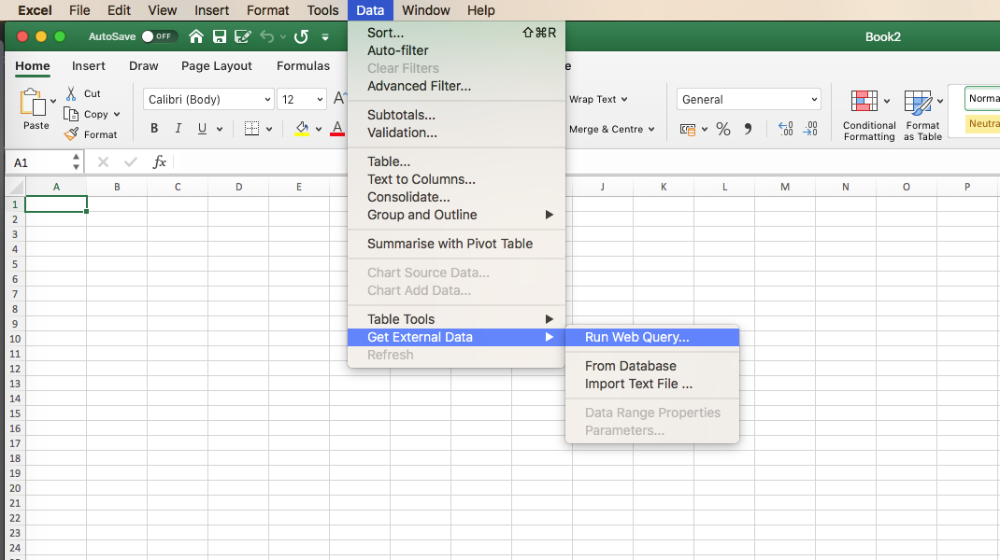
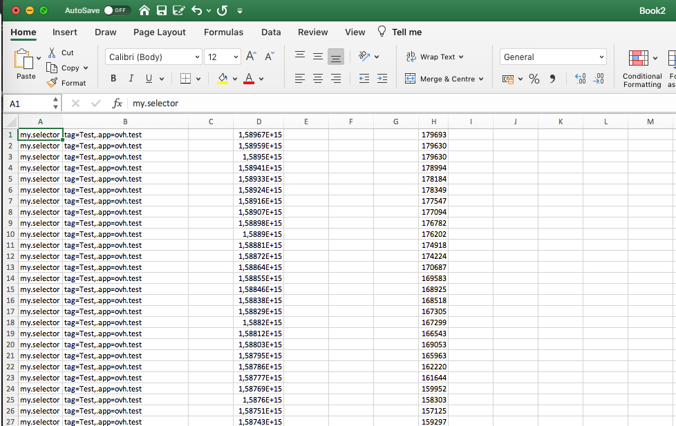
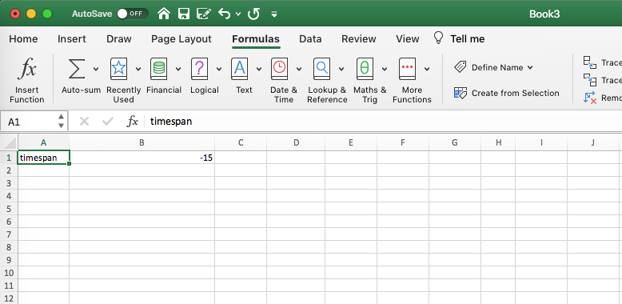
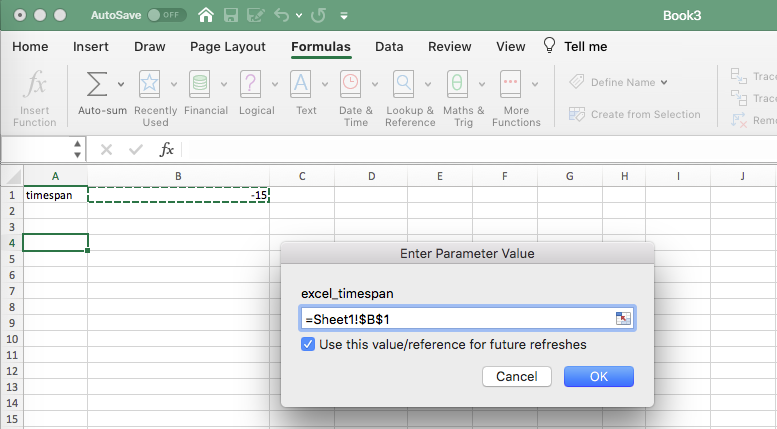
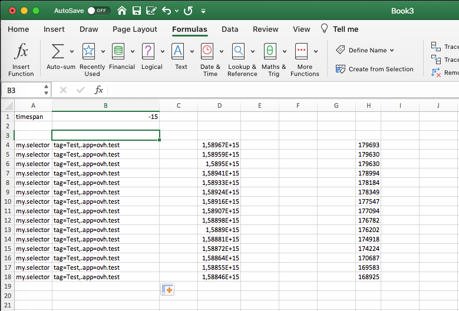

**Last updated 18th May, 2020**

## Objective

[Excel](https://www.microsoft.com/en-us/microsoft-365/excel){.external} is a common tool used to quickly plot and compute some KPI over a data set. In this guide, you will learn how to configure an Excel query to load Metrics data.

## Requirements

- a valid OVH Metrics account.
- a `READ` token that can be found on Metrics`s manager
- This documentation is for an excel data sheet. This can be used as a start to use Metrics on similar tools as LibreOffice or PowerBI for instance.

## Instructions

### Create an Excel query file

First, you will need to set-up a Web query on Excel. Let's create an `.iqy` file. [.igy](https://www.shufflepoint.com/help/QuickStartExcelIQY.aspx){.external} files are the one used by excel to perform WebQueries. Let's write the following content in a `warp10.iqy` file:

```shell-session
WEB
1
https://warp10.gra1.metrics.ovh.net/api/v0/fetch?now=now&timespan=-100&selector=my.selector{tag=Test}&format=fulltsv&token=READ_TOKEN

Selection=1
Formatting=None
PreFormattedTextToColumns=True
ConsecutiveDelimitersAsOne=True
SingleBlockTextImport=False
DisableDateRecognition=False
DisableRedirections=False
```

To resume what we are doing in the `warp10.iqy` file: we use the Warp10 native [`fetch` entrypoint](https://www.warp10.io/content/03_Documentation/03_Interacting_with_Warp_10/04_Fetching_data/01_Fetching_data) as it can generates tsv files. Those files can natively be loaded by Excel.

How does the Warp10 fetch endpoint works:

- The `now` and `timespan` parameter are query time limits. This means we will search for the last 100 points (before current time). You can also use the `start` or `end` parameter to set ISO string dates as time limits.
- The `selector` parameter is used to select the data to retrieve. In this query example we retrieve the `my.selector` metrics that have as tag `tag` the value `Test`.
- The `format` key is used to retrieve the data in `tsv` format. Two values are possible `tsv` to **not** retrieve the series tags and `fulltsv` to retrieve the series tags
- The `token` key to set the Metrics authentication token.

> [!warning]
>
>You need to replace the READ_TOKEN key by your own Metrics token, and the selector by one matching the data you want to retrieve.
>Be carefull with the time limits set in your queries, as you may load too many data for an Excel sheet.
>

### Retrieve Metrics data on Excel

To execute the previously created query, click on `data` menu then on `get external` data and finally on `Run web query` and load your `warp10.iqy` file. Excel will then load your data from the Metrics Data Platform.

{.thumbnail}

You will now get access to them directly in your Excel sheet:

{.thumbnail}

The first column `A` represents the series name ("my.selector"), `B` represents the series tags, `D` each datapoints timestamps and `H` each measurements values.

### Use custom cell values to retrieve data

If you want to refresh the Web query based on some Excel sheet data, this can be done as described below.

First let's update the `warp10.iqy` file, we will replace the set timespan by an `excel_timespan` Excel query variable.

```shell-session
WEB
1
https://warp10.gra1.metrics.ovh.net/api/v0/fetch?now=now&timespan=["excel_timespan"]&selector=my.selector{tag=Test}&format=fulltsv&token=READ_TOKEN

Selection=1
Formatting=None
PreFormattedTextToColumns=True
ConsecutiveDelimitersAsOne=True
SingleBlockTextImport=False
DisableDateRecognition=False
DisableRedirections=False
```

Once this is done, create a `timespan` cell on your excel sheet:

{.thumbnail}

Load your new Warp10 `warp10.iqy` query file as done previously. Excel will later ask you which cell to use for the `excel_timespan` query variable. Fill it with the relative `timespan` cell data:

{.thumbnail}

Ticking `Use this value/reference for future refreshes` will enable the use of this variable for each refresh.

Data will be loaded with the custom timespan set. You can update it to change the result.

{.thumbnail}

It's now time to enjoy your Excel analysis and own customisation with Metrics Data Platform!

## Go further

- Documentation: [Guides](../product.en-gb.md){.ref}
- Vizualize your data: [https://grafana.metrics.ovh.net/login](https://grafana.metrics.ovh.net/login){.external}
- Reach the Metrics team: [gitter room](https://gitter.im/ovh/metrics)
- Community hub: [https://community.ovh.com](https://community.ovh.com/en/c/Platform){.external}
- Create an account: [Try it free!](https://www.ovh.com/fr/order/express/#/new/express/resume?products=~%28~%28planCode~%27metrics-free-trial~configuration~%28~%28label~%27region~values~%28~%27gra1%29%29%29~option~%28~%29~quantity~1~productId~%27metrics%29%29&paymentMeanRequired=0){.external}
