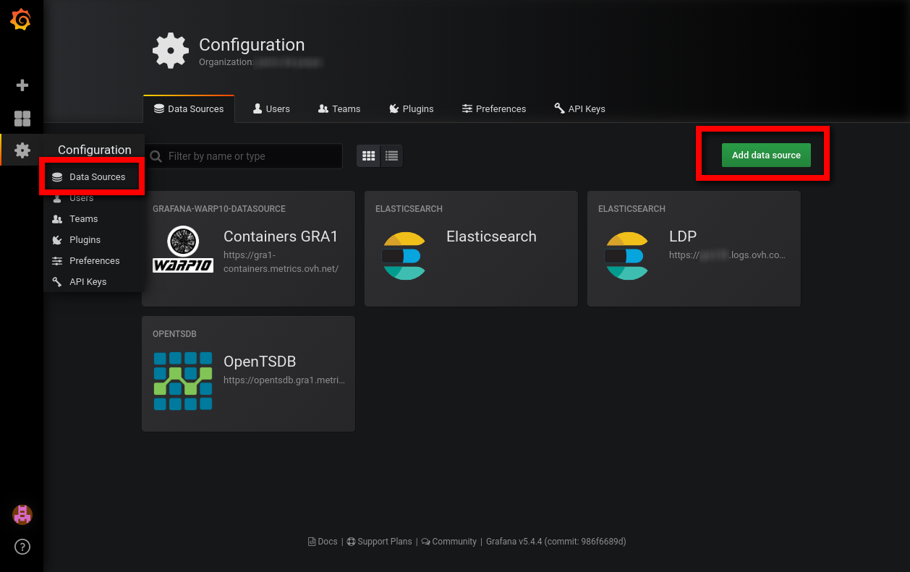
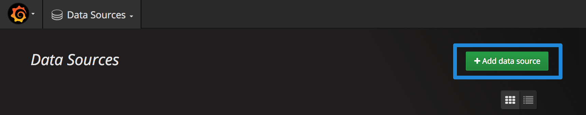

**Last updated 15th May, 2018**

## Objective

Grafana is an open source, feature rich metrics dashboard and graph editor for Graphite, Elasticsearch, OpenTSDB, Prometheus and InfluxDB. In this guide, you will learn how to configure a Metrics datasource.

## Requirements

- a valid OVH Metrics account.
- a `READ` token that can be found on Metrics`s manager
- A Grafana instance. You can either use your own Grafana instance or [public OVH grafana](https://grafana.metrics.ovh.net){.external}.

## Instructions

### Datasource setup

Datasources depends on which protocol you want to use. Go to :

__Menu__ > __Data sources__ > __Add datasource__

{.thumbnail}

{.thumbnail}

How to fill the blanks:

* `Name` is the name of the datasource.
* `Type` is the __protocol__ that you want to use..
* `URL` depends of your project region it's build as this https://PROTOCOL.REGION.metrics.ovh.net where region can be __gra1__ or __bhs1__. You can refer to the OVH manager to find your region. The protocol is the one that you want to use, for example "opentsdb"
* `Access` is __direct__.
* `Basic Auth` checkbox must be checked.
* `user` is not used, you can use __metrics__ as basic auth.
* `password` must be fileld with a Metrics Read token. Tokens can be crafted on the manager.

Here's an example for using OpenTSDB with GRA1 cluster:

{.thumbnail}

You can now use this datasource in any dashboard!