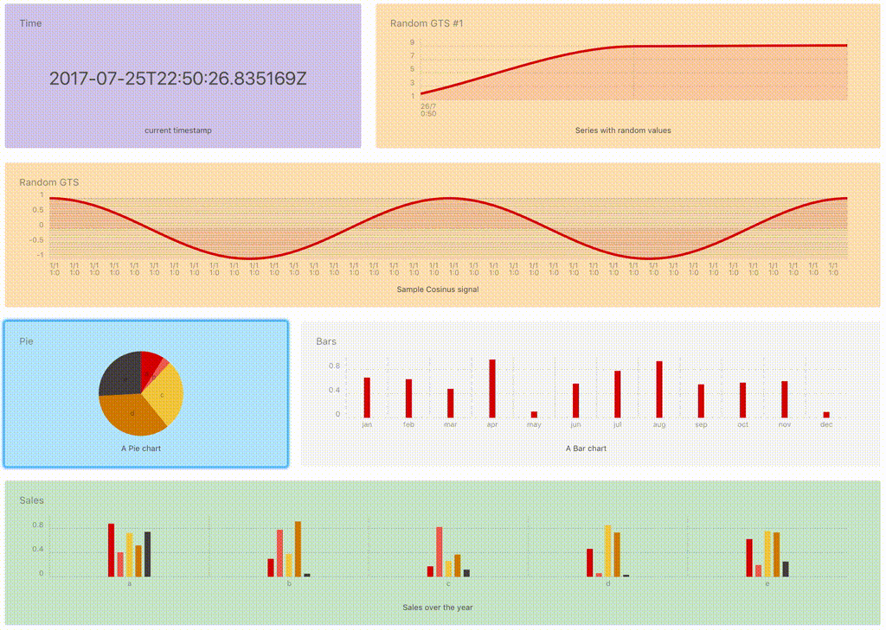

**Last updated 15th May, 2018**

## Time Series Dataviz Tools
Multiple tools are available to graph your data, compose dashboards or show counters:

### Grafana
- **Grafana**: Do you know that we provide a free hosted [**Grafana**](https://grafana.metrics.ovh.net){.external}?

{.thumbnail}

### Quantum
- **Quantum**: Quantum is the official IDE to start developping WarpScript™. You can access it with [https://quantum.metrics.ovh.net](https://quantum.metrics.ovh.net){.external}.

{.thumbnail}

### MyBoard.ovh
- **MyBoard.ovh**: [MyBoard.ovh](https://MyBoard.ovh){.external} is our custom tool to create dynamic dashboards. You can find the documentation [here](https://matteobrusa.github.io/md-styler/?url=https://myboard.ovh/assets/USAGE.md){.external}

{.thumbnail}

## Time Series Dataviz Development

### WebComponents
- **Warp 10™ WebComponents**: Warp 10™ is providing [WebComponents](https://www.webcomponents.org/){.external} to integrate graphs into your own web pages. You can find examples on their [Github account](https://github.com/senx/warp10-quantumviz){.external}.
