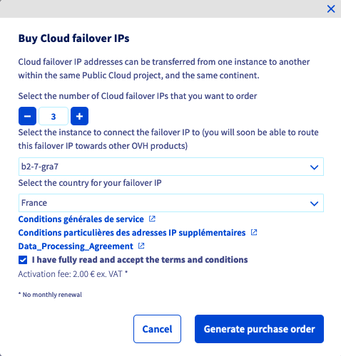

> [!primary]
> Esta traducción ha sido generada de forma automática por nuestro partner SYSTRAN. En algunos casos puede contener términos imprecisos, como en las etiquetas de los botones o los detalles técnicos. En caso de duda, le recomendamos que consulte la versión inglesa o francesa de la guía. Si quiere ayudarnos a mejorar esta traducción, por favor, utilice el botón «Contribuir» de esta página.
>

**Última actualización: 02/11/2022**

> [!primary]
>
> Desde el 6 de octubre de 2022, nuestra solución "Failover IP" se denomina desde ahora [Additional IP](https://www.ovhcloud.com/es/network/additional-ip/). Esto no afectará a sus funcionalidades ni al funcionamiento de sus servicios.
>

## Objetivo

Es posible que necesite configurar una dirección Additional IP en sus instancias por diferentes razones:

- Tiene varios sitios en su instancia.
- Aloja proyectos internacionales.

Para satisfacer estas necesidades, puede comprar una dirección Additional IP para sus instancias Public Cloud.

Estas direcciones Additional IP solo pueden migrar a las instancias de un mismo proyecto.

**Esta guía explica cómo comprar una Additional IP para su proyecto Public Cloud OVHcloud.**

## Requisitos

- Tener acceso al [área de cliente de OVHcloud](https://ca.ovh.com/auth/?action=gotomanager&from=https://www.ovh.com/world/&ovhSubsidiary=ws){.external}.
- Disponer al menos de una instancia. A tal efecto, consulte [la guía para crear una instancia desde el área de cliente](https://docs.ovh.com/us/es/public-cloud/crear_una_instancia_desde_el_area_de_cliente_de_ovh/).

## Procedimiento

Conéctese al [área de cliente de OVHcloud](https://ca.ovh.com/auth/?action=gotomanager&from=https://www.ovh.com/world/&ovhSubsidiary=ws), acceda a la sección `Public Cloud`{.action} y seleccione el proyecto de Public Cloud correspondiente. 
En el menú de la izquierda, haga clic en `Additional IP`{.action} en la sección `Network`.

Haga clic en el botón `Acciones`{.action} y seleccione `Comprar direcciones Additional IP`{.action}.

{.thumbnail}

Se abrirá esta página:

{.thumbnail}

Introduzca la siguiente información:

* El número de direcciones Additional IP deseadas
* La instancia en la que se enrutarán las IP
* La geolocalización de las IP

Asimismo, deberá aceptar las condiciones generales de servicio.

Geolocalizaciones disponibles en Europa:

|          |          |          |           |                    |
|:--------:|:--------:|:--------:|:---------:|:------------------:|
| Bélgica | Finlandia |  Francia  | Alemania | República Checa |
|  Irlanda |  Italia  | Lituania |  Países Bajos |     Reino Unido    |
| Portugal |  España |  Polonia |  Lituania |                    |

> [!primary] **Disponibilidad**
> 
> La presencia de los países mencionados anteriormente
> está sujeta a las disponibilidades de las direcciones IP.
> 

> [!primary] **Geolocalización**
>
> La geolocalización solo se basa en los organismos de referencia.
> 
> Por ejemplo, en el caso de RIPE: [https://www.ripe.net/](https://www.ripe.net/){.external}
>
> En caso de verificar en otras bases, comuníquese directamente con los organismos correspondientes. OVHcloud no mediará entre las partes.

Haga clic en `Generar la orden de pedido`{.action} para redirigirla automáticamente al recibo de pedido (es necesario autorizar la visualización de los pop-ups en su navegador).

También podrá consultar la orden de pedido en el área de cliente, accediendo al `Panel de control`{.action} y haciendo clic en `Ver mis pedidos`{.action}.

Para más información, consulte nuestra guía sobre [gestión de pedidos de OVHcloud](https://docs.ovh.com/us/es/billing/gestionar-los-pedidos-en-ovh/).

## Más información

[Configurar una Additional IP](https://docs.ovh.com/us/es/publiccloud/network-services/configure-additional-ip/)

Interactúe con nuestra comunidad de usuarios en <https://community.ovh.com/en/>.
