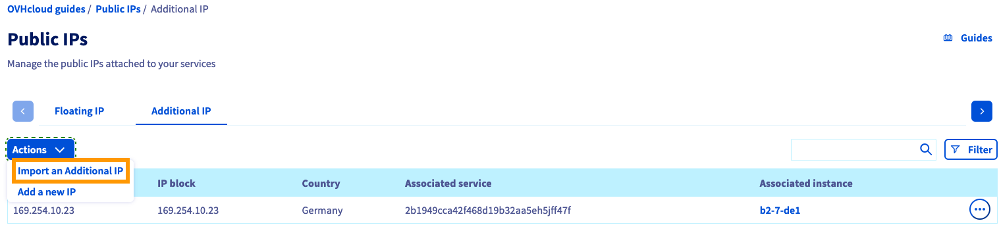
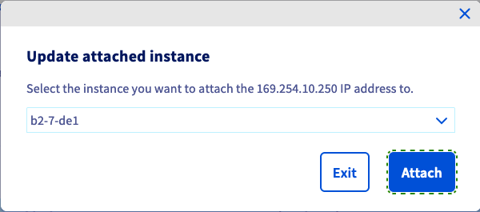

**Última actualización: 04/01/2023**

> [!primary]
>
> Desde el 6 de octubre de 2022, nuestra solución "Failover IP" se denomina desde ahora [Additional IP](https://www.ovhcloud.com/es/network/additional-ip/). Esto no afectará a sus funcionalidades.
>

## Objetivo

Si necesita configurar una dirección Additional IP en sus instancias porque:

- Tiene varios sitios web en su instancia 
- Aloja varios proyectos internacionales
- Quiere migrar de un servidor dedicado a una instancia de Public Cloud

Puede importar una dirección Additional IP que esté asociada a otro servicio de OVHcloud.

**Esta guía explica cómo importar esta Additional IP en su proyecto de Public Cloud de OVHcloud.**

## Requisitos

- Tener un [proyecto de Public Cloud](https://www.ovhcloud.com/es/public-cloud/) en su cuenta de OVHcloud
- Tener acceso al [área de cliente de OVHcloud](https://ca.ovh.com/auth/?action=gotomanager&from=https://www.ovh.com/world/&ovhSubsidiary=ws){.external}
- Tener una [dirección Additional IP](https://www.ovhcloud.com/es/bare-metal/ip/)

> [!warning]
> Esta funcionalidad no está actualmente disponible para instancias Metal.
>

## Procedimiento

Conéctese al [área de cliente de OVHcloud](https://ca.ovh.com/auth/?action=gotomanager&from=https://www.ovh.com/world/&ovhSubsidiary=ws) y seleccione su proyecto en la sección `Public Cloud `{.action}.

En el menú de la izquierda, abra `Public IPs`{.action} en `Network`.

Abra la pestaña `Additional IP`{.action} y haga clic en el botón `Acciones`{.action}. Seleccione `Importar una IP`{.action} para mostrar todas las direcciones IP que puedan importarse a su proyecto de Public Cloud.

{.thumbnail}

Si todavía no tiene una Additional IP en su proyecto de Public Cloud, la opción de importación de una Additional IP se mostrará en la página de inicio.

Haga clic en `...`{.action} junto a la dirección IP que quiera importar y haga clic en `Importar esta Additional IP`{.action}.

{.thumbnail}

Haga clic en `Importar`{.action} para confirmar la operación.

{.thumbnail}

Espere a que finalice la importación en unos minutos. Abra la pestaña `Additional IP`{.action} para buscar la dirección IP importada. Actualice la página si es necesario.

Haga clic en `..`{.action} a la derecha y seleccione `Editar la instancia asociada`{.action}.

{.thumbnail}

Se abrirá una ventana emergente en la que podrá elegir la instancia a la que quiere asociar la dirección IP.

{.thumbnail}

Haga clic en `Adjuntar`{.action} para confirmar la operación. Se mostrará un mensaje de edición en la página.

> [!warning]
>
> No es posible mover una Additional IP entre diferentes zonas. Por ejemplo, una IP localizada en el datacenter de SBG puede moverse hacia GRA o RBX, pero no hacia BHS.
>

Su dirección Additional IP estará asociada a su instancia.

El siguiente paso es configurar la IP en el sistema operativo. Consulte [nuestra guía sobre cómo configurar](https://docs.ovh.com/us/es/publiccloud/network-services/configure-additional-ip/) el alojamiento web.

## Más información

Interactúe con nuestra comunidad de usuarios en <https://community.ovh.com/en/>.
