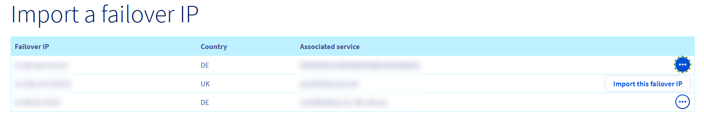

**Ostatnia aktualizacja: 02-11-2022**

> [!primary]
>
> Od 6 października 2022 nasze rozwiązanie "Failover IP" nazywa się teraz [Additional IP](https://www.ovhcloud.com/pl/network/additional-ip/). Nie ma to żadnego wpływu na funkcje ani na działanie usług.
>

## Wprowadzenie

Jeśli chcesz skonfigurować adres Additional IP w swoich instancjach, ponieważ:

- masz w instancji wiele witryn internetowych, 
- obsługujesz projekty międzynarodowe,
- chcesz migrować z serwera dedykowanego do instancji Public Cloud,

Można zaimportować adres Additional IP powiązany z inną usługą OVHcloud.

**Dowiedz się, jak zaimportować adres Additional IP do projektu OVHcloud Public Cloud.**

## Wymagania początkowe

- [Projekt Public Cloud](https://www.ovhcloud.com/pl/public-cloud/) na koncie OVHcloud
- Dostęp do [Panelu klienta OVHcloud](https://www.ovh.com/auth/?action=gotomanager&from=https://www.ovh.pl/&ovhSubsidiary=pl){.external}
- [Adres Additional IP](https://www.ovhcloud.com/pl/bare-metal/ip/){.external}

## W praktyce

Najpierw zaloguj się do [Panelu klienta OVHcloud](https://www.ovh.com/auth/?action=gotomanager&from=https://www.ovh.pl/&ovhSubsidiary=pl){.external}, wybierz projekt w sekcji `Public Cloud`{.action}. Wybierz pozycję `Additional IP`{.action} w sekcji "Network".

Kliknij przycisk `Operacje`{.action} i wybierz opcję ` Importuj adres IP`{.action}, aby wyświetlić wszystkie adresy IP, które można zaimportować do projektu Public Cloud.

{.thumbnail}

Jeśli nie posiadasz jeszcze adresu Additional IP w Twoim projekcie Public Cloud, na stronie głównej pojawi się możliwość importu adresu IP.

Kliknij ikonę z trzema kropkami po prawej stronie adresu IP, który chcesz zaimportować, a następnie kliknij pozycję `Importuj ten Additional IP`{.action}.

{.thumbnail}

Kliknij przycisk `Importuj`{.action}:

{.thumbnail}

Spowoduje to ponowne załadowanie strony. Zostanie wyświetlone potwierdzenie migracji adresu IP.

Po zaimportowaniu adresu Additional IP kliknij ikonę z trzema kropkami (po prawej) i wybierz pozycję `Zmodyfikuj powiązaną instancję`{.action}.

{.thumbnail}

Zostanie wyświetlone okno umożliwiające wybranie instancji, do której ma zostać przeniesiony adres IP:

{.thumbnail}

Kliknij przycisk `Dołącz`{.action}. Spowoduje to ponowne załadowanie strony i wyświetlenie potwierdzenia, że adres IP został powiązany z instancją:

{.thumbnail}

Adres Additional IP będzie już dołączony do instancji.

Następnym krokiem jest skonfigurowanie adresu IP w systemie operacyjnym. Przewodnik jest dostępny tutaj: [Konfiguracja adresu Additional IP](https://docs.ovh.com/pl/publiccloud/network-services/configure-additional-ip/).

## Sprawdź również

Dołącz do naszej społeczności użytkowników: <https://community.ovh.com/en/>.
