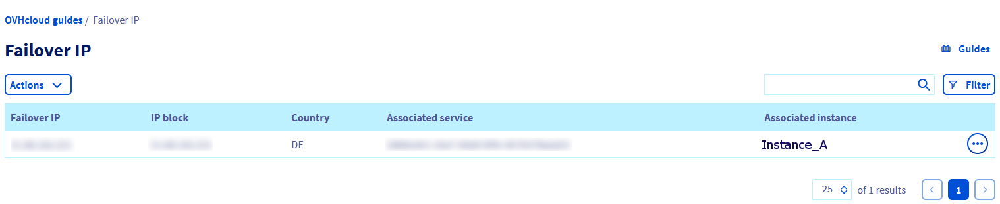
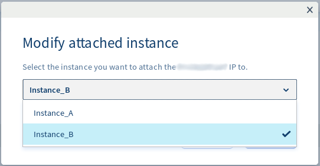

> [!primary]
> Esta traducción ha sido generada de forma automática por nuestro partner SYSTRAN. En algunos casos puede contener términos imprecisos, como en las etiquetas de los botones o los detalles técnicos. En caso de duda, le recomendamos que consulte la versión inglesa o francesa de la guía. Si quiere ayudarnos a mejorar esta traducción, por favor, utilice el botón «Contribuir» de esta página.
>

**Última actualización: 02/11/2022**

> [!primary]
>
> Desde el 6 de octubre de 2022, nuestra solución "Failover IP" se denomina desde ahora [Additional IP](https://www.ovhcloud.com/es/network/additional-ip/). Esto no afectará a sus funcionalidades ni al funcionamiento de sus servicios.
>

## Objetivo
Esta guía explica cómo migrar una IP de conmutación de una instancia a otra. Por lo general, esta acción limita o elimina la posibilidad de que su servidor esté inaccesible y le permite:

- Migrar un sitio web a su «nueva versión»
- Ejecutar su actividad en un servidor replicado mientras realiza un mantenimiento o ejecuta una actualización en el servidor de producción.

## Requisitos

- Tener al menos dos instancias de Public Cloud ejecutándose
- Tener una Additional IP
- Estar conectado al [área de cliente de OVHcloud](https://ca.ovh.com/auth/?action=gotomanager&from=https://www.ovh.com/world/&ovhSubsidiary=ws){.external}.

## Procedimiento

> [!primary]
> Una Additional IP no puede moverse de una zona a otra. Por ejemplo, una IP situada en el datacenter SBG podrá migrarse a GRA o RBX, pero no podrá migrarse a BHS.
>

### Migración de la Additional IP

En primer lugar, conéctese al [área de cliente de OVHcloud](https://ca.ovh.com/auth/?action=gotomanager&from=https://www.ovh.com/world/&ovhSubsidiary=ws), acceda a la sección `Public Cloud`{.action} y seleccione el servicio Public Cloud correspondiente. A continuación, seleccione Additional IP en el apartado **Network** .
En nuestro ejemplo, una Additional IP se enruta hacia "Instancia_A" y queremos redirigirla hacia "Instancia_B".

{.thumbnail}

Haga clic en los 3 puntos a la derecha de la Additional IP y a seleccione `Modificar la instancia asociada`{.action}.

{.thumbnail}

Haga clic en la casilla junto al servidor de destino

{.thumbnail}

- Haga clic en `Asociar`{.action}.

- Pasados unos segundos, el panel de control se actualizará y se mostrará el siguiente mensaje, confirmando que la migración se ha realizado correctamente:

{.thumbnail}

> [!success]
> La IP de conmutación puede configurarse en el servidor de destino antes o después de realizar la migración. Si está preconfigurada, comenzará a responder en cuanto se haya realizado la operación de enrutamiento (*routing*).
>

## Más información

[Configurar una Additional IP](https://docs.ovh.com/us/es/publiccloud/network-services/configure-additional-ip/)

[Importar una Additional IP](https://docs.ovh.com/us/es/publiccloud/network-services/import-additional-ip/)

Interactúe con nuestra comunidad de usuarios en <https://community.ovh.com/en/>.
