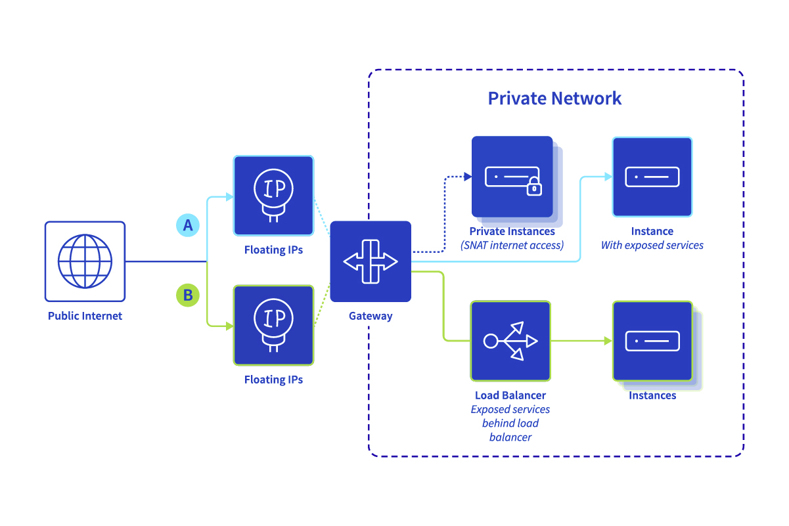
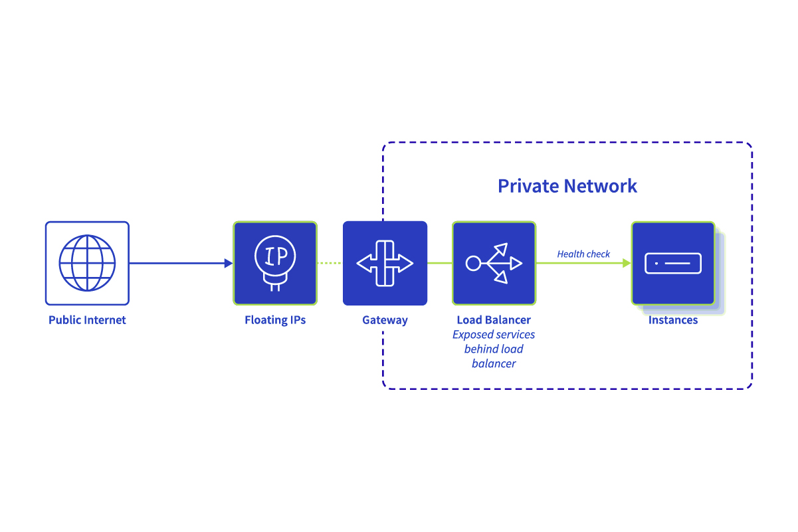
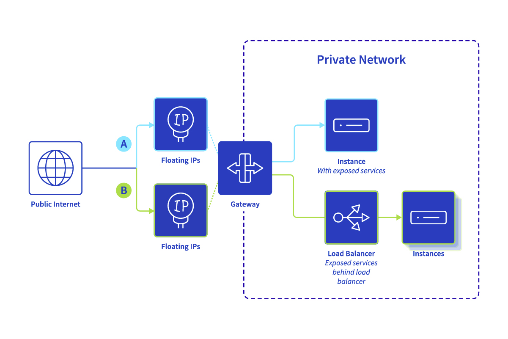

**Last updated 2nd November 2022**

## Objective

**This page explains the concepts behind Public Cloud Networking.**

## Public Cloud Networking concepts

### Private network: Basics

A private network enables you to build an isolated, reliable, and high performance network infrastructure for your application in the cloud.

Public Cloud private networks provide the ability to configure your network in a fully managed way, using common networking concepts such as subnets and routing. Combined with network components such as [Gateway](#gateway), [Load Balancer](#lodbalancer) and [Floating IP](#floatingip), it allows you to quickly and easily build a complete end-to-end infrastructure, from your backend servers to your users.

### Public Cloud private networks

Public Cloud private networks are being created on top of a [vRack](https://www.ovh.ie/solutions/vrack/) - an OVHcloud service providing a global private network that can be assigned to a Public Cloud project.

Public Cloud private network is a regional ressource that can be configured in two different ways: **single-region** or **multi-region**, in which the term "region" refers to Public Cloud availability regions. (Find more information [on our website](https://www.ovhcloud.com/en-ie/public-cloud/regions-availability/).)

- In **single-region** mode, only one private network is created (one region selected), with no capacity for inter-region connectivity.
- In **multi-region** mode, a private network is created in each selected region. Connectivity between regions is made possible by configuring a single broadcast domain over all private networks (i.e. configuring the same vRack, VLAN and subnet on the private networks in all regions).

Each type can then have subnets attached to allow resources to communicate. Those subnets are simply IP blocks of a private network in the given region.

A subnet (or parts of it) can be assigned to instances using the DHCP protocol for automatic configuration.

Public Cloud private networks use Layer-2 VLANs to separate broadcast domains from each other. For more information, see [the VLAN section below](#VLANcluster).

You can find more information about private networks and subnets in the OpenStack documentation:

- <https://docs.openstack.org/liberty/install-guide-rdo/launch-instance-networks-private.html>
- <https://docs.openstack.org/python-openstackclient/pike/cli/command-objects/subnet.html>

### Public Cloud DHCP and IP ranges for private networks

Dynamic Host Configuration Protocol (DHCP, [RFC 2131](https://datatracker.ietf.org/doc/html/rfc2131)) allows easier resource addressing through auto-configuration.

The Public Cloud DHCP service allows autoconfiguration for Floating IPs. It can be enabled in regions where Public Cloud private network is created. It doesn't work for OVHcloud Additional IPs.

### OVHcloud vRack network

OVHcloud vRack a transversal private network. It is designed to allow for complex private architectures on a global scale of multiple data centres, interconnecting different products in different data centres spread over different regions. You can read more about it on the [vRack web page](https://www.ovh.ie/solutions/vrack/).

### Public Cloud private network vs OVHcloud vRack

OVHcloud Public Cloud private networks are created inside a vRack network (VLANs can be used for further clustering if needed). This means that addressing schemas between regions in the same vRack/VLAN cannot overlap to allow communication.

### OVHcloud vRack - Clustering with VLANs 

For more advanced use cases, every vRack can be clustered further with Layer-2 VLANs (up to 4000 VLANs are available per single vRack). A Public Cloud private network can be placed in each VLAN.

This way, a number of scenarios are possible.

- **Single-region private networks**: Using a private network with different VLANs in different regions allows to split a broadcast domain into local regions. This use case can be selected for compatibility with some of the new network functions (e.g. Load Balancer, Gateway) or disaster recovery scenarios.
- **Multi-region private networks**: To achieve resource interconnectivity between regions, the same vRack/VLAN/subnet should be used to create a private network in each region. Please note that different DHCP IP ranges must be used in different regions. This type creates broadcast domains between regions which can be helpful in some cases, but it is not compatible with some of the new network services (e.g. Load Balancer, Gateway).
- **Private connectivity across different product lines**: Resources from the Bare Metal Cloud or Hosted Private Cloud universes can be used together with Public Cloud services by leveraging the same vRack/VLAN for interconnectivity.

### Connecting Public Cloud resources to the Internet

The OVHcloud infrastructure offers multiple ways to access the Internet or to expose Public Cloud resources to the Internet.

#### Public Mode: A public IP is attached directly to the instance 

Public Cloud instances use public IP addresses which are attached to a public port for Internet access. As every instance is exposed to the Internet separately, security must be addressed on every single instance.

In this mode you can still connect instances to private networks for interconnection purposes.

OVHcloud Public IP addresses directly attached to instances in Public Mode are **not** designed to be moved to other instances or network services. For infrastructure-agnostic usage, the suggested way is to use a Floating IP address that is linked to your service but not the specific instance.

Keep in mind that some services (e.g. Load Balancer, Gateway) are not compatible with Public Mode instances.

#### Private mode: The instance remains private (unless a Floating IP or a Load Balancer is attached)

In this mode, a newly created instance does not have a public IP attached to any port. The instance will remain fully private (no public connectivity) unless:

- A Floating IP address is attached to it (using Gateway) for **inbound traffic** use cases, for example when services need to be exposed publicly.
- Load Balancer with Floating IP is configured for **inbound traffic**, so services located on the instance may be exposed to the Internet.
- SNAT Gateway is configured in the private network for **outbound access** use cases. This will enable Internet access only without exposing any private resources. 

In private mode, users can define a single entry point (a Gateway) that is managing inbound/outbound traffic rules. This simplifies security management: There is no need to monitor all resources for proper public traffic access rules.

If you want to access your fully private instance from the Internet, the following options are available:

- You can create an "SSH proxy instance" (also known as a "jump host") with a Floating IP public address on one side and a private network (the one of the private instance) on the other side. Log in to this host, then log in to the private instance.
- You can temporarily assign a Floating IP to such an instance for the time of access.

> [!primary]
> View our [Bastion repository on GitHub](https://github.com/ovh/the-bastion) for more details on creating SSH proxies.
>

#### Public Cloud Gateway (with SNAT) 

If connectivity from a fully private instance to outside networks (Internet) is needed, then using Gateway with Source Network Address Translation (SNAT) is the appropriate method. 

The private IP address of your resource (instance) is being translated into a public one (allowing it to reach public resources). The answer will be in turn translated and forwarded properly to your resource. This way, the public IP can be shared across a number of services.

It is important to note that a resource (instance) remains fully private in this scenario. No kind of access initiated from the outside network is possible.

{.thumbnail}

> [!primary]
> Gateway currently supports single-region private networks only. This is the recommended private network scope for production grade setups with this service (including public-to-private Load Balancer which requires a Gateway). Other setups are not supported.
>

#### Load Balancer inside private networking 

OVHcloud offers the Octavia Load Balancer as part of the Public Cloud ecosystem. This provides the most flexibility for scaling your applications.

The Public Cloud Load Balancer remains fully private, therefore it needs a Gateway service to access the public network and Floating IP for outbound service exposure.

{.thumbnail}

Read more about it on our [Load Balancer guide page](https://docs.ovh.com/ie/en/publiccloud/network-services/getting-started-with-load-balancer-public-cloud/).

### Public IP addresses

#### OVHcloud Floating IP for Public Cloud 

OVHcloud Floating IP provides infrastructure-agnostic, cloud-native, flexible public IP addresses for automation use cases. It can be used to expose your Public Cloud services to the Internet by mapping it to either your private instance or a network function (a Load Balancer for example). It requires a Gateway to work (for mapping between public and private IPs) and it is only supporting IP version 4.

With fully automated assignments via DHCP and a pay-as-you-go billing model, the Floating IP service is designed for automated usage (e.g. Ansible, Terraform).

The main purpose of Floating IP is web service exposure to the Internet. This may pertain to a service on a single instance or a cluster of instances with a Load Balancer in front. Floating IP is thus ideal for application version testing and CI/CD automation (e.g. blue-green, canary, active fallback deployments).

{.thumbnail}

The Floating IP logic is aligned with our Public Cloud regional concept which means they can be announced from a single region.

#### OVHcloud Additional IP (previously labelled as Failover IP)

OVHcloud Additional IP is another type of service-agnostic public IP address. Additional IP addresses allow you to switch between attached services, but compared to Floating IPs they are more static as they need additional configuration directly on the host. Therefore they are more suited to interconnect OVHcloud services from different product lines.

For example, you may apply a hybrid-cloud concept based on a mix of Bare Metal servers and Public Cloud resources or other OVHcloud services.

Please note that Additional IP can only be used with instances in [Public Mode](#publicmode), as opposed to the usage of Floating IP.

Find out more about Additional IP and Floating IP on the dedicated [Concepts page](https://docs.ovh.com/ie/en/publiccloud/network-services/additional-ip-vs-floating-ip/).

## Go further

Join our community of users on <https://community.ovh.com/en/>.