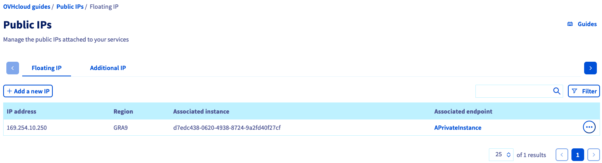

**Last updated 2nd November 2022**

## Objective

Infrastructure resources can be exposed to the Internet via their own public IP addresses. For services created on such an infrastructure it is however not recommended to use these IP addresses to expose services themselves.

When a service should be optimised for scalability or agility, its public IP address should not be linked to a particular server or virtual machine. For such cases, separate reserved IP addresses are the best way to make services publicly available.

In the Public Cloud universe you can use either **Additional IP** (previously labelled as Failover IP) or **Floating IP** to achieve this.

Both services provide a flexible way to manage public access to your services. They can stay infrastructure-agnostic and be scaled up or migrated whenever needed.

## Public Cloud IP concepts

### Additional IP (previously labelled as Failover IP)

This type of public IP address is available for services of all relevant OVHcloud universes: Bare Metal Cloud (for bare metal servers), Public Cloud (with OpenStack) or Hosted Private Cloud (with VMware or Nutanix for example).

They are designed to be used in cross-product scenarios, for example in failover operations or hybrid cloud use cases. They are billed on a monthly basis.

Once an Additional IP address is available in your Control Panel, it can be attached/detached or moved between servers and Public Cloud instances. Manual changes may be needed on the backend side to apply new IP configurations.

Please note that in the Public Cloud universe, Additional IP can only be used with instances in the **Public Mode** of networking (having public IPs in the external network).

More information about configuring Additional IP addresses is available in [this guide](https://docs.ovh.com/au/en/publiccloud/network-services/configure-additional-ip/).

### Floating IP

This type of public IP address is only available for [Public Cloud services](https://www.ovhcloud.com/en-au/public-cloud/), designed for cloud-native use cases and especially automation (e.g. Terraform, Ansible). They serve to expose a private instance or a private network service (Load Balancer for example) to the public network.

The backend (instance/Load Balancer) system configuration when using Floating IP is entirely automatic (via DHCP protocol), no manual setup is needed. However, they require a Gateway in order to map a public IP address to an instance or network service.

Please note that Floating IP can only be used with instances in the **Private Mode** of networking (within a specific private network inside a given region).

Floating IP is billed hourly on a pay-as-you-go basis.

More information about configuring Floating IP is available on the [Public Cloud Networking Concepts page](https://docs.ovh.com/au/en/publiccloud/network-services/networking-concepts/).

### How to obtain public IP addresses in the OVHcloud Control Panel

In the [OVHcloud Control Panel](https://ca.ovh.com/auth/?action=gotomanager&from=https://www.ovh.com.au/&ovhSubsidiary=au), open the Public Cloud section and select `Public IPs`{.action}. Here you can manage Additional IP and Floating IP addresses according to your needs.

{.thumbnail}

Depending on your choice, you can select from the different regions and further configuration options are available.

## Go further

Join our community of users on <https://community.ovh.com/en/>.