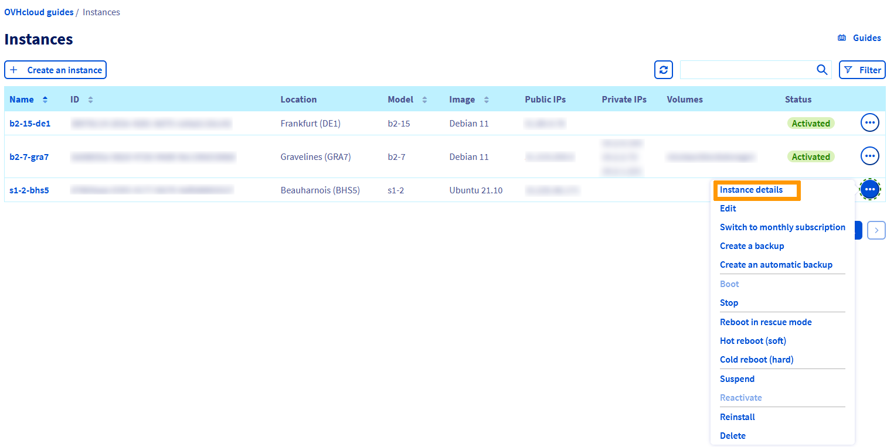
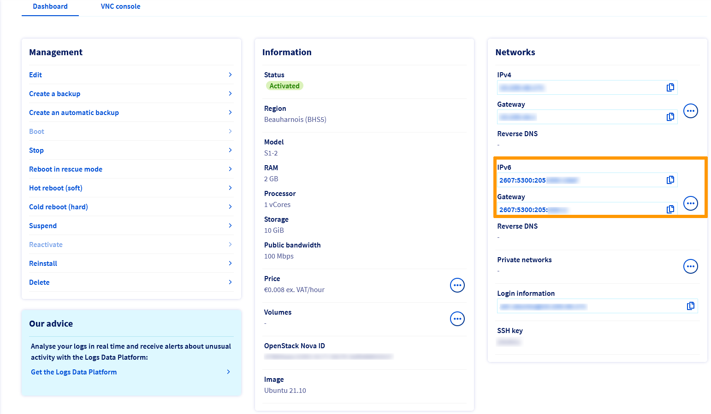

> [!primary]
> Esta tradução foi automaticamente gerada pelo nosso parceiro SYSTRAN. Em certos casos, poderão ocorrer formulações imprecisas, como por exemplo nomes de botões ou detalhes técnicos. Recomendamos que consulte a versão inglesa ou francesa do manual, caso tenha alguma dúvida. Se nos quiser ajudar a melhorar esta tradução, clique em "Contribuir" nesta página.
>

**Última atualização: 15/11/2022**

## Objetivo

“Internet Protocol version 6” (IPv6) é a última versão do Internet Protocol (IP). Foi concebido para resolver o esgotamento antecipado dos endereços IPv4 utilizando os endereços compostos por 128 bits em vez dos tradicionais 32 bits do IPv4.

Todas as instâncias Public Cloud são entregues com um endereço IPv4 e um endereço IPv6.

Por predefinição, apenas o endereço IPv4 é configurado.

**Neste tutorial, iremos explicar como configurar um endereço IPv6 numa instância Public Cloud.**

> [!primary]
> 
> Atualmente, as ofertas Floating IP e Gateway não tomam a cargo o IPv6. O IPv6 só pode ser utilizado com as instâncias em [modo público](https://docs.ovh.com/pt/publiccloud/network-services/networking-concepts/#publicmode).
>

## Requisitos

* Uma instância Public Cloud (qualquer modelo)
* Dispor de um acesso administrativo (root) via SSH ou ambiente de trabalho remoto (Windows) ao seu servidor.
* Ter conhecimentos básicos de rede.
* Ter acesso à [Área de Cliente OVHcloud](https://www.ovh.com/auth/?action=gotomanager&from=https://www.ovh.pt/&ovhSubsidiary=pt)

## Instruções

> [!warning]
>
> Note-se que nas versões recentes dos sistemas operativos Linux, o endereço IPv6 é configurado por defeito nas instâncias da Nuvem Pública. Certifique-se de verificar o seu ficheiro de configuração do SO antes de fazer quaisquer alterações.
>


### Léxico

Aqui tem um breve léxico dos termos utilizados neste tutorial:

|Léxico|Descrição|
|---|---|
|YOUR_IPV6|O endereço IPv6 associado ao seu serviço|
|IPv6_PREFIX|O prefixo do bloco IPv6 (por ex.: 2607:5300:60:62ac::/128 -> netmask = 128)|
|IPv6_GATEWAY|A gateway do bloco IPv6|


### Obter as informações de rede

Aceda à Área de Cliente, clique no menu da secção `Public Cloud`{.action}, selecione o seu projeto Public Cloud e clique em `Instances`{.action} no menu à esquerda. Depois clique no `...`{.action} ao lado da instância correspendente e clique em `Detalhes da instância`{.action}.

{.thumbnail}

Todas as informações necessárias serão visíveis na secção **Redes**.

{.thumbnail}

### Exemplos de configurações persistentes

> [!primary] 
> **Exemplos**
> 
>As informações fornecidas abaixo são exemplos.
>
>Enquanto administrador dos seus serviços, é responsável por adaptá-los à sua distribuição.
>

> [!warning]
>
> Antes de alterar um ficheiro de configuração, crie sempre uma cópia de segurança do original em caso de problema.
>

<br>Em primeiro lugar, aceda à sua instância em SSH.

#### Debian

Se considerarmos que a sua interface é eth0, a configuração a adicionar deverá ser a seguinte:

Ficheiro a alterar (com privilégios su): `/etc/network/interfaces`

```console
iface eth0 inet6 static
address YOUR_IPV6
netmask IPV6_PREFIX
post-up /sbin/ip -6 route add IPV6_GATEWAY dev eth0
post-up /sbin/ip -6 route add default via IPV6_GATEWAY dev eth0
pre-down /sbin/ip -6 route del default via IPV6_GATEWAY dev eth0
pre-down /sbin/ip -6 route del IPV6_GATEWAY dev eth0
```

Exemplo concreto:

```console
iface eth0 inet6 static
address 2001:41d0:xxx:xxxx::999
netmask 128
post-up /sbin/ip -6 route add 2001:41d0:xxx:xxxx::111 dev eth0
post-up /sbin/ip -6 route add default via 2001:41d0:xxx:xxxx::111 dev eth0
pre-down /sbin/ip -6 route del default via 2001:41d0:xxx:xxxx::111 dev eth0
pre-down /sbin/ip -6 route del 2001:41d0:xxx:xxxx::111 dev eth0
```

#### Ubuntu

Os ficheiros de configuração de rede encontram-se no diretório `/etc/netplan/`. Em primeiro lugar, crie uma cópia do ficheiro de configuração IPv6:

```bash
cd /etc/netplan
cp 50-cloud-init.yaml 51-cloud-init-ipv6.yaml
```

Isto permite separar a configuração IPv6 e desfazer facilmente as alterações em caso de erro.

Se considerarmos que a sua interface é eth0, a configuração a adicionar deverá ser a seguinte:

Ficheiro a alterar (com privilégios su): `/etc/netplan/51-cloud-init-ipv6.yaml`

```yaml
network:
    ethernets:
        eth0:
            dhcp6: false
            match:
                macaddress: fb:17:3r:39:56:75
            set-name: eth0
            addresses:
              - "YOUR_IPV6/IPv6_PREFIX"
            gateway6: "IPv6_GATEWAY"
            routes:
              - to: "IPv6_GATEWAY"
                scope: link
    version: 2
```

> [!warning]
>
> É importante respeitar o alinhamento de cada elemento deste ficheiro tal como representado no exemplo acima. Não utilize a tecla de tabulação para criar o seu espaçamento. Apenas a tecla de espaço é necessária.
>

Pode testar a sua configuração através do seguinte comando:

```bash
netplan try
```

Se a configuração estiver correta, execute-a através do seguinte comando:

```bash
netplan apply
```

#### RedHat / CentOS

Se considerarmos que a sua interface é eth0, a configuração deverá ser a seguinte:

Ficheiro a alterar (com privilégios sudo): `/etc/sysconfig/network-scripts/ifcfg-eth0`

```console
IPV6INIT=yes
IPV6ADDR=YOUR_IPV6/IPV6_PREFIX
IPV6_DEFAULTGW=IPV6_GATEWAY
```

Exemplo concreto:

```console
IPV6INIT=yes
IPV6ADDR=2001:41d0:xxx:xxxx::999
IPV6_DEFAULTGW=2001:41d0:xxx:xxxx::111
```

#### Windows

Aceda à secção `Ligações de rede`{.action} do seu Windows.

{.thumbnail}

A seguir, aceda às `Propriedades`{.action} da sua placa de rede clicando com o botão direito do rato.

{.thumbnail}

Clique em `IPv6`{.action} e, a seguir, em `Propriedades`{.action}.

{.thumbnail}

Finalmente, insira as informações relativas ao IPv6.

{.thumbnail}

## Diagnóstico

Configurou o IPv6 mas nada mudou? 

Existe uma operação simples para determinar se a falha está relacionada com a configuração realizada ou a rede da OVHcloud.

Primeiro, [passe a sua instância para o modo Rescue](https://docs.ovh.com/pt/public-cloud/passar_uma_instancia_em_modo_de_rescue/).

De seguida, utilize os comandos abaixo para configurar o seu IP de forma não persistente:

```bash
ip addr add YOUR_IPV6/IPV6_PREFIX dev eth0
ip -6 route add IPV6_GATEWAY dev eth0
ip -6 route add default via IPV6_GATEWAY dev eth0
```

Teste novamente a sua rede através de um ping6, por exemplo:

```bash
ping6 ipv6.google.com
```

Se a sua instância responder, é provável que uma das etapas da sua configuração inicial não tenha sido realizada corretamente.

De qualquer forma, não hesite em contactar o suporte com os elementos testados acima para receber uma análise da nossa parte.

## Quer saber mais?

Fale com a nossa comunidade de utilizadores: <https://community.ovh.com/en/>