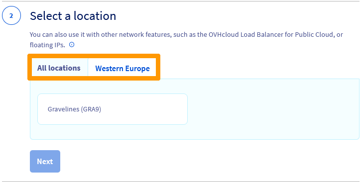
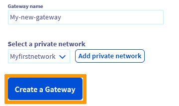

**Last updated 2nd November 2022**

## Objective

A Gateway offers a secure outbound connection method from your private network instances or the ability to use Floating IPs with your instance or Load Balancer for service exposition.

This can be created via the [OVHcloud Control Panel](https://ca.ovh.com/auth/?action=gotomanager&from=https://www.ovh.com/world/&ovhSubsidiary=ws), the [OpenStack API](https://docs.ovh.com/us/es/public-cloud/preparar_el_entorno_para_utilizar_la_api_de_openstack/) or the [OVHcloud API](https://ca.api.ovh.com/console/).

**Learn how to create a private network with a gateway.**

## Requirements

- A [Public Cloud project](https://www.ovhcloud.com/es/public-cloud/) in your OVHcloud account
- Access to the [OVHcloud API](https://ca.api.ovh.com/console/), the [OVHcloud Control Panel](https://ca.ovh.com/auth/?action=gotomanager&from=https://www.ovh.com/world/&ovhSubsidiary=ws) or the OpenStack command line environment ([Tutorial](https://docs.ovh.com/us/es/public-cloud/preparar_el_entorno_para_utilizar_la_api_de_openstack/))
- The [OpenStack Command Line Interface](https://docs.openstack.org/newton/user-guide/common/cli-install-openstack-command-line-clients.html){.external} tool installed on your working environment (optional)

## Instructions

### Via the OVHcloud Control Panel

> [!success]
> Click on the tabs below to view each of the 6 steps in turn.

> [!tabs]
> **Step 1**
>>
>> Log in to your [OVHcloud Control Panel](https://ca.ovh.com/auth/?action=gotomanager&from=https://www.ovh.com/world/&ovhSubsidiary=ws) and open your `Public Cloud`{.action} project.
>>
>> Click on `Public Gateway`{.action} in the left-hand menu under **Network**.
>>
>> Please note that you need to have activated the vRack before proceeding, if you do not have a vRack, please consult [this section](https://docs.ovh.com/us/es/publiccloud/network-services/public-cloud-vrack/#activation) of the relevant guide.
>> 
>> Next, click on `Create a Gateway`{.action}. 
>>
>> {.thumbnail}
>>
> **Step 2**
>>
>> First, select your gateway size.
>> 
>> {.thumbnail}
>>
>> |Size|Bandwith|Cost|
>> |---|---|---|
>> |S|up to 200Mbps|2€/month, excluding tax|
>> |M|up to 500Mbps|8€/month, excluding tax|
>> |L|up to 2Gbps|35€/month, excluding tax|
>>
> **Step 3**
>>
>> In the next step, select a location. It is best to create a Public Gateway in the region where you intend to deploy your private instances.
>>
>> {.thumbnail}
>>
> **Step 4**
>>
>> The next step allows you to edit the default name of your gateway and attach a private network to it. You can use the drop down list to select an existing private network. Be aware that only single-region private networks are supported by Gateway.
>>
>> {.thumbnail}
>>
>> Otherwise, click on `Add a private network`{.action} to create a new one (in simplified dialog box with predefined values).
>>
>> {.thumbnail}
>> 
>> In our example, a private network does not exist yet in the region we selected, so we create a new one.
>> 
>> In the popup window, enter a name for your private network, select a subnet and click on `Add`{.action}.
>>
>> {.thumbnail}
>>
> **Step 5**
>>
>> Once the network has been added, click on `Create a gateway`{.action}.
>>
>> {.thumbnail}
>>
>> The creation may take several minutes, you may need to refresh the page after a couple of minutes to display the new service.
>>
> **Step 6**
>>
>> Once the creation is done, you now have a private network linked to a public gateway. 
>>
>> To view your newly created private network, click on `Private Networks`{.action} in the left-hand menu under **Network**.
>> 
>> {.thumbnail} 
>>
>> You can view the new gateway in the `Public Gateways`{.action} section.
>>
>> {.thumbnail}
>>

### Via the OpenStack API

Before proceeding, it is recommended that you consult these guides:

- [Preparing an environment to use the OpenStack API](https://docs.ovh.com/us/es/public-cloud/preparar_el_entorno_para_utilizar_la_api_de_openstack/)
- [Setting OpenStack environment variables](https://docs.ovh.com/us/es/public-cloud/cargar-las-variables-de-entorno-openstack/)
 
> [!tabs]
> **Step 1**
>> Once your environment is ready, type the following at the command line:
>>
>> ```
>> openstack network create my_network
>>
>> openstack subnet create my_subnet --subnet-range <my_private_ip_range/mask> --network my_network --no-dhcp
>>
>> openstack router create my_router
>>
>> openstack router add subnet my_router my_subnet
>>
>> openstack router set --external-gateway Ext-Net my_router
>> ```
>> 


### Via the OVHcloud API

> [!tabs]
> **Step 1** 
>> 
>> Log in to the OVHcloud APIv6 interface according to the relevant guide ([First steps with the OVHcloud API](https://docs.ovh.com/us/es/api/first-steps-with-ovh-api/)).
>> 
>> In case the project ID is unknown, the calls below allow you to retrieve it.
>>
>> > [!api]
>> >
>> > @api {GET} /cloud/project
>>
>> > [!primary]
>> > This call retrieves the list of projects.
>>
>> > [!api]
>> >
>> > @api {GET} /cloud/project/{serviceName}
>>
>> > [!primary]
>> > This call identifies the project via the "description" field.
>> >
> **Step 2**<br>
>> **Create your private network and gateway** 
>> 
>> > [!api]
>> >
>> > @api {POST} /cloud/project/{serviceName}/region/{regionName}/gateway
>>
>> Fill in the fields according the following table.
>>
>> |Field|Description|
>> |---|---|
>> |serviceName|'The ID of your project'|
>> |regionName|Example: GRA9|
>> |model|size of your gateway (l, m ,s) depending on your needs|
>> |name|set a name for your gateway, you can click on the dropdown arrow and select "null" for a default one|
>> |name|set a name for your private network, you can click on the dropdown arrow and select "null" for a default one|
>> |cidr|IP block for your subnet| Ex : 192.168.1.0/24|
>> |enableDhcp|check the box for yes|
>> |ipVersion|4|please note that this is not available yet for IPv6|
>> 
>> The VLAN identifier (vlanId) is required if you want to create a specific VLAN. You can enter a value (between 2 - 4000) or leave it empty. If left empty, the system will automatically assign one by default.
>>
>> > [!primary]
>> >
>> > This is the step of creating the private network and gateway by region.
>> >
>> > You will need to do the same for each region where your private instances are present.
>> 
>> The creation will take a few minutes.
>>
>> To verify the details of your gateway, you can use the following API call:
>>
>> > [!api]
>> >
>> > @api {GET} /cloud/project/{serviceName}/region/{regionName}/gateway
>> >
>> > Fill in the field with the previously obtained information:
>> >
>> > **serviceName** : The Public Cloud project ID in the form of a 32-character string
>> >
>> > **regionName** : the name of your region
>> > You can leave the “subnetId” field blank in order to obtain all the gateways created inthe region specified.
>> >
>>

## Go further

Join our community of users on <https://community.ovh.com/en/>.