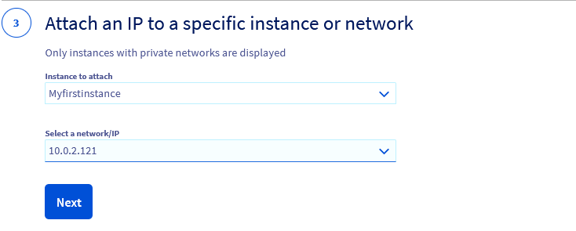

**Dernière mise à jour le 02/11/2022**

## Objectif

Les Floating IP sont des adresses IP publiques sur [Public Cloud](https://www.ovhcloud.com/fr/public-cloud/), utilisées pour exposer une instance privée ou un service de réseau privé sur le réseau public. Retrouvez plus d'informations sur [notre page concepts](https://docs.ovh.com/fr/publiccloud/network-services/additional-ip-vs-floating-ip/) dédiée.

**Découvrez comment attacher des adresses Floating IP à vos instances.**

## Prérequis

- Un projet [Public Cloud](https://www.ovhcloud.com/fr/public-cloud/) existant sur votre compte OVHcloud
- Avoir accès à [l’API OVHcloud](https://eu.api.ovh.com/console/) ou à [l’espace client OVHcloud](https://www.ovh.com/auth/?action=gotomanager&from=https://www.ovh.com/fr/&ovhSubsidiary=fr) ou à l’environnement OpenStack en ligne de commande (si besoin, consultez notre [tutoriel](https://docs.ovh.com/fr/public-cloud/preparer-lenvironnement-pour-utiliser-lapi-openstack/))
- L’outil [OpenStack Command Line Interface](https://docs.openstack.org/newton/user-guide/common/cli-install-openstack-command-line-clients.html){.external} installé sur votre environnement de travail (facultatif)

## Comprendre le service Floating IP

La solution Floating IP est fournie par les services OpenStack DVR (Distributed Virtual Router) sur le Public Cloud OVHcloud.

Floating IP vous permet de créer une adresse IP publique et de l’utiliser pour les réseaux privés de vos VMs pour le trafic entrant et sortant. Les adresses Floating IP peuvent être attachées et détachées de vos VMs à tout moment. 

Vous pouvez garder des adresses Floating IP sans avoir à les attacher à un service. Elles restent disponibles pour vos ressources jusqu'à leur suppression manuelle.

### Configuration cible

{.thumbnail}

Le but de cet exercice est de créer une VM (**vm4fip**) uniquement avec un réseau privé local (**test-network**) et d'utiliser un routeur (**router1**) pour configurer une Floating IP.

Ensuite, nous utiliserons cette Floating IP pour nous connecter à l'instance (VM) de l'extérieur et vérifier son accès à Internet.

## En pratique

### Depuis l’espace client OVHcloud

#### Attacher une Floating IP à une instance

> [!success]
> Cliquez sur l'un des deux onglets ci-dessous selon que vous souhaitez associer une Floating IP à une nouvelle instance (**Option 1**) ou à une instance déjà existante (**Option 2**).

> [!tabs]
> **Option 1**
>> 
>> **Cas d’une nouvelle instance**
>>
>> Si vous souhaitez associer une Floating IP à une instance existante, passez à **l'Option 2** (deuxième onglet ci-dessus).
>>
>> Connectez-vous à votre [espace client OVHcloud](https://www.ovh.com/auth/?action=gotomanager&from=https://www.ovh.com/fr/&ovhSubsidiary=fr), accédez à la section `Public Cloud`{.action} et sélectionnez le projet Public Cloud concerné.
>> 
>> Avant de créer votre instance, assurez-vous d'avoir créé un [réseau privé avec Gateway](https://docs.ovh.com/fr/publiccloud/network-services/creating-private-network-with-gateway/).
>>
>> Si vous avez besoin d'assistance pour créer une nouvelle instance, consultez d'abord notre guide pour [créer une instance depuis l'espace client OVHcloud](https://docs.ovh.com/fr/public-cloud/premiers-pas-instance-public-cloud/#create-instance). 
>>
>> À l'étape 5 de la création d'une instance, vous est proposé le choix du « mode public » ou « mode privé » pour la mise en réseau de votre instance. 
>>
>> Par défaut, le mode public est sélectionné. Cependant, comme nous créons une instance à laquelle nous allons attacher une Floating IP, nous devons créer une instance avec un réseau privé **UNIQUEMENT**.
>>
>> Sélectionnez le `Mode privé`{.action} et cliquez sur la flèche déroulante pour sélectionner le réseau privé de votre choix (le réseau doit avoir été préalablement créé avec une Gateway).
>>
>> Si vous sélectionnez un réseau privé qui n'est pas lié à une Gateway, le système créera automatiquement une Gateway de taille « S » par défaut et l'attachera à votre réseau.
>>
>> {.thumbnail}
>>
>> Cochez ensuite la case à côté de `Attacher une Floating IP à cette instance`{.action} puis sélectionnez `Créer une nouvelle Floating IP`{.action}.
>>
>> Lorsque vous avez terminé, cliquez sur `Suivant`{.action} pour passer à la dernière étape et définir votre mode de facturation.
>>
>> En cas de doute sur la durée d’utilisation, nous vous recommandons de choisir la facturation à l’heure, car il n’est pas possible de la choisir après la livraison du service. Vous aurez la possibilité de passer en abonnement mensuel dès que l'instance sera disponible sur la page « Instances ».
>>
>> > [!warning]
>> > Si vous choisissez d’être facturé à l’heure, vous continuerez à être facturé tant que l’instance n’est pas supprimée, même si l’instance n’est pas utilisée.
>> >
>>
>> Après vérification de votre configuration, cliquez sur `Créer une instance`{.action} pour terminer la création de votre nouvelle instance. L’opération peut prendre quelques minutes jusqu’à la livraison de votre service.
>> 
>>
> **Option 2** 
>>
>> **Cas d’une instance existante (créée uniquement avec un réseau privé)**
>>
>> Veuillez noter que le réseau privé doit être relié à une Gateway. Pour plus d'informations, consultez ce guide : [Créer un réseau privé avec une Gateway](https://docs.ovh.com/fr/publiccloud/network-services/creating-private-network-with-gateway/).
>>
>> Depuis l'onglet `Public Cloud`{.action}, cliquez sur `Public IPs`{.action} dans le menu de gauche sous **Network**.
>>
>> Cliquez sur `Floating IPs`{.action} puis sur `Ajouter une nouvelle IP`{.action}.
>>
>> {.thumbnail}
>>
>> Sous la rubrique « Sélectionnez votre usage public », choississez `Floating IPs (Public Cloud)`{.action}.
>> 
>> {.thumbnail}
>>
>> À l'étape suivante, choisissez la région de votre Floating IP. La région doit être celle de l'instance à laquelle la Floating IP sera rattachée.
>>
>> {.thumbnail}
>> 
>> > [!primary]
>> > Veuillez noter que seules seront affichées les régions dans lesquelles ce service est disponible.
>> >
>>
>> Cliquez ensuite sur la liste déroulante pour sélectionner l'instance à laquelle attacher la Floating IP, puis choisissez le réseau/IP (celui-ci sera dans la plage par défaut sélectionnée lors de la création du réseau privé de l'instance).
>>
>> {.thumbnail}
>>
>> > [!primary]
>> > Dans le cas où votre instance est attachée à deux ou plusieurs réseaux privés, vous sera alors présenté un nombre équivalent d'adresses IPs privées à sélectionner. Sélectionnez l'IP privée de votre choix.
>> >
>>
>> Une fois ces étapes effectuées, cliquez sur `Générer le bon de commande`{.action}. La livraison de votre service peut prendre quelques minutes.
>>
>> {.thumbnail}
>>

#### Détacher une Floating IP

Cette fonctionnalité est actuellement disponible uniquement via [l’API OpenStack](#detachip).

#### Supprimer une Floating IP

Depuis l'onglet `Public Cloud`{.action}, cliquez sur `Public IPs`{.action} dans le menu de gauche sous **Network**.

Dans l'onglet `Floating IP`{.action}, cliquez sur le bouton `...`{.action} à côté de l'IP correspondante et sélectionnez `Supprimer`{.action}.

{.thumbnail}

Dans la fenêtre qui s'affiche, cliquez sur `Confirmer`{.action}. L'opération peut prendre quelques minutes.

### Depuis l'API OpenStack

#### Attacher une Floating IP à une instance

> [!tabs]
> **Étape 1** 
>>
>> Créez un routeur :
>> 
>> ```bash
>> $ openstack router create router1
>> $ openstack router show router1 -c id -c status
>> +--------+--------------------------------------+
>> | Field  | Value                                |
>> +--------+--------------------------------------+
>> | id     | d2370b2f-18ba-4a23-886d-35c01ba2a957 |
>> | status | ACTIVE                               |
>> +--------+--------------------------------------+
>> ```
>>
> **Étape 2**
>>
>> Créez un réseau privé si nécessaire.<br> Si vous en avez déjà un, vous pouvez ignorer cette étape.
>>
>> ```bash
>> $ openstack network create test-network
>> $ openstack network show test-network -c id -c status
>> +--------+--------------------------------------+
>> | Field  | Value                                |
>> +--------+--------------------------------------+
>> | id     | a9753f63-889a-43b7-b3ea-258bd5008207 |
>> | status | ACTIVE                               |
>> +--------+--------------------------------------+
>> ```
>> 
> **Étape 3** 
>>
>> Créez un sous-réseau pour le réseau privé **test-network**.<br> Si vous en avez déjà un, vous pouvez ignorer cette étape.
>>
>> Le service **DHCP** doit être activé sur le sous-réseau et une **gateway ip** doit être configurée.
>>
>> ```bash
>> $ openstack subnet create —subnet-range 192.168.0.1/24 —network test-network —dhcp —gateway 192.168.0.1 test-subnet
>> $ openstack subnet show test-subnet -c id -c gateway_ip -c enable_dhcp -c name
>> +-------------+--------------------------------------+
>> | Field       | Value                                |
>> +-------------+--------------------------------------+
>> | enable_dhcp | True                                 |
>> | gateway_ip  | 192.168.0.1                          |
>> | id          | c23df163-0d46-4928-91d6-956794c4de16 |
>> | name        | test-subnet                          |
>> +-------------+--------------------------------------+
>> ```
>>
> **Étape 4**
>>
>> Ajoutez un sous-réseau au **router1**.
>>
>> ```bash
>> $ openstack router add subnet router1 test-subnet
>> $ openstack router show router1 -c interfaces_info -c name
>> +-----------------+-----------------------------------------------------------------------------------------------------------------------------------------+
>> | Field           | Value                                                                                                                                   |
>> +-----------------+-----------------------------------------------------------------------------------------------------------------------------------------+
>> | interfaces_info | [{"port_id": "ec872f31-cfe5-4326-9aa2-30d2e5c60d20", "ip_address": "192.168.0.1", "subnet_id": "c23df163-0d46-4928-91d6-956794c4de16"}] |
>> | name            | router1                                                                                                                                 |
>> +-----------------+-----------------------------------------------------------------------------------------------------------------------------------------+
>> ```
>>
> **Étape 5**
>>
>> Ajoutez une gateway au **router1** à partir du réseau partagé public **Ext-Net**.
>> 
>> ```bash
>> $ openstack router set —external-gateway Ext-Net router1
>> $ openstack router show router1 -c external_gateway_info -c name
>> +-----------------------+------------------------------------------------------------------------------------------------------------------------------------------------------------------------------------------------------------------------------------------------------------------------------------------+
>> | Field                 | Value                                                                                                                                                                                                                                                                                    |
>> +-----------------------+------------------------------------------------------------------------------------------------------------------------------------------------------------------------------------------------------------------------------------------------------------------------------------------+
>> | external_gateway_info | {"network_id": "b2c02fdc-ffdf-40f6-9722-533bd7058c06", "external_fixed_ips" : [{"subnet_id": "0f11270c-1113-4d4f-98de-eba83445d962", "ip_address": "141.94.208.45"}, {"subnet_id": "4aa6cac1-d5cd-4e25-b14b-7573aeabcab1", "ip_address": "2001:41d0:304:400::7dc"}], "enable_snat": true} |
>> | name                  | router1                                                                                                                                                                                                                                                                                  |
>> +-----------------------+------------------------------------------------------------------------------------------------------------------------------------------------------------------------------------------------------------------------------------------------------------------------------------------+
>> ```
>> 
> **Étape 6**
>>
>> Créez une clé SSH **test-keypair** pour la connexion SSH à votre VM (n'oubliez pas de limiter les accès au fichier de clé privée à l'aide de la commande chmod).
>>
>> ```bash
>> $ openstack keypair create —private-key ./test-key.rsa test-key
>> +-------------+-------------------------------------------------+
>> | Field       | Value                                           |
>> +-------------+-------------------------------------------------+
>> | fingerprint | 02:54:10:33:e4:b0:fb:4b:ec:4b:06:e8:0d:38:90:25 |
>> | name        | test-key                                        |
>> | user_id     | 0a3ef9fd2ea748e8935accf19d0278a8                |
>> +-------------+-------------------------------------------------+
>> $ chmod 600 ./test-key.rsa
>> ```
>>
> **Étape 7**
>>
>> Générez une VM avec l'interface **test-network** uniquement.
>>
>> ```bash
>> $ openstack server create —image 'Ubuntu 22.04' —flavor s1-8 —key-name test-key —net test-network vm4fip
>> $ openstack server show vm4fip -c name -c status
>> +--------+--------+
>> | Field  | Value  |
>> +--------+--------+
>> | name   | vm4fip |
>> | status | ACTIVE |
>> +--------+--------+
>> ```
>>
>> Nous avons maintenant une VM nommée **vm4fip** avec une interface privée uniquement. Cette VM n'a aucun accès en dehors du **test-network** (réseau privé).
>> 
> **Étape 8**
>>
>> Créez une Floating IP à partir du réseau **Ext-Net**.
>>
>> ```bash
>> $ openstack floating ip create Ext-Net
>> $ openstack floating ip list
>> +--------------------------------------+---------------------+------------------+------+--------------------------------------+----------------------------------+
>> | ID                                   | Floating IP Address | Fixed IP Address | Port | Floating Network                     | Project                          |
>> +--------------------------------------+---------------------+------------------+------+--------------------------------------+----------------------------------+
>> | 7b646f78-9344-440e-83c1-57c828a03718 | 169.254.10.25       | None             | None | b2c02fdc-ffdf-40f6-9722-533bd7058c06 | 25a9e81103504980809e3f7573d93da3 |
>> +--------------------------------------+---------------------+------------------+------+--------------------------------------+----------------------------------+
>> ```
>>
> **Étape 9**
>>
>> Associez la Floating IP à la VM **vm4fip**.
>>
>> ```bash
>> $ openstack server add floating ip vm4fip 169.254.10.25
>> $ openstack floating ip list
>> +--------------------------------------+---------------------+------------------+--------------------------------------+--------------------------------------+----------------------------------+
>> | ID                                   | Floating IP Address | Fixed IP Address | Port                                 | Floating Network                     | Project                          |
>> +--------------------------------------+---------------------+------------------+--------------------------------------+--------------------------------------+----------------------------------+
>> | 7b646f78-9344-440e-83c1-57c828a03718 | 169.254.10.25       | 192.168.0.201    | 1230869c-7116-4ee9-b688-8b6ebc153855 | b2c02fdc-ffdf-40f6-9722-533bd7058c06 | 25a9e81103504980809e3f7573d93da3 |
>> +--------------------------------------+---------------------+------------------+--------------------------------------+--------------------------------------+----------------------------------+
>> ```
>>
>> Votre VM ping maintenant via la Floating IP :
>> 
>> ```bash
>> $ ping 169.254.10.25
>> PING 169.254.10.25 (169.254.10.25) 56(84) bytes of data.
>> 64 bytes from 169.254.10.25: icmp_seq=1 ttl=52 time=0.641 ms
>> 64 bytes from 169.254.10.25: icmp_seq=2 ttl=52 time=1.06 ms
>> 64 bytes from 169.254.10.25: icmp_seq=3 ttl=52 time=0.744 ms
>> ^C
>> --- 169.254.10.25 ping statistics ---
>> 3 packets transmitted, 3 received, 0% packet loss, time 2024ms
>> rtt min/avg/max/mdev = 0.641/0.817/1.067/0.182 ms
>> ```
>>
>> Et nous pouvons nous connecter à la VM vm4fip :
>>
>> ```bash
>> $  ssh ubuntu@169.254.10.25 -i ./test-key.rsa
>> Welcome to Ubuntu 22.04 LTS (GNU/Linux 5.15.0-25-generic x86_64)
>>
>> * Documentation:  https://help.ubuntu.com
>> * Management:     https://landscape.canonical.com
>> * Support:        https://ubuntu.com/advantage
>> 
>> ubuntu@vm4fip:~$ ip a
>> 1: lo: <LOOPBACK,UP,LOWER_UP> mtu 65536 qdisc noqueue state UNKNOWN group default qlen 1000
>> link/loopback 00:00:00:00:00:00 brd 00:00:00:00:00:00
>> inet 127.0.0.1/8 scope host lo
>> valid_lft forever preferred_lft forever
>> inet6 ::1/128 scope host
>> valid_lft forever preferred_lft forever
>> 2: ens3: <BROADCAST,MULTICAST,UP,LOWER_UP> mtu 9000 qdisc fq_codel state UP group default qlen 1000
>> link/ether fa:16:3e:24:b9:c2 brd ff:ff:ff:ff:ff:ff
>> altname enp0s3
>> inet 192.168.0.201/24 metric 100 brd 192.168.0.255 scope global dynamic ens3
>> valid_lft 85929sec preferred_lft 85929sec
>> inet6 fe80::f816:3eff:fe24:b9c2/64 scope link
>> valid_lft forever preferred_lft forever
>> ```
>> Comme vous pouvez le constater, la VM n'a qu'une IP privée mais elle est disponible depuis Internet via l'adresse Floating IP.
>>
>> ```bash
>> ubuntu@vm4fip:~$ sudo resolvectl dns ens3 1.1.1.1
>> ubuntu@vm4fip:~$ curl ifconfig.me/ip
>> 169.254.10.25
>> ```
>>
>> > [!warning]
>> >
>> > Une fois qu'une Floating IP est attachée à une VM, elle est exposée au réseau public. Assurez-vous toujours que votre machine virtuelle et ses services sont correctement protégés par des groupes de sécurité ou un pare-feu virtuel.
>> >

#### Détacher une Floating IP <a name="detachip"></a>

Vous pouvez détacher une Floating IP de votre VM à tout moment :

```bash
$ openstack server remove floating ip vm4fip 169.254.10.25
$ openstack floating ip list
+--------------------------------------+---------------------+------------------+------+--------------------------------------+----------------------------------+
| ID                                   | Floating IP Address | Fixed IP Address | Port | Floating Network                     | Project                          |
+--------------------------------------+---------------------+------------------+------+--------------------------------------+----------------------------------+
| 7b646f78-9344-440e-83c1-57c828a03718 | 169.254.10.25       | None             | None | b2c02fdc-ffdf-40f6-9722-533bd7058c06 | 25a9e81103504980809e3f7573d93da3 |
+--------------------------------------+---------------------+------------------+------+--------------------------------------+----------------------------------+
$ ping 169.254.10.25
PING 169.254.10.25 (169.254.10.25) 56(84) bytes of data.
^C
--- 169.254.10.25 ping statistics ---
2 packets transmitted, 0 received, 100% packet loss, time 1019ms
```

> [!warning]
> 
> Une fois qu'une Floating IP est détachée, elle retourne dans votre pool de Floating IPs. La Floating IP peut être attachée de nouveau à la même VM ou à toute autre VM. Détacher une Floating IP ne la supprime pas.
>

#### Supprimer une Floating IP

Pour supprimer une Floating IP, vous devez le faire explicitement :

```bash
$ openstack floating ip delete 169.254.10.25
$ openstack floating ip list
$
```

### Depuis l'API OVHcloud

#### Attacher une Floating IP à une instance

L'API OVHcloud vous permet d'associer une Floating IP uniquement à une instance existante.

> [!tabs]
> **Étape 1**
>> 
>> Pour commencer, récupérez toutes les informations dont vous aurez besoin.
>>
>> Pour l'identifiant du projet (project ID), les appels ci-dessous vous permettent de le récupérer.
>>
>> > [!api]
>> >
>> > @api {GET} /cloud/project
>>
>>
>> > [!primary]
>> > Cet appel récupère la liste des projets.
>> 
>> > [!api]
>> >
>> >@api {GET} /cloud/project/{serviceName}
>>
>> > [!primary]
>> > Cet appel identifie le projet via le champ "description".
>> 
> **Étape 2**
>> 
>> Pour l'identifiant de l'instance, l'appel ci-dessous vous permet de le récupérer.
>>
>> > [!api]
>> >
>> > @api {GET} /cloud/project/{serviceName}/instance
>>
>> > [!primary]
>> > Complétez les champs avec les informations précédemment obtenues :
>> >
>> > **serviceName** : ID du projet
>> >
>> > **region** : vous pouvez spécifier la région pour des résultats plus rapides
>>
>> La création va prendre quelques instants.
>>
> **Étape 3**
>> Une fois que vous avez rassemblé toutes les informations, vous pouvez créer une Floating IP et l'associer à une instance en utilisant l'appel suivant.
>> 
>> > [!api]
>> >
>> > @api {POST} /cloud/project/{serviceName}/region/{regionName}/instance/{instanceId}/floatingIp 
>>
>> Remplissez les champs selon le tableau suivant :
>>
>> |Champ|Description| 
>> |---|---| 
>> |serviceName|Identifiant du projet|
>> |regionName|Nom de la région dans laquelle se trouve l'instance|
>> |instanceid|Identifiant de l'instance|
>> |ip|l'IP privée de l'instance|
>>
>> > [!primary]
>> > Pour le champ de propriété « Gateway », veuillez choisir l'option « Empty ». Cela est dû au fait que nous attachons une Floating IP à une instance créée au départ avec un réseau privé **uniquement** et qui est déjà rattachée à une gateway. Veuillez noter que, pour le moment, il ne sera pas possible de créer une Floating IP si l'instance est liée à un réseau privé qui n'est pas rattaché à une gateway.
>> >
>> La création va prendre quelques instants.
>>

#### Détacher une Floating IP

Cette fonctionnalité est actuellement uniquement disponible via [l'API OpenStack](#detachip).

#### Supprimer une Floating IP

Pour supprimer une Floating IP, utilisez les appels API suivants.

Récupérez tout d'abord les informations nécessaires.

Pour l'identifiant du projet, les appels ci-dessous vous permettent de le récupérer :

> [!api]
>
> @api {GET} /cloud/project

> [!primary]
> Cet appel récupère la liste des projets.
>

> [!api]
>
> @api {GET} /cloud/project/{serviceName}
>

> [!primary]
> Cet appel identifie le projet via le champ « description ».
>

Récupérez l'identifiant de la Floating IP avec l'appel ci-dessous :

> [!api]
>
> @api {GET} /cloud/project/{serviceName}/region/{regionName}/floatingip
>

> [!primary]
> Complétez les champs avec les informations précédemment obtenues :
> 
> - **serviceName** : ID du projet
> - **regionName** : le nom de la région

Une fois les informations récupérées, utilisez l'appel suivant pour supprimer la Floating IP :

> [!api]
>
> @api {DELETE} /cloud/project/{serviceName}/region/{regionName}/floatingip/{floatingIpId}
>

> [!primary]
> Complétez les champs avec les informations précédemment obtenues :
>
> - **serviceName** : ID du projet
> - **regionName** : le nom de la région où se trouve l'IP
> - **floatingIpId** : ID de l'adresse Floating IP

## Aller plus loin

Échangez avec notre communauté d'utilisateurs sur <https://community.ovh.com/>.
