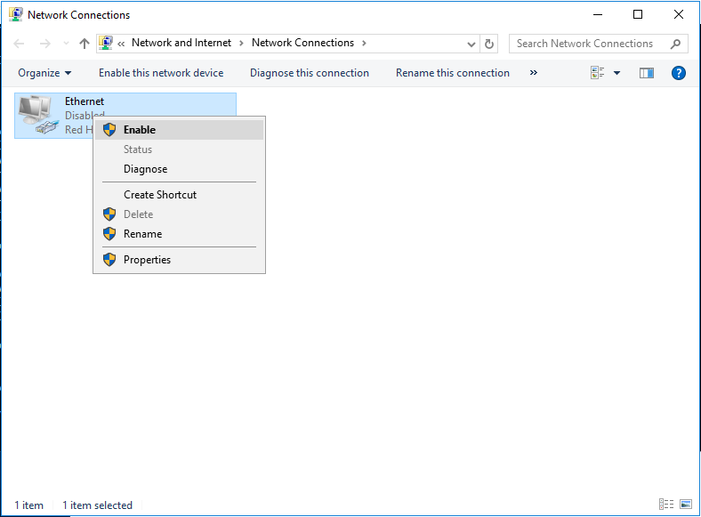

**Last updated 4th January 2023**


> [!primary]
>
> Since October 6th, 2022 our service "Failover IP" is named [Additional IP](https://www.ovhcloud.com/en-au/network/additional-ip/). This renaming has no effect on its technical features.
>

## Objective

You may need to configure Additional IP addresses on your instances, for example if you are hosting multiple websites or international services. OVHcloud Additional IPs allow you to associate multiple IP addresses with a single network interface.

**This guide explains how to add Additional IP addresses to your network configuration.**

> [!warning]
>OVHcloud is providing you with services for which you are responsible, with regard to their configuration and management. You are therefore responsible for ensuring they function correctly.
>
>This guide is designed to assist you in common tasks as much as possible. Nevertheless, we recommend that you contact a [specialist service provider](https://partner.ovhcloud.com/en-au/directory/) if you have difficulties or doubts concerning the administration, usage or implementation of services on a server.
>

## Requirements

- A [Public Cloud instance](https://www.ovhcloud.com/en-au/public-cloud/) in your OVHcloud account
- An [Additional IP address](https://www.ovhcloud.com/en-au/bare-metal/ip/) or an Additional IP block
- Administrative access (root) via SSH or GUI to your instance
- Basic networking and administration knowledge

## Instructions

The following sections contain the configurations for the most commonly used distributions/operating systems. The first step is always to log in to your instance via SSH or a GUI login session (VNC for a Windows instance). The examples below presume you are logged in as a user with elevated permissions (Administrator/sudo).

> [!primary]
>
Concerning different distribution releases, please note that the proper procedure to configure your network interface as well as the file names may have been subject to change. We recommend to consult the manuals and knowledge resources of the respective OS versions if you experience any issues.
> 

**Please take note of the following terminology that will be used in code examples and instructions of the guide sections below:**

|Term|Description|Examples|
|---|---|---|
|ADDITIONAL_IP|An Additional IP address assigned to your service|169.254.10.254|
|NETWORK_INTERFACE|The name of the network interface|*eth0*, *ens3*|
|ID|ID of the IP alias, starting with *0* (depending on the number of additional IPs there are to configure)|*0*, *1*|


### Debian 11

#### Step 1: Disable automatic network configuration

Open the following file path with a text editor:

```bash
sudo nano /etc/cloud/cloud.cfg.d/99-disable-network-config.cfg
```
Enter the following line, then save and exit the editor.

```bash
network: {config: disabled}
```
Creating this configuration file will prevent changes to your network configuration from being made automatically.

#### Step 2: Edit the network configuration file

You can verify your network interface name with this command:

```bash
ip a
```

Open the network configuration file for editing with the following command:

```bash
sudo nano /etc/network/interfaces.d/50-cloud-init
```
Then add the following lines:

```bash
auto NETWORK_INTERFACE:ID
iface NETWORK_INTERFACE:ID inet static
address ADDITIONAL_IP
netmask 255.255.255.255
```

#### Step 3: Restart the interface

Apply the changes with the following command:

```bash
sudo systemctl restart networking
```

### Ubuntu 22.04

The configuration file for your Additional IP addresses is located in `/etc/netplan/`. In this example it is called "50-cloud-init.yaml". Before making changes, verify the actual file name in this folder. Each Additional IP address will need its own line within the file.

#### Step 1: Disable automatic network configuration

Open the following file path with a text editor:

```bash
sudo nano /etc/cloud/cloud.cfg.d/99-disable-network-config.cfg
```
Enter the following line, then save and exit the editor.

```bash
network: {config: disabled}
```
Creating this configuration file will prevent changes to your network configuration from being made automatically.

#### Step 2: Edit the configuration file

You can verify your network interface name with this command:

```bash
ip a
```

Open the network configuration file for editing with the following command:

```bash
sudo nano /etc/netplan/50-cloud-init.yaml
```

Do not change the existing lines in the file; add your Additional IP address according to the example below:

```yaml
network:
    version: 2
    ethernets:
        NETWORK_INTERFACE:
            dhcp4: true
            match:
                macaddress: fa:xx:xx:xx:xx:63
            set-name: NETWORK_INTERFACE
            addresses:
            - ADDITIONAL_IP/32
```

> [!warning]
>
> It is important to respect the alignment of each element in this file as represented in the example above. Do not use the tab key to create your spacing.
>

Save and close the file.

#### Step 3: Apply the new network configuration

You can test your configuration using this command:

```bash
sudo netplan try
```

If it is correct, apply it using the following command:

```bash
sudo netplan apply
```

Repeat this procedure for each Additional IP address.


### Windows Server (2016)

Log in to the [OVHcloud Control Panel](https://ca.ovh.com/auth/?action=gotomanager&from=https://www.ovh.com.au/&ovhSubsidiary=au), go to the `Public Cloud`{.action} section, and select the Public Cloud project concerned.

Open `Instances`{.action} in the left-hand menu and click on the name of your instance. Switch to the tab `VNC console`{.action}.

#### Step 1: Verify the network configuration

Right-click on the `Start Menu`{.action} button and open `Run`{.action}.

Type `cmd` and click `OK`{.action} to open the command line application.

{.thumbnail}

In order to retrieve the current IP configuration, enter `ipconfig` at the command prompt.

{.thumbnail}

#### Step 2: Change the IPv4 Properties

Now you need to change the IP properties to a static configuration.

Open the adapter settings in the Windows control panel and then open the `Properties`{.action} of `Internet Protocol Version 4 (TCP/IPv4)`{.action}.

{.thumbnail}

In the IPv4 Properties window, select `Use the following IP address`{.action}. Enter the IP address which you have retrieved in the first step, then click on `Advanced`{.action}.

#### Step 3: Add the Additional IP in the "Advanced TCP/IP Settings"

In the new window, click on `Add...`{.action} under "IP addresses". Enter your Additional IP address and the subnet mask (255.255.255.255).

{.thumbnail}

Confirm by clicking on `Add`{.action}.

{.thumbnail}

#### Step 4: Restart the network interface

Back in the control panel (`Network Connections`{.action}), right-click on your network interface and then select `Disable`{.action}.

{.thumbnail}

To restart it, right-click on it again and then select `Enable`{.action}.

{.thumbnail}

#### Step 5: Check the new network configuration

Open the command prompt (cmd) and enter `ipconfig`. The configuration should now include the new Additional IP address.

{.thumbnail}


### cPanel (CentOS 7) / Red Hat derivatives

#### Step 1: Edit the network configuration file

You can verify your network interface name with this command:

```bash
ip a
```

Open the network configuration file for editing:

```bash
sudo nano /etc/sysconfig/network-scripts/ifcfg-NETWORK_INTERFACE:ID
```

Then add these lines:

```bash
DEVICE=NETWORK_INTERFACE:ID
BOOTPROTO=static
IPADDR=ADDITIONAL_IP
NETMASK=255.255.255.255
BROADCAST=ADDITIONAL_IP
ONBOOT=yes
```

#### Step 2: Restart the interface

Apply the changes with the following command:

```bash
sudo systemctl restart networking
```


### Plesk

#### Step 1: Access the Plesk IP management section

In the Plesk control panel, choose `Tools & Settings`{.action} from the left-hand sidebar.

{.thumbnail}

Click on `IP Addresses`{.action} under **Tools & Resources**.

#### Step 2: Add the additional IP information

In this section, click on the button `Add IP Address`{.action}.

{.thumbnail}

Enter your Additional IP in the form `xxx.xxx.xxx.xxx/32` into the field "IP address and subnet mask", then click on `OK`{.action}.

{.thumbnail}

#### Step 3: Check the current IP configuration

Back in the section "IP Addresses", verify that the Additional IP address was added correctly.

{.thumbnail}


### Troubleshooting

First, soft-reboot your instance via the instance's OS or from the [OVHcloud Control Panel](https://ca.ovh.com/auth/?action=gotomanager&from=https://www.ovh.com.au/&ovhSubsidiary=au). If you are still unable to establish a connection from the public network to your Additional IP and suspect a network problem, you need to reboot the instance in [rescue mode](https://docs.ovh.com/au/en/public-cloud/put_an_instance_in_rescue_mode/). Then you can set up the Additional IP address directly on the instance.

Once you are connected in rescue mode via SSH, enter the following command:

```bash
ifconfig ens3:0 ADDITIONAL_IP netmask 255.255.255.255 broadcast ADDITIONAL_IP up
```

To test the connection, simply ping your Additional IP from the outside. If it responds in rescue mode, that probably means that there is a configuration error. If, however, the IP is still not working, please inform our support teams by creating a support request in your [OVHcloud Control Panel](https://ca.ovh.com/auth/?action=gotomanager&from=https://www.ovh.com.au/&ovhSubsidiary=au) for further investigations.

## Go further

[Importing an Additional IP](https://docs.ovh.com/au/en/publiccloud/network-services/import-additional-ip/)

[Migrating an Additional IP](https://docs.ovh.com/au/en/publiccloud/network-services/migrate-additional-ip/)

Join our community of users on <https://community.ovh.com/en/>.
