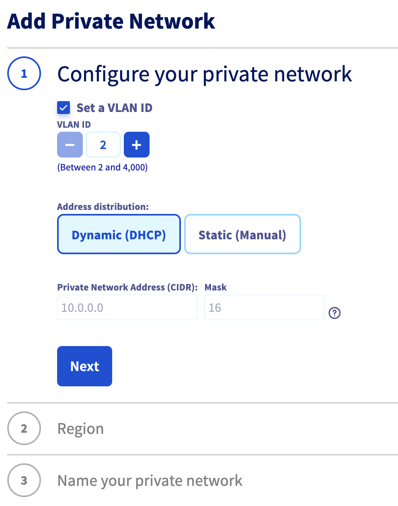
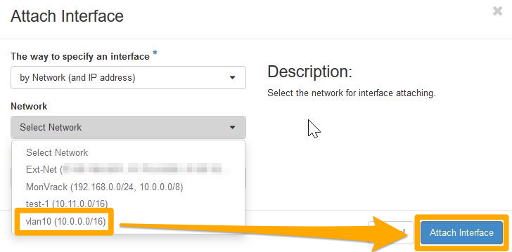
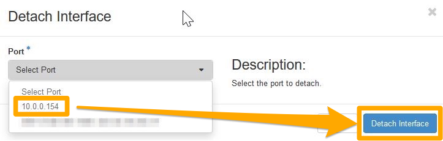

> [!primary]
> Questa traduzione è stata generata automaticamente dal nostro partner SYSTRAN. I contenuti potrebbero presentare imprecisioni, ad esempio la nomenclatura dei pulsanti o alcuni dettagli tecnici. In caso di dubbi consigliamo di fare riferimento alla versione inglese o francese della guida. Per aiutarci a migliorare questa traduzione, utilizza il pulsante "Modifica" di questa pagina.
>

**Ultimo aggiornamento: 02/11/2022**

## Obiettivo

La [vRack](https://www.ovh.it/soluzioni/vrack/) è una rete privata che permette di configurare l'indirizzamento tra diversi server dedicati OVHcloud. Permette anche di aggiungere [istanze Public Cloud](https://docs.ovh.com/it/public-cloud/primi-passi-public-cloud/) alla tua rete privata per creare un'infrastruttura di risorse fisiche e virtuali.

**Questa guida ti mostra come configurare le istanze Public Cloud all'interno della tua vRack.**

## Prerequisiti

- Disporre di un [progetto Public Cloud](https://docs.ovh.com/it/public-cloud/crea_il_primo_progetto_public_cloud/)
- Avere accesso allo [Spazio Cliente OVHcloud](https://www.ovh.com/auth/?action=gotomanager&from=https://www.ovh.it/&ovhSubsidiary=it)
- Aver [creato un utente OpenStack](https://docs.ovh.com/it/public-cloud/creation-and-deletion-of-openstack-user/#crea-un-utente-openstack_1) (facoltativo)
- Conoscenze di rete elementari

## Presentazione delle interfacce

Per creare la tua vRack o aggiungere un'istanza all'interno della rete, potresti aver bisogno di utilizzare lo Spazio Cliente OVHcloud, le APIv6 OVHcloud, le API OpenStack o l'interfaccia Horizon.

In base al tuo profilo tecnico e alle tue esigenze, dovrai scegliere quale interfaccia o metodo utilizzare. In questo modo, per ogni azione, vi proporremo le varie opzioni possibili.

**Ecco una breve descrizione delle azioni possibili secondo il metodo/interfaccia scelto.**

### Spazio Cliente OVHcloud

Lo [Spazio Cliente OVHcloud](https://www.ovh.com/auth/?action=gotomanager&from=https://www.ovh.it/&ovhSubsidiary=it) è un'interfaccia visiva e completa, che in caso di necessità richiede solo una VLAN, è ideale per essere gestita. Non è possibile personalizzare la gamma di IP privati che sarà disponibile solo in 10.x.x.x/16.

Le VLAN saranno implementate di default su tutte le zone. Avrai solo la possibilità di attivare o meno i *gateway*.

La fatturazione dei tuoi servizi è disponibile nello Spazio Cliente OVHcloud.

### Interfaccia Horizon

Interfaccia visiva indipendente di OVHcloud, [Horizon](https://horizon.cloud.ovh.net/auth/login/){.external} è l'implementazione iniziale della dashboard di OpenStack, che fornisce un'interfaccia utente web ai servizi OpenStack, in particolare Nova, Swift, Keystone, ecc...

Questa interfaccia completa e tecnica ti permette di gestire quasi tutte le azioni OpenStack. Sarà una delle interfacce necessarie per gestire più di due VLAN, aggiungere interfacce di rete private alle tue istanze, gestire immagini personalizzate, ecc...

Consulta la guida [Creare un utente per accedere a Horizon](https://docs.ovh.com/it/public-cloud/horizon/) per familiarizzare con Horizon.

> [!primary]
> Horizon funziona per zona, ti consigliamo di scegliere la zona geografica di lavoro in alto a sinistra della tua interfaccia (GRA5, SBG3, BHS1, ecc...)
>

### APIv6 OVHcloud

Ogni azione eseguita nello Spazio Cliente OVHcloud utilizza le [APIv6 OVHcloud](https://api.ovh.com/).
È possibile accedere alle API in misura maggiore rispetto allo Spazio Cliente.

L'interfaccia è meno visiva dello Spazio Cliente OVHcloud, ma ti permette di effettuare numerose azioni. In questo modo è possibile gestire e personalizzare le tue VLAN, aggiungere interfacce alle tue istanze o creare server altamente personalizzati.

A volte sarà necessario recuperare più informazioni prima dell'utilizzo di un'API specifica.

Puoi semplicemente accedere alle API dalla [nostra pagina Web](https://api.ovh.com/), ma anche creare i tuoi script PHP o Python per farvi ricorso.

In questo modo, potrai automatizzare liberamente le operazioni di base tramite script, ottimizzare le tue funzioni, ecc...

Consulta la guida [Primi passi con le API OVHcloud](https://docs.ovh.com/it/api/first-steps-with-ovh-api/), per familiarizzare con l'utilizzo delle APIv6 OVHcloud.

### API OpenStack

I servizi Public Cloud possono essere gestiti utilizzando le righe di comando Linux o Windows dopo aver scaricato e installato gli strumenti OpenStack.

A seconda del livello che si desidera gestire, è necessario utilizzare il client **Nova** (Compute), **Neutron** (rete), **Glance** (immagine) o **Swift** (Object storage). L'ultima aggiunta a questo assortimento, il client OpenStack, consente di gestire quasi tutti i livelli OpenStack direttamente.

L'API OpenStack consente inoltre di automatizzare facilmente la gestione tramite gli script.

Grazie all'API OpenStack, è possibile automatizzare facilmente questa gestione tramite i tuoi script.

Per familiarizzarti con l'API OpenStack, consulta queste guide:

- [Preparare l’ambiente per utilizzare l’API OpenStack](https://docs.ovh.com/it/public-cloud/prepara_il_tuo_ambiente_di_sviluppo_per_utilizzare_lapi_openstack/)
- [Impostare le variabili d'ambiente OpenStack](https://docs.ovh.com/it/public-cloud/impostare-le-variabili-dambiente-openstack/)

A seconda delle tue necessità, puoi utilizzare le API dedicate a OpenStack:

- Nova (compute)
- Glance (image)
- Cinder (image)
- Neutron (network)

> [!primary]
> In alcuni casi, sarà più facile utilizzare le API OpenStack e in altri, Nova, Neutron, ecc.
>
> Inoltre, alcune funzionalità potrebbero mancare dall'API OpenStack a seconda della versione del client e del sistema operativo.
Per rendere la guida più accessibile, offre le opzioni più semplici e intuitive.
È possibile consultare la [documentazione ufficiale di OpenStack](https://docs.openstack.org/){.external} se si desidera approfondire la conoscenza del suo utilizzo.
>

## Procedura

### Step 1: Attivazione e gestione di un vRack <a name="activation"></a>

Prima di tutto, è necessario creare una vRack.

Il prodotto è gratuito e la messa a disposizione richiede solo pochi minuti. ma richiede la creazione e la conferma di un buono d'ordine.

Una volta che la vRack è attiva, visualizzerai questo servizio con la denominazione "pn-xxxxxx".

#### Dallo Spazio Cliente OVHcloud

Accedi allo [Spazio Cliente OVHcloud](https://www.ovh.com/auth/?action=gotomanager&from=https://www.ovh.it/&ovhSubsidiary=it), clicca sul menu `Public Cloud`{.action} e seleziona il tuo progetto Public Cloud in alto a sinistra.

{.thumbnail}

Clicca su `Private network`{.action} nel menu a sinistra. 

{.thumbnail}

Clicca sul pulsante `Per iniziare, crea una vRack`{.action}. In questo caso, scegli di creare una nuova vRack o di utilizzare una vRack esistente. Nel nostro esempio, creeremo una nuova vRack. Una volta effettuata la scelta, clicca su `Crea`{.action}.

{.thumbnail}

Per continuare la configurazione della vRack dallo Spazio Cliente OVHcloud, continua la lettura di questa guida utilizzando la [creazione di una VLAN nella vRack dallo Spazio Cliente OVHcloud](./#crea-una-vlan-dallo-spazio-cliente-ovhcloud).

#### Dalle APIv6 OVHcloud

Per attivare e gestire una vRack, clicca [qui](https://docs.ovh.com/gb/en/publiccloud/network-services/public-cloud-vrack-apiv6/#step-1-activating-and-managing-a-vrack) (EN), per consultare la guida specifica a questo metodo.

### Step 2: Crea una VLAN nella vRack

È necessario creare una VLAN (o rete locale virtuale) affinché le istanze collegate alla vRack possano comunicare tra loro.

Sull'offerta Public Cloud è possibile creare fino a 4.000 VLAN all'interno di una sola vRack. In questo modo è possibile utilizzare ciascun indirizzo IP privato fino a 4.000 volte.
Ad esempio, l'IP 192.168.0.10 della VLAN 2 è diverso dall'IP 192.168.0.10 della VLAN 42.

Questa operazione potrebbe rivelarsi utile per segmentare la tua vRack tra più reti virtuali.

Dallo Spazio Cliente OVHcloud è possibile utilizzare la VLAN scelta, ma non è possibile personalizzare la gamma IP. La vRack sarà attiva in tutte le zone.

Grazie alle APIv6 OVHcloud è possibile personalizzare l'insieme dei parametri: gamma IP (ad esempio 10.0.0.0/16), zona di implementazione, DHCP, Gateway, ecc...

> [!primary]
> Sui server dedicati, di default, sei sulla VLAN 0. Per il funzionamento dell'infrastruttura OpenStack è necessario specificare il numero della VLAN direttamente a livello dell'infrastruttura.
>
> Diversamente dai server dedicati, non è necessario "taggare" la VLAN direttamente su un'istanza Public Cloud. 
>
> Per maggiori informazioni sulla gestione delle VLAN della vRack dei server dedicati, consulta questa guida: [Creare due o più VLAN nella vRack](https://docs.ovh.com/it/dedicated/creare-vlan-vrack/).

> [!warning]
> La vRack è un'infrastruttura gestita a livello di OVHcloud e può essere gestita solo dallo Spazio Cliente OVHcloud e dalle APIv6 OVHcloud.
>
> Non essendo OpenStack allo stesso livello dell'infrastruttura, non è possibile personalizzare le VLAN tramite l'interfaccia Horizon o le API OpenStack.
>

#### Crea una VLAN dallo Spazio Cliente OVHcloud

Una volta creata la vRack, clicca di nuovo su `Private Network`{.action} nel menu a sinistra. 

{.thumbnail}

Clicca su `Crea una rete privata`{.action}. La pagina successiva ti permette di personalizzare diversi parametri.

{.thumbnail}

Selezionando la casella `Definisci l’ID della VLAN`, dovrai scegliere un numero di VLAN che varia da 2 a 4.000.

Se non selezioni la casella `Definisci l’ID della VLAN`, sarai di default nella VLAN 0.

Se hai bisogno di far comunicare i server dedicati OVHcloud con VLAN tag, consulta questa guida: [Creare due o più VLAN nella vRack](https://docs.ovh.com/it/dedicated/creare-vlan-vrack/).

La gamma DHCP predefinita è 10.0.0.0/16. Per modificare questa classe IP, è necessario passare attraverso le APIv6 OVHcloud.

Conferma le Region richieste, inserisci un nome per la tua rete privata e clicca su `Crea`{.action} per iniziare la creazione. 

> [!primary]
> La creazione della rete privata potrebbe richiedere alcuni minuti.
>

#### Crea una VLAN dalle APIv6 OVHcloud

Per creare una VLAN dalle APIv6 OVHcloud, clicca [qui](https://docs.ovh.com/gb/en/publiccloud/network-services/public-cloud-vrack-apiv6/#step-3-creating-a-vlan-in-the-vrack_1) (EN), per consultare la guida specifica a questo metodo.

### Step 3: Integra un'istanza nella vRack

Possono presentarsi due situazioni:

- L'istanza non esiste ancora.
- L'istanza esiste già e devi aggiungerla alla vRack.

#### Caso di una nuova istanza

##### **Dallo Spazio Cliente OVHcloud**

Consulta la guida [Creare un'istanza dallo Spazio Cliente](https://docs.ovh.com/it/public-cloud/primi-passi-public-cloud/#create-instance). Durante la creazione di un'istanza, potrai specificare, nello Step 4, una rete privata nella quale integrare la tua istanza. Nel menu a tendina presentato seleziona la tua vRack creata precedentemente.

{.thumbnail}

> [!warning]
> Quando crei una nuova istanza, accedi alla tua istanza solo con una vRack dallo Spazio Cliente OVHcloud.
> Per aggiungere diverse interfacce, è necessario passare attraverso le API OpenStack o Horizon.
>

##### **Dalle APIv6 OVHcloud**

Clicca [qui](https://docs.ovh.com/gb/en/publiccloud/network-services/public-cloud-vrack-apiv6/#step-4-integrating-an-instance-into-the-vrack_1) (EN), per consultare la guida specifica a questo metodo.

##### **Dalle API OpenStack**

Per utilizzare le API OpenStack, in caso contrario, prepara il tuo ambiente di lavoro come indicato nella [prima sezione di questa guida](./#api-openstack).

Per creare un'istanza direttamente nella vRack, è necessario eseguire questa operazione.

###### Recupero delle informazioni necessarie

Identificazione delle reti pubbliche e private:

```bash
openstack network list
 
+--------------------------------------+------------+-------------------------------------+
| ID                                   | Name       | Subnets                             |
+--------------------------------------+------------+-------------------------------------+
| 12345678-90ab-cdef-xxxx-xxxxxxxxxxxx | MyVLAN-42  | xxxxxxxx-yyyy-xxxx-yyyy-xxxxxxxxxxxx|
| 34567890-12ab-cdef-xxxx-xxxxxxxxxxxx | Ext-Net    | zzzzzzzz-yyyy-xxxx-yyyy-xxxxxxxxxxxx|
| 67890123-4abc-ef12-xxxx-xxxxxxxxxxxx | MyVLAN_0   | yyyyyyyy-xxxx-xxxx-yyyy-xxxxxxxxxxxx|
+--------------------------------------+------------+-------------------------------------+
```

o

```bash
nova net-list
 
+--------------------------------------+------------+------+
| ID                                   | Label      | CIDR |
+--------------------------------------+------------+------+
| 12345678-90ab-cdef-xxxx-xxxxxxxxxxxx | MyVLAN-42  | None |
| 34567890-12ab-cdef-xxxx-xxxxxxxxxxxx | Ext-Net    | None |
| 67890123-4abc-ef12-xxxx-xxxxxxxxxxxx | MyVLAN_0   | None |
+--------------------------------------+------------+------+
```
> [!primary]
> Annotare gli ID della rete che ti interessa:
><br> - Ext-Net per avere un IP pubblico
><br> - Quello delle VLAN necessarie alla tua configurazione
>

Ricorda anche queste informazioni, come indicato nella [guida all'utilizzo dell'API Nova](https://docs.ovh.com/gb/en/public-cloud/starting-with-nova-api/):

- ID o nome della chiave SSH OpenStack
- ID del tipo di istanza (*flavor*)
- ID dell'immagine desiderata (sistema operativo, snapshot, ecc...)

###### Implementazione dell'istanza

Con gli elementi recuperati precedentemente, è possibile creare un'istanza includendola direttamente nella vRack:

```bash
nova boot --key-name SSHKEY --flavor [ID-flavor] --image [ID-Image] --nic net-id=[ID-Network 1] --nic net-id=[ID-Network 2] [name-of-instance]

Esempio :
nova boot --key-name my-ssh-key --flavor xxxxxx-xxxx-xxxx-xxxx-xxxxxxxxxxxx --image yyyy-yyyy-yyyy-yyyy-yyyyyyyyyyyy --nic net-id=[id_Ext-Net] --nic net-id=[id_vLan] name_of_instance

+--------------------------------------+------------------------------------------------------+
| Property                             | Value                                                |
+--------------------------------------+------------------------------------------------------+
| OS-DCF:diskConfig                    | MANUAL                                               |
| OS-EXT-AZ:availability_zone          |                                                      |
| OS-EXT-STS:power_state               | 0                                                    |
| OS-EXT-STS:task_state                | scheduling                                           |
| OS-EXT-STS:vm_state                  | building                                             |
| OS-SRV-USG:launched_at               | -                                                    |
| OS-SRV-USG:terminated_at             | -                                                    |
| accessIPv4                           |                                                      |
| accessIPv6                           |                                                      |
| adminPass                            | xxxxxxxxxxxx                                         |
| config_drive                         |                                                      |
| created                              | YYYY-MM-DDTHH:MM:SSZ                                 |
| flavor                               | [Flavor Type] (xxxxxx-xxxx-xxxx-xxxx-xxxxxxxxxxxx)   |
| hostId                               |                                                      |
| id                                   | xxxxxx-xxxx-xxxx-xxxx-xxxxxxxxxxxx                   |
| image                                | [Image Type] (xxxxxx-xxxx-xxxx-xxxx-xxxxxxxxxxxx)    |
| key_name                             | [Name of key]                                        |
| metadata                             | {}                                                   |
| name                                 | [Name of instance]                                   |
| os-extended-volumes:volumes_attached | []                                                   |
| progress                             | 0                                                    |
| security_groups                      | default                                              |
| status                               | BUILD                                                |
| tenant_id                            | zzzzzzzzzzzzzzzzzzzzzzzzzzzzzzzz                     |
| updated                              | YYYY-MM-DDTHH:MM:SSZ                                 |
| user_id                              | zzzzzzzzzzzzzzzzzzzzzzzzzzzzzzzz                     |
+--------------------------------------+------------------------------------------------------+
```
o

```bash
openstack server create --key-name SSHKEY --flavor [ID-flavor] --image [ID-Image] --nic net-id=[ID-Network 1] --nic net-id=[ID-Network 2] [instance name]

Esempio:
openstack server create --key-name my-ssh-key --flavor xxxxxx-xxxx-xxxx-xxxx-xxxxxxxxxxxx --image yyyy-yyyy-yyyy-yyyy-yyyyyyyyyyyy --nic net-id=[id_Ext-Net] --nic net-id=[id_VLAN] NameOfInstance

+--------------------------------------+------------------------------------------------------+
| Property                             | Value                                                |
+--------------------------------------+------------------------------------------------------+
| OS-DCF:diskConfig                    | MANUAL                                               |
| OS-EXT-AZ:availability_zone          |                                                      |
| OS-EXT-STS:power_state               | 0                                                    |
| OS-EXT-STS:task_state                | scheduling                                           |
| OS-EXT-STS:vm_state                  | building                                             |
| OS-SRV-USG:launched_at               | -                                                    |
| OS-SRV-USG:terminated_at             | -                                                    |
| accessIPv4                           |                                                      |
| accessIPv6                           |                                                      |
| adminPass                            | xxxxxxxxxxxx                                         |
| config_drive                         |                                                      |
| created                              | YYYY-MM-DDTHH:MM:SSZ                                 |
| flavor                               | [Flavor type] (xxxxxx-xxxx-xxxx-xxxx-xxxxxxxxxxxx)   |
| hostId                               |                                                      |
| id                                   | xxxxxx-xxxx-xxxx-xxxx-xxxxxxxxxxxx                   |
| image                                | [Image type] (xxxxxx-xxxx-xxxx-xxxx-xxxxxxxxxxxx)    |
| key_name                             | [Name of key]                                        |
| metadata                             | {}                                                   |
| name                                 | [Name of instance]                                   |
| os-extended-volumes:volumes_attached | []                                                   |
| progress                             | 0                                                    |
| security_groups                      | default                                              |
| status                               | BUILD                                                |
| tenant_id                            | zzzzzzzzzzzzzzzzzzzzzzzzzzzzzzzz                     |
| updated                              | YYYY-MM-DDTHH:MM:SSZ                                 |
| user_id                              | zzzzzzzzzzzzzzzzzzzzzzzzzzzzzzzz                     |
+--------------------------------------+------------------------------------------------------+
```

Puoi definire l'indirizzo IP dell'istanza della tua interfaccia vRack a livello di OpenStack.

Per farlo, puoi aggiungere un semplice argomento nella funzione "—nic":

```bash
``` 
--nic net-id=[ID-Network],v4-fixed-ip=[IP_static_vRack]
```
```

Esempio:

```bash
```
--nic net-id=[ID-vRack],v4-fixed-ip=192.168.0.42
```
```

###### Verifica dell'istanza

Dopo pochi minuti, puoi verificare la lista delle istanze esistenti per trovare il server creato:

```bash
openstack server list
+--------------------------------------+---------------------+--------+--------------------------------------------------+--------------------+
| ID                                   |       Name          | Status | Networks                                         |     Image Name     |
+--------------------------------------+---------------------+--------+--------------------------------------------------+--------------------+
| xxxxxx-xxxx-xxxx-xxxx-xxxxxxxxxxxxxx | [Name of instance]  | ACTIVE | Ext-Net=[IP_V4], [IP_V6]; MyVrack=[IP_V4_vRack]  | [Name-of-instance] |
+--------------------------------------+---------------------+--------+--------------------------------------------------+--------------------+
```

```bash
nova list
+--------------------------------------+--------------------+--------+------------+-------------+--------------------------------------------------+
| ID                                   | Name               | Status | Task State | Power State | Networks                                         |
+--------------------------------------+--------------------+--------+------------+-------------+--------------------------------------------------+
| xxxxxx-xxxx-xxxx-xxxx-xxxxxxxxxxxx   | [Name of instance] | ACTIVE | -          | Running     | Ext-Net=[IP_V4], [IP_V6]; MyVrack=[IP_V4_vRack]  |
+--------------------------------------+--------------------+--------+------------+-------------+--------------------------------------------------+
```


#### In caso di istanza esistente

Lo Spazio Cliente OVHcloud permette di associare un'istanza a una o più reti private ma non offre una configurazione avanzata delle interfacce di rete. Per personalizzarli ulteriormente, è necessario gestirli tramite le APIv6 OVHcloud, le API OpenStack o Horizon.

L'azione consiste nell'aggiungere una nuova interfaccia di rete al tuo server, oltre a quella esistente.

Ad esempio, se hai un'interfaccia pubblica *eth0*, avrai anche un'interfaccia *eth1*.

> [!warning]
> La configurazione di questa nuova interfaccia è raramente automatica.
> Sarà quindi necessario configurarla in DHCP o IP Fisso secondo la tua infrastruttura.
>


##### **Dallo Spazio Cliente OVHcloud** 

Accedi allo [Spazio Cliente OVHcloud](https://www.ovh.com/auth/?action=gotomanager&from=https://www.ovh.it/&ovhSubsidiary=it) poi clicca sul `Public Cloud`{.action} e seleziona il tuo progetto in alto a sinistra.

Clicca su `Instances`{.action} nel menu a sinistra e poi su `...`{.action} a destra dell'istanza corrispondente. Seleziona `Dettagli dell'istanza`{.action}.

{.thumbnail}

Verrà aperto il dashboard dell'istanza. Cliccate su `...`{.action} accanto a "Reti private" e selezionate `Associa una rete`{.action}.

{.thumbnail}

Nel pop-up che appare, seleziona la rete o le reti private da associare alla tua istanza e clicca su `Associa`{.action}.

{.thumbnail}

##### **Gestione delle interfacce di rete con le APIv6 OVHcloud**

Clicca [qui](https://docs.ovh.com/gb/en/publiccloud/network-services/public-cloud-vrack-apiv6/#in-case-of-an-existing-instance_1) (EN), per consultare la guida specifica a questo metodo.

##### **Gestione delle interfacce di rete con OpenStack Horizon**

Accedi all'interfaccia [Horizon](https://horizon.cloud.ovh.net/auth/login/){.external} utilizzando il metodo indicato nella [prima parte di questa guida](./#interfaccia-horizon).

Accedi alla tua zona di lavoro:

{.thumbnail}

Clicca su `Compute` e poi su `Instances`:

{.thumbnail}

###### Aggiunta di un'interfaccia privata

Per aggiungere un'interfaccia, clicca sulla freccia che permette di accedere alle azioni sull'istanza. Clicca su `Attach Interface`{.action}:

{.thumbnail}

Seleziona la tua interfaccia e conferma:

{.thumbnail}

> [!primary]
> La tua istanza OVHcloud disporrà quindi di una nuova interfaccia di rete oltre all'interfaccia pubblica (Ext-net).
><br>Nel riepilogo dell'istanza puoi vedere l'indirizzo IP privato assegnato automaticamente alla tua interfaccia.
><br>A vostro carico, configurare la vostra interfaccia tramite il DHCP o utilizzare i vostri IP tramite una configurazione in IP statico.
>

###### Elimina un'interfaccia privata

> [!warning]
> L'eliminazione di un'interfaccia è definitiva.
>
>Se elimini l'interfaccia "Ext-Net" (IP pubblico), questo indirizzo viene rilasciato e rimesso in circolazione. Non potreste riassegnarla.
><br>Questa operazione è necessaria solo per isolare il server nella vRack (interfaccia "Ext-Net") o per estrarlo da una VLAN.
>

Per eliminare un'interfaccia, clicca sulla freccia che permette di accedere alle azioni sull'istanza. Clicca su `Detach Interface`{.action}:

{.thumbnail}

Seleziona l'interfaccia da eliminare e conferma:

{.thumbnail}

##### **Gestione delle interfacce di rete dalle API OpenStack**

Per utilizzare le API OpenStack, in caso contrario, prepara il tuo ambiente di lavoro come indicato nella [prima sezione di questa guida](./#api-openstack).

Per integrare un'istanza esistente nella vRack, è necessario eseguire questa operazione.

###### Recupero delle informazioni necessarie

Identificazione delle tue istanze:

```bash
openstack server list
 
+--------------------------------------+--------------+--------+------------------------------------------------------------------------+------------+
| ID                                   | Name         | Status | Networks                                                               | Image Name |
+--------------------------------------+--------------+--------+------------------------------------------------------------------------+------------+
| 12345678-90ab-cdef-xxxx-xxxxxxxxxxxx | My-Instance  | ACTIVE | Ext-Net=xx.xx.xx.xx, 2001:41d0:yyyy:yyyy::yyyy; MyVrack=192.168.0.124  | Debian 9   |
+--------------------------------------+--------------+--------+------------------------------------------------------------------------+------------+
```

o

```bash
nova list
 
+--------------------------------------+--------------+--------+------------+-------------+----------------------------------------------------------------------+
| ID                                   | Name         | Status | Task State | Power State | Networks                                                             |
+--------------------------------------+--------------+--------+------------+-------------+----------------------------------------------------------------------+
| 12345678-90ab-cdef-xxxx-xxxxxxxxxxxx | My-Instance  | ACTIVE | -          | Running     | Ext-Net=xx.xx.xx.xx,2001:41d0:yyyy:yyyy::yyyy;MyVrack=192.168.0.124  |
+--------------------------------------+--------------+--------+------------+-------------+----------------------------------------------------------------------+
```

Identificazione delle reti pubbliche e private:

```bash
openstack network list
 
+--------------------------------------+------------+-------------------------------------+
| ID                                   | Name       | Subnets                             |
+--------------------------------------+------------+-------------------------------------+
| 12345678-90ab-cdef-xxxx-xxxxxxxxxxxx | MyVLAN-42  | xxxxxxxx-yyyy-xxxx-yyyy-xxxxxxxxxxxx|
| 34567890-12ab-cdef-xxxx-xxxxxxxxxxxx | Ext-Net    | zzzzzzzz-yyyy-xxxx-yyyy-xxxxxxxxxxxx|
| 67890123-4abc-ef12-xxxx-xxxxxxxxxxxx | MyVLAN-0   | yyyyyyyy-xxxx-xxxx-yyyy-xxxxxxxxxxxx|
+--------------------------------------+------------+-------------------------------------+
```

o

```bash
nova net-list
 
+--------------------------------------+------------+------+
| ID                                   | Label      | CIDR |
+--------------------------------------+------------+------+
| 12345678-90ab-cdef-xxxx-xxxxxxxxxxxx | MyVLAN-42  | None |
| 34567890-12ab-cdef-xxxx-xxxxxxxxxxxx | Ext-Net    | None |
| 67890123-4abc-ef12-xxx-xxxxxxxxxxxxx | MyVLAN-0   | None |
+--------------------------------------+------------+------+
```

> [!primary]
> Annotare gli ID della rete che ti interessa:
><br> - Ext-Net per avere un IP pubblico
><br> - quello delle VLAN necessarie alla tua configurazione
>

###### Aggiunta di un'interfaccia privata

Per associare una nuova interfaccia, esegui questo comando:

```bash
nova interface-attach --net-id <ID-VLAN> <ID-instance>
```

Esempio:
```bash
nova interface-attach --net-id 12345678-90ab-cdef-xxxx-xxxxxxxxxxxx 12345678-90ab-cdef-xxxx-xxxxxxxxxxxx
```

Verifica che l'azione sia stata presa in carico:

```bash
nova show <ID-instance>
 
+--------------------------------------+----------------------------------------------------------+
| Property                             | Value                                                    |
+--------------------------------------+----------------------------------------------------------+
| Ext-Net network                      | xx.xx.xx.xx, 2001:41d0:xxx:xxxx::xxxx                    | => il tuo IP Pubblico
| MyVLAN-42 network                    | 192.168.0.x                                              | => il tuo IP privato
[...]
```

o

```bash
openstack server show <ID-instance>
+--------------------------------------+-------------------------------------------------------------------------+
| Field                                | Value                                                                   |
+--------------------------------------+-------------------------------------------------------------------------+
[...]
| addresses                            | Ext-Net=xx.xx.xx.xx, 2001:41d0:xxx:xxxx::xxxx; MonVLAN-42=192.168.0.x   | => il tuo IP Pubblico ; il tuo IP privato                                                                     
[...]
```

###### Elimina un'interfaccia

> [!warning]
> L'eliminazione di un'interfaccia è definitiva.
>
> Se elimini l'interfaccia "Ext-Net" (IP pubblico), questo indirizzo viene rilasciato e rimesso in circolazione. Non potreste riassegnarla.
><br>Questa operazione è necessaria solo per isolare il server nella vRack (interfaccia "Ext-Net") o per estrarlo da una VLAN.
>

Per scollegare un'interfaccia è necessario, in un primo tempo, identificare la porta *Neutron* creata.

Puoi usare i seguenti comandi:

```bash
neutron port-list
+--------------------------------------+------+-------------------+---------------------------------------------------------------------------------------------------+
| id                                   | name | mac_address       | fixed_ips                                                                                         |
+--------------------------------------+------+-------------------+---------------------------------------------------------------------------------------------------+
| 12345678-abcd-ef01-2345-678910abcdef |      | fa:xx:xx:xx:xx:xx | {"subnet_id": "01234567-8901-abscdef12345678910abcd", "ip_address": "192.168.0.x"}                |
| 09876543-210a-bcde-f098-76543210abcd |      | fa:yy:yy:yy:yy:yy | {"subnet_id": "65432109-abcd-ef09-8765-43210abcdef1", "ip_address": "2001:41d0:xxx:xxxx::xxxx"}   |
|                                      |      |                   | {"subnet_id": "abcdef12-3456-7890-abcd-ef1234567890", "ip_address": "YY.YY.YY.YY"}                |
+--------------------------------------+------+-------------------+---------------------------------------------------------------------------------------------------+
```

o
```bash
openstack port list
+--------------------------------------+------+-------------------+-------------------------------------------------------------------------------------------+
| ID                                   | Name | MAC Address       | Fixed IP Addresses                                                                        |
+--------------------------------------+------+-------------------+-------------------------------------------------------------------------------------------+
| 12345678-abcd-ef01-2345-678910abcdef |      | fa:xx:xx:xx:xx:xx | ip_address='192.168.0.xx', subnet_id='301234567-8901-abscdef12345678910abcd'              |
| 09876543-210a-bcde-f098-76543210abcd |      | fa:yy:yy:yy:yy:yy | ip_address='2001:41d0:xxx:xxxx::xxxx', subnet_id='65432109-abcd-ef09-8765-43210abcdef1'   |
|                                      |      |                   | ip_address='YY.YY.YY.YY', subnet_id='abcdef12-3456-7890-abcd-ef1234567890'                |
+--------------------------------------+------+-------------------+-------------------------------------------------------------------------------------------+
```

Una volta identificata la porta da eliminare, esegui il comando:

```bash
nova interface-detach <ID_instance> <port_id>
```

Ad esempio:

```bash
nova interface-detach 12345678-90ab-cdef-xxxx-xxxxxxxxxxxx 12345678-abcd-ef01-2345-678910abcdef
```

## Per saperne di più

[Configurazione della vRack Public Cloud da APIv6 OVHcloud](https://docs.ovh.com/gb/en/publiccloud/network-services/public-cloud-vrack-apiv6/) (EN)

[Server dedicati - Creare due o più VLAN nella vRack](https://docs.ovh.com/it/dedicated/creare-vlan-vrack/)

Contatta la nostra Community di utenti all’indirizzo <https://community.ovh.com/en/>.
