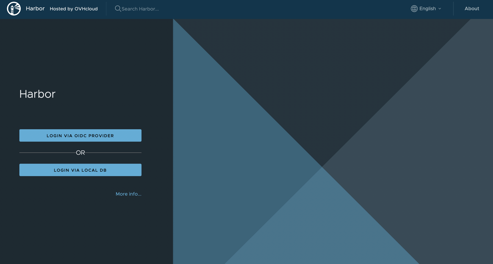
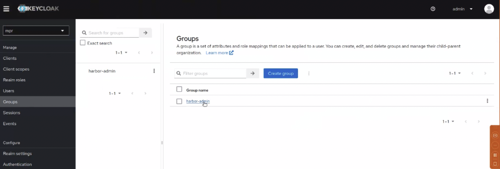
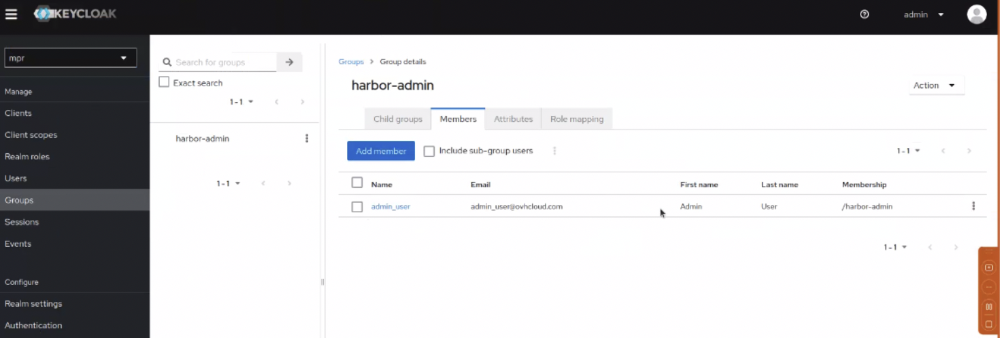

routes:
    canonical: /pages/platform/private-registry/configure-oidc-provider-authentication

**Last updated 25th August, 2023.**

<style>
 pre {
     font-size: 14px;
 }
 pre.console {
   background-color: #300A24; 
   color: #ccc;
   font-family: monospace;
   padding: 5px;
   margin-bottom: 5px;
 }
 pre.console code {
   border: solid 0px transparent;
   color: #ccc;
   font-family: monospace !important;
   font-size: 0.75em;
 }
 .small {
     font-size: 0.75em;
 }
</style>

## Objective

OVHcloud Managed Private Registry service, a cloud-native registry built on Harbor, allows you to store, manage and access your container images (OCI artifacts) and Helm charts.

By default, to log in your OVHloud Managed private registries you have to generate credentials (from the OVHcloud Control Panel, the APIv6 or Terraform), then log you with this user and administrate other users in the Harbor HMI. But, do you know that you can configure an Open ID Connect (OIDC) provider, for the OVHcloud Managed Private registry authentiction, like Keycloack?

First of all, what is OIDC?


OIDC stands for [OpenID Connect](https://en.wikipedia.org/wiki/OpenID). It is an open standard and decentralized authentication protocol.
This protocol allows verifying the user identity when a user is trying to access a protected HTTPs endpoint.

Several OpenID Connect providers exists like Dex, Keycloak, Okta or a SaaS provider and Harbor supports all of them. In this tutorial we will use Keycloack.

What is Keycloak?


[Keycloak](https://www.keycloak.org/) is an open source Identity and Access Management solution aimed at modern applications and services.
It makes it easy to secure applications and services with little to no code.
More information can be found here: [Official Keycloak documentation](https://www.keycloak.org/documentation.html).

**This guide will explain how to configure the authentication of your OVHcloud Managed Private Registry service to use an OIDC provider.**

## Requirements

- An OVHcloud [Managed Private Registry](/pages/platform/private-registry/creating-a-private-registry)
- The URL and login/password of your private registry
- an OIDC provider, like a KeyCloack instance and credentials to access to it

Follow the official guide if you want to [install a Keyclock on an OVHcloud Managed Kubernetes cluster](/pages/platform/kubernetes-k8s/installing-keycloak).

## Instructions

### Configure OIDC provider through the API

#### The API Explorer

To simplify things, we are using the [API Explorer](https://api.ovh.com/) which allows to explore, learn and interact with the API in an interactive way.

Log in to the API Explorer using your OVHcloud NIC handle.

{.thumbnail}

If you go to the [Kubernetes section](https://api.ovh.com/console/#/cloud/project/%7bservicename%7d/kube~get) of the API Explorer, you will see the available endpoints:

{.thumbnail}

#### API endpoints

- Configure an OIDC provider for your OVHcloud Managed Private Registry:

Do a POST HTTP request and fill the input fields with the keycloack/OIDC provider information.

> [!api]
>
> @api {POST} /cloud/project/{serviceName}/containerRegistry/{registryID}/openIdConnect
> 

**Input:**

```
serviceName: <your service name>
registryID: <the ID of the registry>
OIDCPost:
  deleteUsers: true
  provider:
    adminGroup: harbor-admin //it's my admin group in keycloack
    clientSecret: <keycloack client secret>
    endpoint: <keyclock endpoint> //ending with the realm, for example: https://xxx.yyy.com/realms/mpr 
    groupsClaim: <group in keycloack>
    name: keycloack //for example
    scope: openid,profile,email,offline_access
    userClaim:
    verifyCert: true //if you want to check the keycloack SSL/TLS certificate
```

**Result:**

```json
null
```

Go to the [Harbor documentation](https://goharbor.io/docs/2.8.0/administration/configure-authentication/oidc-auth/) to see the details of the needed information.

> [!primary]
>
> If you forget to enable `deleteUsers` option, you will have an error: `{ "class": "Client::BadRequest", "message": "4 users exist, set parameter deleteUsers to delete them" }`. Indeed, when a new private registry is created, several users are created. So you need to enable the `deleteUsers` field is order to remove existing local users and enable OIDC authentication.

Now, access to the Harbor HMI and new buttons should appears, especially the `Login via OIDC provider`:



When you click on the `Login via OIDC provider` button, you are redirected to the Keycloack interface. 


If you don't enable `autoOnboard` input field, a popup in the Habror interface should appear asking you to fill the username.
When this option is checked, the attribute `UserClaim` must be set, Harbor will read the value of this claim from ID token and use it as the username for onboarding the user. 


Click on the `Save` button to finally log on Harbor with the OIDC provider.

- Get an existing registry's OIDC configuration:

> [!api]
>
> @api {GET} /cloud/project/{serviceName}/containerRegistry/{registryID}/openIdConnect
> 

**Input:**

```
serviceName: <your service name>
registryId: xxxxxxxx-xxxx-xxxx-xxxx-xxxxxxxxxxxx
```

**Result:**

```json
{
  "id": "xxxxxxxx-xxxx-xxxx-xxxx-xxxxxxxxxxxx",
  "name": "keycloak",
  "createdAt": "2023-08-24T13:35:07.217448Z",
  "updatedAt": "2023-08-24T13:35:07.300496Z",
  "status": "READY",
  "endpoint": "https://xxxx.yyy.com/realms/mpr",
  "clientId": "harbor",
  "groupsClaim": "groups",
  "adminGroup": "harbor-admin",
  "scope": "openid,profile,email,offline_access",
  "verifyCert": true,
  "autoOnboard": false,
  "userClaim": ""
}
```

- Update an existing registry's OIDC provider (to add adminGroup and groupsClaim fields for example):

First, retrieve information about groups in keycloack:



Check you have at least one member in the group:


Then, update the configuration with a PUT request.

> [!api]
>
> @api {PUT} /cloud/project/{serviceName}/containerRegistry/{registryID}/openIdConnect
> 

```
OIDCPost:
  provider:
    adminGroup: harbor-admin //for example, it's my admin group in keycloack
    groupsClaim: groups
```

Result:
```json
null
```

- List users

When you log in the Harbor HMI with an OIDC provider user, the user will be saved. With this API endpoint you can list them.

> [!api]
>
> @api {GET} /cloud/project/{serviceName}/containerRegistry/{registryID}/users
> 

**Input:**

```
serviceName: <your service name>
registryId: xxxxxxxx-xxxx-xxxx-xxxx-xxxxxxxxxxxx
```

**Result:**

```json
[
  {
    "id": "8",
    "user": "Standard_User",
    "email": "standard_user@ovhcloud.com",
    "password": ""
  }
]
```

- Set an user as admin

By default an user created in an OIDC provider don't have the admin right. To grants the admin rights to an user, you can do a PUT in the API to set an user as admin.

> [!api]
>
> @api {PUT} /cloud/project/{serviceName}/containerRegistry/{registryID}/users/{userID}/setAsAdmin
> 

**Input:**

```
serviceName: <your service name>
registryId: xxxxxxxx-xxxx-xxxx-xxxx-xxxxxxxxxxxx
userID: 8 //the user ID
```

**Result:**

```json
```

When you log again with this user, now you are an Administrator.


- Delete an existing registry's OIDC configuration:

If you want to delete the authentication with OIDC configuration, execute a DELETE action in the API.

> [!api]
>
> @api {DELETE} /cloud/project/{serviceName}/containerRegistry/{registryID}/openIdConnect
> 

**Input:**

```
serviceName: <your service name>
registryId: xxxxxxxx-xxxx-xxxx-xxxx-xxxxxxxxxxxx
```

**Result:**

```json
```

This request will delete all the users.

> [!primary]
>
> Generate again the users credentials through the OVHcloud Control Panel, the APIv6 or Terraform and log you with this new local credentials.

## Go further

To have an overview of OVHcloud Managed Private Registry service, read the [OVHcloud Managed Private Registry documentation](/products/public-cloud-containers-orchestration-managed-private-registry).

Join our community of users on <https://community.ovh.com/en/>.
