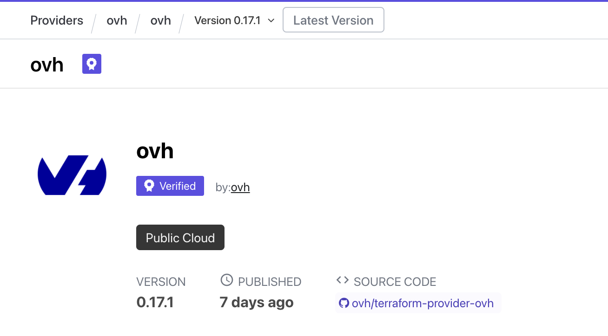
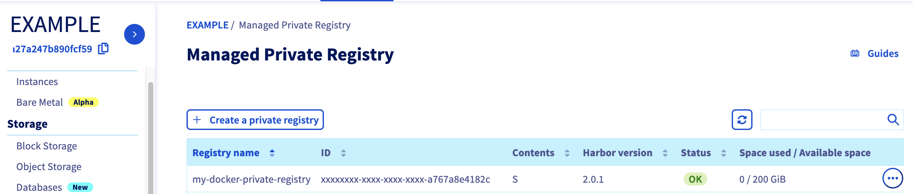

<style>
 pre {
     font-size: 14px;
 }
 pre.console {
   background-color: #300A24;
   color: #ccc;
   font-family: monospace;
   padding: 5px;
   margin-bottom: 5px;
 }
 pre.console code {
   border: solid 0px transparent;
   font-family: monospace !important;
   font-size: 0.75em;
   color: #ccc;
 }
 .small {
     font-size: 0.75em;
 }
</style>

**Last updated 16th August 2022**

## Objective

Creating an OVHcloud Managed Private Registry (Harbor) through the OVHcloud Control Panel is cool but do you know you can deploy a private registry programmatically, with Terraform?

## Terraform

[Terraform](https://www.terraform.io/) is an open-source infrastructure as code (IaC) tool created by [Hashicorp](https://www.hashicorp.com/) in 2014, written in Go. It aims to build, change and version control your infrastructure. You can define and provision your infrastructure by writing the definition of your resources in Hashicorp Configuration Language (HCL).

This tool has a powerful and very intuitive command line interface (CLI).
If you are interested in leveraging your knowledge about Terraform CLI, a [Cheat Sheet](https://github.com/scraly/terraform-cheat-sheet/blob/master/terraform-cheat-sheet.pdf){.external} exists.

## Requirements

- A [Public Cloud project](https://docs.ovh.com/fr/public-cloud/create_a_public_cloud_project/) in your OVHcloud account
- Installing [Terraform CLI](https://www.terraform.io/downloads.html){.external}

## Before you begin

* You should have installed Terraform CLI, version 0.12.x minimum, on your machine. You can install it by following [detailed installation instructions](https://www.terraform.io/docs/cli/index.html){.external} or with the tool [tfenv](https://github.com/tfutils/tfenv){.external}.

## OVHcloud Terraform provider

{.thumbnail}

In order to create a private registry and other resources, OVHcloud provides a [Terraform provider](https://registry.terraform.io/providers/ovh/ovh/latest){.external} which is available in the official Terraform registry.

{.thumbnail}

All available resources and data sources have their definition and documentation.

In this guide, we will create two resources:

* a [ovh_cloud_project_containerregistry](https://registry.terraform.io/providers/ovh/ovh/latest/docs/resources/cloud_project_containerregistry){.external}, that represents an OVHcloud managed private registry
* and a [ovh_cloud_project_containerregistry_user](https://registry.terraform.io/providers/ovh/ovh/latest/docs/resources/cloud_project_containerregistry_user){.external}, that represents a user associated to a private registry

{.thumbnail}

## Getting your cluster/API tokens information

The "OVH provider" needs to be configured with a set of credentials:

* an `application_key`
* an `application_secret`
* a `consumer_key`

Why?

Because, behind the scenes, the "OVH Terraform provider" is doing requests to OVHcloud APIs. 

In order to retrieve this necessary information, please follow the [First steps with the OVHcloud APIs](https://docs.ovh.com/fr/api/first-steps-with-ovh-api/) tutorial.

When you have successfully generated your OVH tokens, please keep them. You'll have to define them in the coming minutes ;-).

The last needed information is the `service_name`: it is the ID of your Public Cloud project.

How to get it?

In the Public Cloud section, you can retrieve your service name ID thanks to the `Copy to clipboard`{.action} button.

{.thumbnail}

You will also use this information in Terraform resources definition files.

## Instructions 

When you want to manage (create, modify, and remove) your infrastructure, getting started with Terraform is easy.
Just create files ending with `.tf` containing the description of the resources you want to have.

In our case, we want to create:

* an OVHcloud Managed Private Registry
* a user attached to the registry

So, let's start!

### Resources definition

First, create a `provider.tf` file with the minimum version, european endpoint ("ovh-eu") and keys you previously got in this guide.

Terraform 0.13 and later:

```
terraform {
  required_providers {
    ovh = {
      source  = "ovh/ovh"
    }
  }
}

provider "ovh" {
  endpoint           = "ovh-eu"
  application_key    = "<your_access_key>"
  application_secret = "<your_application_secret>"
  consumer_key       = "<your_consumer_key>"
}
```

Terraform 0.12 and earlier:

```
# Configure the OVHcloud Provider
provider "ovh" {
  endpoint           = "ovh-eu"
  application_key    = "<your_access_key>"
  application_secret = "<your_application_secret>"
  consumer_key       = "<your_consumer_key>"
}
```

Alternatively the secret keys can be retrieved from your environment.

- `OVH_ENDPOINT`
- `OVH_APPLICATION_KEY`
- `OVH_APPLICATION_SECRET`
- `OVH_CONSUMER_KEY`

This later method (or a similar alternative) is recommended to avoid storing secret data in a source repository.

Here, we defined the `ovh-eu` endpoint because we want to call the OVHcloud Europe API, but other endpoints exist, depending on your needs:

* `ovh-eu` for OVHcloud Europe API
* `ovh-us` for OVHcloud US API
* `ovh-ca` for OVHcloud North-America API

Then, create a `variables.tf` with service_name:

```
variable service_name {
  type        = string
  default     = "<your_service_name>"
}
```

Define the resources you want to create in a new file called `ovh_private_registry.tf`:

```bash
data "ovh_cloud_project_capabilities_containerregistry_filter" "capabilities" {
  service_name = var.service_name
  plan_name    = "SMALL"
  region       = "GRA"
}

resource "ovh_cloud_project_containerregistry" "myregistry" {
  service_name = data.ovh_cloud_project_capabilities_containerregistry_filter.capabilities.service_name
  plan_id      = data.ovh_cloud_project_capabilities_containerregistry_filter.capabilities.id
  region       = data.ovh_cloud_project_capabilities_containerregistry_filter.capabilities.region
  name         = "my-docker-private-registry"
}

resource "ovh_cloud_project_containerregistry_user" "myuser" {
    service_name = ovh_cloud_project_containerregistry.myregistry.service_name
    registry_id  = ovh_cloud_project_containerregistry.myregistry.id
    email        = "my.user@mycompany.com"
    login        = "myuser"
}
```

In this resources configuration, we ask Terraform to create a private registry, in the GRA region and in the small plan.

And we tell Terraform to create a user attached to the registry.

Finally, create a `output.tf` file with the following content:

```
output "registry-url" {
  value = ovh_cloud_project_containerregistry.myregistry.url
}

output "user" {
  value = ovh_cloud_project_containerregistry_user.myuser.user
}

output "password" {
  value = ovh_cloud_project_containerregistry_user.myuser.password
  sensitive = true
}
```

> [!primary]
>
> We specified that the password output is sensitive data, so it will be censored during the `terraform apply` but you can retrieve it with the `terraform output` command as we will show you in this guide.

With this output, we tell Terraform to retrieve the URL of this registry to access to it, moreover the user login and the generated password.

For your information, outputs are useful to retrieve and display specific information after the resources creation.

Your code organisation should be like this: 

```
.
├── output.tf
├── ovh_private_registry.tf
├── provider.tf
└── variables.tf
```

### Create our private registry through Terraform

Now we need to initialize Terraform, generate a plan, and apply it.

```bash
$ terraform init

Initializing the backend...

Initializing provider plugins...
- Reusing previous version of ovh/ovh from the dependency lock file
- Using previously-installed ovh/ovh v0.17.1

Terraform has been successfully initialized!

You may now begin working with Terraform. Try running "terraform plan" to see
any changes that are required for your infrastructure. All Terraform commands
should now work.

If you ever set or change modules or backend configuration for Terraform,
rerun this command to reinitialize your working directory. If you forget, other
commands will detect it and remind you to do so if necessary.
```

The `init` command will initialize your working directory which contains `.tf` configuration files.

It’s the first command to execute for a new configuration, or after doing a checkout of an existing configuration in a given Git repository for example.

The `init` command will:

* Download and install Terraform providers/plugins
* Initialize backend (if defined)
* Download and install modules (if defined)

Now, we can generate our plan:

```bash
$ terraform apply
Terraform used the selected providers to generate the following execution plan. Resource actions are indicated with the following symbols:
  + create

Terraform will perform the following actions:

  # ovh_cloud_project_containerregistry.myregistry will be created
  + resource "ovh_cloud_project_containerregistry" "myregistry" {
      + created_at   = (known after apply)
      + id           = (known after apply)
      + name         = "my-docker-private-registry"
      + plan         = (known after apply)
      + plan_id      = "9f728ba5-xxxx-xxxx-xxxx-497cd8bc6a89"
      + project_id   = (known after apply)
      + region       = "GRA"
      + service_name = "xxxxxxxxxxxxxxxx"
      + size         = (known after apply)
      + status       = (known after apply)
      + updated_at   = (known after apply)
      + url          = (known after apply)
      + version      = (known after apply)
    }

  # ovh_cloud_project_containerregistry_user.myuser will be created
  + resource "ovh_cloud_project_containerregistry_user" "myuser" {
      + email        = "my.user@mycompany.com"
      + id           = (known after apply)
      + login        = "myuser"
      + password     = (sensitive value)
      + registry_id  = (known after apply)
      + service_name = "xxxxxxxxxxxxxxxxxxxxxxxxxxxxxxxx"
      + user         = (known after apply)
    }

Plan: 2 to add, 0 to change, 0 to destroy.

Changes to Outputs:
  + password     = (sensitive value)
  + registry-url = (known after apply)
  + user         = (known after apply)

Do you want to perform these actions?
  Terraform will perform the actions described above.
  Only 'yes' will be accepted to approve.
```

Now you can accept this plan and enter the `yes` command to execute it.

```
  Enter a value: yes

ovh_cloud_project_containerregistry.myregistry: Creating...
ovh_cloud_project_containerregistry.myregistry: Still creating... [10s elapsed]
ovh_cloud_project_containerregistry.myregistry: Still creating... [20s elapsed]
ovh_cloud_project_containerregistry.myregistry: Still creating... [30s elapsed]
ovh_cloud_project_containerregistry.myregistry: Still creating... [40s elapsed]
ovh_cloud_project_containerregistry.myregistry: Still creating... [50s elapsed]
ovh_cloud_project_containerregistry.myregistry: Still creating... [1m0s elapsed]
ovh_cloud_project_containerregistry.myregistry: Still creating... [1m10s elapsed]
ovh_cloud_project_containerregistry.myregistry: Still creating... [1m20s elapsed]
ovh_cloud_project_containerregistry.myregistry: Still creating... [1m30s elapsed]
ovh_cloud_project_containerregistry.myregistry: Still creating... [1m40s elapsed]
ovh_cloud_project_containerregistry.myregistry: Still creating... [1m50s elapsed]
ovh_cloud_project_containerregistry.myregistry: Still creating... [2m0s elapsed]
ovh_cloud_project_containerregistry.myregistry: Still creating... [2m10s elapsed]
ovh_cloud_project_containerregistry.myregistry: Still creating... [2m20s elapsed]
ovh_cloud_project_containerregistry.myregistry: Still creating... [2m30s elapsed]
ovh_cloud_project_containerregistry.myregistry: Still creating... [2m40s elapsed]
ovh_cloud_project_containerregistry.myregistry: Still creating... [2m50s elapsed]
ovh_cloud_project_containerregistry.myregistry: Still creating... [3m0s elapsed]
ovh_cloud_project_containerregistry.myregistry: Creation complete after 3m6s [id=xxxxxxx-xxxx-xxxx-xxxx-xxxxxxxx]
ovh_cloud_project_containerregistry_user.myuser: Creating...
ovh_cloud_project_containerregistry_user.myuser: Creation complete after 2s [id=3]

Apply complete! Resources: 2 added, 0 changed, 0 destroyed.

Outputs:

password = <sensitive>
registry-url = "https://1ab234c5.gra7.container-registry.ovh.net"
user = "myuser"
```

Now, log in to the [OVHcloud Control Panel](https://www.ovh.com/auth/?action=gotomanager&from=https://www.ovh.com/fr/&ovhSubsidiary=fr), go to the `Public Cloud`{.action} section and click on `Managed Private Registry`. <br>
As you can see, your registry has been successfuly created:

{.thumbnail}

## Connect to the private registry

Our registry is created, now we can access to and see the interface/UI of your managed Harbor.

In order to do this, retrieve the necessary information locally:

```
terraform output registry-url
terraform output user
terraform output password
```

You should see the following:

<pre class="console"><code>$ terraform output registry-url
"https://1ab234c5.gra7.container-registry.ovh.net"

$ terraform output user
"myuser"

$ terraform output password
"mygeneratedpassword"
</code></pre>

Now go to the private registry URL and login with the credentials you have retrieved.

## Destroy (cleanup)

If you want to easily destroy created resources, you can use `terraform destroy` command.

```
$ terraform destroy
ovh_cloud_project_containerregistry.myregistry: Refreshing state... [id=xxxxxxxxx-xxxx-xxxx-xxxx-xxxxxxxx]
ovh_cloud_project_containerregistry_user.myuser: Refreshing state... [id=3]

Terraform used the selected providers to generate the following execution plan. Resource actions are indicated with the following symbols:
  - destroy

Terraform will perform the following actions:

  # ovh_cloud_project_containerregistry.myregistry will be destroyed
  - resource "ovh_cloud_project_containerregistry" "myregistry" {
      - created_at   = "2022-04-12T12:34:30.161619Z" -> null
      - id           = "xxxxxxxxx-xxxx-xxxx-xxxx-xxxxxxxx" -> null
      - name         = "my-docker-private-registry" -> null
      - plan         = [
          - {
              - code            = "registry.s-plan-equivalent.hour.consumption"
              - created_at      = "2019-09-13T15:53:33.599585Z"
              - features        = [
                  - {
                      - vulnerability = false
                    },
                ]
              - id              = "xxxxxxxxx-xxxx-xxxx-xxxx-xxxxxxxxx"
              - name            = "SMALL"
              - registry_limits = [
                  - {
                      - image_storage    = 214748364800
                      - parallel_request = 15
                    },
                ]
              - updated_at      = "2021-03-29T10:09:03.960847Z"
            },
        ] -> null
      - plan_id      = "xxxxxxxxx-xxxx-xxxx-xxxx-xxxxxxxxx" -> null
      - region       = "GRA" -> null
      - service_name = "<your_service_name>" -> null
      - size         = 0 -> null
      - status       = "READY" -> null
      - updated_at   = "2022-04-12T12:38:14.564559Z" -> null
      - url          = "https://1ab234c5.gra7.container-registry.ovh.net" -> null
      - version      = "2.0.1" -> null
    }

  # ovh_cloud_project_containerregistry_user.myuser will be destroyed
  - resource "ovh_cloud_project_containerregistry_user" "myuser" {
      - email        = "my.user@mycompany.com" -> null
      - id           = "3" -> null
      - login        = "myuser" -> null
      - password     = (sensitive value)
      - registry_id  = "xxxxxxxxx-xxxx-xxxx-xxxx-xxxxxxxx" -> null
      - service_name = "<your_service_name>" -> null
      - user         = "myuser" -> null
    }

Plan: 0 to add, 0 to change, 2 to destroy.

Changes to Outputs:
  - password     = (sensitive value)
  - registry-url = "https://1ab234c5.gra7.container-registry.ovh.net" -> null
  - user         = "myuser" -> null

Do you really want to destroy all resources?
  Terraform will destroy all your managed infrastructure, as shown above.
  There is no undo. Only 'yes' will be accepted to confirm.

  Enter a value: yes

ovh_cloud_project_containerregistry_user.myuser: Destroying... [id=3]
ovh_cloud_project_containerregistry_user.myuser: Destruction complete after 1s
ovh_cloud_project_containerregistry.myregistry: Destroying... [id=xxxxxxxxx-xxxx-xxxx-xxxx-xxxxxxxx]
ovh_cloud_project_containerregistry.myregistry: Still destroying... [id=xxxxxxxxx-xxxx-xxxx-xxxx-xxxxxxxx, 10s elapsed]
ovh_cloud_project_containerregistry.myregistry: Destruction complete after 11s

Destroy complete! Resources: 2 destroyed.
```

Perfect, your private registry and the user have been destroyed.

## Go further

Join our community of users on <https://community.ovh.com/en/>.
