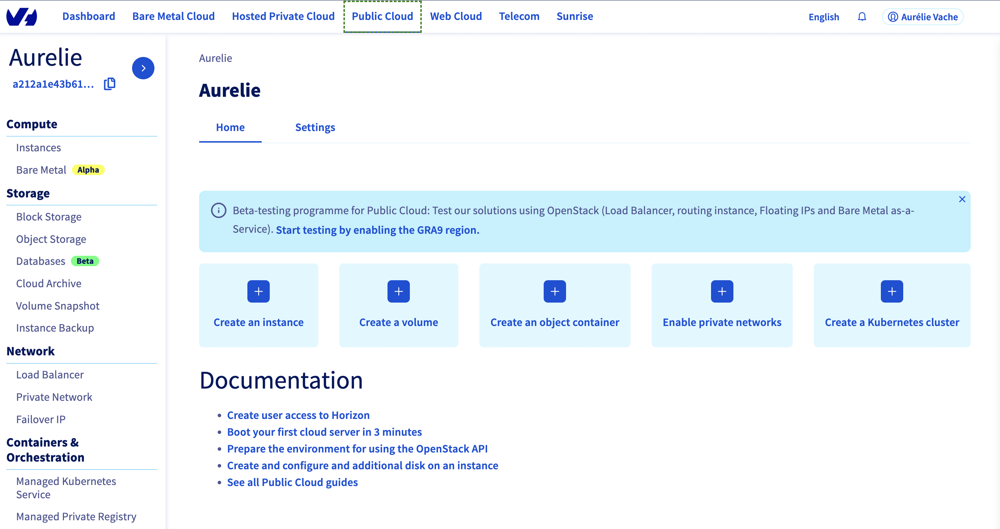
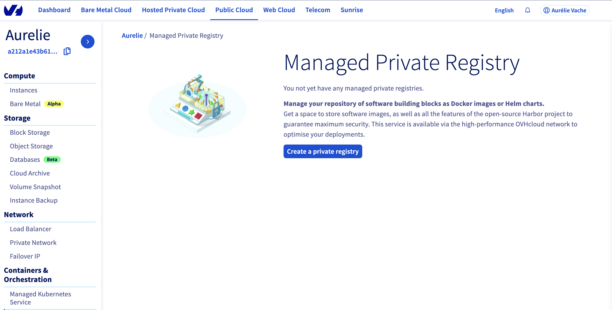
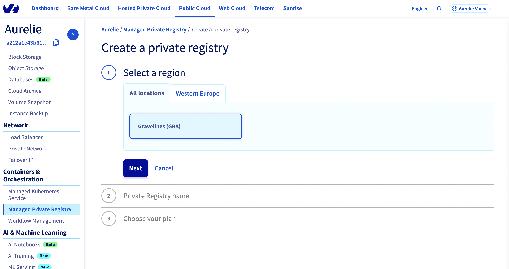
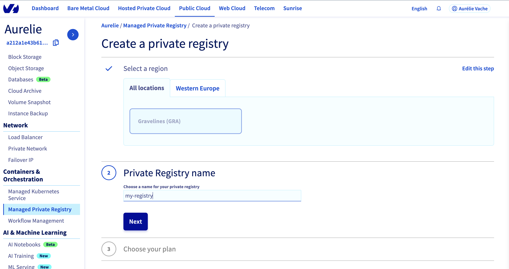
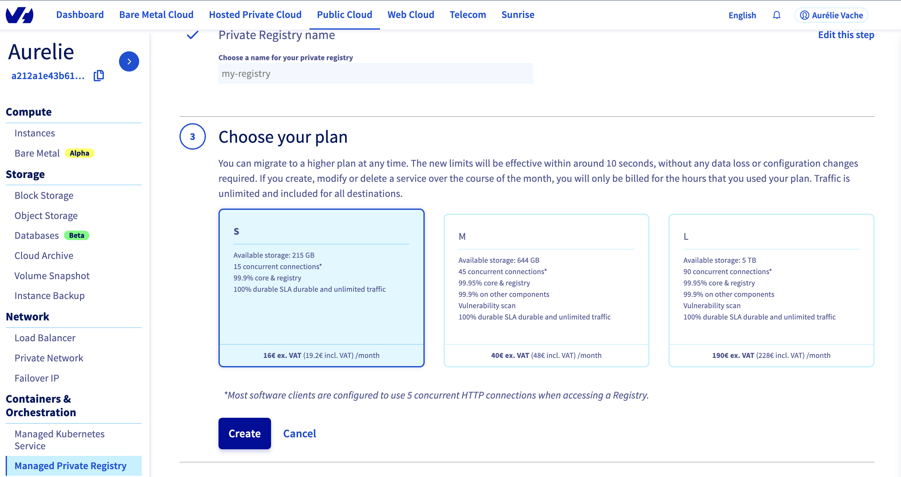
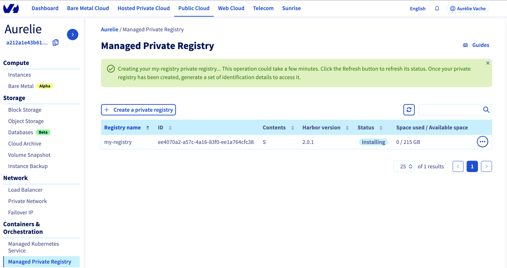
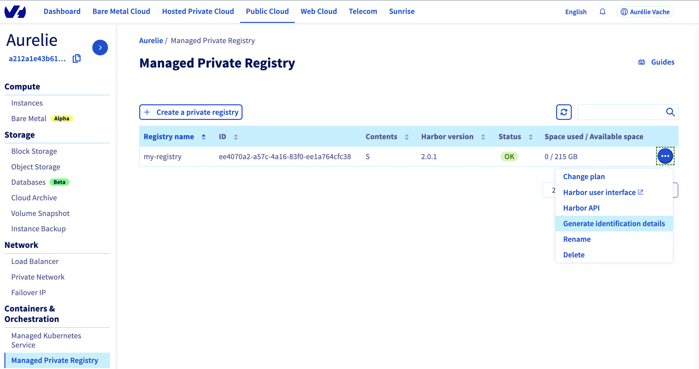
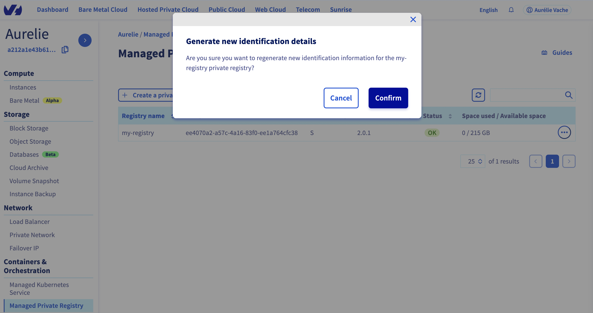
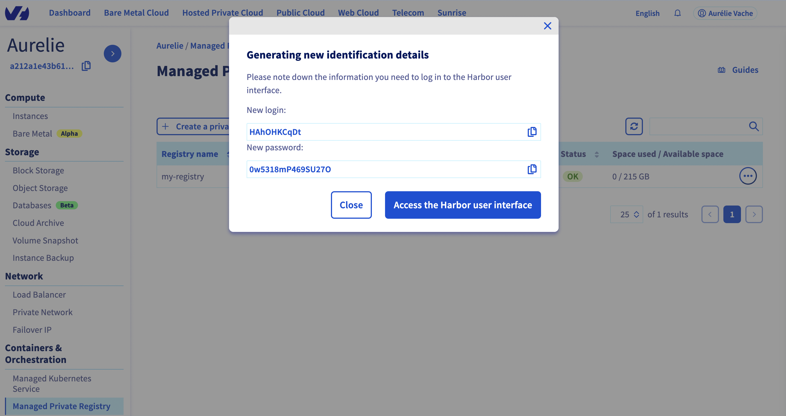

**Last updated 14th April, 2022.**

A Docker Registry is a system that lets you store and distribute your Docker images. The best known Registry is the official [Docker Hub](https://hub.docker.com/){.external}, where you can find official public images such as [Alpine](https://hub.docker.com/_/alpine){.external}, [Golang](https://hub.docker.com/_/golang){.external} or [Debian](https://hub.docker.com/_/debian){.external}.

Today, OVHcloud allows you to spawn your own authenticated Docker Registry where you can privately store your Docker images. This is the best way to use your private images with our OVHcloud Managed Kubernetes Service offer without exposing them to everyone.

## Objective

OVHcloud Managed Private Registry service provides you a managed, authenticated Docker registry where you can privately store your Docker images. This guide will explain how to create your Private Registry.

## Instructions

1. First, log in to the [OVHcloud Control Panel](https://www.ovh.com/auth/?action=gotomanager&from=https://www.ovh.ie/&ovhSubsidiary=ie).

1. In the left menu, in the `Containers & Orchestration`{.action} section, select `Managed Private Registry`{.action}.

    {.thumbnail}

2. Then click on `Create a private registry`{.action}.

    {.thumbnail}

3. In the following menu, choose a region to deploy your private registry in, and click on `Next`{.action}.

    {.thumbnail}

4. Choose the registry name (`my-registry` in my example), and click on `Next`{.action}.

    {.thumbnail}

5. Choose your plan between the three available plans, and click on `Next`{.action}.

    {.thumbnail}

> [!primary]
>
> With the `M` and `L` plan, OVHcloud installs and maintains a vulnerability scanner for you: [Trivy](https://aquasecurity.github.io/trivy/).

6. Your private registry is being created...

    {.thumbnail}

7. When status switches to `OK`, click on the right `...`{.action} button and select `Generate identification details`{.action}.

    {.thumbnail}

8. Then click on `Confirm`{.action} to generate new credentials.

    {.thumbnail}

9. Credentials will be shown on the page. Please write then down, you will need them in order to use your private registry.

    {.thumbnail}

Congratulations, you have now a working OVHcloud Managed Private Registry.

## Go further

To go further you can look at our guide on [connecting to the UI](../connecting-to-the-ui/).
