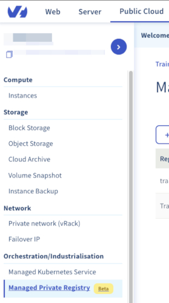
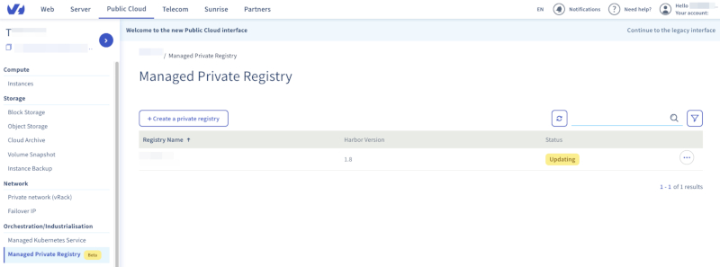
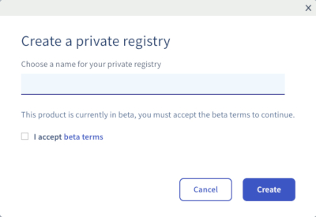
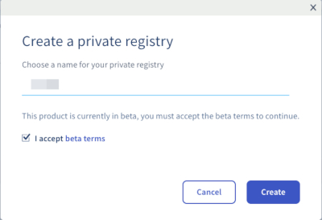
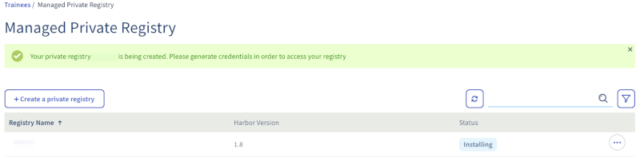
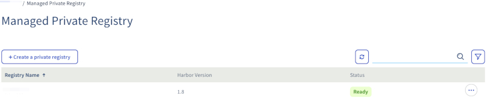
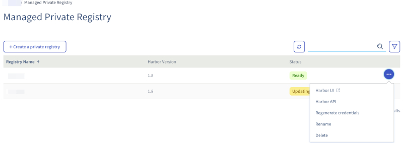
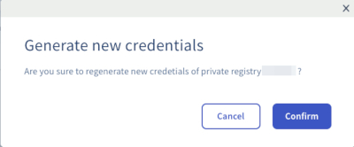
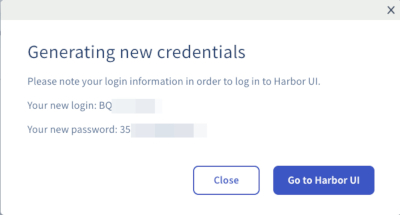

**Last updated 20th January, 2020.**

A Docker Registry is a system that lets you store and distribute your Docker images. The best known Registry is the official [Docker Hub](https://hub.docker.com/){.external}, where you can find official public images such as [Alpine](https://hub.docker.com/_/alpine){.external}, [Golang](https://hub.docker.com/_/golang){.external} or [Debian](https://hub.docker.com/_/debian){.external}.

Today, OVHcloudallows you to spawn your own authenticated Docker Registry where you can privately store your Docker images. This is the best way to use your private images with our OVHcloudManaged Kubernetes Service offer without exposing them to everyone.

## Objective

OVHcloudManaged Private Registry service provides you a managed, authenticated Docker registry where you can privately store your Docker images. This guide will explain how to create your Private Registry.

## Instructions

1. First, log in to the OVHcloudPublic Cloud Manager.

1. In the left menu, in section *Orchestration/Industrialisation*, select *Managed Private Registry*.

    {.thumbnail}

1. Then click on *Create a Private Registry*. During the beta, the private registry is totally free.

    {.thumbnail}

1. In the pop-up *Create a private registry*, write a name for your private registry and read and accept the beta terms.

    {.thumbnail}

1. So let's write `yourname-registry`, then tick the box to accept beta terms and click then on the blue button *Create*.

    {.thumbnail}

1. Your private registry is being created...

    {.thumbnail}

1. When status switches to *Ready*. click on the right end button...

    {.thumbnail}

1. And select *Regenerate credentials*

    {.thumbnail}

1. Then confirm to generate new credentials    

    {.thumbnail}

1. Credential will be shown on the page. Please write then down, you will need them in order to use your private registry

    {.thumbnail}

Congratulations, you have now a working OVHcloud Managed Private Registry

## Go further

To go further you can look at our guide on [Connecting to the UI](../connecting-to-the-ui/).
