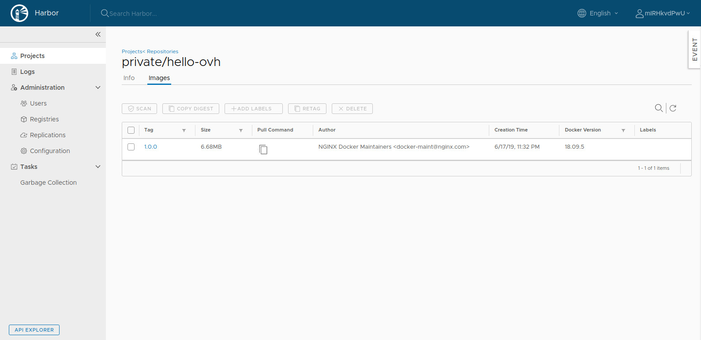
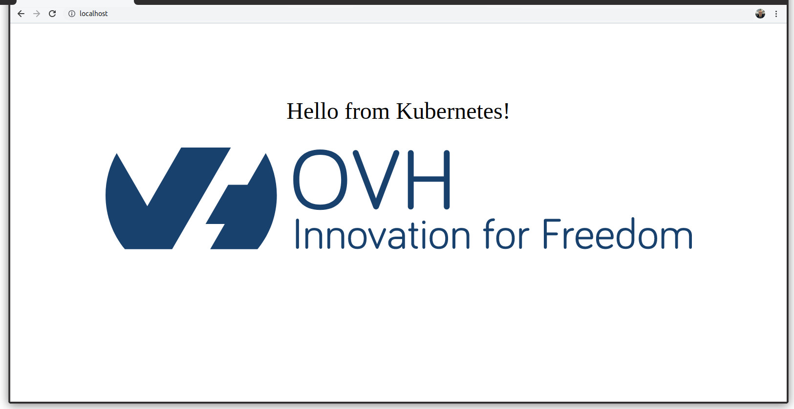

**Last updated 20<sup>th</sup> January, 2020.**

<style>
 pre {
     font-size: 14px;
 }
 pre.console {
   background-color: #300A24; 
   color: #ccc;
   font-family: monospace;
   padding: 5px;
   margin-bottom: 5px;
 }
 pre.console code {
   border: solid 0px transparent;
   color: #ccc;
   font-family: monospace !important;
   font-size: 0.75em;
 }
 .small {
     font-size: 0.75em;
 }
</style>


## Objective

OVHcloud Managed Private Registry service provides you a managed, authenticated Docker registry where you can privately store your Docker images. This guide will explain how create a Docker image, store it in the OVHcloud Managed Private Registry service and using it from a Docker client.


## Requirements

- An OVHcloud Managed Private Registry (see the [creating a private registry](../creating-a-private-registry/) guide for more information)
- An access to the Harbor UI to operate the private registry (see the [connecting to the UI](../connecting-to-the-ui/) guide for more information)
- A private project and an user with the right to read and write on the project (see the [managing users and projects](../managing-users-and-projects/) guide for more information)


## Instructions

### Get your OVHcloud Managed Private Registry API URL

Go to your private registry section on the OVHcloud Public Cloud Manager, and in the *more options* (*...*) button at the right, click on API Harbor.

{.thumbnail}

Copy the URL of the API Harbor, it's the URL of your private registry and we are going to use it several times in this guide.

> In fact when you click to copy button as mentioned by an hand icon in the image, the copied string begins with `https://`. Please remove the `https://` part.

{.thumbnail}


### Creating a Docker image

You're going to create a Docker image using the a very simple Dockerfile and some resource files.
create a `hello-ovh` folder and inside create:

- A `Dockerfile` file:

    ```Dockerfile
    FROM nginx:1.15-alpine

    COPY index.html /usr/share/nginx/html/index.html
    COPY ovh.svg /usr/share/nginx/html/ovh.svg
    ```

- A `index.html` file:

    ```HTML
    <!doctype html>
    <html>
      <head>
        <title>OVHcloud K8S</title>
        <style>
          .title {
          font-size: 3em;
          padding: 2em;
          text-align: center;
          }
        </style>
      </head>
      <body>
        <div class="title">
          <p>Hello from Kubernetes!</p>
          
        </div>
      </body>
    </html>
    ```

- A `ovh.svg` file (right click and save it):

    <img src="data:image/svg+xml;base64,PD94bWwgdmVyc2lvbj0iMS4wIiBlbmNvZGluZz0iVVRGLTgiPz4KPHN2ZyB3aWR0aD0iMTIwMHB4IiBoZWlnaHQ9IjIwOXB4IiB2aWV3Qm94PSIwIDAgMTIwMCAyMDkiIHZlcnNpb249IjEuMSIgeG1sbnM9Imh0dHA6Ly93d3cudzMub3JnLzIwMDAvc3ZnIiB4bWxuczp4bGluaz0iaHR0cDovL3d3dy53My5vcmcvMTk5OS94bGluayI+CiAgICA8IS0tIEdlbmVyYXRvcjogU2tldGNoIDUxLjIgKDU3NTE5KSAtIGh0dHA6Ly93d3cuYm9oZW1pYW5jb2RpbmcuY29tL3NrZXRjaCAtLT4KICAgIDx0aXRsZT5sb2dvL292aC9iYXNlbGluZS9CcmFuZENvbG9yPC90aXRsZT4KICAgIDxkZXNjPkNyZWF0ZWQgd2l0aCBTa2V0Y2guPC9kZXNjPgogICAgPGRlZnM+PC9kZWZzPgogICAgPGcgaWQ9ImxvZ28vb3ZoL2Jhc2VsaW5lL0JyYW5kQ29sb3IiIHN0cm9rZT0ibm9uZSIgc3Ryb2tlLXdpZHRoPSIxIiBmaWxsPSJub25lIiBmaWxsLXJ1bGU9ImV2ZW5vZGQiPgogICAgICAgIDxnIGlkPSJCcmFuZENvbG9yIiBmaWxsPSIjMTEzRjZEIiBmaWxsLXJ1bGU9Im5vbnplcm8iPgogICAgICAgICAgICA8ZyBpZD0iU2lnbGUiPgogICAgICAgICAgICAgICAgPHBhdGggZD0iTTMyNy44LDExLjYgTDI5MC40LDc2LjYgTDI1MS4xLDc2LjYgTDIwNC43LDE1Ny4xIEwyNDQsMTU3LjEgTDIxNC4yLDIwOC44IEwzMTEsMjA4LjggQzMzNS43LDE3OC42IDM1MC42LDE0MCAzNTAuNiw5Ny45IEMzNTAuNSw2Ni41IDM0Mi4yLDM3IDMyNy44LDExLjYgWiIgaWQ9IlNoYXBlIj48L3BhdGg+CiAgICAgICAgICAgICAgICA8cGF0aCBkPSJNMTM2LjMsMjA4LjggTDI1Ni41LDAgTDE1NC44LDAgTDg1LjUsMTIwLjQgTDIyLjgsMTEuNCBDOC4zLDM3IDAsNjYuNCAwLDk3LjkgQzAsMTQwIDE0LjgsMTc4LjYgMzkuNiwyMDguOCBMMTM2LjMsMjA4LjggWiIgaWQ9IlNoYXBlIj48L3BhdGg+CiAgICAgICAgICAgIDwvZz4KICAgICAgICAgICAgPGcgaWQ9IlR5cG9ncmFwaHkiIHRyYW5zZm9ybT0idHJhbnNsYXRlKDM4NC4wMDAwMDAsIDQuMDAwMDAwKSI+CiAgICAgICAgICAgICAgICA8cGF0aCBkPSJNMC4yLDYyLjMgQzAuMiwyMC4zIDIxLjEsMC4xIDU1LjQsMC4xIEM4OS44LDAuMSAxMTAuNiwyMC4zIDExMC42LDYyLjMgQzExMC42LDEwMy45IDg5LjcsMTI0LjMgNTUuNCwxMjQuMyBDMjEuMSwxMjQuMyAwLjIsMTAzLjkgMC4yLDYyLjMgWiBNMTIuNiw2Mi4zIEMxMi42LDk2LjggMjguNCwxMTMuMyA1NS40LDExMy4zIEM4Mi41LDExMy4zIDk4LjIsOTYuOCA5OC4yLDYyLjMgQzk4LjIsMjcuNiA4Mi40LDExLjEgNTUuNCwxMS4xIEMyOC40LDExLjEgMTIuNiwyNy42IDEyLjYsNjIuMyBaIiBpZD0iU2hhcGUiPjwvcGF0aD4KICAgICAgICAgICAgICAgIDxwYXRoIGQ9Ik0yMDUuNSw1LjEgQzIwNiwzLjcgMjA3LjgsMS4yIDIxMS4yLDEuMiBDMjE0LjYsMS4yIDIxNy4yLDMuOSAyMTcuMiw3LjIgQzIxNy4yLDguMyAyMTYuOCw5LjMgMjE2LjcsOS45IEwxNzUuMywxMTkuMSBDMTc0LjQsMTIxLjYgMTcxLjksMTIzLjIgMTY5LjYsMTIzLjIgQzE2Ny4zLDEyMy4yIDE2NC44LDEyMS42IDE2My45LDExOS4xIEwxMjIuNCw5LjkgQzEyMi4yLDkuNCAxMjEuOSw4LjMgMTIxLjksNy4yIEMxMjEuOSwzLjggMTI0LjYsMS4yIDEyNy45LDEuMiBDMTMxLjMsMS4yIDEzMywzLjcgMTMzLjYsNS4xIEwxNjkuNSwxMDAuNCBMMjA1LjUsNS4xIFoiIGlkPSJTaGFwZSI+PC9wYXRoPgogICAgICAgICAgICAgICAgPHBhdGggZD0iTTI0Ni43LDY2LjIgTDI0Ni43LDExNy4yIEMyNDYuNywxMjAuNCAyNDQsMTIzLjIgMjQwLjcsMTIzLjIgQzIzNy40LDEyMy4yIDIzNC43LDEyMC40IDIzNC43LDExNy4yIEwyMzQuNyw3LjIgQzIzNC43LDQgMjM3LjQsMS4yIDI0MC43LDEuMiBDMjQ0LDEuMiAyNDYuNyw0IDI0Ni43LDcuMiBMMjQ2LjcsNTUuMiBMMzA4LjMsNTUuMiBMMzA4LjMsNy4yIEMzMDguMyw0IDMxMSwxLjIgMzE0LjMsMS4yIEMzMTcuNywxLjIgMzIwLjMsNCAzMjAuMyw3LjIgTDMyMC4zLDExNy4yIEMzMjAuMywxMjAuNCAzMTcuNiwxMjMuMiAzMTQuMywxMjMuMiBDMzEwLjksMTIzLjIgMzA4LjMsMTIwLjQgMzA4LjMsMTE3LjIgTDMwOC4zLDY2LjIgTDI0Ni43LDY2LjIgWiIgaWQ9IlNoYXBlIj48L3BhdGg+CiAgICAgICAgICAgIDwvZz4KICAgICAgICAgICAgPGcgaWQ9IkJhc2VsaW5lIiB0cmFuc2Zvcm09InRyYW5zbGF0ZSgzODkuMDAwMDAwLCAxNDMuMDAwMDAwKSI+CiAgICAgICAgICAgICAgICA8cGF0aCBkPSJNNi45LDYxLjkgQzYuOSw2My41IDUuNSw2NSAzLjgsNjUgQzIuMSw2NSAwLjcsNjMuNiAwLjcsNjEuOSBMMC43LDYgQzAuNyw0LjQgMi4xLDIuOSAzLjgsMi45IEM1LjUsMi45IDYuOSw0LjMgNi45LDYgTDYuOSw2MS45IFoiIGlkPSJTaGFwZSI+PC9wYXRoPgogICAgICAgICAgICAgICAgPHBhdGggZD0iTTU0LjMsMzggTDU0LjMsNjIuMSBDNTQuMyw2My43IDUzLDY1IDUxLjQsNjUgQzQ5LjgsNjUgNDguNSw2My43IDQ4LjUsNjIuMSBMNDguNSwzOS4yIEM0OC41LDMyLjEgNDYuNCwyNy4yIDM3LjcsMjcuMiBDMjguOCwyNy4yIDI1LjcsMzIuNiAyNS43LDM5LjggTDI1LjcsNjIuMSBDMjUuNyw2My43IDI0LjQsNjUgMjIuOCw2NSBDMjEuMiw2NSAxOS45LDYzLjcgMTkuOSw2Mi4xIEwxOS45LDI1LjUgQzE5LjksMjMuOSAyMS4yLDIyLjYgMjIuOCwyMi42IEMyNC40LDIyLjYgMjUuNywyMy45IDI1LjcsMjUuNSBMMjUuNywyOC40IEMyNy40LDI1IDMxLjgsMjIuMSAzNy43LDIyLjEgQzUxLjYsMjIuMSA1NC4zLDMwLjQgNTQuMywzOCBaIiBpZD0iU2hhcGUiPjwvcGF0aD4KICAgICAgICAgICAgICAgIDxwYXRoIGQ9Ik05OS40LDM4IEw5OS40LDYyLjEgQzk5LjQsNjMuNyA5OC4xLDY1IDk2LjUsNjUgQzk0LjksNjUgOTMuNiw2My43IDkzLjYsNjIuMSBMOTMuNiwzOS4yIEM5My42LDMyLjEgOTEuNSwyNy4yIDgyLjgsMjcuMiBDNzMuOSwyNy4yIDcwLjgsMzIuNiA3MC44LDM5LjggTDcwLjgsNjIuMSBDNzAuOCw2My43IDY5LjUsNjUgNjcuOSw2NSBDNjYuMyw2NSA2NSw2My43IDY1LDYyLjEgTDY1LDI1LjUgQzY1LDIzLjkgNjYuMywyMi42IDY3LjksMjIuNiBDNjkuNSwyMi42IDcwLjgsMjMuOSA3MC44LDI1LjUgTDcwLjgsMjguNCBDNzIuNSwyNSA3Ni45LDIyLjEgODIuOCwyMi4xIEM5Ni43LDIyLjEgOTkuNCwzMC40IDk5LjQsMzggWiIgaWQ9IlNoYXBlIj48L3BhdGg+CiAgICAgICAgICAgICAgICA8cGF0aCBkPSJNMTQ1LjMsNDMuNyBDMTQ1LjMsNTguNSAxMzguMSw2NS40IDEyNi40LDY1LjQgQzExNC44LDY1LjQgMTA3LjUsNTguNSAxMDcuNSw0My43IEMxMDcuNSwyOC45IDExNC44LDIyLjEgMTI2LjQsMjIuMSBDMTM4LjEsMjIuMSAxNDUuMywyOC45IDE0NS4zLDQzLjcgWiBNMTM5LjUsNDMuNyBDMTM5LjUsMzIuNCAxMzQuNywyNy4zIDEyNi40LDI3LjMgQzExOC4xLDI3LjMgMTEzLjMsMzIuMyAxMTMuMyw0My43IEMxMTMuMyw1NS4yIDExOC4xLDYwLjIgMTI2LjQsNjAuMiBDMTM0LjcsNjAuMiAxMzkuNSw1NS4yIDEzOS41LDQzLjcgWiIgaWQ9IlNoYXBlIj48L3BhdGg+CiAgICAgICAgICAgICAgICA8cGF0aCBkPSJNMTY0LjEsNjMuMiBMMTQ4LjgsMjYuOCBDMTQ4LjcsMjYuNSAxNDguNSwyNi4yIDE0OC41LDI1LjUgQzE0OC41LDIzLjkgMTQ5LjgsMjIuNiAxNTEuNCwyMi42IEMxNTMsMjIuNiAxNTMuNywyMy42IDE1NC4xLDI0LjUgTDE2Ni44LDU1LjYgTDE3OS41LDI0LjUgQzE3OS45LDIzLjYgMTgwLjYsMjIuNiAxODIuMiwyMi42IEMxODMuOCwyMi42IDE4NS4xLDIzLjkgMTg1LjEsMjUuNSBDMTg1LjEsMjYuMSAxODQuOSwyNi41IDE4NC44LDI2LjggTDE2OS41LDYzLjIgQzE2OSw2NC40IDE2OCw2NSAxNjYuOCw2NSBDMTY1LjcsNjUgMTY0LjcsNjQuMyAxNjQuMSw2My4yIFoiIGlkPSJTaGFwZSI+PC9wYXRoPgogICAgICAgICAgICAgICAgPHBhdGggZD0iTTE5NywzMi4xIEMxOTYuMSwzMy4xIDE5NS41LDMzLjQgMTk0LjcsMzMuNCBDMTkzLjMsMzMuNCAxOTIuMSwzMi4yIDE5Mi4xLDMwLjggQzE5Mi4xLDMwLjIgMTkyLjMsMjkuNyAxOTIuNSwyOS4zIEMxOTUsMjUuMyAxOTkuOSwyMi4yIDIwNy41LDIyLjIgQzIxNy45LDIyLjIgMjIzLjcsMjguMyAyMjMuNywzNy41IEwyMjMuNyw2Mi4zIEMyMjMuNyw2My44IDIyMi40LDY1LjEgMjIwLjksNjUuMSBDMjE5LjQsNjUuMSAyMTguMSw2My44IDIxOC4xLDYyLjMgTDIxOC4xLDU5LjEgQzIxNS44LDYzLjMgMjEwLjYsNjUuNiAyMDUuMiw2NS42IEMxOTUuNiw2NS42IDE4OS42LDYxIDE4OS42LDUyLjcgQzE4OS42LDQ0LjggMTk1LjYsNDAgMjA1LjQsNDAgTDIxOC4xLDQwIEwyMTguMSwzNy42IEMyMTguMSwzMS41IDIxNCwyNy43IDIwNy41LDI3LjcgQzIwMi43LDI3LjUgMTk5LjgsMjguOSAxOTcsMzIuMSBaIE0yMTguMSw0OC43IEwyMTguMSw0NC45IEwyMDUuNCw0NC45IEMxOTkuNSw0NC45IDE5NS41LDQ3LjMgMTk1LjUsNTIuNiBDMTk1LjUsNTcuMyAxOTguNyw2MC4zIDIwNS44LDYwLjMgQzIxMi4xLDYwLjIgMjE4LjEsNTYuMyAyMTguMSw0OC43IFoiIGlkPSJTaGFwZSI+PC9wYXRoPgogICAgICAgICAgICAgICAgPHBhdGggZD0iTTIzNi43LDEzLjkgQzIzNi43LDEyLjQgMjM4LjEsMTEgMjM5LjYsMTEgQzI0MS4yLDExIDI0Mi41LDEyLjQgMjQyLjUsMTMuOSBMMjQyLjUsMjMuNCBMMjQ4LjQsMjMuNCBDMjQ5LjksMjMuNCAyNTEuMSwyNC42IDI1MS4xLDI2LjEgQzI1MS4xLDI3LjYgMjQ5LjksMjguOCAyNDguNCwyOC44IEwyNDIuNSwyOC44IEwyNDIuNSw1My43IEMyNDIuNSw1Ny42IDI0NC43LDU5LjYgMjQ3LjcsNTkuNiBDMjQ5LjIsNTkuNiAyNTAuNSw2MC44IDI1MC41LDYyLjMgQzI1MC41LDYzLjggMjQ5LjIsNjUgMjQ3LjcsNjUgQzI0MC42LDY1IDIzNi43LDYwLjIgMjM2LjcsNTMuNiBMMjM2LjcsMjguNyBMMjMzLjIsMjguNyBDMjMxLjcsMjguNyAyMzAuNSwyNy41IDIzMC41LDI2IEMyMzAuNSwyNC41IDIzMS43LDIzLjMgMjMzLjIsMjMuMyBMMjM2LjcsMjMuMyBMMjM2LjcsMTMuOSBaIiBpZD0iU2hhcGUiPjwvcGF0aD4KICAgICAgICAgICAgICAgIDxwYXRoIGQ9Ik0yNTksMTAuNyBDMjU5LDguMSAyNjAuMyw3LjEgMjYyLjQsNy4xIEMyNjQuNiw3LjEgMjY1LjgsOC4xIDI2NS44LDEwLjcgQzI2NS44LDEyLjkgMjY0LjUsMTQuMSAyNjIuNCwxNC4xIEMyNjAuMywxNC4yIDI1OSwxMi45IDI1OSwxMC43IFogTTI2NS4zLDYyLjEgQzI2NS4zLDYzLjcgMjY0LDY1IDI2Mi40LDY1IEMyNjAuOCw2NSAyNTkuNSw2My43IDI1OS41LDYyLjEgTDI1OS41LDI1LjUgQzI1OS41LDIzLjkgMjYwLjgsMjIuNiAyNjIuNCwyMi42IEMyNjQsMjIuNiAyNjUuMywyMy45IDI2NS4zLDI1LjUgTDI2NS4zLDYyLjEgWiIgaWQ9IlNoYXBlIj48L3BhdGg+CiAgICAgICAgICAgICAgICA8cGF0aCBkPSJNMzEyLjEsNDMuNyBDMzEyLjEsNTguNSAzMDQuOSw2NS40IDI5My4yLDY1LjQgQzI4MS42LDY1LjQgMjc0LjMsNTguNSAyNzQuMyw0My43IEMyNzQuMywyOC45IDI4MS42LDIyLjEgMjkzLjIsMjIuMSBDMzA0LjksMjIuMSAzMTIuMSwyOC45IDMxMi4xLDQzLjcgWiBNMzA2LjMsNDMuNyBDMzA2LjMsMzIuNCAzMDEuNSwyNy4zIDI5My4yLDI3LjMgQzI4NC45LDI3LjMgMjgwLjEsMzIuMyAyODAuMSw0My43IEMyODAuMSw1NS4yIDI4NC45LDYwLjIgMjkzLjIsNjAuMiBDMzAxLjUsNjAuMiAzMDYuMyw1NS4yIDMwNi4zLDQzLjcgWiIgaWQ9IlNoYXBlIj48L3BhdGg+CiAgICAgICAgICAgICAgICA8cGF0aCBkPSJNMzU1LjUsMzggTDM1NS41LDYyLjEgQzM1NS41LDYzLjcgMzU0LjIsNjUgMzUyLjYsNjUgQzM1MSw2NSAzNDkuNyw2My43IDM0OS43LDYyLjEgTDM0OS43LDM5LjIgQzM0OS43LDMyLjEgMzQ3LjYsMjcuMiAzMzguOSwyNy4yIEMzMzAsMjcuMiAzMjYuOSwzMi42IDMyNi45LDM5LjggTDMyNi45LDYyLjEgQzMyNi45LDYzLjcgMzI1LjYsNjUgMzI0LDY1IEMzMjIuNCw2NSAzMjEuMSw2My43IDMyMS4xLDYyLjEgTDMyMS4xLDI1LjUgQzMyMS4xLDIzLjkgMzIyLjQsMjIuNiAzMjQsMjIuNiBDMzI1LjYsMjIuNiAzMjYuOSwyMy45IDMyNi45LDI1LjUgTDMyNi45LDI4LjQgQzMyOC42LDI1IDMzMywyMi4xIDMzOC45LDIyLjEgQzM1Mi44LDIyLjEgMzU1LjUsMzAuNCAzNTUuNSwzOCBaIiBpZD0iU2hhcGUiPjwvcGF0aD4KICAgICAgICAgICAgICAgIDxwYXRoIGQ9Ik0zODYuNSwyOC44IEMzODUsMjguOCAzODMuOCwyNy42IDM4My44LDI2LjEgQzM4My44LDI0LjYgMzg1LDIzLjQgMzg2LjUsMjMuNCBMMzg5LjYsMjMuNCBMMzg5LjYsMTggQzM4OS42LDkuOSAzOTQuMiwyLjUgNDA1LjIsMi41IEM0MDYuNywyLjUgNDA3LjksMy43IDQwNy45LDUuMiBDNDA3LjksNi43IDQwNi43LDcuOSA0MDUuMiw3LjkgQzM5OC4yLDcuOSAzOTUuNCwxMi4xIDM5NS40LDE4IEwzOTUuNCwyMy4zIEw0MDMuNiwyMy4zIEM0MDUuMSwyMy4zIDQwNi4zLDI0LjUgNDA2LjMsMjYgQzQwNi4zLDI3LjUgNDA1LjEsMjguNyA0MDMuNiwyOC43IEwzOTUuNCwyOC43IEwzOTUuNCw2MiBDMzk1LjQsNjMuNiAzOTQuMSw2NC45IDM5Mi41LDY0LjkgQzM5MC45LDY0LjkgMzg5LjYsNjMuNiAzODkuNiw2MiBMMzg5LjYsMjguNyBMMzg2LjUsMjguNyBMMzg2LjUsMjguOCBaIiBpZD0iU2hhcGUiPjwvcGF0aD4KICAgICAgICAgICAgICAgIDxwYXRoIGQ9Ik00NDguNCw0My43IEM0NDguNCw1OC41IDQ0MS4yLDY1LjQgNDI5LjUsNjUuNCBDNDE3LjksNjUuNCA0MTAuNiw1OC41IDQxMC42LDQzLjcgQzQxMC42LDI4LjkgNDE3LjksMjIuMSA0MjkuNSwyMi4xIEM0NDEuMiwyMi4xIDQ0OC40LDI4LjkgNDQ4LjQsNDMuNyBaIE00NDIuNiw0My43IEM0NDIuNiwzMi40IDQzNy44LDI3LjMgNDI5LjUsMjcuMyBDNDIxLjIsMjcuMyA0MTYuNCwzMi4zIDQxNi40LDQzLjcgQzQxNi40LDU1LjIgNDIxLjIsNjAuMiA0MjkuNSw2MC4yIEM0MzcuOCw2MC4yIDQ0Mi42LDU1LjIgNDQyLjYsNDMuNyBaIiBpZD0iU2hhcGUiPjwvcGF0aD4KICAgICAgICAgICAgICAgIDxwYXRoIGQ9Ik00NjMuMiwyOS41IEM0NjUsMjUuNCA0NjkuNSwyMi4zIDQ3NS43LDIyLjMgQzQ3Ny4yLDIyLjMgNDc4LjUsMjMuNiA0NzguNSwyNS4xIEM0NzguNSwyNi42IDQ3Ny4yLDI3LjkgNDc1LjcsMjcuOSBDNDY3LjQsMjcuOSA0NjMuMiwzMy43IDQ2My4yLDQyIEw0NjMuMiw2Mi4yIEM0NjMuMiw2My44IDQ2MS45LDY1LjEgNDYwLjMsNjUuMSBDNDU4LjcsNjUuMSA0NTcuNCw2My44IDQ1Ny40LDYyLjIgTDQ1Ny40LDI1LjYgQzQ1Ny40LDI0IDQ1OC43LDIyLjcgNDYwLjMsMjIuNyBDNDYxLjksMjIuNyA0NjMuMiwyNCA0NjMuMiwyNS42IEw0NjMuMiwyOS41IFoiIGlkPSJTaGFwZSI+PC9wYXRoPgogICAgICAgICAgICAgICAgPHBhdGggZD0iTTUxNC4yLDYxLjkgQzUxNC4yLDYzLjYgNTEyLjgsNjUgNTExLjEsNjUgQzUwOS40LDY1IDUwOCw2My42IDUwOCw2MS45IEw1MDgsNi43IEM1MDgsNSA1MDkuNCwzLjYgNTExLjEsMy42IEw1NDAsMy42IEM1NDEuNSwzLjYgNTQyLjgsNC45IDU0Mi44LDYuNCBDNTQyLjgsNy45IDU0MS41LDkuMiA1NDAsOS4yIEw1MTQuMSw5LjIgTDUxNC4xLDMxLjYgTDUzNCwzMS42IEM1MzUuNSwzMS42IDUzNi44LDMyLjkgNTM2LjgsMzQuNCBDNTM2LjgsMzUuOSA1MzUuNSwzNy4yIDUzNCwzNy4yIEw1MTQuMiwzNy4yIEw1MTQuMiw2MS45IFoiIGlkPSJTaGFwZSI+PC9wYXRoPgogICAgICAgICAgICAgICAgPHBhdGggZD0iTTU1NC42LDI5LjUgQzU1Ni40LDI1LjQgNTYwLjksMjIuMyA1NjcuMSwyMi4zIEM1NjguNiwyMi4zIDU2OS45LDIzLjYgNTY5LjksMjUuMSBDNTY5LjksMjYuNiA1NjguNiwyNy45IDU2Ny4xLDI3LjkgQzU1OC44LDI3LjkgNTU0LjYsMzMuNyA1NTQuNiw0MiBMNTU0LjYsNjIuMiBDNTU0LjYsNjMuOCA1NTMuMyw2NS4xIDU1MS43LDY1LjEgQzU1MC4xLDY1LjEgNTQ4LjgsNjMuOCA1NDguOCw2Mi4yIEw1NDguOCwyNS42IEM1NDguOCwyNCA1NTAuMSwyMi43IDU1MS43LDIyLjcgQzU1My4zLDIyLjcgNTU0LjYsMjQgNTU0LjYsMjUuNiBMNTU0LjYsMjkuNSBaIiBpZD0iU2hhcGUiPjwvcGF0aD4KICAgICAgICAgICAgICAgIDxwYXRoIGQ9Ik01OTEuNywyMi4xIEM2MDYuMSwyMi4xIDYwOC45LDMzLjUgNjA4LjksMzkuNyBDNjA4LjksNDIuMyA2MDguOSw0NS41IDYwNS4zLDQ1LjUgTDU3OSw0NS41IEM1NzksNTQuNCA1ODQuMSw2MC4yIDU5Mi42LDYwLjIgQzU5Ny44LDYwLjIgNjAwLjksNTguMiA2MDMuNCw1Ni4zIEM2MDMuOSw1NS45IDYwNC4zLDU1LjggNjA1LDU1LjggQzYwNi40LDU1LjggNjA3LjYsNTcgNjA3LjYsNTguNCBDNjA3LjYsNTkuNCA2MDcuMSw1OS45IDYwNi42LDYwLjUgQzYwNS4yLDYxLjkgNjAwLjYsNjUuNSA1OTIuNSw2NS41IEM1ODAuNSw2NS41IDU3Myw1OC45IDU3Myw0My44IEM1NzMuMSwyOS44IDU3OS45LDIyLjEgNTkxLjcsMjIuMSBaIE01OTEuNywyNy4zIEM1ODMuOSwyNy4zIDU3OS41LDMyLjMgNTc5LDQwLjQgTDYwMy4yLDQwLjQgQzYwMy4yLDMzLjkgNjAwLjksMjcuMyA1OTEuNywyNy4zIFoiIGlkPSJTaGFwZSI+PC9wYXRoPgogICAgICAgICAgICAgICAgPHBhdGggZD0iTTYzMy42LDIyLjEgQzY0OCwyMi4xIDY1MC44LDMzLjUgNjUwLjgsMzkuNyBDNjUwLjgsNDIuMyA2NTAuOCw0NS41IDY0Ny4yLDQ1LjUgTDYyMC45LDQ1LjUgQzYyMC45LDU0LjQgNjI2LDYwLjIgNjM0LjUsNjAuMiBDNjM5LjcsNjAuMiA2NDIuOCw1OC4yIDY0NS4zLDU2LjMgQzY0NS44LDU1LjkgNjQ2LjIsNTUuOCA2NDYuOSw1NS44IEM2NDguMyw1NS44IDY0OS41LDU3IDY0OS41LDU4LjQgQzY0OS41LDU5LjQgNjQ5LjEsNTkuOSA2NDguNSw2MC41IEM2NDcuMiw2MS45IDY0Mi41LDY1LjUgNjM0LjQsNjUuNSBDNjIyLjQsNjUuNSA2MTQuOSw1OC45IDYxNC45LDQzLjggQzYxNS4xLDI5LjggNjIxLjksMjIuMSA2MzMuNiwyMi4xIFogTTYzMy42LDI3LjMgQzYyNS44LDI3LjMgNjIxLjQsMzIuMyA2MjAuOSw0MC40IEw2NDUuMSw0MC40IEM2NDUuMiwzMy45IDY0Mi45LDI3LjMgNjMzLjYsMjcuMyBaIiBpZD0iU2hhcGUiPjwvcGF0aD4KICAgICAgICAgICAgICAgIDxwYXRoIGQ9Ik02ODcuNCwyNy45IEw2ODcuNCwyLjkgQzY4Ny40LDEuMyA2ODguNywwIDY5MC4zLDAgQzY5MS45LDAgNjkzLjIsMS4zIDY5My4yLDIuOSBMNjkzLjIsNDcuNiBDNjkzLjIsNTkuNSA2ODUuOCw2NS4zIDY3NS41LDY1LjMgQzY2My45LDY1LjMgNjU3LDU4LjQgNjU3LDQzLjYgQzY1NywyOC44IDY2My41LDIyIDY3NS4xLDIyIEM2ODAuOSwyMi4xIDY4NS4zLDI1LjEgNjg3LjQsMjcuOSBaIE02ODcuNCwzNS4yIEM2ODcuNCwzNS4yIDY4NCwyNy4zIDY3NS41LDI3LjMgQzY2Ny4zLDI3LjMgNjYyLjgsMzIuNiA2NjIuOCw0My43IEM2NjIuOCw1NSA2NjcuMiw2MC4yIDY3NS41LDYwLjIgQzY4Mi40LDYwLjIgNjg3LjQsNTYuMiA2ODcuNCw0Ny43IEw2ODcuNCwzNS4yIFoiIGlkPSJTaGFwZSI+PC9wYXRoPgogICAgICAgICAgICAgICAgPHBhdGggZD0iTTc0MCw0My43IEM3NDAsNTguNSA3MzIuOCw2NS40IDcyMS4xLDY1LjQgQzcwOS41LDY1LjQgNzAyLjIsNTguNSA3MDIuMiw0My43IEM3MDIuMiwyOC45IDcwOS41LDIyLjEgNzIxLjEsMjIuMSBDNzMyLjgsMjIuMSA3NDAsMjguOSA3NDAsNDMuNyBaIE03MzQuMiw0My43IEM3MzQuMiwzMi40IDcyOS40LDI3LjMgNzIxLjEsMjcuMyBDNzEyLjgsMjcuMyA3MDgsMzIuMyA3MDgsNDMuNyBDNzA4LDU1LjIgNzEyLjgsNjAuMiA3MjEuMSw2MC4yIEM3MjkuNCw2MC4yIDczNC4yLDU1LjIgNzM0LjIsNDMuNyBaIiBpZD0iU2hhcGUiPjwvcGF0aD4KICAgICAgICAgICAgICAgIDxwYXRoIGQ9Ik04MTEsMzggTDgxMSw2Mi4xIEM4MTEsNjMuNyA4MDkuNyw2NSA4MDguMSw2NSBDODA2LjUsNjUgODA1LjIsNjMuNyA4MDUuMiw2Mi4xIEw4MDUuMiwzOS4yIEM4MDUuMiwzMi4xIDgwMi43LDI3LjIgNzkzLjksMjcuMiBDNzg2LjIsMjcuMiA3ODIuNiwzMS4zIDc4Mi42LDM4IEw3ODIuNiw2Mi4xIEM3ODIuNiw2My43IDc4MS4zLDY1IDc3OS43LDY1IEM3NzguMSw2NSA3NzYuOCw2My43IDc3Ni44LDYyLjEgTDc3Ni44LDM5LjIgQzc3Ni44LDMyLjEgNzc0LjYsMjcuMiA3NjUuNywyNy4yIEM3NTcuMywyNy4yIDc1NC42LDMyLjIgNzU0LjYsMzkuOCBMNzU0LjYsNjIuMSBDNzU0LjYsNjMuNyA3NTMuMyw2NSA3NTEuNyw2NSBDNzUwLjEsNjUgNzQ4LjgsNjMuNyA3NDguOCw2Mi4xIEw3NDguOCwyNS41IEM3NDguOCwyMy45IDc1MC4xLDIyLjYgNzUxLjcsMjIuNiBDNzUzLjMsMjIuNiA3NTQuNiwyMy45IDc1NC42LDI1LjUgTDc1NC42LDI4LjQgQzc1Ni4xLDI1LjEgNzYwLjUsMjIuMSA3NjYuMywyMi4xIEM3NzMuNywyMi4xIDc3OC41LDI0LjggNzgwLjYsMjguNCBDNzgyLjksMjQuOSA3ODYuOCwyMi4xIDc5My44LDIyLjEgQzgwNy44LDIyLjEgODExLDMwLjQgODExLDM4IFoiIGlkPSJTaGFwZSI+PC9wYXRoPgogICAgICAgICAgICA8L2c+CiAgICAgICAgPC9nPgogICAgPC9nPgo8L3N2Zz4=" alt="ovh.svg">


1. Go into the `hello-ovh` folder with the three files and do a `docker build`.
  You will need to tag your build using your private registry URL, the project within the registry (*private* if you followed the [managing users and projects](../managing-users-and-projects/) guide), and the image name (*hello-ovh*):

  ```bash
  docker build --tag [YOUR_PRIVATE_REGISTRY_URL]/private/hello-ovh:1.0.0 .
  ```

  In my private registry example:

  <pre class="console"><code>
    $ docker build --tag 8093ff7x.gra5.container-registry.ovh.net/private/hello-ovh:1.0.0 .
    Sending build context to Docker daemon  14.34kB
    Step 1/3 : FROM nginx:1.15-alpine
    1.15-alpine: Pulling from library/nginx
    e7c96db7181b: Pull complete 
    264026bbe255: Pull complete 
    a71634c55d29: Pull complete 
    5595887beb81: Pull complete 
    Digest: sha256:57a226fb6ab6823027c0704a9346a890ffb0cacde06bc19bbc234c8720673555
    Status: Downloaded newer image for nginx:1.15-alpine
    ---> dd025cdfe837
    Step 2/3 : COPY index.html /usr/share/nginx/html/index.html
    ---> f1f2487532bc
    Step 3/3 : COPY ovh.svg /usr/share/nginx/html/ovh.svg
    ---> 3f803b45da18
    Successfully built 3f803b45da18
    Successfully tagged 8093ff7x.gra5.container-registry.ovh.net/private/hello-ovh:1.0.0
  </code></pre>

1. Login to your private registry, using a user with write rights to the project (*private-user* if you followed the [managing users and projects](../managing-users-and-projects/) guide)

  ```bash
  docker login [YOUR_PRIVATE_REGISTRY_URL]
  ```

  In my private registry example:

  <pre class="console"><code>
    $ docker login 8093ff7x.gra5.container-registry.ovh.net
    Username: private-user
    Password: 

    Login Succeeded
  </code></pre>

1. Upload the image to the private registry

  ```bash
  docker push [YOUR_PRIVATE_REGISTRY_URL]/private/hello-ovh:1.0.0
  ```

  In my private registry example:

  <pre class="console"><code>
    $ docker push 8093ff7x.gra5.container-registry.ovh.net/private/hello-ovh:1.0.0
    The push refers to repository [8093ff7x.gra5.container-registry.ovh.net/private/hello-ovh]
    369ed87ef8b1: Pushed 
    d2220a0eb85b: Pushed 
    a521e1bbddf5: Pushed 
    bf381a670956: Pushed 
    a61993362baf: Pushed 
    f1b5933fe4b5: Pushed 
    1.0.0: digest: sha256:f5a6a8f0d7c95cf3926b504a7949c8575e478106b59d8913ab947729aa5bd075 size: 1568
  </code></pre>

If you go to your Harbor UI, you will see that a `hello-ovh` repository in the  *private* project:

{.thumbnail}

This repository will store all the versions of the `hello-ovh` image (right now only the *1.0.0*):

{.thumbnail}


### Deploy the private image


Now you can use `docker pull` (preceded by a `docker login` on your private registry if you're doing it from a different computer) to deploy the image from the OVHcloud Managed Private Registry.

```bash
docker pull [YOUR_PRIVATE_REGISTRY_URL]/private/hello-ovh:1.0.0 
```

In my private registry example:

<pre class="console"><code>
  $ docker pull 8093ff7x.gra5.container-registry.ovh.net/private/hello-ovh:1.0.0
  1.0.0: Pulling from private/hello-ovh
  e7c96db7181b: Already exists 
  264026bbe255: Already exists 
  a71634c55d29: Already exists 
  5595887beb81: Already exists 
  4c1b9819c67d: Pull complete 
  5df2876c6416: Pull complete 
  Digest: sha256:f5a6a8f0d7c95cf3926b504a7949c8575e478106b59d8913ab947729aa5bd075
  Status: Downloaded newer image for 8093ff7x.gra5.container-registry.ovh.net/private/hello-ovh:1.0.0
</code></pre>

And then you can run it:

```bash
docker run -d -p 80:80 [YOUR_PRIVATE_REGISTRY_URL]/private/hello-ovh:1.0.0 
```


In my private registry example:

<pre class="console"><code>
  $ docker run -d -p 80:80 8093ff7x.gra5.container-registry.ovh.net/private/hello-ovh:1.0.0
c18f071c3c8c10ca636ed9be84878c12f3a270b6def131eb756f69435b978da1
</code></pre>

And now you can test it with `curl`:

<pre class="console"><code>
$ curl localhost:80
&lt;!doctype html>

&lt;html>
&lt;head>
&lt;title>OVHcloud K8S&lt;/title>
&lt;/head>
&lt;style>
.title {
font-size: 3em;
padding: 2em;
text-align: center;
}
&lt;/style>
&lt;body>
&lt;div class="title">
&lt;p>Hello from Kubernetes!&lt;/p>
&lt;img src="./ovh.svg">
&lt;/div>
&lt;/body>
&lt;/html>
</code></pre>

Or in your browser:

{.thumbnail}

### Go further

To go further you can look at our guide on [Using your private registry with Kubernetes](../using-private-registry-with-kubernetes/).