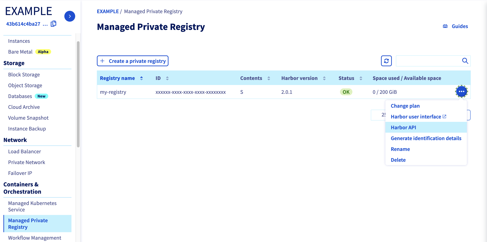
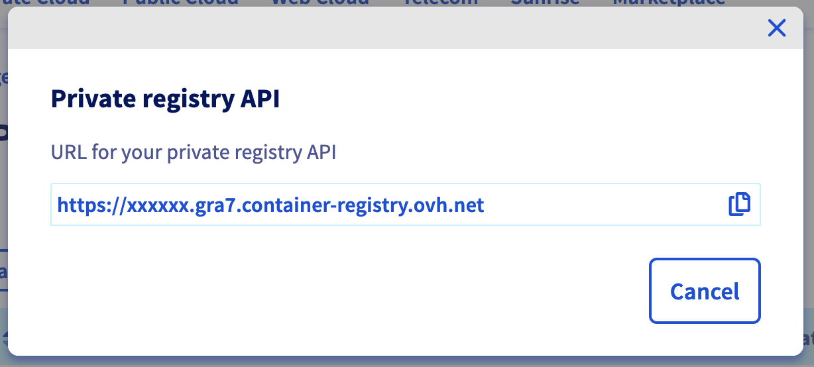
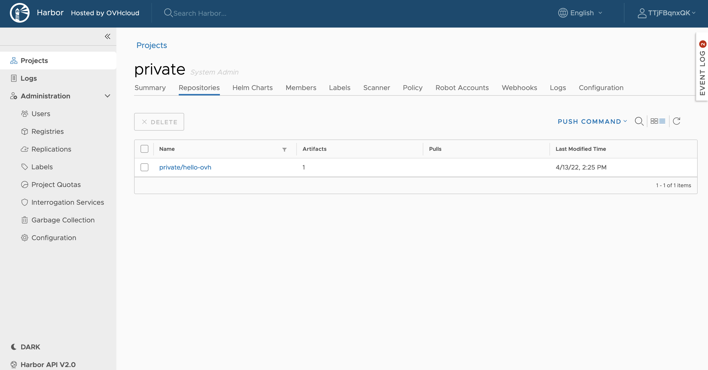

**Last updated 13th April, 2022.**

<style>
 pre {
     font-size: 14px;
 }
 pre.console {
   background-color: #300A24; 
   color: #ccc;
   font-family: monospace;
   padding: 5px;
   margin-bottom: 5px;
 }
 pre.console code {
   border: solid 0px transparent;
   color: #ccc;
   font-family: monospace !important;
   font-size: 0.75em;
 }
 .small {
     font-size: 0.75em;
 }
</style>


## Objective

OVHcloud Managed Private Registry service provides you a managed, authenticated Docker registry where you can privately store your Docker images. This guide will explain how to create a Docker image, store it in the OVHcloud Managed Private Registry service and using it from a Docker client.


## Requirements

- An OVHcloud Managed Private Registry (see the [creating a private registry](../creating-a-private-registry/) guide for more information)
- An access to the Harbor UI to operate the private registry (see the [connecting to the UI](../connecting-to-the-ui/) guide for more information)
- A private project and an user with the right to read and write on the project (see the [managing users and projects](../managing-users-and-projects/) guide for more information)


## Instructions

### Get your OVHcloud Managed Private Registry API URL

Go to your private registry section on the OVHcloud Public Cloud Manager, and in the *more options* (*...*) button at the right, click on Harbor API.

{.thumbnail}

Copy the URL of the API Harbor, it's the URL of your private registry and we are going to use it several times in this guide.

{.thumbnail}

> In fact when you click to copy button as mentioned by an hand icon in the image, the copied string begins with `https://`. Please remove the `https://` part.

### Creating a Docker image

You're going to create a Docker image using a very simple Dockerfile and some resource files.

Create a `hello-ovh/` folder and inside create:

- A `Dockerfile` file:

```  
FROM nginx:1.15-alpine

COPY index.html /usr/share/nginx/html/index.html
COPY ovh.svg /usr/share/nginx/html/ovh.svg
```

- A `index.html` file:

```
<!doctype html>
<html>
  <head>
    <title>OVHcloud K8S</title>
    <style>
      .title {
      font-size: 3em;
      padding: 2em;
      text-align: center;
      }
    </style>
  </head>
  <body>
    <div class="title">
      <p>Hello from Private Registry!</p>
      
    </div>
  </body>
</html>
```

- A `ovh.svg` file (right click and save it):

    <img src="data:image/svg+xml;base64,PD94bWwgdmVyc2lvbj0iMS4wIiBlbmNvZGluZz0iVVRGLTgiIHN0YW5kYWxvbmU9Im5vIj8+CjwhLS0gR2VuZXJhdG9yOiBBZG9iZSBJbGx1c3RyYXRvciAyMi4wLjEsIFNWRyBFeHBvcnQgUGx1Zy1JbiAuIFNWRyBWZXJzaW9uOiA2LjAwIEJ1aWxkIDApICAtLT4KCjxzdmcKICAgeG1sbnM6ZGM9Imh0dHA6Ly9wdXJsLm9yZy9kYy9lbGVtZW50cy8xLjEvIgogICB4bWxuczpjYz0iaHR0cDovL2NyZWF0aXZlY29tbW9ucy5vcmcvbnMjIgogICB4bWxuczpyZGY9Imh0dHA6Ly93d3cudzMub3JnLzE5OTkvMDIvMjItcmRmLXN5bnRheC1ucyMiCiAgIHhtbG5zOnN2Zz0iaHR0cDovL3d3dy53My5vcmcvMjAwMC9zdmciCiAgIHhtbG5zPSJodHRwOi8vd3d3LnczLm9yZy8yMDAwL3N2ZyIKICAgeG1sbnM6c29kaXBvZGk9Imh0dHA6Ly9zb2RpcG9kaS5zb3VyY2Vmb3JnZS5uZXQvRFREL3NvZGlwb2RpLTAuZHRkIgogICB4bWxuczppbmtzY2FwZT0iaHR0cDovL3d3dy5pbmtzY2FwZS5vcmcvbmFtZXNwYWNlcy9pbmtzY2FwZSIKICAgdmVyc2lvbj0iMS4xIgogICBpZD0iTGF5ZXJfMSIKICAgeD0iMHB4IgogICB5PSIwcHgiCiAgIHZpZXdCb3g9IjAgMCA2NzcgMTQyLjMiCiAgIHN0eWxlPSJlbmFibGUtYmFja2dyb3VuZDpuZXcgMCAwIDY3NyAxNDIuMzsiCiAgIHhtbDpzcGFjZT0icHJlc2VydmUiCiAgIHNvZGlwb2RpOmRvY25hbWU9Im92aGNsb3VkLnN2ZyIKICAgaW5rc2NhcGU6dmVyc2lvbj0iMC45Mi40ICg1ZGE2ODljMzEzLCAyMDE5LTAxLTE0KSI+PG1ldGFkYXRhCiAgIGlkPSJtZXRhZGF0YTMwIj48cmRmOlJERj48Y2M6V29yawogICAgICAgcmRmOmFib3V0PSIiPjxkYzpmb3JtYXQ+aW1hZ2Uvc3ZnK3htbDwvZGM6Zm9ybWF0PjxkYzp0eXBlCiAgICAgICAgIHJkZjpyZXNvdXJjZT0iaHR0cDovL3B1cmwub3JnL2RjL2RjbWl0eXBlL1N0aWxsSW1hZ2UiIC8+PC9jYzpXb3JrPjwvcmRmOlJERj48L21ldGFkYXRhPjxkZWZzCiAgIGlkPSJkZWZzMjgiIC8+PHNvZGlwb2RpOm5hbWVkdmlldwogICBwYWdlY29sb3I9IiNmZmZmZmYiCiAgIGJvcmRlcmNvbG9yPSIjNjY2NjY2IgogICBib3JkZXJvcGFjaXR5PSIxIgogICBvYmplY3R0b2xlcmFuY2U9IjEwIgogICBncmlkdG9sZXJhbmNlPSIxMCIKICAgZ3VpZGV0b2xlcmFuY2U9IjEwIgogICBpbmtzY2FwZTpwYWdlb3BhY2l0eT0iMCIKICAgaW5rc2NhcGU6cGFnZXNoYWRvdz0iMiIKICAgaW5rc2NhcGU6d2luZG93LXdpZHRoPSIyNzM2IgogICBpbmtzY2FwZTp3aW5kb3ctaGVpZ2h0PSIxNzE0IgogICBpZD0ibmFtZWR2aWV3MjYiCiAgIHNob3dncmlkPSJmYWxzZSIKICAgaW5rc2NhcGU6em9vbT0iMy43NDQ0NjA5IgogICBpbmtzY2FwZTpjeD0iMjc4LjUwMjM0IgogICBpbmtzY2FwZTpjeT0iNzEuMTUwMDAyIgogICBpbmtzY2FwZTp3aW5kb3cteD0iLTEyIgogICBpbmtzY2FwZTp3aW5kb3cteT0iLTEyIgogICBpbmtzY2FwZTp3aW5kb3ctbWF4aW1pemVkPSIxIgogICBpbmtzY2FwZTpjdXJyZW50LWxheWVyPSJMYXllcl8xIiAvPgo8c3R5bGUKICAgdHlwZT0idGV4dC9jc3MiCiAgIGlkPSJzdHlsZTIxIj4KCS5zdDB7ZmlsbDojMDA0MTZCO30KPC9zdHlsZT4KPHBhdGgKICAgY2xhc3M9InN0MCIKICAgZD0ibSAzOTkuNywzOC4xIGMgLTEuOCwwIC0zLjIsMS41IC0zLjIsMy4yIFYgNjYuOSBIIDM2My42IFYgNDEuMyBjIDAsLTEuNyAtMS40LC0zLjIgLTMuMiwtMy4yIC0xLjgsMCAtMy4yLDEuNSAtMy4yLDMuMiBWIDEwMCBjIDAsMS43IDEuNCwzLjIgMy4yLDMuMiAxLjgsMCAzLjIsLTEuNSAzLjIsLTMuMiBWIDcyLjggaCAzMi45IFYgMTAwIGMgMCwxLjcgMS40LDMuMiAzLjIsMy4yIDEuOCwwIDMuMiwtMS41IDMuMiwtMy4yIFYgNDEuMyBjIDAsLTEuNyAtMS40LC0zLjIgLTMuMiwtMy4yIHogTSAyNTkuNiwzNy41IGMgLTE4LjMsMCAtMjkuNSwxMC44IC0yOS41LDMzLjIgMCwyMi4yIDExLjIsMzMuMSAyOS41LDMzLjEgMTguMywwIDI5LjUsLTEwLjkgMjkuNSwtMzMuMSAwLC0yMi40IC0xMS4xLC0zMy4yIC0yOS41LC0zMy4yIHogbSAwLDYwLjQgYyAtMTQuNSwwIC0yMi45LC04LjggLTIyLjksLTI3LjIgMCwtMTguNSA4LjQsLTI3LjMgMjIuOSwtMjcuMyAxNC41LDAgMjIuOSw4LjggMjIuOSwyNy4zIDAsMTguNCAtOC40LDI3LjIgLTIyLjksMjcuMiB6IG0gODUsLTU5LjggYyAtMS44LDAgLTIuNywxLjMgLTMsMi4xIEwgMzIyLjQsOTEgMzAzLjIsNDAuMSBjIC0wLjMsLTAuOCAtMS4yLC0yLjEgLTMsLTIuMSAtMS44LDAgLTMuMiwxLjQgLTMuMiwzLjIgMCwwLjYgMC4yLDEuMSAwLjMsMS40IGwgMjIuMSw1OC4zIGMgMC41LDEuMyAxLjgsMi4yIDMsMi4yIDEuMiwwIDIuNiwtMC45IDMsLTIuMiBsIDIyLjEsLTU4LjMgYyAwLjEsLTAuMyAwLjMsLTAuOSAwLjMsLTEuNCAwLC0xLjcgLTEuNCwtMy4xIC0zLjIsLTMuMSB6IE0gMTc5LjMsNTYuOCBoIC0xOS4xIGwgLTIyLjUsMzkuMSBoIDE5LjEgTCAxNDIuNCwxMjEgaCA0Ni45IGMgMTIsLTE0LjcgMTkuMiwtMzMuNCAxOS4yLC01My44IDAsLTE1LjIgLTQsLTI5LjUgLTExLC00MS45IHogTSAxNjIuOCwxOS43IEggMTEzLjUgTCA3OS45LDc4LjEgNDkuNSwyNS4yIGMgLTcsMTIuNCAtMTEuMSwyNi43IC0xMS4xLDQxLjkgMCwyMC40IDcuMiwzOS4yIDE5LjIsNTMuOCBoIDQ3IHYgMCB6IG0gMzk2LDQyLjUgYyAtMS42LDAgLTIuOSwxLjIgLTIuOSwyLjggdiAyMi44IGMgMCw1LjcgLTEuOCwxMC42IC0xMC42LDEwLjYgLTguOCwwIC0xMC42LC00LjkgLTEwLjYsLTEwLjYgViA2NSBjIDAsLTEuNiAtMS4zLC0yLjggLTIuOCwtMi44IC0xLjYsMCAtMi44LDEuMiAtMi44LDIuOCB2IDIyLjggYyAwLDguMyAyLjgsMTUuOSAxNi4yLDE1LjkgMTMuNSwwIDE2LjIsLTcuNiAxNi4yLC0xNS45IFYgNjUgYyAwLC0xLjYgLTEuMiwtMi44IC0yLjcsLTIuOCB6IG0gLTU3LjYsLTAuNiBjIC0xMS4zLDAgLTE4LjMsNi42IC0xOC4zLDIwLjkgMCwxNC4zIDcuMSwyMSAxOC4zLDIxIDExLjMsMCAxOC4zLC02LjcgMTguMywtMjEgMCwtMTQuMiAtNywtMjAuOSAtMTguMywtMjAuOSB6IG0gMCwzNi45IGMgLTgsMCAtMTIuNiwtNC44IC0xMi42LC0xNiAwLC0xMSA0LjYsLTE1LjkgMTIuNiwtMTUuOSA4LDAgMTIuNiw0LjkgMTIuNiwxNS45IDAsMTEuMiAtNC42LDE2IC0xMi42LDE2IHogTSA2MDUuMSw0MC40IGMgLTEuNiwwIC0yLjgsMS4yIC0yLjgsMi44IHYgMjQuMiBjIC0yLC0yLjggLTYuMywtNS43IC0xMS45LC01LjcgLTExLjMsMCAtMTcuNSw2LjYgLTE3LjUsMjAuOSAwLDE0LjMgNi42LDIxIDE3LjksMjEgOS45LDAgMTcuMSwtNS43IDE3LjEsLTE3LjIgViA0My4yIGMgLTAuMSwtMS42IC0xLjMsLTIuOCAtMi44LC0yLjggeiBtIC0yLjgsNDYgYyAwLDguMyAtNC44LDEyLjEgLTExLjUsMTIuMSAtOCwwIC0xMi4zLC01LjEgLTEyLjMsLTE2IDAsLTEwLjcgNC40LC0xNS45IDEyLjMsLTE1LjkgOC4yLDAgMTEuNSw3LjcgMTEuNSw3LjcgeiBNIDQ3Miw5Ny45IGMgLTIuNCwwIC0zLjUsLTEuNSAtMy41LC01IFYgNDMuMiBjIDAsLTEuNSAtMS4yLC0yLjggLTIuOCwtMi44IC0xLjUsMCAtMi44LDEuMyAtMi44LDIuOCBWIDkzIGMgMCw2LjcgMy4yLDEwLjIgOS4xLDEwLjIgMS40LDAgMi42LC0xLjEgMi42LC0yLjYgMCwtMS41IC0xLjIsLTIuNyAtMi42LC0yLjcgeiBtIC0yMy4xLC0zLjcgYyAtMC42LDAgLTEsMC4yIC0xLjcsMC42IC0yLDEuNSAtNS4xLDMuOCAtMTAuMSwzLjggLTgsMCAtMTIuMywtNS4xIC0xMi4zLC0xNiAwLC0xMC43IDQuMywtMTUuOSAxMi4zLC0xNS45IDUuOCwwIDguMSwyLjYgOS40LDQuMSAwLjYsMC43IDEuMiwxIDIuMSwxIDEuNCwwIDIuNSwtMSAyLjUsLTIuNSAwLC0wLjYgLTAuMiwtMSAtMC42LC0xLjcgLTEuNCwtMS45IC01LjcsLTYgLTEzLjQsLTYgLTExLjMsMCAtMTgsNi42IC0xOCwyMC45IDAsMTQuMyA2LjcsMjEgMTgsMjEgNy4xLDAgMTEuMywtMy4xIDEzLjIsLTQuNyAwLjksLTAuOCAxLjEsLTEuNCAxLjEsLTIuMiAwLjEsLTEuMyAtMS4xLC0yLjQgLTIuNSwtMi40IHoiCiAgIGlkPSJwYXRoMjMiCiAgIHN0eWxlPSJmaWxsOiMwMDBlOWM7ZmlsbC1vcGFjaXR5OjEiCiAgIGlua3NjYXBlOmNvbm5lY3Rvci1jdXJ2YXR1cmU9IjAiCiAgIHNvZGlwb2RpOm5vZGV0eXBlcz0ic3NjY3Nzc3Nzc2Njc3Nzc3Nzc3Nzc3Nzc3Nzc2NjY3NzY2NzY2Nzc2NjY2NjY3NjY2NjY2NzY2NjY3Nzc3Nzc3Nzc3Nzc3Nzc3Nzc3Nzc3Nzc3Njc3Nzc2Nzc3Nzc2Nzc3Nzc3Nzc3Nzc2Nzc3Njc3Njc3NzY2NzIiAvPgo8L3N2Zz4=" alt="ovh.svg">


You should have these files in your `hello-ovh` directory:

```bash
├── Dockerfile
├── index.html
└── ovh.svg
```

- Go into the `hello-ovh` folder, containing the three files, and do a `docker build`. You will need to tag your build using your private registry URL, the project within the registry (*private* if you followed the [managing users and projects](../managing-users-and-projects/) guide), and the image name (*hello-ovh*):

```bash
docker build --tag [YOUR_PRIVATE_REGISTRY_URL]/[YOUR_PROJECT]/hello-ovh:1.0.0 .
```

  Here the result of the command execution for my private registry in the `private` project:

<pre class="console"><code>$ docker build --tag 8093ff7x.gra5.container-registry.ovh.net/private/hello-ovh:1.0.0 .
Sending build context to Docker daemon  14.34kB
Step 1/3 : FROM nginx:1.15-alpine
1.15-alpine: Pulling from library/nginx
e7c96db7181b: Pull complete 
264026bbe255: Pull complete 
a71634c55d29: Pull complete 
5595887beb81: Pull complete 
Digest: sha256:57a226fb6ab6823027c0704a9346a890ffb0cacde06bc19bbc234c8720673555
Status: Downloaded newer image for nginx:1.15-alpine
---> dd025cdfe837
Step 2/3 : COPY index.html /usr/share/nginx/html/index.html
---> f1f2487532bc
Step 3/3 : COPY ovh.svg /usr/share/nginx/html/ovh.svg
---> 3f803b45da18
Successfully built 3f803b45da18
Successfully tagged 8093ff7x.gra5.container-registry.ovh.net/private/hello-ovh:1.0.0
</code></pre>

- Login to your private registry, using a user with write rights to the project (*private-user* if you followed the [managing users and projects](../managing-users-and-projects/) guide)

```bash
docker login [YOUR_PRIVATE_REGISTRY_URL]
```

  In my private registry:

<pre class="console"><code>$ docker login 8093ff7x.gra5.container-registry.ovh.net
Username: private-user
Password: 
Login Succeeded
</code></pre>

- Upload the image to the private registry

```bash
docker push [YOUR_PRIVATE_REGISTRY_URL]/[YOUR_PROJECT]/hello-ovh:1.0.0
```

  In my private registry example:

<pre class="console"><code>$ docker push 8093ff7x.gra5.container-registry.ovh.net/private/hello-ovh:1.0.0
The push refers to repository [8093ff7x.gra5.container-registry.ovh.net/private/hello-ovh]
369ed87ef8b1: Pushed 
d2220a0eb85b: Pushed 
a521e1bbddf5: Pushed 
bf381a670956: Pushed 
a61993362baf: Pushed 
f1b5933fe4b5: Pushed 
1.0.0: digest: sha256:f5a6a8f0d7c95cf3926b504a7949c8575e478106b59d8913ab947729aa5bd075 size: 1568
</code></pre>

If you go to your Harbor UI, you will see that a `hello-ovh` repository in the  *private* project:

{.thumbnail}

This repository will store all the versions of the `hello-ovh` image (right now only the *1.0.0*):

{.thumbnail}


### Deploy the private image

Now you can use `docker pull` (preceded by a `docker login` on your private registry if you're doing it from a different computer) to deploy the image from the OVHcloud Managed Private Registry.

```bash
docker pull [YOUR_PRIVATE_REGISTRY_URL]/[YOUR_PROJECT]/hello-ovh:1.0.0 
```

In my private registry example:

<pre class="console"><code>$ docker pull 8093ff7x.gra5.container-registry.ovh.net/private/hello-ovh:1.0.0
1.0.0: Pulling from private/hello-ovh
e7c96db7181b: Already exists 
264026bbe255: Already exists 
a71634c55d29: Already exists 
5595887beb81: Already exists 
4c1b9819c67d: Pull complete 
5df2876c6416: Pull complete 
Digest: sha256:f5a6a8f0d7c95cf3926b504a7949c8575e478106b59d8913ab947729aa5bd075
Status: Downloaded newer image for 8093ff7x.gra5.container-registry.ovh.net/private/hello-ovh:1.0.0
</code></pre>

And then you can run it:

```bash
docker run -d -p 80:80 [YOUR_PRIVATE_REGISTRY_URL]/[YOUR_PROJECT]/hello-ovh:1.0.0 
```


In my private registry example:

<pre class="console"><code>$ docker run -d -p 8080:80 8093ff7x.gra5.container-registry.ovh.net/private/hello-ovh:1.0.0
c18f071c3c8c10ca636ed9be84878c12f3a270b6def131eb756f69435b978da1
</code></pre>

And now you can test it with the `curl` command:

```bash
$ curl localhost:8080
<!doctype html>

<html>
<head>
<title>OVH K8S</title>
</head>
<style>
.title {
font-size: 3em;
padding: 2em;
text-align: center;
}
</style>
<body>
<div class="title">
<p>Hello from Private Registry!</p>

</div>
</body>
</html>
```

Or in your browser:

{.thumbnail}

### Go further

To go further you can look at our guide on [Using your private registry with Kubernetes](../using-private-registry-with-kubernetes/).