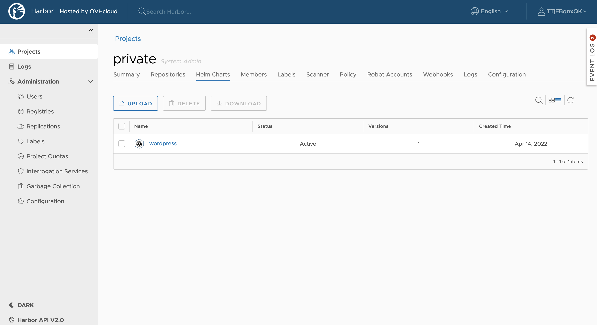

**Last updated 14 April, 2022.**

<style>
 pre {
     font-size: 14px;
 }
 pre.console {
   background-color: #300A24; 
   color: #ccc;
   font-family: monospace;
   padding: 5px;
   margin-bottom: 5px;
 }
 pre.console code {
   border: solid 0px transparent;
   color: #ccc;
   font-family: monospace !important;
   font-size: 0.75em;
 }
 .small {
     font-size: 0.75em;
 }
</style>

OVHcloud Managed Private Registry service is a composite cloud-native registry which supports both container image management and [Helm](https://helm.sh/){.external} [chart](https://helm.sh/docs/topics/charts/){.external} management. 

This guide will explain how to deploy a Helm chart from your OVHcloud Managed Private Registry in a Kubernetes cluster.

## Before you begin

This tutorial presupposes that you already have a working OVHcloud Managed Kubernetes cluster, and some basic knowledge of how to operate it. If you want to know more on those topics, please look at the [deploying a Hello World application](../../kubernetes/deploying-hello-world/) documentation. You will need to have Helm installed on your cluster (see the [installing helm](../../kubernetes/installing-helm/) guide for more information).

You also need to have a working OVHcloud Managed Private Registry and have followed the guide on [managing Helm charts in the OVHcloud Managed Private Registry](../using-helm-chart-museum/).

You should have at least one wordpress Helm chart in your Private Registry:



## Prerequisites

We (the OVHcloud Managed Kubernetes Service team) are working on a patch to be released in early 2022. In the meantime, please remove the default storage class and install the new one.

- Delete the concerned `StorageClass` that you are using by default

```bash
kubectl delete storageclasses.storage.k8s.io csi-cinder-high-speed
```

It will delete the existing `StorageClass`:

<pre class="console"><code>$ kubectl delete storageclasses.storage.k8s.io csi-cinder-high-speed
storageclass.storage.k8s.io "csi-cinder-high-speed" deleted
</code></pre>

- Create a new `StorageClass` with the required fix

```bash
kubectl apply -f https://raw.githubusercontent.com/ovh/docs/develop/pages/platform/kubernetes-k8s/fix-persistent-volumes-permissions/files/fixed-cinder-high-speed-storage-class.yaml
```

It will apply the correct `StorageClass` YAML manifest:

<pre class="console"><code>$ kubectl apply -f https://raw.githubusercontent.com/ovh/docs/develop/pages/platform/kubernetes-k8s/fix-persistent-volumes-permissions/files/fixed-cinder-high-speed-storage-class.yaml
storageclass.storage.k8s.io/csi-cinder-high-speed created
</code></pre>

If you have already installed a previous version of Bitnami's WordPress Helm chart, please follow the following step by step guide.

- Delete the concerned Helm Chart

For example with the Helm Chart `wordpress` which is concerned by this behavior:

```bash
helm uninstall wordpress
```

And don't forget to verify if concerned `PersistentVolumeClaim` (PVC) and `PersistentVolume` (PV) have been deleted before reinstalling the Helm Chart:

```bash
kubectl get persistentvolumeclaims -A | grep wordpress
kubectl get persistentvolumes 
```

If a `PersistentVolumeClaim` is listed, please delete it (the `PersistentVolume` will be deleted automatically).

```bash
kubectl delete pvc data-my-first-k8s-wordpress-mariadb-0
```

The command will delete the remaining `PersistentVolumeClaim`:

<pre class="console"><code>$ kubectl delete pvc data-my-first-k8s-wordpress-mariadb-0
persistentvolumeclaim "data-my-first-k8s-wordpress-mariadb-0" deleted
</code></pre>

## Instructions

### Deploying a chart from your registry in Kubernetes

In this step you are going to deploy a chart from your OVHcloud Managed Private Registry into an OVHcloud Managed Kubernetes cluster (or any other Kubernetes cluster).

As indicated in the *Before you begin* section, you need to have `helm` installed in your cluster and a working `helm` CLI in your workstation (see the [installing Helm](../../kubernetes/installing-helm/) guide for more information if needed).

Run the command `helm version` to make sure the `helm` CLI is correctly installed locally.

<pre class="console"><code>$ helm version
version.BuildInfo{Version:"v3.7.0", GitCommit:"eeac83883cb4014fe60267ec6373570374ce770b", GitTreeState:"clean", GoVersion:"go1.17"}
</code></pre>

#### Add your OVHcloud Managed Private Registry to the repository list

The first thing to do is add your OVHcloud Managed Private Registry to the Helm's repository list, with `helm repo add` command.

You can do it in two ways: adding your private registry as single index entry point or adding each project as a separate index entry point.

- Adding your OVHcloud Managed Private Registry as a unified single index entry point

  In this mode, Helm will be able to use all the charts in any of your projects which are accessible by the currently authenticated user.
  

```bash
helm repo add --username <username> --password <password> <repo name> https://<repo url>/chartrepo
```

- Adding a project in your OVHcloud Managed Private Registry as a separate index entry point

  In this mode, Helm only can pull charts from the specified project.

```bash
helm repo add --username <username> --password <password> <repo name> https://<repo url>/chartrepo/<project>
```

In my example, I added the project in the private registry as a separate index entry point:

<pre class="console"><code>$ helm repo add --username private-user --password xxxxxx privreg https://ab1cd23e.gra7.container-registry.ovh.net/chartrepo/private
"privreg" has been added to your repositories
</code></pre>


#### Install charts

Before installing, make sure your the chart index is synchronized with the `helm repo update` command.

In my case:

<pre class="console"><code>$ helm repo update
Hang tight while we grab the latest from your chart repositories...
...Successfully got an update from the "gpu-helm-charts" chart repository
...
...Successfully got an update from the "privreg" chart repository
...
Update Complete. ⎈Happy Helming!⎈
</code></pre>

Look for your chart:

```bash 
helm search repo wordpress
```

In my case, it finds several versions of WordPress chart, the official ones in the `bitnami` Helm repository, and the one in my `privreg` private registry project:

<pre class="console"><code>$ helm search repo wordpress
NAME                   	CHART VERSION	APP VERSION	DESCRIPTION
bitnami/wordpress      	13.2.1       	5.9.3      	WordPress is the world's most popular blogging ...
bitnami/wordpress-intel	0.2.0        	5.9.3      	WordPress for Intel is the most popular bloggin...
privreg/wordpress      	13.1.4       	5.9.2      	WordPress is the world's most popular blogging ...
</code></pre>

Everything is ready, so now you can install the chart into your Kubernetes:

```bash
helm install wordpress --username <username> --password <password> privreg/wordpress
```

In my case:

<pre class="console"><code>$ helm install wordpress --username private-user --password xxxxxx privreg/wordpress
NAME: wordpress
LAST DEPLOYED: Thu Apr 14 09:33:33 2022
NAMESPACE: default
STATUS: deployed
REVISION: 1
TEST SUITE: None
NOTES:
CHART NAME: wordpress
CHART VERSION: 13.1.4
APP VERSION: 5.9.2

** Please be patient while the chart is being deployed **

Your WordPress site can be accessed through the following DNS name from within your cluster:

    wordpress.default.svc.cluster.local (port 80)

To access your WordPress site from outside the cluster follow the steps below:

1. Get the WordPress URL by running these commands:

  NOTE: It may take a few minutes for the LoadBalancer IP to be available.
        Watch the status with: 'kubectl get svc --namespace default -w wordpress'

   export SERVICE_IP=$(kubectl get svc --namespace default wordpress --include "{{ range (index .status.loadBalancer.ingress 0) }}{{ . }}{{ end }}")
   echo "WordPress URL: http://$SERVICE_IP/"
   echo "WordPress Admin URL: http://$SERVICE_IP/admin"

2. Open a browser and access WordPress using the obtained URL.

3. Login with the following credentials below to see your blog:

  echo Username: user
  echo Password: $(kubectl get secret --namespace default wordpress -o jsonpath="{.data.wordpress-password}" | base64 --decode)
</code></pre>

Check your WordPress is running correctly:

<pre class="console"><code>$ kubectl get pod -l app.kubernetes.io/instance=wordpress
NAME                         READY   STATUS    RESTARTS   AGE
wordpress-8586785c5d-cttz4   1/1     Running   0          85s
wordpress-mariadb-0          1/1     Running   0          85s
</code></pre>

## Go further

To have an overview of the OVHcloud Managed Private Registry service, you can go to the [OVHcloud Managed Private Registry site](../).

Join our community of users on <https://community.ovh.com/en/>.