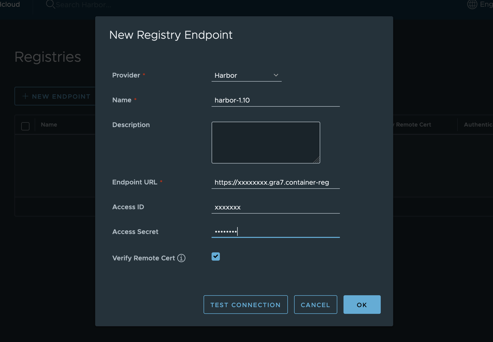
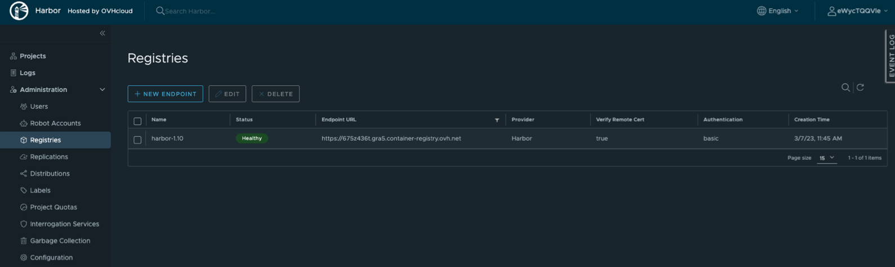
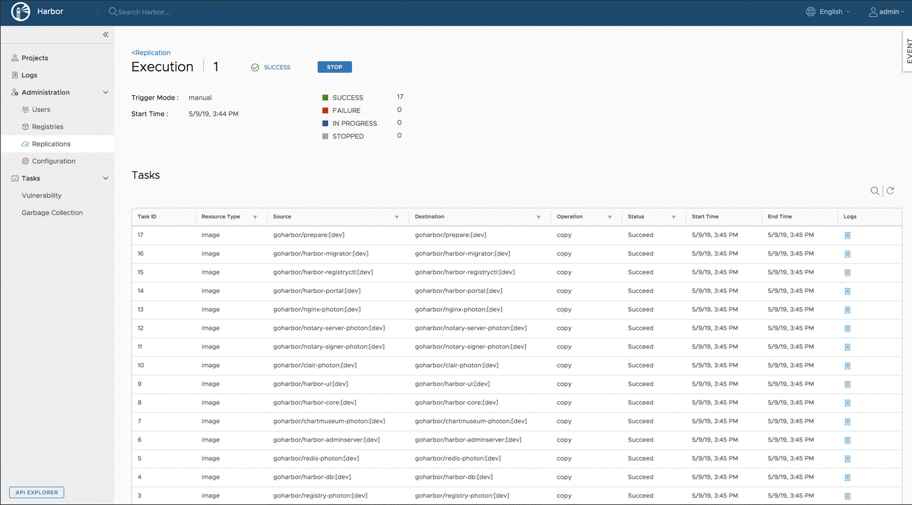

**Last updated 09th March, 2023.**

## Objective

OVHcloud Managed Private Registry service provides you a managed, authenticated Docker registry where you can privately store your Docker images. 

Managed Private Registry is built on Open Source solutions, such as Docker, and the CNCF Harbor project, to guarantee its interoperability. 

In the past, ... TODO: context ...

## Instructions

1. First, follow the [Creating a private registry](../creating-a-private-registry/) guide to create a new private registry named `my-new-registry` for example, with the latest version of Harbor.

2. Follow the [Connecting to the UI](../connecting-to-the-ui/) guide to connect to your new private registry. 

3. Now you will configure a replication between your old private registry (in Harbor 1.x) and the new one.

In the `Administration` menu, click on `Registries`{.action}.

{.thumbnail}

4. Click on `New endpoint` button to create a replication endpoint.

Now fill the form with the following information:

- Provider: `Harbor`
- Name: `harbor-1.10`
- Endpoint URL: `<your Harbor 1.10 URL (https://xxxxxxxx.gra7.container-registry.ovh.net/)>`
- Access ID: `<Harbor 1.10 username>`
- Access secret: `<Harbor 1.10 password>`

Click on `OK` button to save your information.

{.thumbnail}
{.thumbnail}

5. In the `Administration` menu, click on `Replications`{.action}.

{.thumbnail}

6. Click on `New replication rule` button to create a new rule.

Now fill the form with the following information:

- Name: `harbor-1.10`
- Replication mode: `Pull based`
- Source registry: `harbor-1.10`
- Trigger mode: `Manual` or `Scheduled`

Click on `Test connection` button to ping the private registry.

Then, click on `Save` button to save your information.

> [!primary]
>
> **Manual**: Replicate the resources manually when needed. Note: Deletion operations are not replicated.
>
> **Scheduled**: Replicate the resources periodically by defining a cron job. Note: Deletion operations are not replicated.

{.thumbnail}

7. To run manually a replication rule, go back in `Replications` menu, select your replication rule and click on `Replicate` button.

{.thumbnail}

8. Click on the rule to see its execution status.

{.thumbnail}

8. At last, you must reconfigure your Harbor instance (users, robot accounts, garbage collection, retention rules...).
Once your registry is replicated, change both the Harbor URL and credentials in your CI/CD and deployment platform if not already done.

> [!primary]
>
> If you run several times the same replications and you have Helm charts, the replication can fail the second time, but it will work.