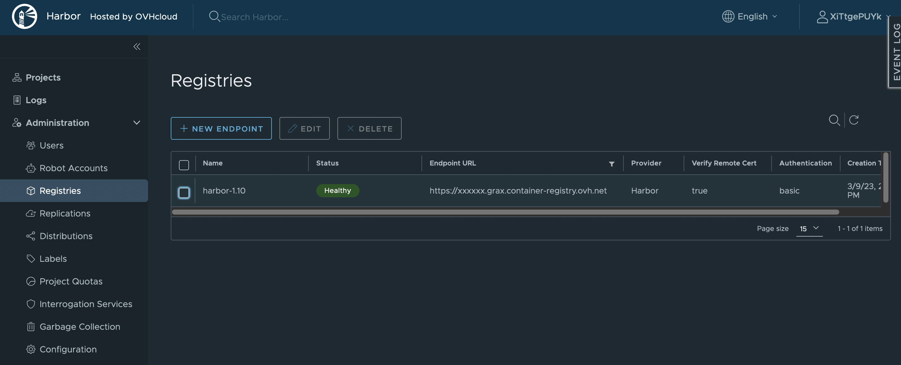
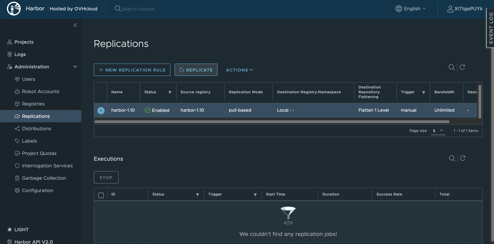
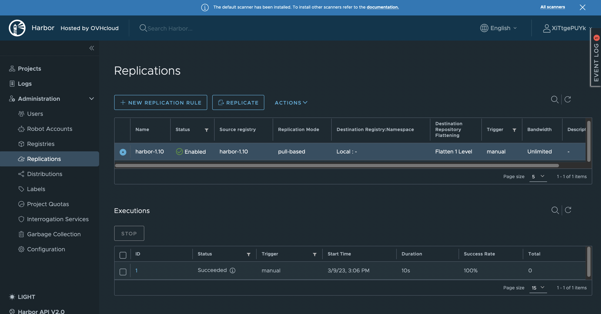

**Last updated 10th March, 2023.**

## Objective

The OVHcloud Managed Private Registry service provides you a managed, authenticated Docker registry where you can privately store your Docker images. 

Managed Private Registry is built on Open Source solutions such as Docker and the CNCF Harbor project, to guarantee its interoperability. 

The Managed Private Registries based on Harbor 1.x will terminate on August 1st 2023. The aim of this guide is to show you how to create a new private registry (based on Harbor 2.x) and migrate your data from your 1.x private registry to this new one.

## Instructions

First, follow the guide [Creating a private registry](https://docs.ovh.com/it/private-registry/creating-a-private-registry/) to create a new private registry named `my-new-registry` for example, with the latest version of Harbor.

Follow the guide [Connecting to the UI](https://docs.ovh.com/gb/en/private-registry/connecting-to-the-ui/) to connect to your new private registry. 

Now you will configure a replication between your old private registry (in Harbor 1.x) and the new one.

In the `Administration` menu, click on `Registries`{.action}.

{.thumbnail}

Click on `New endpoint`{.action} button to create a replication endpoint.

Now fill the form with the following information:

- Provider: `Harbor`
- Name: `harbor-1.10`
- Endpoint URL: `<your Harbor 1.10 URL (https://xxxxxxxx.grax.container-registry.ovh.net/)>`
- Access ID: `<Harbor 1.10 username>`
- Access secret: `<Harbor 1.10 password>`

{.thumbnail}

Click on the button `Test connection`{.action} to ping the private registry and test your information.

{.thumbnail}

Click on the button `OK`{.action} to save your information.

{.thumbnail}

In the `Administration` menu, click on `Replications`{.action}.

{.thumbnail}

Click on the button `New replication rule`{.action} to create a new rule.

Now fill the form with the following information:

- Name: `harbor-1.10`
- Replication mode: `Pull based`
- Source registry: Select your registry started with `harbor-1.10-*`
- Trigger mode: `Manual` or `Scheduled`

> [!primary]
>
> **Manual**: Replicate the resources manually when needed.
>
> **Scheduled**: Replicate the resources periodically by defining a cron job.
>
> Note: In both cases, deletion operations are not replicated.

{.thumbnail}

Click on `Save`{.action} to save your information.

{.thumbnail}

To run manually a replication rule, select your replication rule and click on the `Replicate`{.action} button.

{.thumbnail}

Then click on `Replicate`{.action} to run the replication.

{.thumbnail}

You should be able to see the status of the replication in the `Executions` section.

First your replication should be in the status `InProgress` and then, after waiting a moment (depending on the size of the data to replicate), the status should change to `Succeeded`.

{.thumbnail}
{.thumbnail}

> [!primary]
>
> If you run the same replications several times and you have Helm charts, the replication can fail the second time but it will work.

Finally, you must reconfigure your Harbor instance (users, robot accounts, garbage collection, retention rules, etc.).
Once your registry is replicated, change both the Harbor URL and the credentials in your CI/CD and deployment platform if not already done.

## Go further

To have an overview of OVHcloud Managed Private Registry service, you can consult the [OVHcloud Managed Private Registry site](https://docs.ovh.com/it/private-registry/).

Join our community of users on <https://community.ovh.com/en/>.
