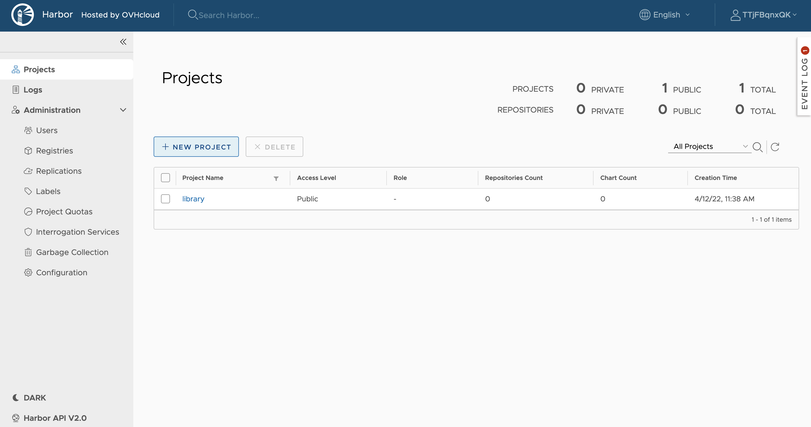
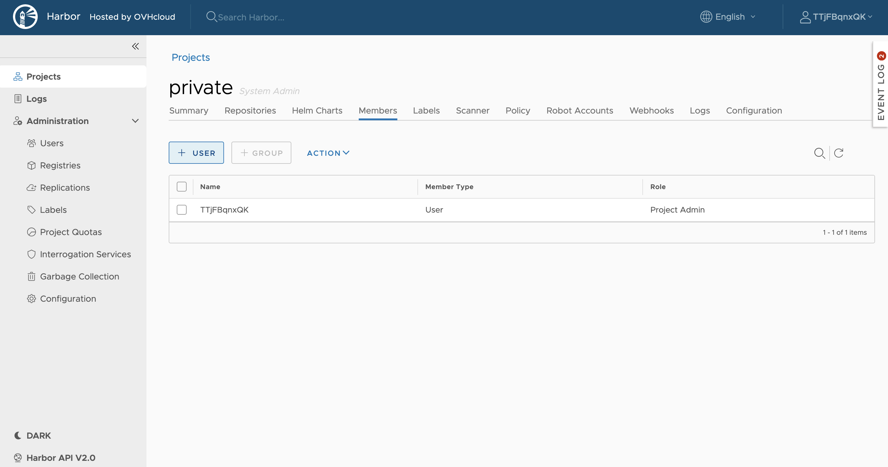
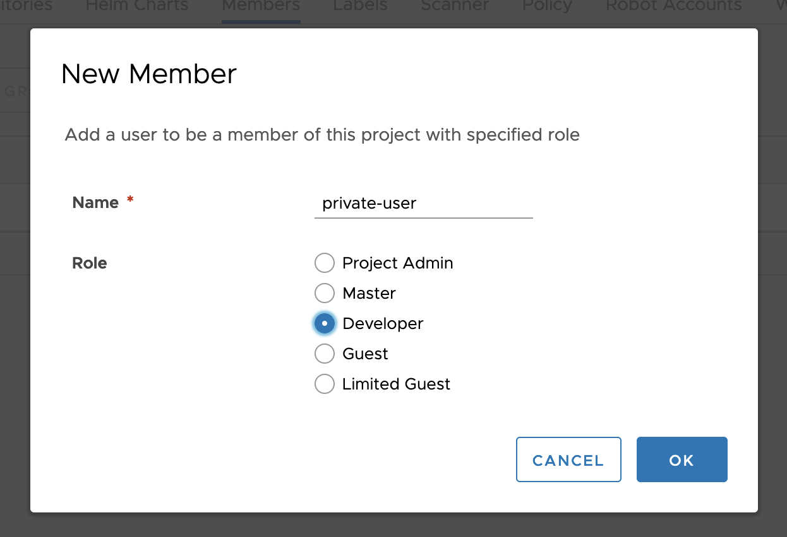

**Last updated 13th April, 2022.**

## Objective

OVHcloud Managed Private Registry service provides you a managed Harbor, an authenticated Docker registry where you can privately store your Docker images. This guide will explain how to manage users and projects on your OVHcloud Managed Private Registry service.

## Requirements

- An OVHcloud Managed Private Registry (see the [creating a private registry](../creating-a-private-registry/) guide for more information)
- An access to the Harbor UI to operate the private registry (see the [connecting to the UI](../connecting-to-the-ui/) guide for more information)

## Instructions

You can manage projects, users and rights on your private registry by using the Harbor UI.

### Creating a new project

A project in Harbor contains all repositories of an application. No images can be pushed to Harbor before the project is created. 

There are two types of project in Harbor:

- Public: All users can read from a public Harbor project
- Private: Only users with proper privileges can read from this projects.

Let's create a private project:

1. Create a new project on Harbor UI

    {.thumbnail}

1. Call it *private* and leave the public checkbox unchecked

    {.thumbnail}

> [!primary]
>
> Keep `-1` for the storage quota if you don't want limitations. 

After the project is created, you can browse repositories, helm charts, members, labels, scanner, policy, robot accounts, webhooks, logs and configuration using the navigation tab.

{.thumbnail}

### Creating a new user and giving it rights on the *private* project

Now you're going to create a new user and give him developer rights over the *private* project.

1. Go to the `Users`{.action} section of Harbor UI and click on `New user`{.action}

    {.thumbnail}

1. Add a new *private-user* user. For the e-mail domain, use the domain found in the URL of your Harbor UI

    {.thumbnail}

1. The new user is now visible in your Harbor UI 

    {.thumbnail}

1. Go back to the `Projects`{.action} section, choose the `private`{.action} project and in the `Members`{.action} tab, click on  `+User`{.action}

    {.thumbnail}

1. Add the *private-user* as member to the project, and give him a *Developer* role    

    {.thumbnail}

The *private-user* is now a member of the *private* project.

{.thumbnail}

### Go further

To go further you can look at our guide on [Creating and using a private image](../creating-and-using-a-private-image/).
