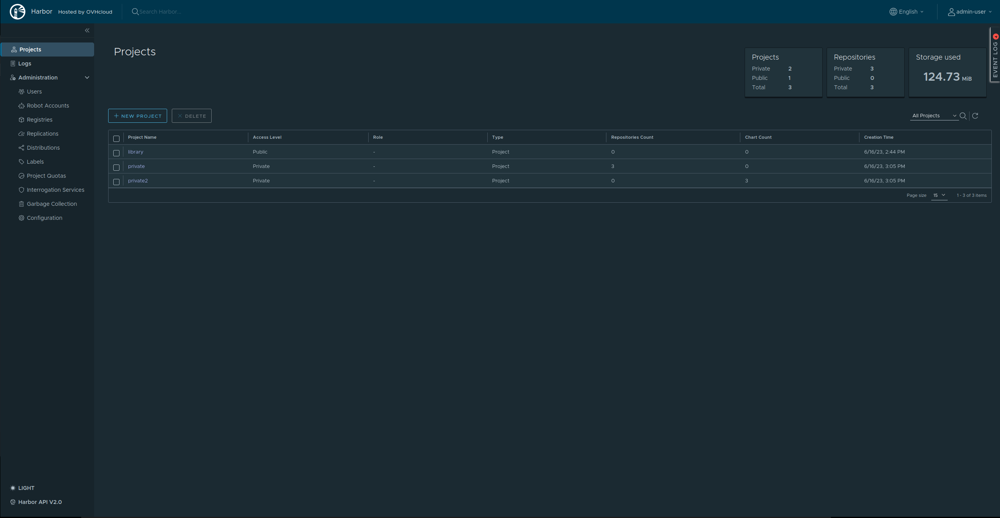

<style>
 pre {
     font-size: 14px;
 }
 pre.console {
   background-color: #300A24; 
   color: #ccc;
   font-family: monospace;
   padding: 5px;
   margin-bottom: 5px;
 }
 pre.console code {
   border: solid 0px transparent;
   color: #ccc;
   font-family: monospace !important;
   font-size: 0.75em;
 }
</style>

## Objective

The OVHcloud Managed Private Registry service provides you a managed, authenticated Docker registry where you can privately store your Docker images and Helm charts.

Managed Private Registry is built on top of Open Source solution [Harbor](https://github.com/goharbor/harbor), to guarantee its interoperability.

[Harbor](https://github.com/goharbor/harbor) supports two different ways to store the Helm charts data:


1. Harbor registry storage directly via OCI API.
2. Harbor hosted Chartmuseum backend via Chartmuseum's API.

From Harbor version 2.6, [Chartmuseum](https://github.com/helm/chartmuseum) is deprecated and is removed from Harbor version 2.8.

## How to know if I have Helm charts stored inside Chartmuseum?

Follow the guide [Connecting to the UI](/pages/platform/private-registry/connecting-to-the-ui) to connect to your registry.

From the main page (Projects list) once you're logged in, check if you have some Chartmuseum Helm charts in "Chart Count" column.


Helm charts stored in Chartmuseum are viewable under project "Helm Charts" tab.


While Helm charts stored in OCI are viewable under project "Repository" tab like the Docker images.


## Instructions

We developed a tool called [chartmuseum2oci](https://github.com/goharbor/chartmuseum-migration-tools) whose purpose is to migrate Helm charts from Harbor Chartmuseum to Helm OCI registry.

### Requirements

To migrate all Helm charts you have to use an admin user or a user having at least the "developer" role on all projects.

> [!warning]
> If the user hasn't enough rights, only the Helm Charts contained in projects accessible by user will be copied. No error will be displayed.
>

Then export the following variables:

```bash
export HARBOR_URL=https://
export HABOR_USER=
export HARBOR_PASSWORD=
```

### Run migration

Run the following commands:

```bash
git clone https://github.com/goharbor/chartmuseum-migration-tools.git
cd chartmuseum-migration-tools/chartmuseum2oci
docker build -t goharbor/chartmuseum2oci .
docker run -ti --rm goharbor/chartmuseum2oci --url $HARBOR_URL --username $HARBOR_USER --password $HARBOR_PASSWORD
```

During the migration, the tool will give you the amount of charts to migrate and the progression of the migration:

<pre class="console"><code>$ docker run -ti --rm ovhcloud/harbor-chartmuseum-migrator --url $HARBOR_URL --username $HARBOR_USER --password $HARBOR_PASSWORD
$ docker run -ti --rm ovhcloud/harbor-chartmuseum-migrator --url $HARBOR_URL --username $HARBOR_USER --password $HARBOR_PASSWORD
2023/06/28 16:17:32 416 Helm charts to migrate from Chartmuseum to OCI
   4% |█████                                                                                                                                        | (19/416, 20 it/min) [56s:19m36s]
</code></pre>

Then, when the migration is ended:
<pre class="console"><code>$ docker run -ti --rm ovhcloud/harbor-chartmuseum-migrator --url $HARBOR_URL --username $HARBOR_USER --password $HARBOR_PASSWORD
$ docker run -ti --rm ovhcloud/harbor-chartmuseum-migrator --url $HARBOR_URL --username $HARBOR_USER --password $HARBOR_PASSWORD
2023/06/28 16:17:32 416 Helm charts to migrate from Chartmuseum to OCI
   100% |█████████████████████████████████████████████████████████████████████████████████████████████████████████████████████████████████████████████| (416/416, 20 it/min)
2023/06/28 16:38:14 416 Helm charts successfully migrated from Chartmuseum to OCI
</code></pre>

> [!primary]
>
> Important: The tool copies Helm charts but does not delete them from Chartmuseum.

### Use OCI Helm charts

To interact with Helm charts in OCI format, use Helm in version 3.8+ (https://helm.sh/docs/intro/install/).
To finalize the migration process, you have to modify all Helm charts occurrences to use OCI URL instead of Chartmuseum one.
Find below some OCI examples:

#### Login

```bash
helm registry login $HARBOR_URL
```

#### Push
```bash
helm push dummy-chart-0.1.0.tgz $HARBOR_URL/$HARBOR_PROJECT
```

#### Install

```bash
helm install dummy-chart oci://$HARBOR_URL/$HARBOR_PROJECT/dummy-chart --version 0.1.0
```

#### Useful Links
- [Harbor Helm documentation](https://goharbor.io/docs/2.4.0/working-with-projects/working-with-images/managing-helm-charts/)
- [Helm OCI documentation](https://helm.sh/docs/topics/registries/#using-an-oci-based-registry)

## Go further

To have an overview of OVHcloud Managed Private Registry service, you can consult the [OVHcloud Managed Private Registry site](/products/public-cloud-containers-orchestration-managed-private-registry).

Join our community of users on <https://community.ovh.com/en/>.
