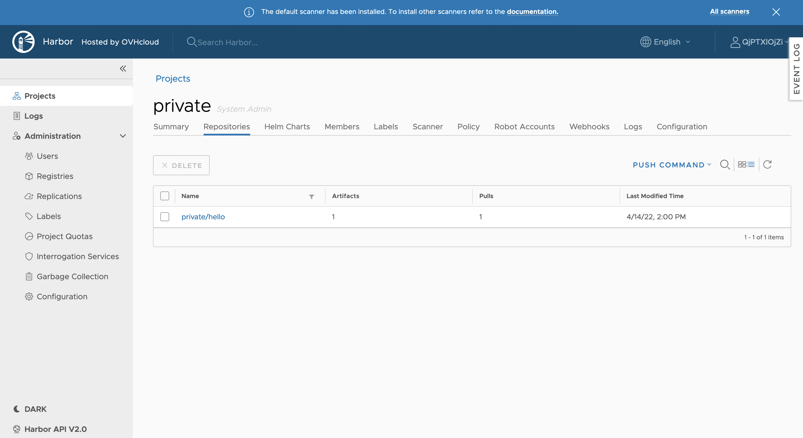
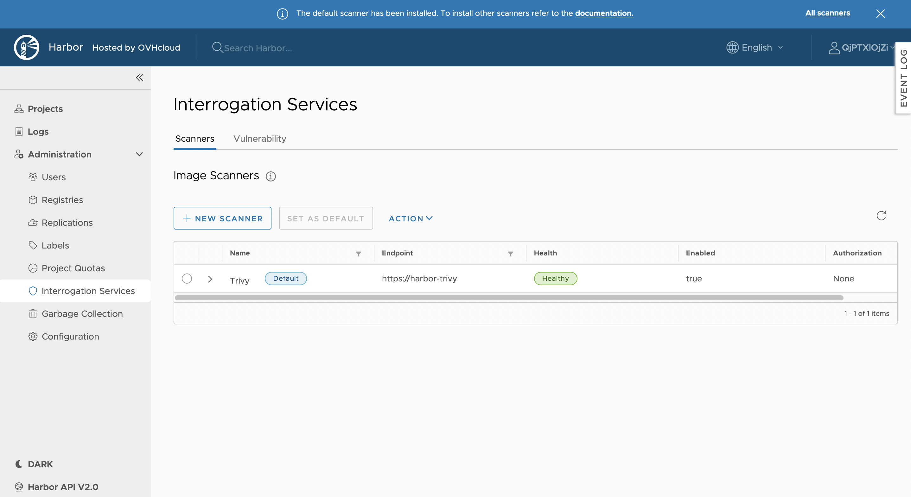
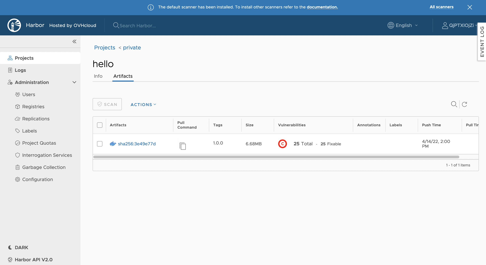
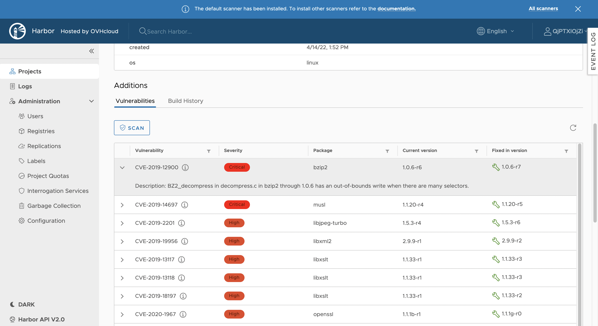
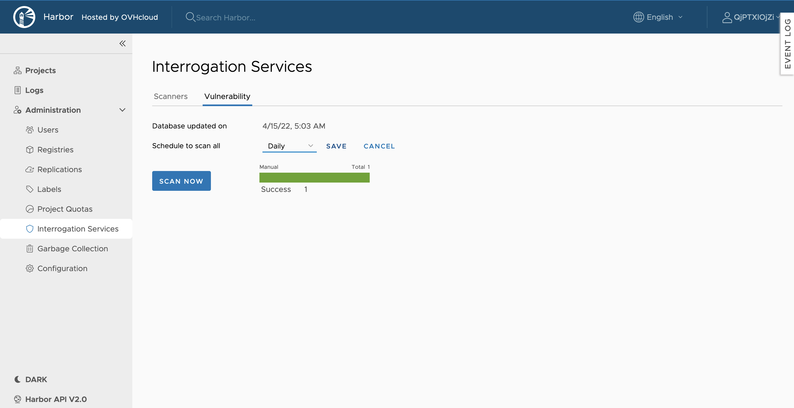

**Last updated 15th April, 2022**

OVHcloud Managed Private Registry service is a composite cloud-native registry which supports both container image management and [Helm](https://helm.sh/){.external} [chart](https://helm.sh/docs/topics/charts/){.external} management. 

**This guide will explain how to activate the vulnerabilities scanner and manually scan an image in an OVHcloud Managed Private Registry service.**

## Before you begin

This tutorial presupposes that you already have a working OVHcloud Managed Private Registry and you have followed the guides on [creating a private registry](../creating-a-private-registry/), [connecting to the UI](../connecting-to-the-ui/), [managing users and projects](../managing-users-and-projects/) and [creating and using private images](../creating-and-using-a-private-image/).

You should have at least one image in your Private Registry:

## Instructions

You can scan your images on your private registry by using the Harbor UI.

### Check that you have enabled a vulnerability scanner

By default, when you create a Private Registry in order to enable a vulnerabilities scanner, you need to choose a `M` or `L` plan.

> [!primary]
>
> With the `M` and `L` plan, OVHcloud installs and maintains a vulnerability scanner for you: [Trivy](https://aquasecurity.github.io/trivy/) for Harbor version 2.x or [Clair](https://github.com/quay/clair) for Harbor version 1.x.

To verify if you have a vulnerability scanner in your private registry, go to `Interrogation Services`{.action} in the navigation bar.

As you can see, Trivy is installed and ready to use.

If you want to manually add a vulnerability scanner, you can also do it with `New Scanner`{.action}. However, it will not be updated and maintaned by OVHcloud.

### Scan a Docker image manually

You can manually scan a Docker image.
To do that, access your project, select an image and click on `Scan`{.action}.

The scanner starts scanning the image.

The number of vulnerabilities is displayed.

When you hover the vulnerabilities column, a chart with the vulnerabilities severity is displayed.

Click on the image ID to display all vulnerabilities, ranked by severity.

#### Scan all the images

You can also scan all your images manually in your private registry.

To do that, go to the `Vulnerability`{.action} tab and open `Interrogation Services`{.action}. Next, click on `Scan Now`{.action}.

### Scan all images regularly

You can schedule a scan:

- hourly
- daily
- weekly
- when you want (enter as a cron format)

For that, select the scheduling and click on the `Save`{.action} button.

## Go further

To have an overview of OVHcloud Managed Private Registry service, you can consult the [OVHcloud Managed Private Registry site](../).

Join our community of users on <https://community.ovh.com/en/>.
