**Last updated 18<sup>th</sup> February, 2020.**

<style>
 pre {
     font-size: 14px;
 }
 pre.console {
   background-color: #300A24; 
   color: #ccc;
   font-family: monospace;
   padding: 5px;
   margin-bottom: 5px;
 }
 pre.console code {
   border: solid 0px transparent;
   color: #ccc;
   font-family: monospace !important;
   font-size: 0.75em;
 }
 .small {
     font-size: 0.75em;
 }
</style>


OVHcloud Managed Private Registry service is a composite cloud-native registry which supports both container image management and [Helm](https://helm.sh/){.external} [chart](https://helm.sh/docs/topics/charts/){.external} management. 

This guide will explain how to manage Helm charts in the OVHcloud Managed Private Registry service: how to upload charts, list the available ones and use them.

## Before you begin

This tutorial presupposes that you already have a working OVHcloud Managed Kubernetes cluster, and some basic knowledge of how to operate it. If you want to know more on those topics, please look at the [deploying a Hello World application](../kubernetes/deploying-hello-ovh/) documentation. You will need to have Helm installed on your cluster (see the [installing helm](../../kubernetes-k8s/installing-helm/) guide for more information).

You also need to have a working OVHcloud Managed Private Registry and have followed the guides on [creating a private registry](../creating-a-private-registry/), [connecting to the UI](../connecting-to-the-ui/), [managing users and projects](../managing-users-and-projects/), [creating and using private images](../creating-and-using-a-private-image/) and [Using Private Registry with OVHcloud Managed Kubernetes](../using-private-registry-with-kubernetes/).


## Instructions


### Preparing a Helm chart

In order to do this tutorial, you will need a Helm chart to upload to your OVHcloud Managed Private Registry. 

If you already have a Helm chart in your filesystem, you can use it for the examples, but in this section we are suppossing you haven't any. We are using a well known Helm chart often employed as example: the [Wordpress](https://github.com/helm/charts/tree/master/stable/wordpress) chart.


#### Download the chart

The first step is downloading the Wordpress chart using `helm`:

```bash
helm fetch stable/wordpress
```

The wordpress Helm chart is downloaded as a `tgz` file.

<pre class="console"><code>$ helm fetch stable/wordpress
$ ls
wordpress-7.6.1.tgz
</code></pre>


#### Inspect the chart (optional)


The file you have downloaded is a packaged Helm chart, useful for downloading it, and for uploading it to your OVHcloud Private Registry. Let's unpack it to have a peek inside it and get a better undestanding of its structure,

A unpackaged chart is organized as a collection of files inside of a directory. The directory name is the name of the chart (without versioning information). Thus, the chart describing WordPress should be stored in a 'wordpress/'.

Inside of this directory, Helm will expect a structure that matches this:
```
wordpress/
  Chart.yaml          # A YAML file containing information about the chart
  LICENSE             # OPTIONAL: A plain text file containing the license for the chart
  README.md           # OPTIONAL: A human-readable README file
  values.yaml         # The default configuration values for this chart
  values.schema.json  # OPTIONAL: A JSON Schema for imposing a structure on the values.yaml file
  charts/             # A directory containing any charts upon which this chart depends.
  crds/               # Custom Resource Definitions
  templates/          # A directory of templates that, when combined with values,
                      # will generate valid Kubernetes manifest files.
  templates/NOTES.txt # OPTIONAL: A plain text file containing short usage notes
```

Let's uncompress the helm chart:

```bash
tar xzf wordpress-7.6.1.tgz
```

As expected, the file is uncompressed into a `wordpress` folder, with the required files and folders inside it:

<pre class="console"><code>$ tar xzf wordpress-7.6.1.tgz
$ ls
wordpress  wordpress-7.6.1.tgz
$ ls wordpress
Chart.yaml  README.md  charts  requirements.lock  requirements.yaml  templates  values.schema.json  values.yaml
</code></pre>

You can now remove the `tgz` file, as we are recreating it.

To package a chart from a chart directory, you can use `helm package`:

```bash
helm package wordpress
```

It creates the packaged chart, with the version appended to the filename:

<pre class="console"><code>$ helm package wordpress
Successfully packaged chart and saved it to: ./wordpress-7.6.1.tgz
</code></pre>


### Manage Helm Charts via the Harbor UI

If you go to the Harbor UI and click on your project, you will see the Helm Chart tab, that you will use to manage the charts inside your registry.

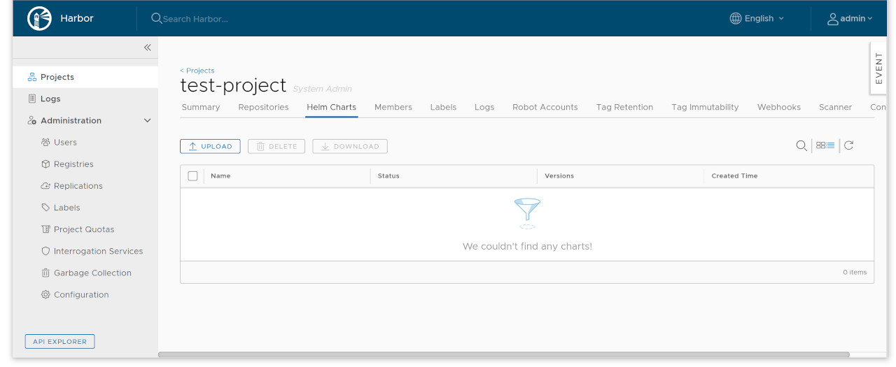{.thumbnail}

By default, it's empty, so let's upload a new chart...


### Upload a chart

To upload a chart, click the `UPLOAD` button on the top left. On the upload dialog, choose the packaged chart file and click sur `UPLOAD` to upload it to your OVHcloud Managed Private Registry.

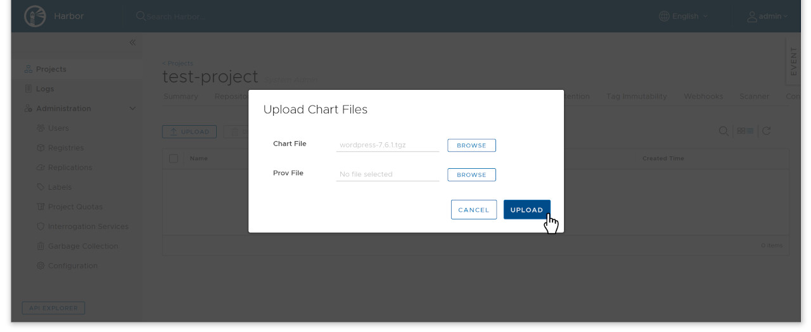{.thumbnail}

Now you will see the Wordpress chart listed in your registry:

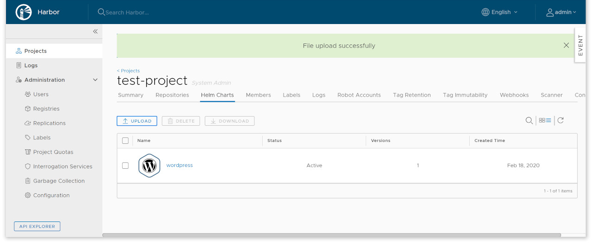{.thumbnail}


### List charts

As you can see, the existing helm charts are listed under the tab Helm Charts with the following information:

- Name of helm chart
- The status of the chart: Active or Deprecated
- The count of chart versions
- The created time of the chart

{.thumbnail}

You can click the icon buttons on the top right to switch views between card view and list view.

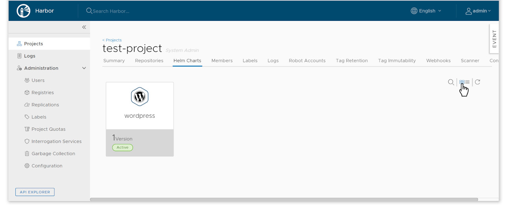{.thumbnail}


### Managing chart versions

Clicking on the chart name will show you the chart details, with one line per version of the chart. For each vers you will have the following information:

- The chart version number
- The maintainers of the chart version
- The template engine used (default is `gotpl`)
- The created timestamp of the chart version

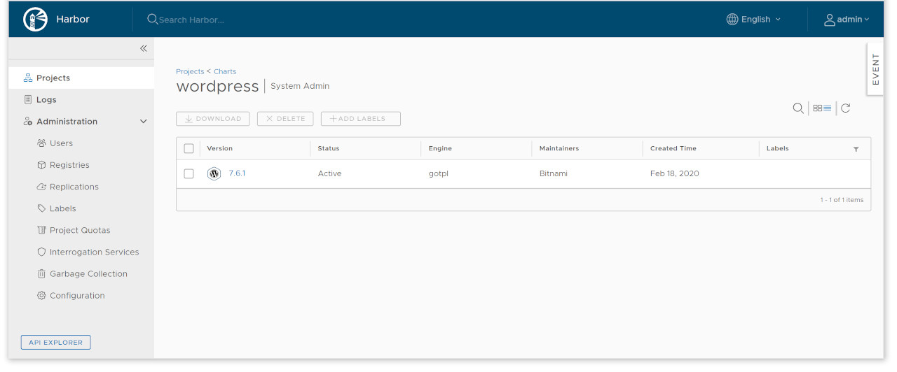{.thumbnail}

As with the top chart list, you can choose between a list mode and a card mode, by clicking on the icon buttons on the top right.

To delete a version, select it by checking the corresponding checkbox and clicking on `DELETE`.


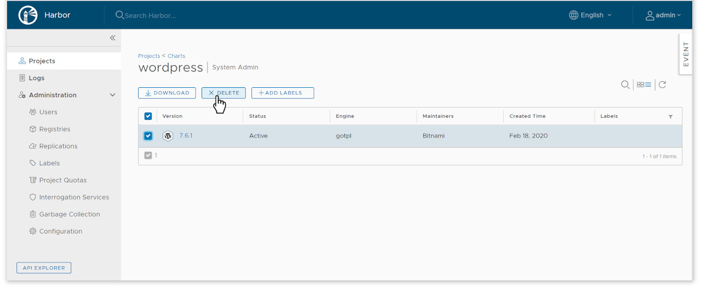{.thumbnail}

Same thing to download a chart, select it and click on `DOWNLOAD` to get the packaged chart file.


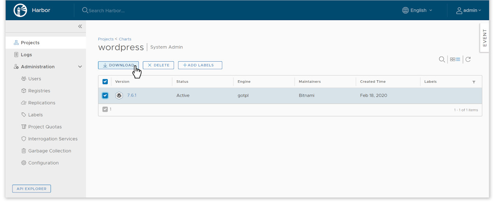{.thumbnail}

Of course, you can also click to the `UPLOAD` buttom to upload the new chart version for the current chart.

You can also use labels to tag the different chart versions. 

Labels are managed in the `Labels` section on the Harbor UI:

{.thumbnail}

{.thumbnail}

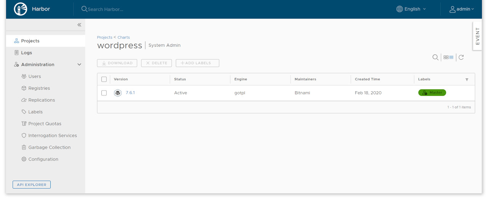{.thumbnail}

You can also filter by tag

{.thumbnail}


### Chart version details

To see the details of a chart version, click on the link on the chart version number.

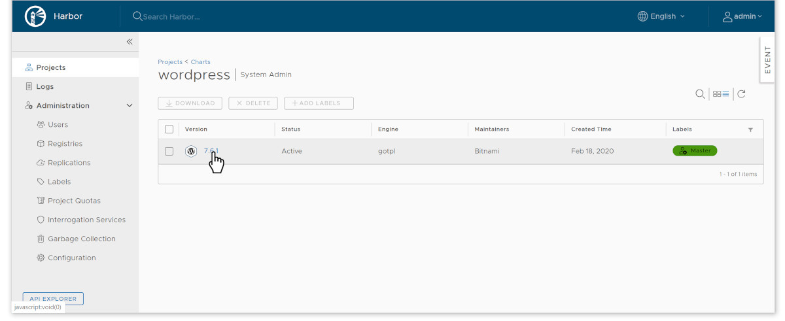{.thumbnail}

You can see more details about the specified chart version, structured in three sections. There are three content sections: summary, dependencies,


The summary shows the `README` of the chart, some metadata (like the timestamp of creation and the application version), and helm commands for reference (to add the repository or instal the chart).


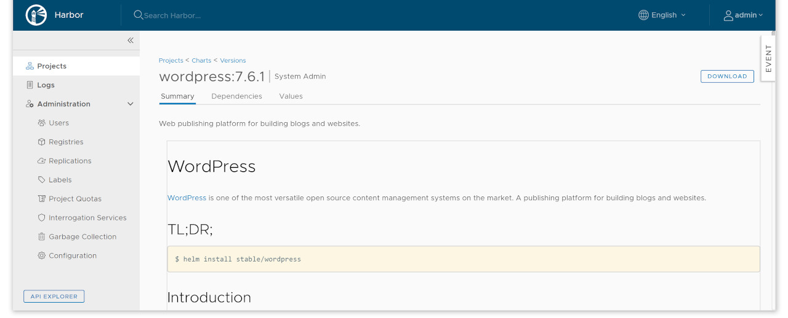{.thumbnail}

{.thumbnail}


The dependencies section show the dependant charts

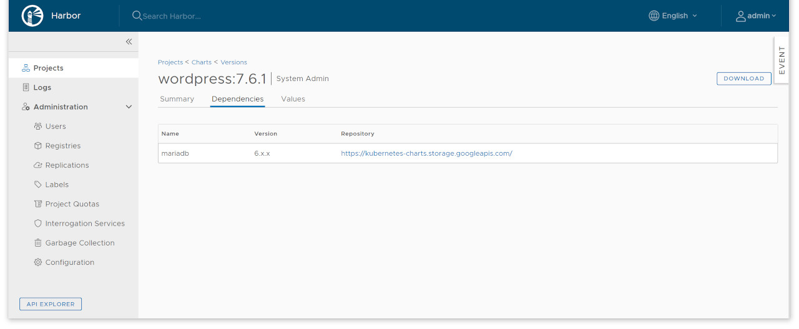{.thumbnail}

