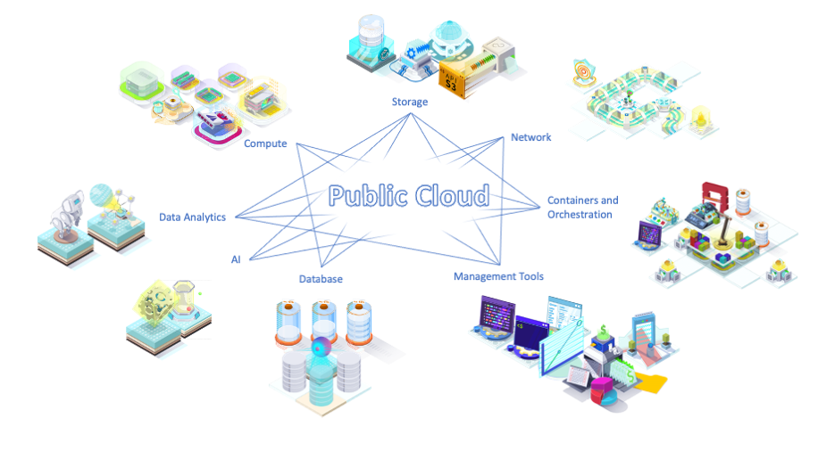

> [!primary]
> Esta traducción ha sido generada de forma automática por nuestro partner SYSTRAN. En algunos casos puede contener términos imprecisos, como en las etiquetas de los botones o los detalles técnicos. En caso de duda, le recomendamos que consulte la versión inglesa o francesa de la guía. Si quiere ayudarnos a mejorar esta traducción, por favor, utilice el botón «Contribuir» de esta página.
> 

**Última actualización: 07/02/2022**

## Objetivo

El Public Cloud de OVHcloud es un entorno que reúne un gran número de productos cloud, compatibles entre sí y que pueden utilizarse por un período breve (una hora, varios días...) o más largo (varios meses, años).

La puesta a disposición es casi instantánea y la facturación se adapta directamente a su uso, lo que aporta simplicidad y flexibilidad a sus prácticas.

Esta guía explica los aspectos esenciales para una buena explotación de los productos.
 En este tutorial ofrecemos un [enfoque global del Public Cloud](#global-approach) y algunos conceptos generales, además de un [enfoque concreto](#concrete-approach) con las ventajas que ofrece el Public Cloud, así como las primeras etapas de su lanzamiento.
 Por último, le proponemos recursos para [ir más lejos](#gofurther).

Si ya está familiarizado con estos conceptos, puede seguir descubriendo el Public Cloud de OVHcloud en las siguientes guías:

- [Abrir una cuenta de OVHcloud](https://docs.ovh.com/us/es/customer/crear-cuenta-ovhcloud/)
- [Cree su primer proyecto de Public Cloud](https://docs.ovh.com/us/es/public-cloud/crear_su_primer_proyecto_de_public_cloud/)
- [Conocer la interfaz de Public Cloud](https://docs.ovh.com/gb/en/public-cloud/public-cloud-interface/)
- [Crear la primera instancia](https://docs.ovh.com/us/es/public-cloud/public-cloud-primeros-pasos/)
- [Gestionar los límites](https://docs.ovh.com/us/es/public-cloud/aumentar_el_limite_de_public_cloud/)

## Enfoque global 

### Un ecosistema de recursos bajo demanda

Todos los productos disponibles en el Public Cloud (como servidores, clusters Kubernetes, volúmenes de disco...) forman un ecosistema.
 Cada elemento corresponde a una función y responde a una necesidad, puede utilizarse solo o como complemento de otros elementos del catálogo.
 Por ejemplo, una instancia (un servidor bajo demanda) puede utilizarse como complemento de elementos de almacenamiento como el object storage. Si su aplicación necesita una base de datos, también hay un elemento que responde a esta necesidad.

Todos estos componentes se integran en un entorno para facilitar el despliegue y la utilización de estos recursos.
 Por ello, es muy fácil iniciar recursos como una instancia o un cluster Kubernetes. El despliegue se realiza en unos segundos.
 También puede eliminar estos recursos unas horas después y así pagar solo por el tiempo de uso. Es lo que llamamos "recursos bajo demanda".

{.thumbnail}

### Recursos disponibles en cualquier lugar

El catálogo de Public Cloud ofrece recursos de bajo nivel, como instancias o redes privadas o recursos administrados en capas más elevadas, como una base de datos.
 Estos recursos se prestan como servicio, en el sentido de que el usuario no necesita comprar los elementos, los utiliza por un tiempo (como un alquiler) y simplemente paga el precio correspondiente al tiempo de uso.
 La mayoría de las veces, el uso de estos recursos no implica un compromiso de permanencia (salvo en caso de facturación mensual para reducir los costes).

Cuando el recurso propuesto es "administrado", se suele hablar de un recurso en las capas altas, ya cercano a la aplicación, como un cluster de base de datos, un cluster Kubernetes, una solución de entrenamiento de modelo para IA...
 Se entiende por "gestión" el hecho de que OVHcloud haya desplegado, monitoreado, mantenido (upgrade) la plataforma. No tiene que preocuparse de toda esta gestión y se beneficia directamente del servicio.

Estos recursos están disponibles en nuestros distintos datacenters repartidos por el mundo. OVHcloud ofrece servicios de Public Cloud en Europa, Norteamérica, Asia y Oceanía.
 Es posible iniciar un recurso en cada uno de estos lugares seleccionando simplemente la localización deseada.

{.thumbnail}

### Un proveedor de servicios cloud en un mercado maduro

El Public Cloud de OVHcloud se posiciona junto a proveedores cloud muy conocidos como AWS (Amazon Web Services), GCP (Google Cloud Platform), Azure (de Microsoft) o Alibaba Cloud. Nuestra oferta se distingue por [tarifas especialmente ventajosas](https://www.ovhcloud.com/es-es/public-cloud/prices/) y el uso de API estándar que permiten a los usuarios libertad de cambio, sin adherencia a ninguna tecnología propietaria.

## Enfoque práctico 

### Casos de uso: algunos ejemplos concretos y sus ventajas

- **Más flexibilidad**: *Tiene una aplicación que funciona actualmente en un alojamiento clásico, como uno o varios servidores dedicados, y desea más flexibilidad en el uso.* El uso de las instancias de Public Cloud es muy similar al de un servidor dedicado, pero ofrece la posibilidad de redimensionar su servidor fácilmente, seguir las evoluciones de hardware, añadir espacio de almacenamiento en caliente, configurar la arquitectura de red como desee, programar copias de seguridad o clonar su servidor en pocas acciones.

- **Más escalabilidad**: *Desarrolle una aplicación cloud nativa y desea una infraestructura capaz de soportar grandes variaciones de carga.* Los clusters Kubernetes pueden reaccionar y adaptarse dinámicamente en función de la carga. Pueden añadir nodos al cluster de forma automática cuando la presión sobre la infraestructura aumenta.

- **Más control de los costes**: *Tiene una aplicación en producción sujeta a estacionalidades y desea trasladar la carga de cálculo al momento de los picos, sin mantener costes de infraestructura significativos durante todo el año.* Las instancias con facturación por horas pueden realizar las tareas en poco tiempo y ser destruidas una vez que haya pasado la necesidad.

- **Más tranquilidad**: *Necesita una base de datos, pero no quiere gestionar el motor y mantenerlo. Las bases de datos administradas están disponibles en unos segundos y son totalmente gestionadas por OVHcloud.* Puede utilizar directamente el servicio de bases de datos cuando usted se desconecta de la instalación, el mantenimiento, las actualizaciones...

### Uso: una interfaz sencilla y unas API estándar

Existen diversas formas de gestionar los recursos de Public Cloud. Tanto si descubrimos los productos de Public Cloud como si somos un usuario avanzado, el uso es sencillo.

- Para descubrir los productos, el área de cliente le ayuda a crear sus recursos eligiendo el rendimiento del producto, su localización, la personalización que desea, así como otros parámetros, como el modo de facturación.

- Para automatizar los despliegues e industrializar sus arquitecturas, también puede utilizar las herramientas del mercado conectándose directamente a las API estándar como la API S3, las API de OpenStack o incluso Kubernetes.

### Inicio: toma de contacto

#### El proyecto

Para empezar, necesitará una [cuenta de cliente de OVHcloud](https://docs.ovh.com/us/es/customer/crear-cuenta-ovhcloud/).

A continuación, deberá [crear un proyecto de Public Cloud](https://docs.ovh.com/us/es/public-cloud/crear_su_primer_proyecto_de_public_cloud/). Un proyecto es un entorno que va a dedicar a un contexto.

Por ejemplo, puede separar los entornos de prueba y producción de dos proyectos.
 O puede utilizar diferentes proyectos para sus distintas aplicaciones (sitio web público, tienda online, aplicación empresarial, gestión de documentos, etc.).

Para iniciar un proyecto, deberá registrar una forma de pago al crear el proyecto.

#### La facturación

Al haber registrado su forma de pago, esta se utilizará para cargar el importe calculado para su [facturación a fin de mes](https://docs.ovh.com/us/es/public-cloud/informacion-sobre-el-tipo-de-facturacion-cloud/). Este cálculo se realiza en función del tiempo de uso de cada recurso, en función del precio de los recursos.

Por ejemplo: En el mes, ha utilizado 1 instancia d2-8 durante todo el mes y 3 instancias b2-60 que contabilizan conjuntamente 32 horas.
 Su factura será de 720 (número de horas en el mes) x 0,0325 € + IVA (precio de la hora de una d2-8) + 32 x 0,4589 € + IVA (precio de la hora de una b2-60). Es decir, 38,08 € + IVA.

#### Gestión de cuotas

Es posible que tenga que ocuparse de los límites.
 La cuota de Public Cloud establece el máximo de recursos que puede empezar. Depende de ciertos parámetros (antigüedad de la cuenta, facturas anteriores..).
 Estas cuotas se asignan por localización (región en el sentido de OpenStack). Así pues, puede que consiga el máximo de recursos posible en su proyecto y que sea necesario [aumentar los límites](https://docs.ovh.com/us/es/public-cloud/aumentar_el_limite_de_public_cloud/).

{.thumbnail}

#### Gestión de usuarios

Es posible que necesite gestionar varios usuarios que intervengan en su proyecto.
 Podrá elegir entre dos opciones:

- Si quiere utilizar las API de OpenStack o S3, o la interfaz Horizon, deberá [crear usuarios](https://docs.ovh.com/us/es/public-cloud/crear-y-eliminar-un-usuario-de-openstack/) para ello. Los usuarios pueden tener derechos limitados para proteger los perímetros de acción.
- Si no necesita acceder a las API o a Horizon, puede [asociar otra cuenta de cliente de OVHcloud](https://docs.ovh.com/us/es/public-cloud/delegar_proyectos/) a su proyecto.

## Más información 

Estos son algunos recursos generales que le ayudarán a empezar en Public Cloud:

|Documentación|Detalles|
|---|---|
|[FAQ](https://docs.ovh.com/us/es/public-cloud/public-cloud-faq/)|Preguntas más frecuentes sobre Public Cloud.|
|[Valor](https://docs.ovh.com/gb/en/public-cloud/introduction-to-instances-and-other-cloud-based-terms/)|Conceptos y definiciones que necesitará para avanzar.|
|[Disponibilidad de los servicios por localización](https://www.ovhcloud.com/fr/public-cloud/regions-availability/)|Las tablas de disponibilidad de los servicios a través de las diferentes localizaciones.|
|[Changelog des images](https://docs.ovh.com/us/es/public-cloud/changelog-images/)|Los cambios en las imágenes de sistema disponibles públicamente.|

En la práctica, a continuación le ofrecemos algunas guías que le ayudarán en el inicio:

|Documentación|Detalles|
|---|---|
|[Crear la primera instancia](https://docs.ovh.com/us/es/public-cloud/public-cloud-primeros-pasos/)|Esta es la primera guía práctica para iniciar un servidor cloud desde el área de cliente de OVHcloud.|
|[Uso de una llave SSH](https://docs.ovh.com/us/es/public-cloud/usar-una-clave-ssh-en-la-interfaz-de-public-cloud/)| Para conectarse a una instancia Linux, necesitará utilizar una conexión SSH en esta guía.|
|[Configuración de la red privada](https://docs.ovh.com/gb/en/public-cloud/public-cloud-vrack/)|En OVHcloud, la tecnología vRack utiliza las redes privadas. Esta guía le ayudará a realizar esta operación.|
|[Asociar un disco adicional a una instancia](https://docs.ovh.com/us/es/public-cloud/crear_y_configurar_un_disco_adicional_en_una_instancia/)|Esta guía explica cómo añadir almacenamiento adicional a la primera instancia de OVH.|
|[Conectarse a Horizon](https://docs.ovh.com/us/es/public-cloud/horizon/)|La interfaz Horizon de OpenStack permite realizar determinadas acciones avanzadas. Así es como conectarse a ella.|
|[Crear un cluster Kubernetes](https://docs.ovh.com/gb/en/kubernetes/creating-a-cluster/) (EN)|Esta guía le ayudará paso a paso a la creación de su primer cluster Kubernetes.|
|[Configurar una IP failover](https://docs.ovh.com/us/es/public-cloud/configurer-une-ip-failover/)|Las IP failover permiten cambiar el tráfico de una instancia a otra. Esta guía explica cómo configurar esta opción.|
|[Instalación de la CLI OpenStack](https://docs.ovh.com/us/es/public-cloud/preparar_el_entorno_para_utilizar_la_api_de_openstack/)|OpenStack también puede utilizarse en línea de comandos. Así es como instalar las herramientas.|

Una de las grandes ventajas de utilizar tecnologías estándares y abiertas, como OpenStack o Kubernetes, es disfrutar de toda la documentación ya disponible.

|Documentación|Detalles|
|---|---|
|[OpenStack CLI](https://docs.openstack.org/python-openstackclient/stein/#using-openstackclient) (EN)|Documentación completa del cliente imprescindible en línea de comandos "openstack". Para consultar la versión Stein, consulte la [tabla de disponibilidad](https://www.ovhcloud.com/fr/public-cloud/regions-availability/).|
|[APIs OpenStack](https://docs.openstack.org/stein/api/) (EN)|Documentación completa de las API de OpenStack. Para consultar la versión Stein, consulte la [tabla de disponibilidad](https://www.ovhcloud.com/fr/public-cloud/regions-availability/).|
|[End user documentation](https://docs.openstack.org/stein/user/) (EN)|Documentación completa para el usuario de OpenStack, en versión Stein.|
|[Developer documentation](https://developer.openstack.org/) (EN)|Documentación para los desarrolladores que quieran conectar su aplicación a las API de OpenStack utilizando las librerías/SDK disponibles.|
|[Kubernetes CLI Overview](https://kubernetes.io/docs/reference/kubectl/overview/) (EN)| Documentación del cliente imprescindible en línea de comandos "kubectl".|
|[Kubernetes APIs Overview](https://kubernetes.io/docs/reference/using-api/) (EN)| Documentación de la API de Kubernetes, útil para tener una visión general de las posibilidades.|

Interactúe con nuestra comunidad de usuarios en <https://community.ovh.com/en/>.
