**Dernière mise à jour le 28/04/2020**

## Objectif

Dans le cadre de l'audit Microsoft, mené par le cabinet de consulting Ernst & Young, OVHcloud vous a adressé un e-mail afin de solliciter votre contribution pour déclarer vos utilisations.

En souscrivant à l'offre Public Cloud, vous avez obtenu le droit d'utiliser des logiciels tiers et vous avez accepté d'utiliser ces logiciels conformément à leurs conditions d'utilisation. Les propriétaires de ces logiciels tiers, comme Microsoft, sont en droit dé vérifier la conformité de l'utilisation que vous faites de leurs logiciels.

Pour cela, vous pouvez choisir parmi ces 3 possibilités :

* Option 1 : [Exécuter vous-même le script fourni par Ernst & Young](./#option-1-executer-vous-meme-le-script-fourni-par-ernst-young)
* Option 2 : [Donner accès à vos serveurs à OVHcloud pour exécution du script fourni par Ernst & Young](./#option-2-donner-acces-a-vos-serveurs-a-ovhcloud-pour-execution-du-script-fourni-par-ernst-young)
* Option 3 : [Effectuer et envoyer les copies d'écran et éléments nécessaires à OVHcloud](./#option-3-effectuer-et-envoyer-les-copies-decran-et-elements-necessaires-a-ovhcloud)

> [!primary]
> 
> Vous trouverez à [cette adresse](https://github.com/ovh/docs/tree/develop/pages/platform/public-cloud/Microsoft-audit/files) l'e-mail envoyé par Microsoft, l'e-mail qui vous a été envoyé par OVHcloud ainsi que le mandat nécessaire si vous choisissez [l'option 2](./#option-2-donner-acces-a-vos-serveurs-a-ovhcloud-pour-execution-du-script-fourni-par-ernst-young).
> 

## En pratique

### Option 1 : Exécuter vous-même le script fourni par Ernst & Young

Si vous souhaitez exécuter vous-même le script fourni par Ernst & Young, merci de suivre la procédure suivante.

1. Connectez-vous à votre VPS ou Instance Public Cloud.

2. Téléchargez à l'aide de votre navigateur habituel le script fourni par Ernst & Young à [cette adresse](https://onedrive.live.com/?authkey=%21AKjh-46_qHwVuCQ&id=80ADB8E634F8B2A%21146&cid=080ADB8E634F8B2A){.external}.

3. Décompressez le fichier zip téléchargé.

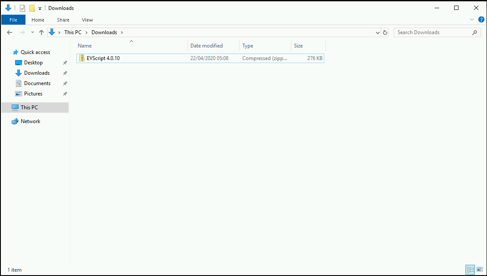

4. Double-cliquez sur le fichier "EYInventoryScript" pour lancer l'exécution du script.

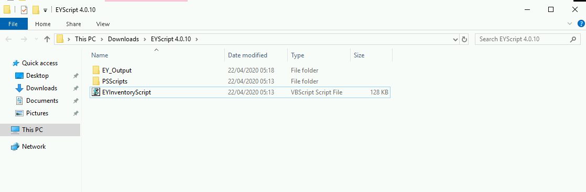

5. Tapez 1 pour exécuter le scan sur un serveur local, en l'occurence votre vps ou instance Public Cloud.

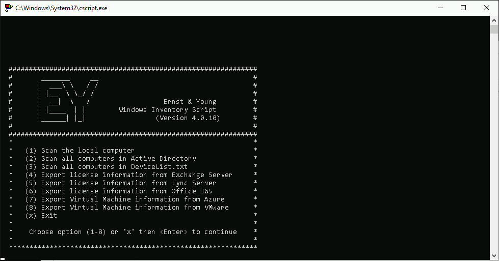

6. Patientez quelques secondes pour voir l'apparition des premiers résultats du script.

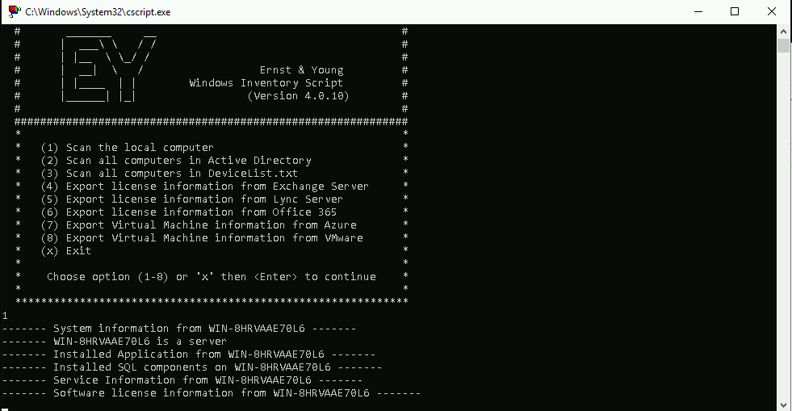

7. Une fois terminé, le script retourne sur le menu initial.

8. Un dossier "EY_Output" a été créé dans le dossier où se trouve l'exécutable "EYInventoryScript". Le dossier contient tous les fichiers de sortie du script. Ce sont ces fichiers qu'il faudra nous transmettre.

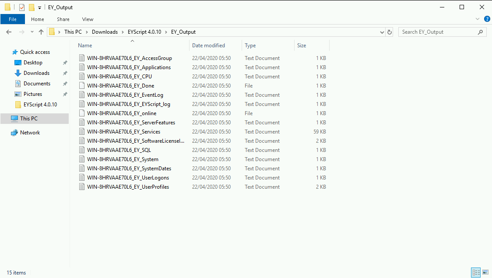

9. Compressez et nommez le dossier "EY_Output" comme suit : EY_Output_ipv4_principal de votre instance Public cloud suivi de .zip ex : EY_Output_10.10.10.10.zip

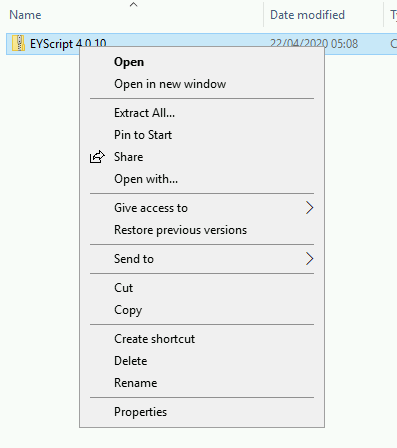
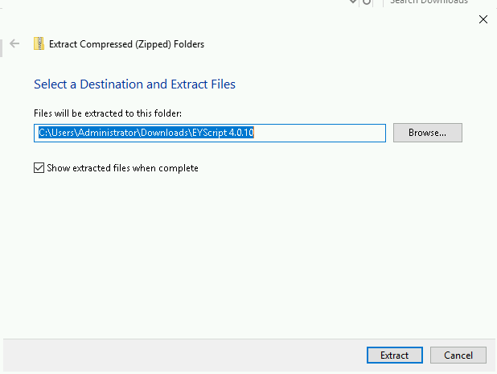

10. Ouvrez votre boite mail ou logiciel de mail habituel

11. Envoyez-nous le dossier des résultats zippé (ici EY_Output_10.10.10.10.zip), avant le 26 mai 2020 à l'adresse suivante : auditmicrosoft@ovhcloud.com

### Option 2 : Donner accès à vos serveurs à OVHcloud pour exécution du script fourni par Ernst & Young

Si vous souhaitez donner accès à vos serveurs à OVHcloud pour exécution du script fourni par Ernst & Young, merci de suivre la procédure suivante.

Le support OVHcloud vous demande vos identifiants pour accéder au système d'exploitation de votre serveur.

Nous allons vous expliquer comment vous pouvez nous transmettre ces informations de manière sécurisée grâce au chiffrement gpg.

Ce dont vous avez besoin :

* le fichier à chiffrer
* le logiciel [Gpg4win](https://gpg4win.org/download.html){.external}
* la clef de chiffrement d'OVHcloud : 


```
-----BEGIN PGP PUBLIC KEY BLOCK-----

mQENBF4u00YBCADquJKlBrqmsHG/V8ldOLgpKpLrNmPw06HxeUKv8aKTnj/w0uQ/ Y6aUeII4bzmqFgBVlfBF3VCM7K6wLfr4QQoCnxlebWdNAB+HwXho0+cq/PoWhgw8 awDFIaJjDEnGFEeFCOkEwCH9GmUeCumZ+6+E1KKc0s3W3S6SvHzhDMmP6F5X8KZl O2dEtEeV2l7adgORDypVE4or9tqytOqsPJmvIWvMQEfO74CGVG3VzkgR3384Pm3a MDiLhc3GBQgZ6oS20UxrO0A25gpblbrfV4R8YUlFrhDTO9zer79Njijqj2udQVOw /xzP+S18ybTFKEwxJFBnwGIp3xAth2CZFJ8lABEBAAG0JVJ1bmNsaW92aCA8bG9p Yy5ibG9uZGVsQGNvcnAub3ZoLmNvbT6JAU4EEwEKADgWIQQFKqz42fnVoqz84rzi 1i5j1bdesAUCXi7TRgIbAwULCQgHAgYVCgkICwIEFgIDAQIeAQIXgAAKCRDi1i5j 1bdesJozB/0QMINDKKLyV1qO9CHBoPpgeAz8tET7UAqoLcflOqPWFFoKPD6lHITJ qXTc7OZEX/keP3vR357JAfVxXZDe4kOB9/4TlaOExBRKYSN0aa4wPRGUCfju1hJ0 YMatsRFJnDjekuzPoeU/aXyvjSZ3mORwE91/WPGuLrK1F2H8ypnskmXC1CezW/X8 dKiVwV9qJcW8BBF0ygWQZ/O9gsH69JL17G3m9+TOaSGq7qBzYvQTMnvJScINlbFJ Es7JyT9cx9t97mS40TATvdm52YjkH5O0x4HqTI5udBe0AVG3QLuqkBAv8PxvITpn pGpfMAW2KmqC+ZRj39nE+cOCmUTvuFwDuQENBF4u00YBCACx5qxncxlaU+sDmzF4 CTXhZTBBLu3FaViBT34dvsqlrYyZ0ONOlTi5k/zNnBp9v/tmM4WSmQ0xPMV4Veqk fQh5bIZd328/g9QLMwCCkFSLxo8+VUCuEG02kiu+2BMTNRvAxOdmHMHO3v/NfzHS ViAFGqxmR3lsRXol3QvKYlOs8ziItH3HBvjd/DT+L9S08KNv9wXx/8iOnYSapaHC hGCtR/O/QUJlvBpOZELWCLDRA+IcTvMqXj4y1S87V4cvE+X0cy0s1UqL6xa8pqfU kSYNlyzt4EkGrri0wjTyfxSxB79CFDS0/m1sL9JIcU1sIg8ZE/TQCdAKP5rVNF40 HT1pABEBAAGJATYEGAEKACAWIQQFKqz42fnVoqz84rzi1i5j1bdesAUCXi7TRgIb DAAKCRDi1i5j1bdesLvCB/9GXDdZhbhg0Xey24Uh2e/46zWrzBAmYCmaLLjtc5QM 1bhueHRs5YxtorLOteVqL7v54IOgl9qsRIvasuyUm3EJs3r3f3zAEEnn1ORtpnf0 sY77qtGbCWk/G2gnxhm0MVFrlQCptJZjMr2lqZfFc4mar4yZBeRA6cfW8JJFjJKj UksrfAI2MRH9f+nQD9jfGxRY8JrfCGWhSoB8S9xHRarZNjqKjcizA6UyL6I55Eh8 4LySeyLJVUo0yhbxAkZmJLHgjFq62IOdXM8eg2Xe1EoVnh/60osOXkZnQWkuwApU BaRKeC0IDZCa9f1VU+zFLDwLXcq8yHGv2RjP39B0T0ZU =9bNm

-----END PGP PUBLIC KEY BLOCK-----
```


1. Téléchargez et installez le logiciel [Gpg4win](https://gpg4win.org/download.html){.external} disponible à cette adresse : [https://gpg4win.org/index.html](https://gpg4win.org/index.html){.external}

2. Une fois installé, lancez Kleopatra (interface graphique pour utiliser Gpg4win) sur votre système.

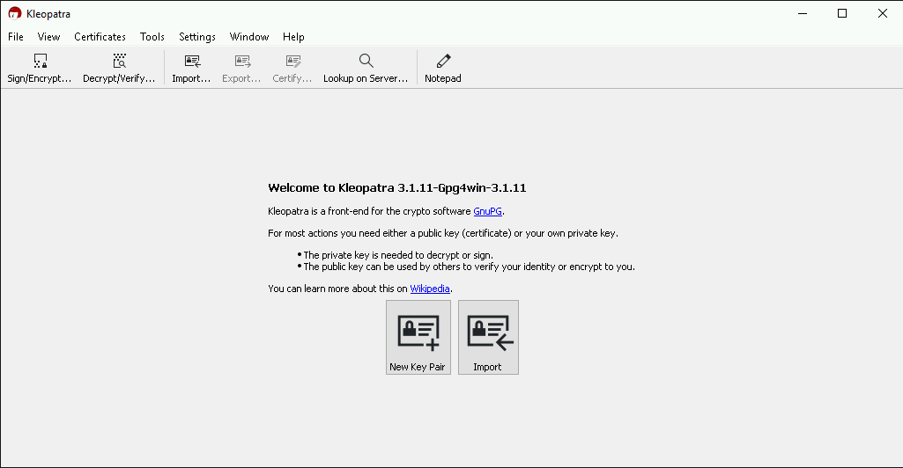

3. Copiez la clef publique d'OVHcloud dans un fichier texte.

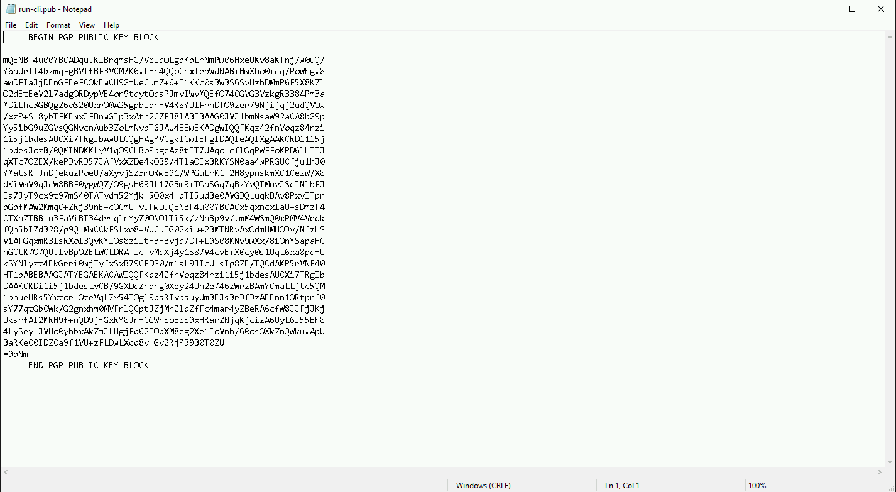

4. Cliquez sur `import`{.action} et recherchez la clef que vous venez d'enregistrer.

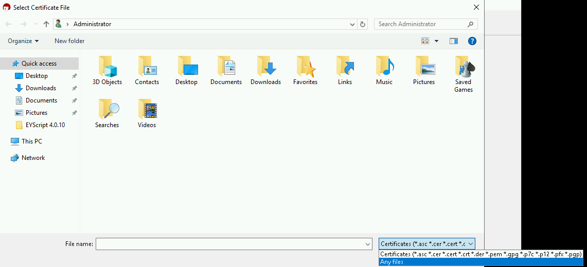

5. Répondez "Non" suite à la demande de création de certificat.

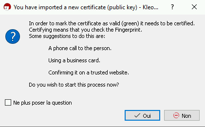

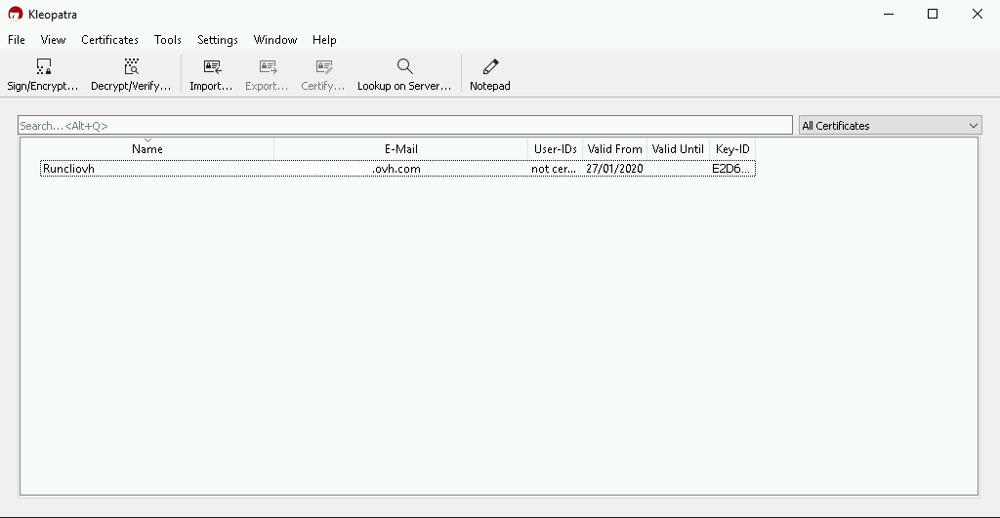

6. Pour chiffrer un fichier, cliquez sur `Sign/Encrypt`{.action}.

7. Sélectionnez votre fichier.

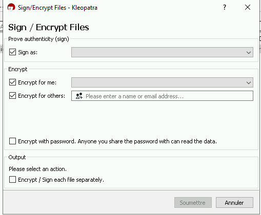

8. Dans le champ "Encrypt for others:" indiquez le nom de la clef (ici "Runcliovh") que vous avez choisie. Elle apparaîtra dans le champ.

9. Cliquez sur Encrypt.

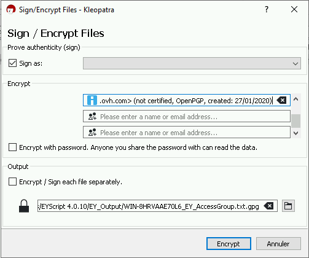

10. Cliquez sur `Continuer`{.action}. 

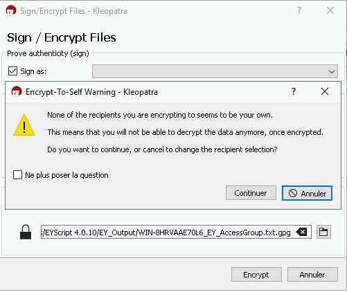

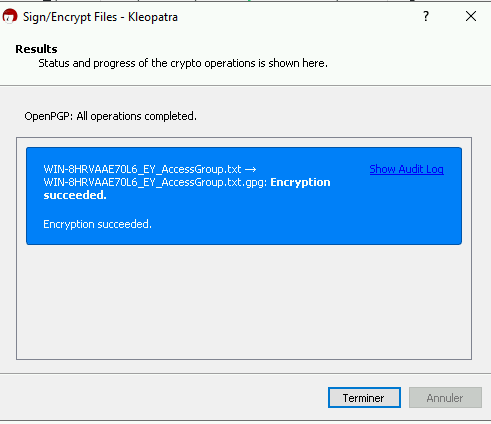

11. Le fichier chiffré est créé dans le même répertoire que le fichier source.

12. Envoyez-nous ce fichier chiffré ainsi que le mandat disponible à [cette adresse](https://github.com/ovh/docs/tree/develop/pages/platform/public-cloud/Microsoft-audit/files), complété et signé par vos soins, avant le 26 mai 2020, à l'adresse suivante : auditmicrosoft@ovhcloud.com

### Option 3 : Effectuer et envoyer les copies d'écran et éléments nécessaires à OVHcloud

Si vous ne pouvez pas appliquer l'une des deux procédures mentionnées préalablement, merci de suivre la procédure suivante.

Le support OVHcloud vous demande de communiquer vos informations "matériel" et "logiciels", de manière sécurisée. En complément de ces éléments, vous devrez également spécifier les raisons qui vous empêchent de suivre les deux premières options.

1. Exécutez la commande "systeminfo" à partir de la ligne de commande. La ligne de commande est accessible en tapant `cmd` dans le dialogue d'exécution de Windows. Une fois la commande exécutée, veuillez faire défiler l'écran jusqu'en haut de la fenêtre d'invite de commande. Il n'est pas nécessaire d'inclure les détails des correctifs dans la capture d'écran.
2. Ouvrez la boîte de dialogue "Ajout/Suppression de programmes" ou "Programmes et fonctionnalités" à partir du panneau de configuration et placez-le côte à côte avec la ligne de commande (comme indiqué dans la première capture d'écran ci-dessous).
    
> [!primary]
> 
> Si le nombre de programmes est trop important pour une seule capture d'écran, il sera nécessaire d'en réaliser plusieurs. Dans le cas d'une deuxième capture d'écran et des suivantes, veuillez vous assurer que le dernier programme de la capture d'écran précédente est le premier programme de la capture d'écran suivante (voir les images ci-dessous).
> 

Vérifiez que l'ensemble de ces éléments sont visibles dans toutes les captures d'écran : 

* Nom du serveur (nom d'hôte)
* Date d'installation initiale
* Processeur(s)
* Date d'installation de la demande

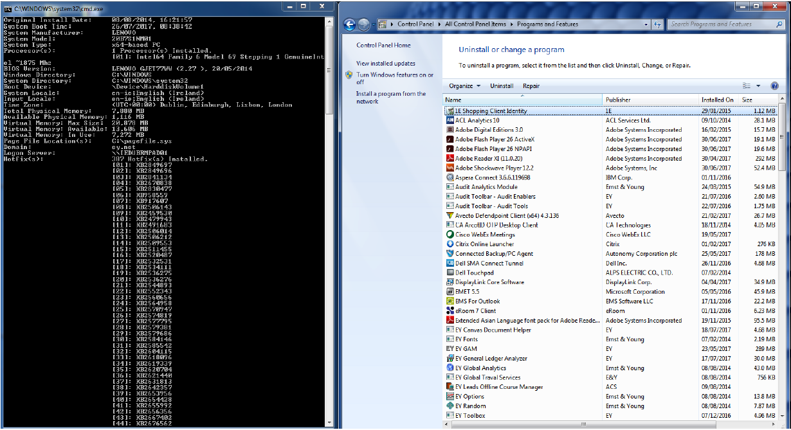

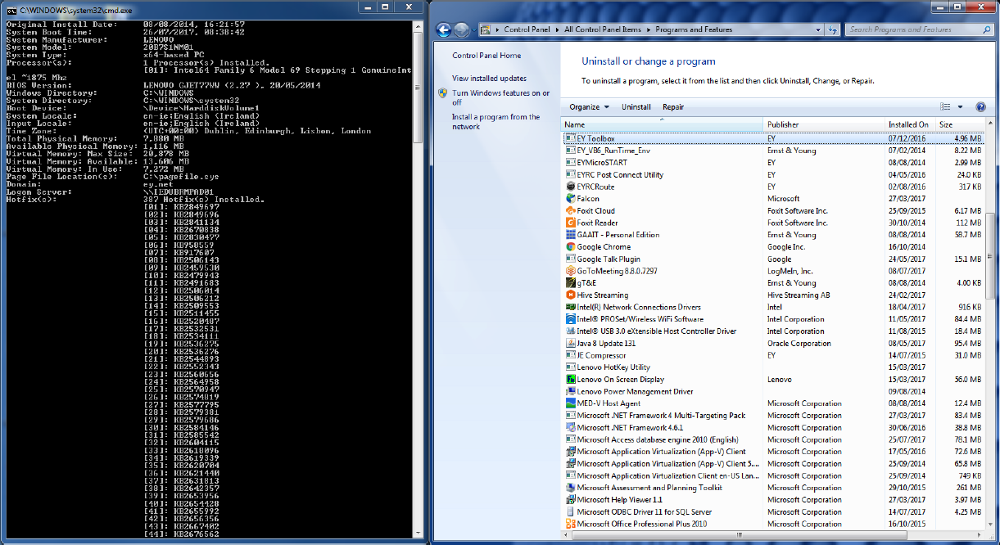
    

#### Version et édition de SQL

3. Si le serveur SQL de Microsoft est déployé sur l'appareil, réalisez une capture d'écran montrant la version et l'édition SQL.

La méthode la plus simple pour obtenir cette preuve est de se connecter au serveur SQL à l'aide du SQL Server Management Studio et d'afficher le panneau des propriétés du serveur (voir l'image ci-dessous) en cliquant avec le bouton droit de la souris sur le nom du serveur SQL dans le panneau de l'explorateur d'objets.

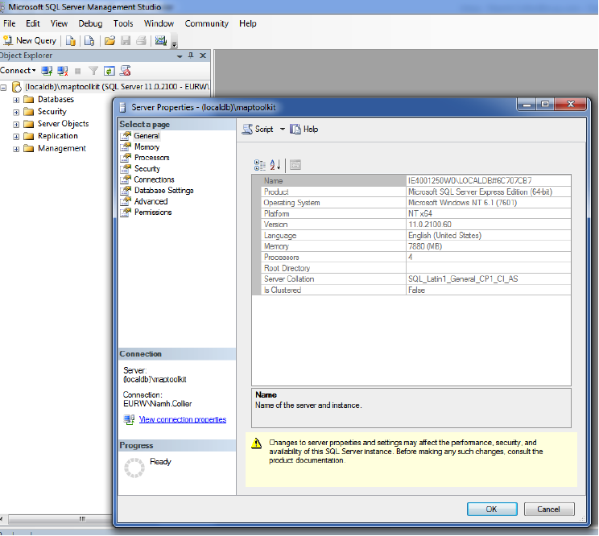

4. Envoyez ces informations par email à l'adresse suivante : auditmicrosoft@ovhcloud.com, avant le 26 mai 2020

 Ces preuves seront par la suite communiquées au cabinet Ernst & Young pour analyse de conformité.