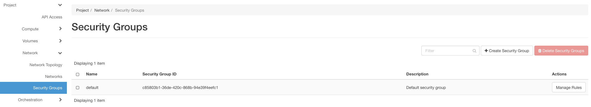
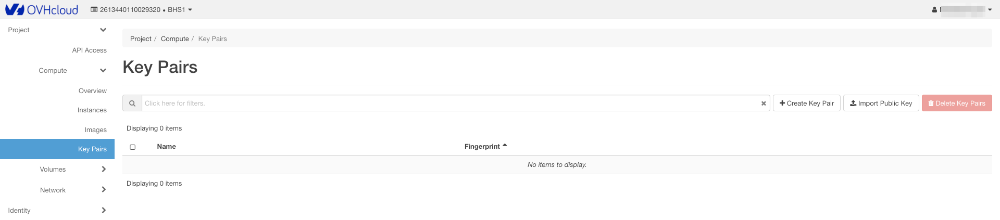
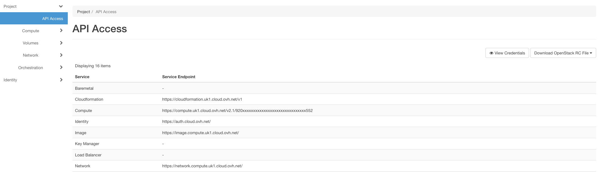

## Objective

OpenStack Horizon has options that allow you to configure elements relating to access to your instances and other services.
For example, you can configure security groups to filter incoming and outgoing connections from your instances or download the OpenRC file which contains the credentials you need to use the OpenStack API.

## Prerequisites

- [Configure user access to Horizon](../configure_user_access_to_horizon/)

## Instructions

- Log in to [the Horizon interface](https://horizon.cloud.ovh.net/auth/login/)

There are 3 areas to note:

- Security Groups let you manage security rules and access to instances, limiting access to certain ports for exmple.

{.thumbnail}

- Key pairs lets you manage SSH keys in two different ways: 

|Create a key pair|Name the key, respond to prompt to download the key pair|
|Import a key pair|Import an existing public key|

{.thumbnail}

- API access lets you view information linked to the API, and to download the OpenStack RC file which lets you use the OpenStack API

{.thumbnail}

## Go further

Join our community of users on <https://community.ovh.com/en/>.
 

