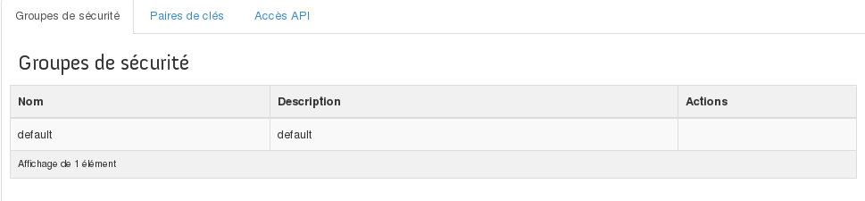
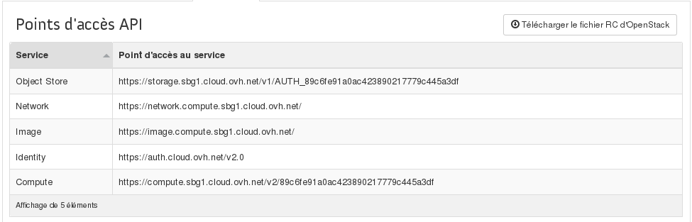

## 
OpenStack Horizon has a menu that allows you to configure elements relating to access to your instances and other services.
For example, you can configure security groups to filter incoming and outgoing connections from your instances, or download the OpenRC file which contains the credentials you need to use the OpenStack API.

## Prerequisites

- [Configure user access to Horizon]({legacy}1773)

## 

- Log in to [the Horizon interface](https://horizon.cloud.ovh.net/auth/login/)
- Click on Access and Security

There are three tabs in this section:

- Security Groups lets you manage security rules and access to instances, limiting access to certain ports for exmple.

{.thumbnail}

- Key pairs lets you manage SSH keys in two different ways: 

|Create a key pair|Name the key, respond to prompt to download the key pair|
|Import a key pair|Import an existing public key|

- API access lets you view information linked to the API, and to download the OpenStack RC file which lets you use the OpenStack API

{.thumbnail}

## 
 

