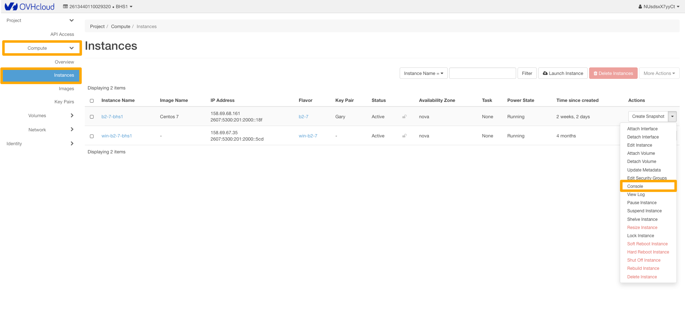
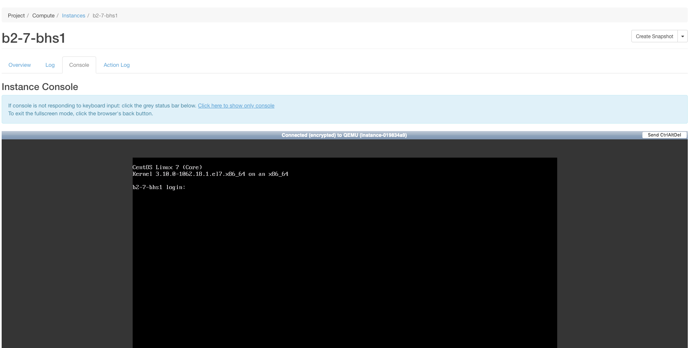

## Introduction
En cas de perte d'accès à votre instance, que cela soit suite à une mauvaise configuration, ou à une coupure du service SSH, il vous est toujours possible de reconfigurer votre instance à l'aide de la console VNC.

> [!success]
>
> Pour cette utilisation , il faut qu'un mot de passe ait été configuré pour un
> utilisateur système présent sur l'instance pour s'authentifier sur le système
> d'exploitation de l'instance.
> La console VNC peut aussi servir de première approche lors d'un
> dysfonctionnement pour établir un diagnostic grâce à l'analyse de la phase de
> démarrage de votre instance.
> 

### Prérequis
- [Créer un accès à Horizon]({legacy}1773){.ref}
- Une instance
- [Passer root et définir un mot de passe]({legacy}1786){.ref}

## Acceder a la console d'une instance
Pour accéder à la console d'une instance, il faut :

- Se connecter à Horizon
- Cliquer sur Instances dans le menu à gauche.
- Sélectionner Console dans la liste déroulante correspondant à l'instance.

{.thumbnail}

- la console de l'instance apparaît.

> [!success]
>
> Si la console ne répond plus aux entrées clavier, cliquez sur la barre d'état.
> Pour quitter le mode plein écran, cliquez sur le bouton retour du navigateur.
> 

**Console de l'instance**

{.thumbnail}
