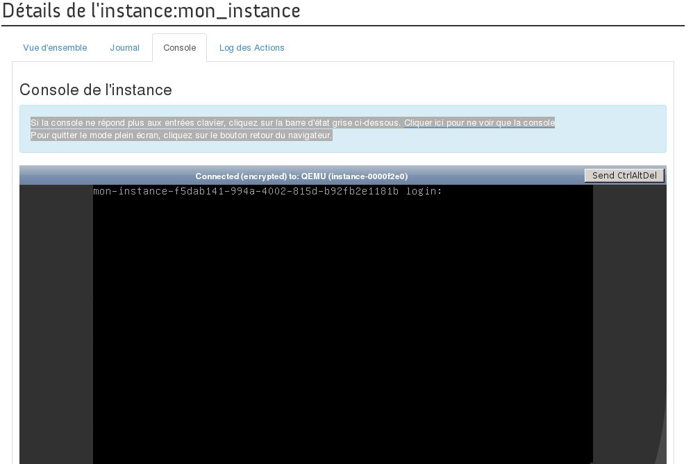

## 
W przypadku utraty dostępu do instancji (na przykład z powodu nieprawidłowej konfiguracji lub przerwy w działaniu usługi SSH), można zmienić konfigurację instancji za pomocą konsoli VNC.

## Informacja
Należy skonfigurować hasło dla użytkownika systemowego obecnego na instancji do logowania się do systemu operacyjnego instancji.

Konsola VNC może również służyć jako pierwszy krok w wykonaniu diagnostyki problemu, dzięki analizie fazy uruchamiania instancji.

## Wstępne wymagania

- [Dostęp do interfejsu Horizon]({legacy}1773)
- Instancja
- [Dostęp root i zdefiniowanie hasła]({legacy}1786)

## 
Aby uzyskać dostęp do konsoli instancji, należy:

- Zalogować się do interfejsu Horizon.
- Kliknąć na Instancje w menu z lewej strony.
- Wybrać Konsola z rozwijalnej listy dla tej instancji.

{.thumbnail}

- Pojawi się konsola instancji.

## Informacja:
Jeśli konsola nie odpowiada na czynności wykonywane za pomocą klawiatury, kliknij na pasek stanu. Aby wyjść z trybu pełnoekranowego, kliknij na przycisk powrotu w przeglądarce.
Konsola instancji

{.thumbnail}
Konsola VNC nie obsługuje klawiatury w formacie francuskim (AZERTY).

## 
[Przewodniki Cloud]({legacy}1785)

