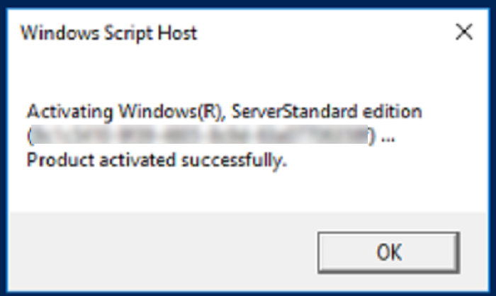
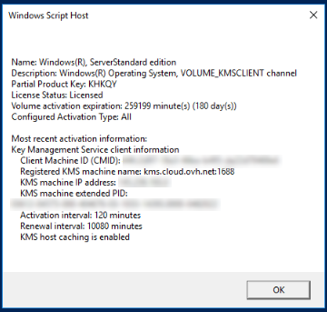

**Dernière mise à jour le 23/01/2023**

## Objectif

Contrairement aux instances Windows créées dans le réseau public, les instances Windows créées avec le mode réseau privé (vrack) n'ont pas leurs licences Windows automatiquement activées. Dans ce cas, vous devez activer la licence manuellement afin d'avoir accès à tous les services Windows.

**Ce guide a pour objectif de vous accompagner dans la configuration de l’interface public de vos instances Public Cloud au sein de votre vRack.**

## Prérequis

- Posséder un [projet Public Cloud](https://docs.ovh.com/fr/public-cloud/create_a_public_cloud_project/)
- Être connecté à votre [espace client OVHcloud](https://www.ovh.com/auth/?action=gotomanager&from=https://www.ovh.com/fr/&ovhSubsidiary=fr)
- Avoir [créé un utilisateur OpenStack](https://docs.ovh.com/fr/public-cloud/creation-et-suppression-dun-utilisateur-openstack/)

Nous vous recommandons de consultez le guide [Accéder à l’interface Horizon](https://docs.ovh.com/fr/public-cloud/horizon/) pour vous familiariser à Horizon.

## En pratique

### Attacher un port public « Ext-Net » à une instance.

#### Depuis l'interface Horizon

Connectez-vous à l’interface [Horizon](https://horizon.cloud.ovh.net/auth/login/) en suivant la méthode indiquée dans la [première partie de ce guide](https://docs.ovh.com/fr/publiccloud/network-services/public-cloud-vrack/#interface-horizon).

Connectez-vous bien sur votre zone de travail :

{.thumbnail}

Dirigez-vous ensuite dans `Compute`{.action}, puis `Instances`{.action} :

{.thumbnail}

Pour ajouter une interface, dans la colonne « Actions », cliquez sur la flèche permettant d’accéder aux actions possible sur l’instance. Cliquez alors sur `Attach Interface`{.action} :

{.thumbnail}

Sélectionnez votre interface et validez :

{.thumbnail}

#### Depuis l'API OpenStack

Avant de poursuivre, Il est recommandé de consulter ces guides :

- [Préparer l’environnement pour utiliser l’API OpenStack](https://docs.ovh.com/fr/public-cloud/prepare_the_environment_for_using_the_openstack_api/).
- [Charger les variables d’environnement OpenStack](https://docs.ovh.com/fr/public-cloud/set-openstack-environment-variables/).

Pour commencer, rassemblez toutes les informations nécessaires:

**Identification de vos instances :**

```bash
openstack server list
+--------------------------------------+-------------------+--------+---------------------------------------------------------------------+----------------------------------------+----------+
| ID                                   | Name              | Status | Networks                                                            | Image                                  | Flavor   |
+--------------------------------------+-------------------+--------+---------------------------------------------------------------------+----------------------------------------+----------+
| f095ad19-5c0a-4ef5-8e01-b3590bc9c6f1 | MyInstance        | ACTIVE |                                                                     | Windows Server 2016 Standard (Desktop) | win-b2-7 |
+--------------------------------------+-------------------+--------+---------------------------------------------------------------------+----------------------------------------+----------+
```


**Identification des réseaux publics et privés :**

```bash
openstack network list
-----------------------------------------------------------------------------------------+
| ID                                   | Name              | Subnets                                                                                                                                                                                                                                                                  |
+--------------------------------------+-------------------+--------------------------------------------------------------------------------------------------------------------------------------------------------------------------------------------------------------------------------------------------------------------------+
| 1ca87837-7860-47a3-8916-c9c516841bf2 | Ext-Net-Baremetal | 1db089a7-1bd9-449f-8e3b-4ea61e666320, 4a614403-b8aa-4291-bd59-0cb2c81c4deb                                                                                                                                                                                               |
| 7394fc68-0f77-40d7-a274-388e7e75d82c | vlan 0            | f3fb67dc-7419-49da-b26c-7f64c480eb63                                                                                                                                                                                                                                     |
| 7a0e67da-70f3-48ed-a6e7-5ec265916211 | private-net       | 57d9faac-f01c-43a2-8866-d9b1dd02cb9e, 5cb270a9-3795-4286-96fe-f3bfa3a328e5                                                                                                                                                                                               |
| b2c02fdc-ffdf-40f6-9722-533bd7058c06 | Ext-Net           | 0f11270c-1113-4d4f-98de-eba83445d962, 1a6c6b72-88e9-4e94-ac8b-61e6dbc4792c, 22e2d853-1b86-48f3-8596-9d12c7693dc7, 4aa6cac1-d5cd-4e25-b14b-7573aeabcab1, 7d6352a6-dbed-4628-a029-fcc3986ae7d6, 9f989c4b-c441-4678-b395-e082c300356e, b072b17b-ef1d-4881-98c7-e0d6a1c3dcea|
+--------------------------------------+-------------------+--------------------------------------------------------------------------------------------------------------------------------------------------------------------------------------------------------------------------------------------------------------------------+
```

Avec les éléments récupérés précédemment, vous pouvez créer un port public nommé « Ext-Net » sur le subnet « Ext-Net » et l'attacher à l'instance :

```bash
openstack port create --network b2c02fdc-ffdf-40f6-9722-533bd7058c06 Ext-Net
+-------------------------+----------------------------------------------------------------------------------------+
| Field                   | Value                                                                                  |
+-------------------------+----------------------------------------------------------------------------------------+
| admin_state_up          | UP                                                                                     |
| allowed_address_pairs   |                                                                                        |
| binding_host_id         | None                                                                                   |
| binding_profile         | None                                                                                   |
| binding_vif_details     | None                                                                                   |
| binding_vif_type        | None                                                                                   |
| binding_vnic_type       | normal                                                                                 |
| created_at              | 2023-01-20T10:12:17Z                                                                   |
| data_plane_status       | None                                                                                   |
| description             |                                                                                        |
| device_id               |                                                                                        |
| device_owner            |                                                                                        |
| device_profile          | None                                                                                   |
| dns_assignment          | None                                                                                   |
| dns_domain              | None                                                                                   |
| dns_name                | None                                                                                   |
| extra_dhcp_opts         |                                                                                        |
| fixed_ips               | ip_address='2001:41d0:304:400::128f', subnet_id='4aa6cac1-d5cd-4e25-b14b-7573aeabcab1' |
|                         | ip_address='57.128.42.227', subnet_id='22e2d853-1b86-48f3-8596-9d12c7693dc7'           |
| id                      | ed34add5-aa76-4aab-97af-815724d76e2c                                                   |
| ip_allocation           | immediate                                                                              |
| mac_address             | fa:16:3e:68:35:9c                                                                      |
| name                    | Ext-Net                                                                                |
| network_id              | b2c02fdc-ffdf-40f6-9722-533bd7058c06                                                   |
| numa_affinity_policy    | None                                                                                   |
| port_security_enabled   | True                                                                                   |
| project_id              | 2098640de5e547289e3740b09e725ecc                                                       |
| propagate_uplink_status | None                                                                                   |
| qos_network_policy_id   | None                                                                                   |
| qos_policy_id           | None                                                                                   |
| resource_request        | None                                                                                   |
| revision_number         | 2                                                                                      |
| security_group_ids      | 9f60804a-0ecf-4738-a4d8-30a6bb0d20c2                                                   |
| status                  | DOWN                                                                                   |
| tags                    |                                                                                        |
| tenant_id               | 2098640de5e547289e3740b09e725ecc                                                       |
| trunk_details           | None                                                                                   |
| updated_at              | 2023-01-20T10:12:18Z                                                                   |
+-------------------------+----------------------------------------------------------------------------------------+
```

Récupérer l'UUID du port « Ext-Net » :

```bash
openstack port list --name Ext-Net
+--------------------------------------+---------+-------------------+---------------------------------------------------------------------------------------+--------+
| ID                                   | Name    | MAC Address       | Fixed IP Addresses                                                                    | Status |
+--------------------------------------+---------+-------------------+---------------------------------------------------------------------------------------+--------+
| ed34add5-aa76-4aab-97af-815724d76e2c | Ext-Net | fa:16:3e:68:35:9c | ip_address='2001:41d0:304:400::128f', subnet_id='4aa6cac1-d5cd-4e25-b14b-7573aeabcab1'| DOWN   |
|                                      |         |                   | ip_address='57.128.42.227', subnet_id='22e2d853-1b86-48f3-8596-9d12c7693dc7'          |        |
+--------------------------------------+---------+-------------------+---------------------------------------------------------------------------------------+--------+
```

Attacher le port à l'instance :

```bash
openstack server add port <server_id> <port_id>
```

#### Activer votre système Windows

Pour pourvoir activer votre système Windows, vous devrez passer par Powershell.

Une fois connecté à votre instance Windows, cliquez sur le menu `Démarrer`{.action}, puis sur l'icône du `Windows PowerShell`{.action}.

Renseignez la commande suivante :

```bash
slmgr.vbs -ato
```

{.thumbnail}

La licence Windows sera activé pour 180 jours.

Il sera nécessaire de répéter cette opération tous les 180 jours.

Pour vérifier le statut de la licence et sa date d'expiration :

```bash
slmgr.vbs -dli
```

{.thumbnail}


## Aller plus loin

[Corriger la clé d’activation Windows Server](https://docs.ovh.com/fr/dedicated/windows-key/).

Échangez avec notre communauté d'utilisateurs sur <https://community.ovh.com>.