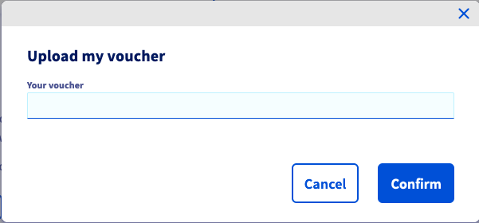

**Last updated 4th February 2022**

## Objective

With the *cloud credit* option you can allocate a specific amount to your Public Cloud project which will serve as the default payment method for the [billing of the project](../information-on-cloud-billing-options/).  This means that cloud credit is debited first and any outstanding amount will be then be paid by other available payment methods. (Please consult the [Public Cloud billing guides](https://docs.ovh.com/sg/en/billing/) to learn more about this topic.)

**This guide explains how to add credit on to your Public Cloud account using a voucher, or by generating a purchase order.**

## Requirements

- A [Public Cloud project](https://www.ovhcloud.com/en-sg/public-cloud/) in your OVHcloud account
- Access to the [OVHcloud Control Panel](https://www.ovh.com/auth/?action=gotomanager&from=https://www.ovh.ie/&ovhSubsidiary=ie)

## Instructions

Log in to the [OVHcloud Control Panel](https://www.ovh.com/auth/?action=gotomanager&from=https://www.ovh.ie/&ovhSubsidiary=ie), go to the `Public Cloud`{.action} section, and select the Public Cloud project concerned. Open `Credit and Vouchers`{.action} in in the left-hand menu.

> [!warning]
>
Note that credit added in this section cannot be transferred or refunded. It does not have monetary value, and any credit that has not been used within 13 months of purchase will be lost.
>

### Adding credit

Click on the button `Buy Public Cloud credit`{.action}.

{.thumbnail}

Enter the amount you wish to add, in your currency (ex VAT). Click on `Generate a purchase order`{.action} to confirm.

{.thumbnail}

A purchase order will then be generated. Click on the link in the green notification box to view it and initiate the payment.

{.thumbnail}

Once the payment is processed, your credit will appear in the `Credits & Vouchers` list.

### Redeeming a voucher

Click on the button `Use a voucher`{.action}.

{.thumbnail}

Enter your voucher code in the window that appears and click on `Confirm`{.action}.

{.thumbnail}

The voucher balance will appear in the `Credits & Vouchers` list.

> [!primary]
>
Since the validity periods of vouchers are usually more limited, the voucher balance will be used before the regular Public Cloud credit.
>

## Go further

Join our community of users on <https://community.ovh.com/en/>.
