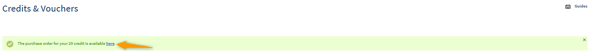
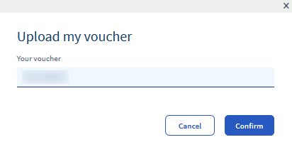

**Last updated 03rd January 2020**

## Objective

This guide explains how to add credit on to your Public Cloud account using a voucher, or by generating a purchase order.

This will then be used as a default payment method.

Each time a bill is generated, the amount due is debited from your cloud credit, then from your Digital Launch Pad account and loyalty account. The debit balance is then eventually paid using your registered payment method. 

You can find more information on these payment methods in the OVHcloud Control Panel by clicking on your name in the top right-hand corner, then `Payment methods`{.action}.

Cloud credit cannot be transferred or refunded. It does not have any monetary value, and any credit that has not been used within 13 months of purchase will be lost.

## Requirements

* a Public Cloud project

## Instructions

### Buy credit.

To buy Public Cloud credit, go to the `Credits & vouchers`{.action} menu in the Public Cloud section of the OVHcloud Control Panel. Next, click `Buy Public Cloud credit`{.action}.

{.thumbnail}

In the next window, you can enter the amount you wish to add.

{.thumbnail}

A link will then be generated. Click on the link to view the corresponding purchase order.

{.thumbnail}
{.thumbnail}

Once you have paid the purchase order, your credit will appear in the credits & vouchers list.

### Use a voucher.

To use a voucher, go to the `Credits & vouchers`{.action} menu in the Public Cloud section of the OVHcloud Control Panel, then click `Use a voucher`{.action}.

{.thumbnail}

Then enter the code for the voucher.

{.thumbnail}

It will then appear in the credits & vouchers list.

Since validity periods for vouchers are shorter, the voucher will always be used before Public Cloud credit.

## Go further

Join our community of users on <https://community.ovh.com/en/>.
