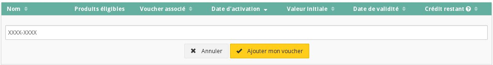

## 
Per aggiungere credito al tuo progetto Cloud, puoi acquistarlo generando un buono d'ordine oppure utilizzare un voucher ricevuto, ad esempio, con un'offerta di prova o durante un evento OVH.

Questa guida ti mostra come aggiungere credito al tuo account Public Cloud utilizzando questi 2 metodi.

## Requisiti necessari

- Un codice voucher

## 

- Accedi allo Spazio Cliente Public Cloud OVH
- Clicca su "Gestione e consumo del progetto"

{.thumbnail}

- Clicca su "Credito e Voucher"

{.thumbnail}
Da questo menu puoi:

- visualizzare lo storico dei tuoi consumi di credito Cloud
- attivare un voucher
- acquistare credito Cloud

{.thumbnail}

## Attiva il tuo voucher

- Clicca su "Attiva un voucher"
- Inserisci il codice di attivazione:

{.thumbnail}

## Acquista il tuo credito Cloud

- Clicca su "Acquista credito Cloud"
- Inserisci l'importo che vuoi assegnare al tuo progetto:

{.thumbnail}

## 
[Ritorna all'indice delle guide Cloud]({legacy}1785)

