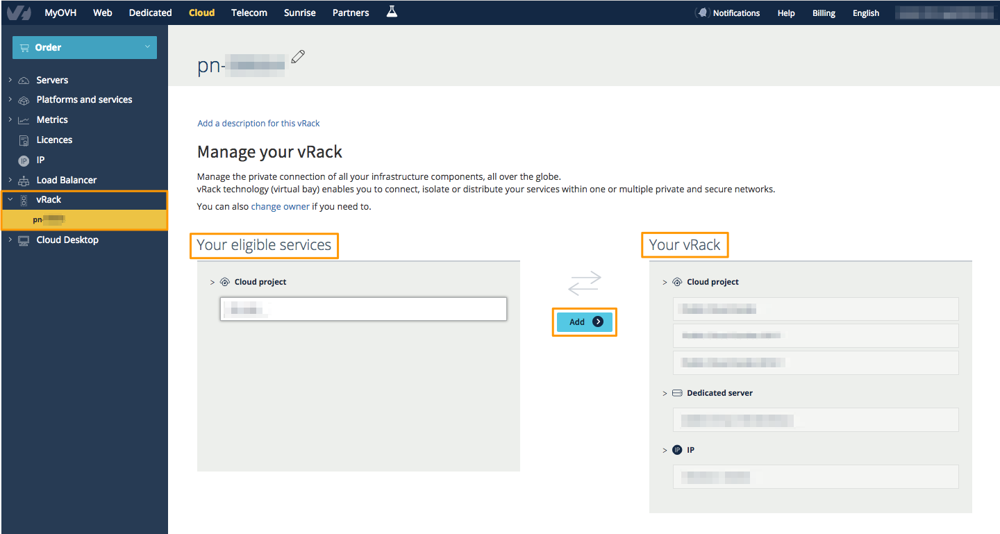

**Ostatnia aktualizacja dnia 2018-01-24**

## Wprowadzenie

Usługa [vRack](https://www.ovh.pl/rozwiazania/vrack/){.external} czyli usługa wirtualnej szafy, pozwala na podłączenie i odizolowanie, rozdzielenie usług serwerowych OVH w ramach jednej lub kilku prywatnych i zabezpieczonych sieci, bez względu na ich liczbę i fizyczną lokalizację w centrach danych OVH.

vRack, działa między różnymi Rejonami centrów danych OVH, co daje możliwość zbudowania prywatnej i redundantnej infrastruktury umieszczonej w kilku Rejonach. Dane są zabezpieczone a komunikacja między serwerami nie odbywa się za pomocą sieci publicznej.

## Wymagania początkowe

- [Projekt Public Cloud](https://www.ovh.pl/public-cloud/instances/){.external}
- Uruchomiona usługa [vRack](https://www.ovh.pl/rozwiazania/vrack/){.external}
- Utworzona sieć prywatna
- Inna usługa współpracująca z vRack:
    - [serwer dedykowany OVH](https://www.ovh.pl/serwery_dedykowane/){.external} (zgodnie z ofertą danego serwera)
    - [dodatkowy blok IP](https://www.ovh.pl/serwery_dedykowane/ip-zawarte.xml){.external}
    - [Private Cloud](https://www.ovh.pl/private-cloud/){.external}
- Dostęp do [Panelu klienta](https://www.ovh.com/auth/?action=gotomanager){.external}

## W praktyce

### Dodawanie elementów infrastruktury od usługi vRack

Po wskazaniu uruchomionej usługi vRack w menu po lewej stronie [`Cloud`{.action} > `vRack`{.action} > `pn-...`{.action}] zaznaczamy usługi, które mają być dodane.

Wtedy zostanie wyświetlony przycisk `Dodaj`{.action} pozwalający je przypisać:

{.thumbnail}

Efekt może być widoczny po upływie kilku minut. Dołączone do rozwiązania vRack usługi będą widoczne po prawej stronie.

W kolejnym etapie należy odpowiednio skonfigurować połączenie po stronie serwerów.

### Odłączanie elementów infrastruktury od usługi vRack

W analogiczny sposób można odłączyć wybrane elementy. Zaznacz element do odłączenia na liście usług po prawej stronie. Następnie kliknij przycisk `Odłącz`{.action}.

Odłączając jakiś element może być konieczna aktualizacja konfiguracji sieci w systemie operacyjnym instancji.

## Sprawdź również

Przyłącz się do społeczności naszych użytkowników na stronie <https://community.ovh.com/en/>.